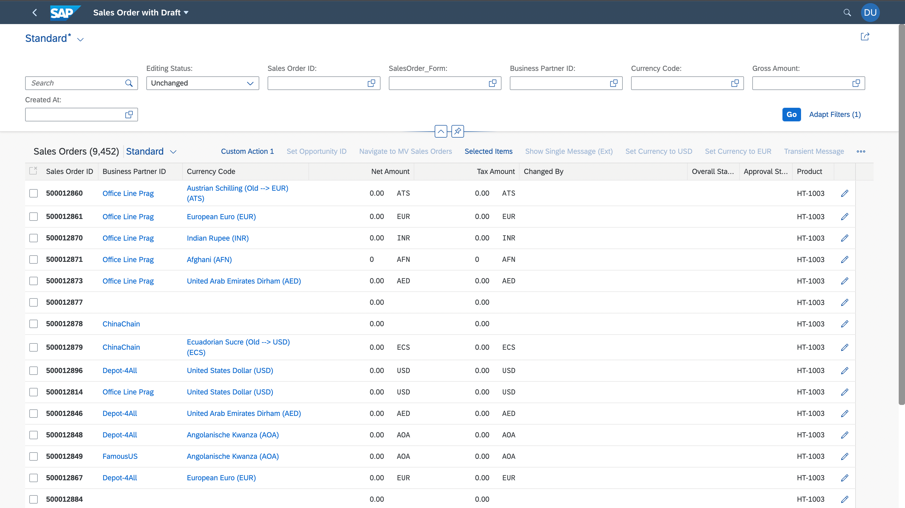
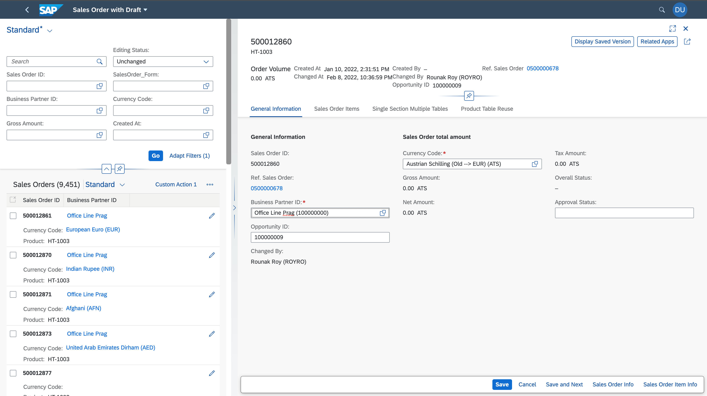

<!-- loio7952b13352714acaba218d1492b77f79 -->

# Navigation to an Object Page in Edit Mode

You can configure the navigation to an object page so that it opens directly in edit mode.

You can use the `editFlow` annotation in the `manifest.json` file to configure navigation, as shown in the following sample code:

> ### Sample Code:  
> ```
> "ListReport|STTA_C_MP_Product": {
>                 "entitySet": "STTA_C_MP_Product",
>                 "component": {
>                     "name": "sap.suite.ui.generic.template.ListReport",
>                     "settings": {
>                         "editFlow":"direct"
> 		….
> 	               }
>                 }
> }
> 
> ```



When direct edit is configured, an additional button *Save and Next* appears in the object page footer in addition to the *Save* and *Cancel* buttons. The *Save and Next* action leads the user to the next object in edit mode after the current changes are saved. The save action leads the user back to the list report.



You can prevent navigation from the object page as a result of the save action by using the `navToListOnSave` setting, as shown in the following sample code:

> ### Sample Code:  
> ```
> "pages": {
>         "ObjectPage|STTA_C_MP_Product": {
>             "entitySet": "STTA_C_MP_Product",
>             "component": {
>                 "name": "sap.suite.ui.generic.template.ObjectPage",
>                 "settings": {
>                     "navToListOnSave": false
> 
>                             }
>                         }
>                     }….
> ```

In this case, the object page switches to display mode once the user chooses *Save*.

