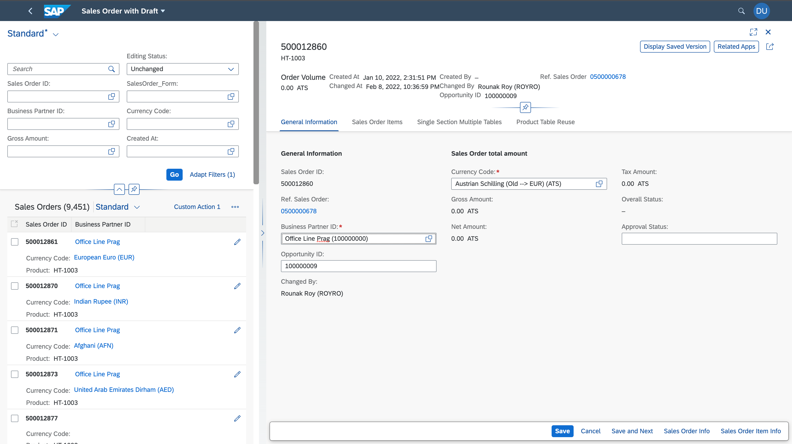

<!-- loio8665847a17a14e1abdcebe3e235c8c68 -->

# Navigation to an Object Page in Edit Mode

> ### Note:  
> This topic is currently only applicable to SAP Fiori elements for OData V2.

You can now configure navigation from the list report to an object page directly in edit mode. You can find the manifest settings here:

> ### Sample Code:  
> ```
> "ListReport|STTA_C_MP_Product": {
>                 "entitySet": "STTA_C_MP_Product",
>                 "component": {
>                     "name": "sap.suite.ui.generic.template.ListReport",
>                     "settings": {
>                         "editFlow":"direct"
> 		….
> 	      }
> }
> }
> 
> ```

  

When direct edit is configured, an additional button, *Save and Next*, appears in the object page footer, in addition to the *Save* and *Cancel* actions. The *Save and Next* action leads you to the next object in edit mode after the saving the current changes. The save action leads you back to the list report page.

  

You can prevent navigation from the object page as a result of the save action by using the following setting. In this case, the object page switches to display mode once you click *Save*.

> ### Sample Code:  
> ```
>                 "pages": {
>                     "ObjectPage|STTA_C_MP_Product": {
>                         "entitySet": "STTA_C_MP_Product",
>                         "component": {
>                             "name": "sap.suite.ui.generic.template.ObjectPage",
>                             "settings": {
>    "navToListOnSave": false
> 
>                                 }
>                             }
>                         }….
> 
> ```

