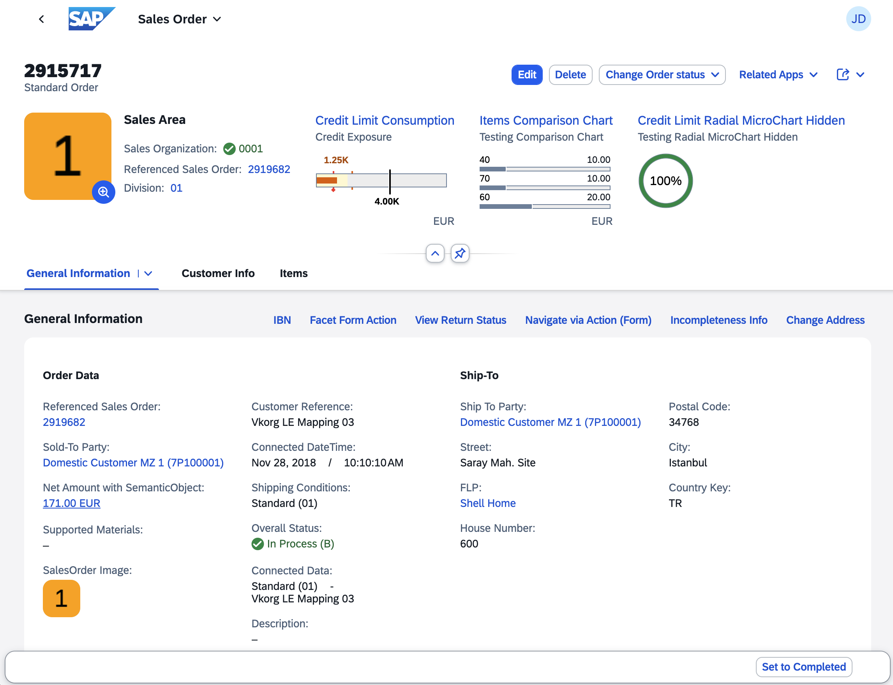

<!-- loio645e27ae85d54c8cbc3f6722184a24a1 -->

# Object Page Elements

The object page allows end users to create, edit, and display objects, as well as save drafts. It is suitable for both simple objects and more complex, multi-faceted objects. The object page view gives you optimal support for multiple devices.

<a name="loio645e27ae85d54c8cbc3f6722184a24a1__section_mx4_xn1_rfc"/>

## Main Elements

The object page is made up of the following elements:

-   Application title is set based on the object type, for example *Sales Order* or *Product*.

-   Object page header comprising of the following elements:

    -   Title and description

    -   Editing status icon, if applicable

    -   Action buttons in the header toolbar, containing generic actions \(in **Display** mode\)

    -   Optional elements, such as the following:

        -   Description

        -   Image of the object instance

            > ### Note:  
            > If the instance does not provide an image, then the default image of the object type is used.

    -   The header toolbar includes:

        -   Buttons for use case-specific actions, for example, *Edit*, *Delete*

        -   Related Apps

        -   A generic *Share* menu that includes the following actions:

            -   *Send Email*

            -   *Share in SAP Jam*

            -   *Save as Tile*

            -   *Share: Microsoft Teams*

            -   *Share: Collaboration Manager*

    -   Header facets highlighting key information related to the object such as:

        -   Label-field pairs to display details such as price or availability. We recommend using no more than five label-field pairs.

        -   Graphical elements such as a chart for credit limits or a rating indicator.

    -   Anchor navigation area that allows end users navigate to the individual content area sections.

    -   Content area where data is organized into sections containing field groups or a table.

        > ### Note:  
        > SAP Fiori elements for OData V2 doesn't support adding an image in the content area.

    -   Paginator buttons in the layout action area enable end users to navigate between subitems without returning to the original list.

        > ### Note:  
        > The paginator buttons are visible if the following conditions are fulfilled:
        > 
        > -   The end user is on a subobject page.
        > 
        > -   The end user navigates from a list to the current page.
        > 
        > -   This list contains at least two entries.

        In SAP Fiori elements for OData V2, the paginator buttons are not available on the main object page by default. You can adapt the UI to enable them.

-   Footer bar in which actions and the *Show Messages* button are available, if applicable.

    In draft applications, the footer bar of subitem object pages can also include the *Apply* button in create and edit mode. This action concludes the current create or edit action, saves the draft, and navigates one step up in the object hierarchy. A toast message is displayed when an action is successful. For more information, see [Draft Handling](draft-handling-ed9aa41.md).

    In a draft application with flexible column layout, the subobject closes and returns to the main object if an end user clicks the *Apply* button.

<a name="loio645e27ae85d54c8cbc3f6722184a24a1__section_s13_dsz_mlb"/>

## Related Information

<table>
<tr>
<th valign="top">

Subject

</th>
<th valign="top">

Link

</th>
</tr>
<tr>
<td valign="top">

Controls related to object pages

</td>
<td valign="top">

[sap.uxap](../10_More_About_Controls/sap-uxap-de71337.md) 

</td>
</tr>
<tr>
<td valign="top">

Annotations used to set up various elements of object pages

</td>
<td valign="top">

[Configuring Object Page Features](configuring-object-page-features-d26d3dd.md)

[Configuring Further Common Features](configuring-further-common-features-a4d3c46.md)

</td>
</tr>
</table>

