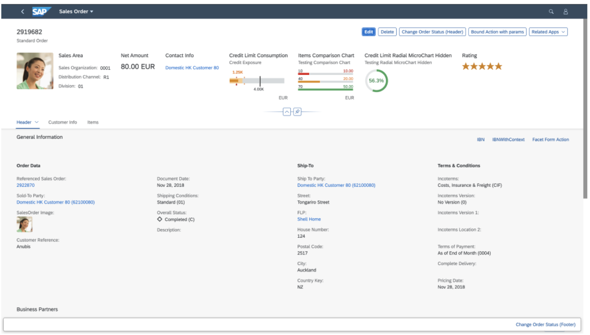

<!-- loio645e27ae85d54c8cbc3f6722184a24a1 -->

# Object Page Elements

The object page lets you display, edit, and create objects, as well as save drafts. It is suitable for both simple objects and more complex, multi-faceted objects. The object page view gives you optimal support for multiple devices.

<a name="loio645e27ae85d54c8cbc3f6722184a24a1__section_m13_dsz_mlb"/>

## Main Elements of the Object Page

The object page is made up of the following elements:

-   Page title that is set to the object type, for example *Sales Order* or *Product*

-   Object header including the following: Action buttons in the object page header

    -   Title and subtitle

    -   Editing status icon \(if applicable\)

    -   Action buttons in the toolbar of the object page header, containing generic actions \(in *Display* mode\)

    -   Optional elements, such as:

        -   A description

        -   An image of the object instance

            > ### Note:  
            > If the instance does not provide an image, then the default image of the object type is used.

        -   Buttons in the header toolbar for use case-specific actions, for example, *Edit* and *Delete*

        -   Header facets to showcase important information relating to the object. Header facets can contain:
            -   Label-field pairs, to show, for example, price or availability. We recommend not to use more than five label-field pairs.

            -   a chart detailing the credit limit, or a rating indicator

-   Anchor navigation area that lets users navigate to the individual content area sections

-   Content area in which data is organized into sections that can contain field groups or a table

    > ### Note:  
    > It is not possible to add an image in the content area for SAP Fiori elements for OData V2.

-   Paginator buttons on the detail page to browse from item to item in the list the user came from

    > ### Note:  
    > The paginator buttons are only visible if these conditions are fulfilled:
    > 
    > -   The user comes from a list to the current page.
    > -   This list contains at least two entries.
    > -   The user is on a subobject page.

    On the first object page, the paginator buttons are disabled by default.

    > ### Note:  
    > You can only adapt the UI to enable them with SAP Fiori elements for OData V2.

    For more information, see [Adapting the UI: List Report and Object Page](adapting-the-ui-list-report-and-object-page-0d2f1a9.md).

-   Footer bar in which actions and the *Show Messages* button are available \(if applicable\).

    In draft applications, the footer bar of subitem object pages can also include the *Apply* button in create and edit mode. This action concludes the current create or edit activity, saves the draft, and navigates one step up in the object hierarchy. A toast message is displayed when an operation is successful. For more information, see [Draft Handling](draft-handling-ed9aa41.md). In a draft application with flexible column layout, the subobject closes and returns to the main object if you click the *Apply* button.

<a name="loio645e27ae85d54c8cbc3f6722184a24a1__section_s13_dsz_mlb"/>

## Related Information

<table>
<tr>
<th valign="top">

Subject

</th>
<th valign="top">

Link

</th>
</tr>
<tr>
<td valign="top">

Controls related to object pages

</td>
<td valign="top">

 [sap.uxap](../10_More_About_Controls/sap-uxap-de71337.md) 

</td>
</tr>
<tr>
<td valign="top">

Annotations used to set up various elements of object pages

</td>
<td valign="top">

[Configuring Object Page Features](configuring-object-page-features-d26d3dd.md)

[Configuring Further Common Features](configuring-further-common-features-a4d3c46.md)

</td>
</tr>
</table>

