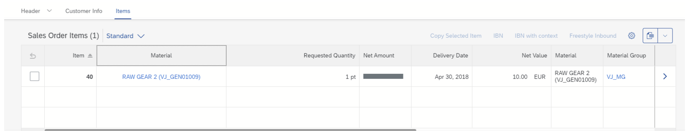

<!-- loiofb93920a2ee145c5bf2b5d1bacb79ab3 -->

# Overriding the Horizontal Alignment of Annotation-Based Table Columns

You can override the horizontal alignment of table columns by using manifest settings.

> ### Note:  
> This topic is only applicable to SAP Fiori elements for OData V4.

Make the settings in the `manifest.json` file as follows:

> ### Sample Code:  
> ```
> "SalesOrderManageObjectPage": {
>     "options": {
>         "settings": {
>             "controlConfiguration": {
>                 "_Item/@com.sap.vocabularies.UI.v1.LineItem": {
>                     "columns": {
>                         "DataField::Material": {
>                             "horizontalAlign": "Center"
>                         }
>                     }
>                 }
>             }
>         }
>     }
> }
> ```

The result is as follows:



The following values are supported for the `horizontalAlign` property:

-   "Begin"
-   "Center"
-   "End"

