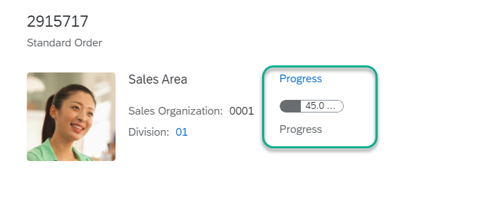
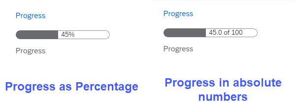
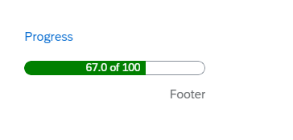
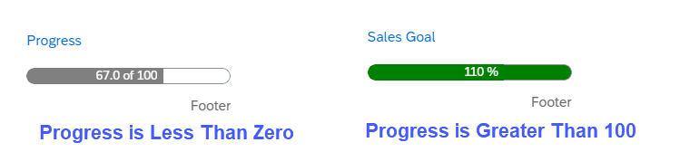

<!-- loio3b5e01c647f44ea98655b8c08feba780 -->

# Progress Indicator Facet

You can add a progress indicator to a header facet on the object page.

The progress indicator allows you to visually represent the level of completion of a goal or target, such as a project's progress, sales progress for the current year’s goal, the development stage of a product, stock availability, and so on. The image below shows a progress indicator within the object page header.

   
  
**Progress Indicator in Object Page Header**

  

As shown below, progress can be expressed either as a percentage or in absolute numbers \(for example, "8 of 10"\), and it can include a unit of measure, such as PC or GB.

   
  
**Progress Indicator: Percent or Number**

  

The progress indicator in the header facet is made up of sections to include a title, subtitle, and footer:

   
  
**Sections of Progress Indicator**

  


## Code Samples


### `UI.ReferenceFacet`

To display the progress indicator in the object page header, add a record to the `UI.HeaderFacets` collection. This record must be of type `UI.ReferenceFacet` and contain an `AnnotationPath` that points to a `UI.DataPoint` with the visualization type `Progress`. The properties for the data point can be included in either the `entityType` being annotated \(`Target`\) or in another `entityType` different from the `Target`, in which case the `AnnotationPath` contains a navigation path as shown below.

> ### Sample Code:  
> XML Annotation
> 
> ```xml
> <Annotations Target="STTA_PROD_MAN.STTA_C_MP_ProjectType">
>    <Annotation Term="UI.HeaderFacets">
>       <Collection>
>          <Record Type="UI.ReferenceFacet">
>             <PropertyValue Property="Target"
>             AnnotationPath="to_ProgressType/@UI.DataPoint#Progress"/>
>          </Record>
>       </Collection>
>    </Annotation>
> </Annotations>
> ```

> ### Sample Code:  
> ABAP CDS Annotation
> 
> ```
> 
> annotate view STTA_C_MP_PROJECTTYPE with {
> @UI.Facet: [
>   {
>     targetQualifier: 'Progress',
>     targetElement: 'TO_PROGRESSTYPE',
>     type: #DATAPOINT_REFERENCE,
>     purpose: #HEADER
>   }
> ]
> test;
> }
> 
> ```

> ### Sample Code:  
> CAP CDS Annotation
> 
> ```
> 
> annotate STTA_PROD_MAN.STTA_C_MP_ProjectType @(
>   UI.HeaderFacets : [
>     {
>         $Type : 'UI.ReferenceFacet',
>         Target : 'to_ProgressType/@UI.DataPoint#Progress',
>     }
>   ]
> );
> 
> ```

> ### Note:  
> In the example above, "UI" is an alias for the `com.sap.vocabularies.UI.v1` vocabulary.


### CDS: `UI.DataPoint`

In CDS, annotate the `EntityType` containing the properties required for the data point as shown in the separate sections for SAP Fiori elements for OData V2 and SAP Fiori elements for OData V4, respectively, below.

> ### Note:  
> -   The data point annotation is for a `Property`, even if the UI vocabulary specifies an `EntityType` as the `Target`.
> 
> -   The property name will be used as the `Qualifier` in the resulting \(generated\) annotation.

The generated annotation will be similar to the example below:


### `UI.DataPoint`

Annotate the `entityType` containing the properties required for the data point as shown below.

> ### Sample Code:  
> XML Annotation
> 
> ```xml
> <Annotations Target="STTA_PROD_MAN.STTA_C_MP_ProgressType">
>    <Annotation Term="UI.DataPoint" Qualifier="Progress">
>       <Record>
>          <PropertyValue Property="Title" String="{@i18n>Title}"/>
>          <PropertyValue Property="Description" String="{@i18n>SubTitle}"/>
>          <PropertyValue Property="Value" Path="Progress"/>
>          <PropertyValue Property="TargetValue" Decimal="150"/>
>          <PropertyValue Property="Criticality" Path="Criticality "/>
>          <PropertyValue Property="Visualization" EnumMember="UI.VisualizationType/Progress"/>
>       </Record>
>    </Annotation>
> </Annotations>
> 
> ```

> ### Sample Code:  
> ABAP CDS Annotation
> 
> ```
> 
> annotate view STTA_C_MP_PROGRESSTYPE with {
> @UI.dataPoint: {
>   title: '{@i18n>Title}',
>   description: '{@i18n>SubTitle}',
>   targetValue: 150,
>   criticality: 'Criticality ',
>   visualization: #PROGRESS
> }
> progress;
> }
> ```

> ### Sample Code:  
> CAP CDS Annotation
> 
> ```
> 
> annotate STTA_PROD_MAN.STTA_C_MP_ProgressType @(
> UI.DataPoint #Progress : {
>     Title : '{@i18n>Title}',
>     Description : '{@i18n>SubTitle}',
>     Value : Progress,
>     TargetValue : 150,
>     Criticality : Criticality ,
>     Visualization : #Progress
>   }
> );
> 
> ```


### `UoM` and `Common.Label`

Additionally, for the unit of measure \(UoM\) and the footer, annotate the property of the `entityType` so that it includes the path of the `Value` property for the data point. For example in the code sample above, the path for the data point `Value` property is `Value`, which is then used to annotate the `entityType`. In the examples below, this is represented by <code>&lt;Annotations Target="STTA_PROD_MAN.STTA_C_MP_ProgressType/<b>Value</b>"&gt;</code>.

Note that the unit of measure can be annotated with `Unit` or `ISOCurrency` as shown below. For the footer, the term `Common.Label` needs to be applied.


### Progress Indicator: `UoM.Unit`

> ### Sample Code:  
> XML Annotation
> 
> ```xml
> <Annotations Target="STTA_PROD_MAN.STTA_C_MP_ProgressType/Value">
>    <Annotation Term="Measures.Unit" Path="UoM"/>
>    <Annotation Term="Common.Label" String="{@i18n>Footer}"/>
> </Annotations>
> ```

> ### Sample Code:  
> ABAP CDS Annotation
> 
> ```xml
> @Semantics.unitOfMeasure: true
> UoM;
> @Semantics.quantity.unitOfMeasure: 'UoM'
> Value;
> ```

> ### Sample Code:  
> CAP CDS Annotation
> 
> ```
> 
> annotate STTA_PROD_MAN.STTA_C_MP_ ProgressType with {
>   @Measures.Unit : UoM
>   Common.Label : '{@i18n>Footer}'
>   Value
> };
> ```


### Progress Indicator: `UoM.ISOCurrency`

> ### Sample Code:  
> XML Annotation
> 
> ```xml
> <Annotations Target="STTA_PROD_MAN.STTA_C_MP_ ProgressType/Value">
>    <Annotation Term="Measures.ISOCurrency" Path="UoM"/>
>    <Annotation Term="Common.Label" Path="Footer/”>
> </Annotations>
> ```

> ### Sample Code:  
> ABAP CDS Annotation
> 
> ```xml
> @Semantics.currencyCode:true
> UoM;
> @Semantics.amount.currencyCode: 'UoM'
> Value;
> ```

> ### Sample Code:  
> CAP CDS Annotation
> 
> ```
> 
> annotate STTA_PROD_MAN.STTA_C_MP_ ProgressType with {
>     Measures.ISOCurrency : UoM
>     @Common.Label : Footer
>     Value
> };
> ```


<a name="loio3b5e01c647f44ea98655b8c08feba780__section_mq1_gqm_bmb"/>

## Rendering Rules

-   The `Value` and `Title` properties are mandatory. Without a value, the progress cannot be calculated. You must provide a title for an object page header facet, as this is required by the `DataPoint` term in the UI vocabulary.

-   The `TargetValue` property is mandatory when using a `UoM` that is not expressed as a percentage \(for example, currency, CM, or PC\), or if no `UoM` is provided.

-   The remaining properties – `Unit of Measure`, `Subtitle`, and `Footer` – are optional.

-   If the value of the `Unit of Measure` property is "%", then the `Value` property will be used directly as a percentage.

-   If the value of the `Unit of Measure` is not "%" or is not provided, then the progress will be calculated using the `Value` and `TargetValue` properties according to the formula `Progress = Value / TargetValue`.

-   Additionally, the following checks will be done:

    -   Division by zero will result in the progress being zero \(since it cannot be calculated\).

    -   If the progress is less than zero, then no color will appear in the progress bar.

    -   If the progress is greater than 100, then the progress bar will be fully colored.

    -   In both cases the actual value of the progress will be displayed in the bar as shown in the image below.

           
          
        **Values in Progress Indicator**

          


<a name="loio3b5e01c647f44ea98655b8c08feba780__section_gdw_jqm_bmb"/>

## Additional Features in SAP Fiori Elements for OData V2

**CDS: `UI.DataPoint`**

In ABAP CDS, annotate the `EntityType` containing the properties required for the data point as shown below.

```xml
@UI.dataPoint: {   
    title:'{@i18n>Title}',   
    description: {@i18n>SubTitle},   
    targetValue: 150,   
    criticality: 'Criticality',   
    visualization: #PROGRESS   
}
ProjectProgress.Progress

```


<a name="loio3b5e01c647f44ea98655b8c08feba780__section_bg1_nqm_bmb"/>

## Additional Features in SAP Fiori Elements for OData V4

**SAP Cloud Application Programming Model: `UI.DataPoint`**

In CAP CDS, annotate the `EntityType` containing the properties required for the data point as shown below.

```
@UI: DataPoint #Progress              : {
        Value         : Progress,
        TargetValue   : 100,
        Title         : 'Progress',
        Visualization : #Progress
    }

```

