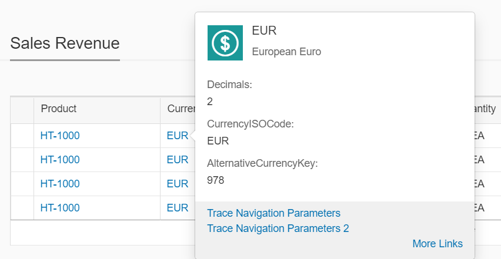
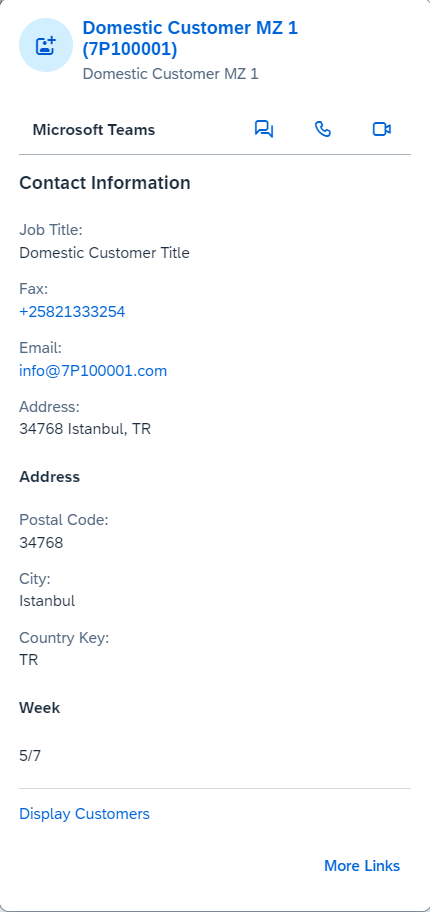
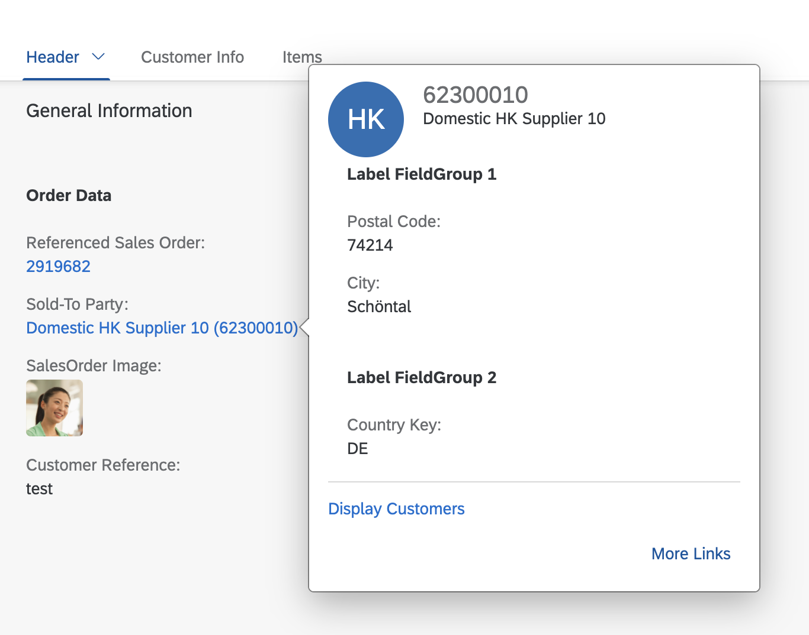

<!-- loio1083035f266547159b292c4a0f567ac7 -->

# Quick Views: Further Configuration Examples

You have various options for configuring quick views. This documentation provides some examples.


<a name="loio1083035f266547159b292c4a0f567ac7__section_mkj_phy_xmb"/>

## Example 1: Quick View in Object Page Table

> ### Note:  
> Not all columns that are supported in a table support the display of a quick view.

  

For the currency, no referential constraint is defined by the service. This is why you need to make the following entry:

```

<Association Name="assoc_6D52161C1362D99A31996E5BB23202E8" sap:content-version="1">
    <End Type="STTA_PROD_MAN.STTA_C_MP_ProductSalesDataType" Multiplicity="1" Role="FromRole_assoc_6D52161C1362D99A31996E5BB23202E8"/>
    <End Type="STTA_PROD_MAN.I_CurrencyType" Multiplicity="0..1" Role="ToRole_assoc_6D52161C1362D99A31996E5BB23202E8"/>
    <ReferentialConstraint>
        <Principal Role="FromRole_assoc_6D52161C1362D99A31996E5BB23202E8">
            <PropertyRef Name="Currency"/>
        </Principal>
        <Dependent Role="ToRole_assoc_6D52161C1362D99A31996E5BB23202E8">
            <PropertyRef Name="Currency"/>
        </Dependent>
    </ReferentialConstraint>
</Association>

```


### Quick view facets annotation

> ### Sample Code:  
> XML Annotation
> 
> ```xml
> 
> <!-- QuickViewFacets annotation for Currency-->
> <Annotations Target="STTA_PROD_MAN.STTA_C_MP_ProductSalesDataType/Currency">
>     <Annotation Term="Common.SemanticObject" String="EPMProduct"/>
> </Annotations>           
> <Annotations Target="STTA_PROD_MAN.I_CurrencyType">           
>     <Annotation Term="UI.QuickViewFacets">
>         <Collection>
>             <Record Type="UI.ReferenceFacet">
>                 <PropertyValue Property="Target" AnnotationPath="@UI.FieldGroup#CurrencyQuickViewPOC_FieldGroup_1" />
>             </Record>           
>         </Collection>
>     </Annotation>
>     <Annotation Term="UI.FieldGroup" Qualifier="CurrencyQuickViewPOC_FieldGroup_1">
>         <Record>
>             <PropertyValue Property="Data">
>                 <Collection>
>                     <Record Type="UI.DataField">
>                         <PropertyValue Property="Label" String="Decimals" />
>                         <PropertyValue Property="Value" Path="Decimals"/>
>                     </Record>
>                     <Record Type="UI.DataField">
>                         <PropertyValue Property="Label" String="CurrencyISOCode" />
> 
>                         <PropertyValue Property="Value" Path="CurrencyISOCode"/>
>                     </Record>
>                     <Record Type="UI.DataField">
>                         <PropertyValue Property="Label" String="AlternativeCurrencyKey" />
> 
>                         <PropertyValue Property="Value" Path="AlternativeCurrencyKey"/>
>                     </Record>                            
>                 </Collection>
>             </PropertyValue>
>         </Record>
>     </Annotation>   
> </Annotations>
> 
> ```

> ### Sample Code:  
> ABAP CDS Annotation
> 
> ```
> 
> annotate view STTA_C_MP_PRODUCTSALESDATA with {
>   @Consumption.semanticObject: 'EPMProduct'
>   currency;
> }
> 
> annotate view I_CURRENCYTYPE with {
> @UI.Facet: [
>   {
>     targetQualifier: 'CurrencyQuickViewPOC_FieldGroup_1',
>     type: #FIELDGROUP_REFERENCE,
>     purpose: #QUICK_VIEW
>   }
> ]
> @UI.fieldGroup: [
>   {
>     label: 'Decimals',
>     value: 'DECIMALS',
>     type: #STANDARD,
>     position: 1 ,
>     qualifier: 'CurrencyQuickViewPOC_FieldGroup_1'
>   }
> ]
> decimals;
> @UI.fieldGroup: [
>   {
>     label: 'CurrencyISOCode',
>     value: 'CURRENCYISOCODE',
>     type: #STANDARD,
>     position: 2 ,
>     qualifier: 'CurrencyQuickViewPOC_FieldGroup_1'
>   }
> ]
> currencyisocode;
> @UI.fieldGroup: [
>   {
>     label: 'AlternativeCurrencyKey',
>     value: 'ALTERNATIVECURRENCYKEY',
>     type: #STANDARD,
>     position: 3 ,
>     qualifier: 'CurrencyQuickViewPOC_FieldGroup_1'
>   }
> ]
> alternativecurrencykey;
> }
> 
> ```

> ### Sample Code:  
> CAP CDS Annotation
> 
> ```
> 
> annotate STTA_PROD_MAN.STTA_C_MP_ProductSalesDataType with {
>     @Common.SemanticObject : 'EPMProduct'
>     Currency
> };
> annotate STTA_PROD_MAN.I_CurrencyType with @(
>     UI.QuickViewFacets : [
>         {
>             $Type : 'UI.ReferenceFacet',
>             Target : '@UI.FieldGroup#CurrencyQuickViewPOC_FieldGroup_1'
>         }
>     ],
>     UI.FieldGroup #CurrencyQuickViewPOC_FieldGroup_1 : {
>         Data : [
>             {
>                 $Type : 'UI.DataField',
>                 Label : 'Decimals',
>                 Value : Decimals
>             },
>             {
>                 $Type : 'UI.DataField',
>                 Label : 'CurrencyISOCode',
>                 Value : CurrencyISOCode
>             },
>             {
>                 $Type : 'UI.DataField',
>                 Label : 'AlternativeCurrencyKey',
>                 Value : AlternativeCurrencyKey
>             }
>         ]
>     }
> );
> 
> ```


<a name="loio1083035f266547159b292c4a0f567ac7__section_u3p_vhy_xmb"/>

## Additional Features in SAP Fiori Elements for OData V2

> ### Example:  
> `QuickViewFacets` annotation for Supplier
> 
>   

> ### Sample Code:  
> XML Annotation
> 
> ```xml
> 
> <!-- QuickViewFacets annotation for Supplier-->
>             <Annotations Target="STTA_PROD_MAN.STTA_C_MP_SupplierType/EmailAddress" xmlns="http://docs.oasis-open.org/odata/ns/edm">
>                   <Annotation Term="com.sap.vocabularies.Communication.v1.IsEmailAddress" Bool="true"/>
>             </Annotations>      
> 
>             <Annotations Target="STTA_PROD_MAN.STTA_C_MP_SupplierType/URL" xmlns="http://docs.oasis-open.org/odata/ns/edm">
>                   <Annotation Term="Org.OData.Core.V1.IsUrl" Bool="true"/>
>             </Annotations>
>             <Annotations Target="STTA_PROD_MAN.STTA_C_MP_SupplierType/PhoneNumber" xmlns="http://docs.oasis-open.org/odata/ns/edm">
>                   <Annotation Term="com.sap.vocabularies.Communication.v1.IsPhoneNumber" Bool="true"/>
>             </Annotations>
>             <Annotations Target="STTA_PROD_MAN.STTA_C_MP_SupplierType">                
>                 <Annotation Term="UI.QuickViewFacets">
>                     <Collection>
>                         <Record Type="UI.ReferenceFacet">
>                             <PropertyValue Property="Target" AnnotationPath="@UI.FieldGroup#SupplierQuickViewPOC_FieldGroup_1" />
>                         </Record>
>                         <Record Type="UI.ReferenceFacet">
>                             <PropertyValue Property="Target" AnnotationPath="@UI.FieldGroup#SupplierQuickViewPOC_FieldGroup_2" />
>                         </Record>        
> 
>                     </Collection>
>                 </Annotation>
>                 <Annotation Term="UI.FieldGroup" Qualifier="SupplierQuickViewPOC_FieldGroup_1">
>                     <Record>
>                         <PropertyValue Property="Label" String="The first field group label" />
>                         <PropertyValue Property="Data">
>                             <Collection>
>                                 <Record Type="UI.DataField">
>                                     <PropertyValue Property="Label" String="Supplier" />
>                                     <PropertyValue Property="Value" Path="Supplier"/>
>                                 </Record>
>                                 <Record Type="UI.DataField">
>                                     <PropertyValue Property="Label" String="Company Name" />
>                                     <PropertyValue Property="Value" Path="CompanyName"/>
>                                 </Record>
>                                 <Record Type="UI.DataField">
>                                     <PropertyValue Property="Label" String="Email Address" />
>                                     <PropertyValue Property="Value" Path="EmailAddress"/>
>                                 </Record>
>                                 <Record Type="UI.DataField">
>                                     <PropertyValue Property="Label" String="to_Address / FormattedAddress" />
>                                     <PropertyValue Property="Value" Path="to_Address/FormattedAddress"/>
>                                 </Record>
>                             </Collection>
>                         </PropertyValue>
>                     </Record>
>                 </Annotation>
>                 <Annotation Term="UI.FieldGroup" Qualifier="SupplierQuickViewPOC_FieldGroup_2">
>                     <Record>
>                         <PropertyValue Property="Label" String="The second field group label" />
>                         <PropertyValue Property="Data">
>                             <Collection>
>                                 <Record Type="UI.DataField">
>                                     <PropertyValue Property="Label" String="Phone Number" />
>                                     <PropertyValue Property="Value" Path="PhoneNumber"/>
>                                 </Record>
>                                 <Record Type="UI.DataField">
>                                     <PropertyValue Property="Label" String="URL" />
>                                     <PropertyValue Property="Value" Path="URL"/>
>                                 </Record>
>                                 <Record Type="UI.DataField">
>                                     <PropertyValue Property="Label" String="to_Address / AddressValidityStartDate" />
>                                     <PropertyValue Property="Value" Path="to_Address/AddressValidityStartDate"/>
>                                 </Record>
>                             </Collection>
>                         </PropertyValue>
>                     </Record>
>                 </Annotation>
>             </Annotations>
> 
> ```

> ### Sample Code:  
> ABAP CDS Annotation
> 
> ```
> 
> annotate view STTA_C_MP_SUPPLIER with {
> @UI.Facet: [
>   {
>     targetQualifier: 'SupplierQuickViewPOC_FieldGroup_1',
>     type: #FIELDGROUP_REFERENCE,
>     purpose: #QUICK_VIEW
>   },
>   {
>     targetQualifier: 'SupplierQuickViewPOC_FieldGroup_2',
>     type: #FIELDGROUP_REFERENCE,
>     purpose: #QUICK_VIEW
>   }
> ]
> @UI.fieldGroup: [
>   {
>     label: 'Supplier',
>     value: 'SUPPLIER',
>     type: #STANDARD,
>     position: 1 ,
>     qualifier: 'SupplierQuickViewPOC_FieldGroup_1',
>     groupLabel: 'The first field group label'
>   }
> ]
> supplier;
> @UI.fieldGroup: [
>   {
>     label: 'Company Name',
>     value: 'COMPANYNAME',
>     type: #STANDARD,
>     position: 2 ,
>     qualifier: 'SupplierQuickViewPOC_FieldGroup_1'
>   }
> ]
> companyname;
> @UI.fieldGroup: [
>   {
>     label: 'Email Address',
>     value: 'EMAILADDRESS',
>     type: #STANDARD,
>     position: 3 ,
>     qualifier: 'SupplierQuickViewPOC_FieldGroup_1'
>   }
> ]
> @Semantics:   { eMail: { address: true, type:  [ #PREF, #WORK ] } }
> emailaddress;
> @UI.fieldGroup: [
>   {
>     label: 'to_Address / FormattedAddress',
>     value: 'TO_ADDRESS/FORMATTEDADDRESS',
>     type: #STANDARD,
>     position: 4 ,
>     qualifier: 'SupplierQuickViewPOC_FieldGroup_1'
>   }
> ]
> to_address/formattedaddress;
> @UI.fieldGroup: [
>   {
>     label: 'Phone Number',
>     value: 'PHONENUMBER',
>     type: #STANDARD,
>     position: 5 ,
>     qualifier: 'SupplierQuickViewPOC_FieldGroup_2'
>   }
> ]
> @Semantics.telephone.type: #WORK
> phonenumber;
> @UI.fieldGroup: [
>   {
>     label: 'URL',
>     value: 'URL',
>     type: #STANDARD,
>     position: 6 ,
>     qualifier: 'SupplierQuickViewPOC_FieldGroup_2'
>   }
> ]
> url;
> @UI.fieldGroup: [
>   {
>     label: 'to_Address / AddressValidityStartDate',
>     value: 'TO_ADDRESS/ADDRESSVALIDITYSTARTDATE',
>     type: #STANDARD,
>     position: 7 ,
>     qualifier: 'SupplierQuickViewPOC_FieldGroup_2'
>   }
> ]
> to_address/addressvaliditystartdate;
> }
> 
> ```


<a name="loio1083035f266547159b292c4a0f567ac7__section_ncg_g3y_xmb"/>

## Additional Features in SAP Fiori Elements for OData V4

> ### Example:  
>   

> ### Sample Code:  
> XML Annotation
> 
> ```xml
> <Annotation Term="UI.QuickViewFacets">
>    <Collection>
>     <Record Type="UI.ReferenceFacet">
>       <PropertyValue Property="Label" String="Label FieldGroup 1"/>
>       <PropertyValue Property="Target" AnnotationPath="@UI.FieldGroup#SoldToQuickView"/>
>     </Record>
>     <Record Type="UI.ReferenceFacet">
>       <PropertyValue Property="Label" String="Label FieldGroup 2"/>
>       <PropertyValue Property="Target" AnnotationPath="@UI.FieldGroup#QVFacet"/>
>     </Record>
>    </Collection>
> </Annotation>
> <Annotation Term="UI.FieldGroup" Qualifier="SoldToQuickView">
>    <Record Type="UI.FieldGroupType">
>      <PropertyValue Property="Data">
>       <Collection>
>        <Record Type="UI.DataField">
>         <PropertyValue Property="Value" Path="PostalCode"/>
>        </Record>
>        <Record Type="UI.DataField">
>         <PropertyValue Property="Value" Path="CityName"/>
>        </Record>
>       </Collection>
>      </PropertyValue>
>    </Record>
> </Annotation>
> <Annotation Term="UI.FieldGroup" Qualifier="QVFacet">
>    <Record Type="UI.FieldGroupType">
>      <PropertyValue Property="Data">
>       <Collection>
>        <Record Type="UI.DataField">
>         <PropertyValue Property="Value" Path="Country"/>
>        </Record>
>       </Collection>
>      </PropertyValue>
>    </Record>
> </Annotation>
> ```

> ### Sample Code:  
> ABAP CDS Annotation
> 
> ```
> 
> @UI.Facet: [
>   {
>     label: 'Label FieldGroup 1',
>     targetQualifier: 'SoldToQuickView',
>     type: #FIELDGROUP_REFERENCE,
>     purpose: #QUICK_VIEW
>   },
>   {
>     label: 'Label FieldGroup 2',
>     targetQualifier: 'QVFacet',
>     type: #FIELDGROUP_REFERENCE,
>     purpose: #QUICK_VIEW
>   }
> ]
> @UI.fieldGroup: [
>   {
>     value: 'POSTALCODE',
>     type: #STANDARD,
>     position: 1 ,
>     qualifier: 'SoldToQuickView'
>   }
> ]
> POSTALCODE;
> 
> @UI.fieldGroup: [
>   {
>     value: 'CITYNAME',
>     type: #STANDARD,
>     position: 2 ,
>     qualifier: 'SoldToQuickView'
>   }
> ]
> CITYNAME;
> 
> @UI.fieldGroup: [
>   {
>     value: 'COUNTRY',
>     type: #STANDARD,
>     position: 1 ,
>     qualifier: 'QVFacet'
>   }
> ]
> COUNTRY;
> 
> ```

> ### Sample Code:  
> CAP CDS Annotation
> 
> ```
> 
> UI.QuickViewFacets : [
>     {
>         $Type : 'UI.ReferenceFacet',
>         Label : 'Label FieldGroup 1',
>         Target : '@UI.FieldGroup#SoldToQuickView'
>     },
>     {
>         $Type : 'UI.ReferenceFacet',
>         Label : 'Label FieldGroup 2',
>         Target : '@UI.FieldGroup#QVFacet'
>     },
> ],
> UI.FieldGroup #SoldToQuickView : {
>     $Type : 'UI.FieldGroupType',
>     Data : [
>         {
>             $Type : 'UI.DataField',
>             Value : PostalCode
>         },
>         {
>             $Type : 'UI.DataField',
>             Value : CityName
>         }
>     ]
> },
> UI.FieldGroup #QVFacet : {
>     $Type : 'UI.FieldGroupType',
>     Data : [
>         {
>             $Type : 'UI.DataField',
>             Value : Country
>         }
>     ]
> },
> 
> ```

