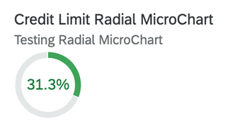

<!-- loio51eb56989df94267a75ebeff24093a5e -->

# Radial Micro Chart

Radial micro charts displays a single percentage value.

The chart consists of a colored radial bar with a percentage value inside.



> ### Note:  
> For more information about this chart type, see [Samples](https://ui5.sap.com/1.82.5/#/entity/sap.suite.ui.microchart.RadialMicroChart).


<a name="loio51eb56989df94267a75ebeff24093a5e__section_cfx_s3q_qmb"/>

## UI.Chart Annotation

The `UI.Chart Title` property is used for the title.

The `UI.Chart Description` property is used for the subtitle.

> ### Sample Code:  
> XML Annotation
> 
> ```xml
> <Annotation Term="UI.Chart" Qualifier="SpecificationWidthRadialChart">
>     <Record Type="UI.ChartDefinitionType">
>         <PropertyValue Property="Title" String="Product Width Specification"/>
>         <PropertyValue Property="Description" String="No navigation with qualifier"/>
>         <PropertyValue Property="ChartType" EnumMember="UI.ChartType/Donut"/>
>         <PropertyValue Property="Measures">
>             <Collection>
>                 <PropertyPath>Width</PropertyPath>
>             </Collection>
>         </PropertyValue>
>         <PropertyValue Property="MeasureAttributes">
>             <Collection>
>                 <Record Type="UI.ChartMeasureAttributeType">
>                     <PropertyValue Property="Measure" PropertyPath="Width"/>
>                     <PropertyValue Property="Role" EnumMember="UI.ChartMeasureRoleType/Axis1"/>
>                     <PropertyValue Property="DataPoint" AnnotationPath="@UI.DataPoint#Width"/>
>                 </Record>
>             </Collection>
>         </PropertyValue>
>     </Record>
> </Annotation>
> 
> ```

> ### Sample Code:  
> ABAP CDS Annotation
> 
> ```
> 
> @UI.Chart: [
>   {
>     title: 'Product Width Specification',
>     description: 'No navigation with qualifier',
>     chartType: #DONUT,
>     measures: [
>       'WIDTH'
>     ],
>     measureAttributes: [
>       {
>         measure: 'Width',
>         role: #AXIS_1,
>         asDataPoint: true
>       }
>     ],
>     qualifier: 'SpecificationWidthRadialChart'
>   }
> ]
> annotate view STTA_C_MP_PRODUCT with {
> 
> }
> 
> ```

> ### Sample Code:  
> CAP CDS Annotation
> 
> ```
> 
> UI.Chart #SpecificationWidthRadialChart : {
>     $Type : 'UI.ChartDefinitionType',
>     Title : 'Product Width Specification',
>     Description : 'No navigation with qualifier',
>     ChartType : #Donut,
>     Measures : [
>         Width
>     ],
>     MeasureAttributes : [
>         {
>             $Type : 'UI.ChartMeasureAttributeType',
>             Measure : Width,
>             Role : #Axis1,
>             DataPoint : '@UI.DataPoint#Width'
>         }
>     ]
> }
> 
> ```


<a name="loio51eb56989df94267a75ebeff24093a5e__section_w1x_s3q_qmb"/>

## UI.DataPoint Annotation

> ### Sample Code:  
> XML Annotation
> 
> ```xml
> <Annotation Term="UI.DataPoint" Qualifier="Width">
>     <Record>
>         <PropertyValue Property="Value" Path="Width"/>
>         <PropertyValue Path="Day1" Property="Title" />
>         <PropertyValue Property="Description" String="Radial Micro Chart"/>
>         <PropertyValue Property="TargetValue" Path="Weight"/>
>         <PropertyValue Property="ForecastValue" Path="Height"/>
>         <PropertyValue Property="MinimumValue" Decimal="0"/>
>         <PropertyValue Property="MaximumValue" Decimal="100"/>
>         <PropertyValue Property="Criticality" Path="criticalityValue"/>
>     </Record>
> </Annotation>
> 
> ```

> ### Sample Code:  
> ABAP CDS Annotation
> 
> ```
> 
> @UI.dataPoint: {
>   description: 'Radial Micro Chart',
>   targetValueElement: 'Weight',
>   forecastValue: 'Height',
>   minimumValue: 0,
>   maximumValue: 100,
>   criticality: 'criticalityValue'
> }
> Width;
> ```

> ### Sample Code:  
> CAP CDS Annotation
> 
> ```
> 
> UI.DataPoint #Width : {
>     Value : Width,
>     Title : Day1,
>     Description : 'Radial Micro Chart',
>     TargetValue : Weight,
>     ForecastValue : Height,
>     MinimumValue : 0,
>     MaximumValue : 100,
>     Criticality : criticalityValue
> }
> 
> ```

> ### Note:  
> The Radial Micro Chart displays percentage values. This means that the unit of measure label is not valid and is not rendered.

For semantic coloring, both `Criticality` and `CriticalityCalculation` are supported \(`Criticality` overrides `CriticalityCalculation`\).

Mandatory:

1.  `UI.Chart` → `ChartType`: “`Donut`”
2.  `UI.Chart` → `Measures`
3.  `UI.Chart` → `MeasureAttributes` → `DataPoint`
4.  `UI.DataPoint` → `Value`
5.  In case `CriticalityCalculation` is used for semantic coloring, then
    -   `UI.DataPoint` → `CriticalityCalculation`

    -   `UI.DataPoint` → `CriticalityCalculation/ImprovementDirection`


