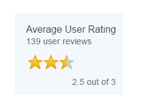
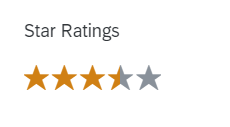
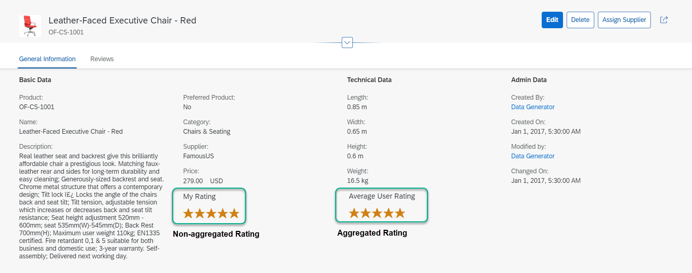

<!-- loiobcc12cbe038146a2a586ac021a20f3a7 -->

# Rating Indicator Facet

You can add a read-only rating indicator to the object page header.

The rating indicator allows you to visually represent the rating types described below.


## Aggregated Rating

This rating shows an average of all ratings recorded for the object and is displayed as shown below in the object page header \(*Display* mode\):

   
  
**Aggregated Rating Indicator**

  

When the rating indicator shows an aggregated rating, it contains the following elements:

-   Title

-   Subtitle, displaying the total number of ratings

    > ### Note:  
    > You have the option to specify a text in the subtitle to be more descriptive \(example: *139 user reviews*, where "139" is the number of reviews received, and "user reviews" is the text added\). For information, see the code sample below.

-   `Rating` control, displaying the visual representation of the rating \(stars\)

-   Footer text, displaying the calculated average of all ratings


> ### Note:  
> If you wish to use an aggregated rating, you must use local annotations \(as opposed to CDS annotations\). For information, see the code sample below.


## Non-Aggregated Rating

This rating shows a single rating, such the user's own rating for the object. In the examples below, the non-aggregated rating is used to display the user's own rating. This rating type is displayed as shown below:

   
  
**Non-Aggregated Rating Indicator**

  

When the rating indicator shows a non-aggregated rating, it contains the following elements:

-   Title

-   Subtitle

-   `Rating` control, displaying the visual representation of the rating \(stars\)


> ### Note:  
> There is no footer for this rating type.
> 
> If you wish to use a non-aggregated rating, you can use either local annotations or CDS annotations. See the code samples below.


## Rating Indicator in Edit Mode

When the object page is in *Edit* mode, the rating indicator moves into the header facet and appears as shown below with the title only. For an aggregated rating, the number of ratings is shown in parentheses after the stars. Note that the rating indicator is still read-only in this mode.

   
  
**Rating Indicator in Edit Mode**

  


## Code Samples

To add a rating indicator facet to the object page header, use a `UI.ReferenceFacet` that points to a `UI.DataPoint` with `Rating` as the `UI.VisualizationType` as shown in the code sample below.

The rating indicator uses the values of the `UI.DataPoint`, which contains the path to the field in the back-end system that provides the rating value.


### Set the Maximum Number of Stars

The maximum number of stars \(`TargetValue`\) can be set in one of the following ways:

-   Specified in the annotation, as shown in the sample code for the aggregated rating

-   Determined by a path to a specific field in the back-end system, as shown in the sample code for the non-aggregated rating


### Change the Subtitle

The subtitle is set differently for the aggregated and non-aggregated ratings.

To render a subtitle for an aggregated rating, set the `SampleSize` property for the term `UI.DataPoint`. The `SampleSize` property value \(for example, *139*\) is then concatenated with a text \(for example, *user reviews*\). You can change this text by annotating the `SampleSize` with `Common.Label`, as shown in the sample code for the aggregated rating. Otherwise, the default text \(*ratings*\) is used.

To render a subtitle for a non-aggregated rating, the `Description` property needs to be set for the term `UI.DataPoint`, as shown in the sample code for the non-aggregated rating.


### Aggregated Rating

> ### Sample Code:  
> XML Annotation
> 
> ```xml
> 
> <Annotation Term="UI.Facets">
>     <Record Type="UI.ReferenceFacet">
>         <PropertyValue Property="Target" AnnotationPath="to_ProductRating/@UI.DataPoint#Aggregated" />
>     </Record>
> </Annotation>
> <Annotation Term="UI.DataPoint" Qualifier="Aggregated">
>     <Record>
>         <PropertyValue Property="Title" String="{@i18n>@ProductAverageRating}" />
>         <PropertyValue Property="Value" Path="AverageRating" />
>         <PropertyValue Property="TargetValue" Int="3" />
>         <PropertyValue Property="Visualization" EnumMember="UI.VisualizationType/Rating" />
>         <PropertyValue Property="SampleSize" Path="ReviewCount" />
>     </Record>
> </Annotation>
> ```

> ### Sample Code:  
> ABAP CDS Annotation
> 
> ```
> 
> @UI.headerInfo: {
>   typeName: 'Sales Order',
>   typeNamePlural: 'Sales Orders',
>   title: {
>     value: 'SO_ID',
>     type: #STANDARD
>   }
> }
> annotate view STTA_C_MP_PRODUCT with {
> 
> }
> 
> ```

> ### Sample Code:  
> CAP CDS Annotation
> 
> ```
> 
> UI.Facets : {
>     $Type : 'UI.ReferenceFacet',
>     Target : 'to_ProductRating/@UI.DataPoint#Aggregated'
> },
> UI.DataPoint #Aggregated : {
>     Title : '{@i18n>@ProductAverageRating}',
>     Value : AverageRating,
>     TargetValue : 3,
>     Visualization : #Rating,
>     SampleSize : ReviewCount
> }
> ```


### Non-Aggregated Rating

> ### Sample Code:  
> XML Annotation
> 
> ```xml
> 
> <Record Type="UI.ReferenceFacet">
>     <PropertyValue Property="Target" AnnotationPath="to_ProductRating/@UI.DataPoint#NonAggregated"/
> </Record>
> <!-- non aggregated rating -->
> <Annotation Term="UI.DataPoint" Qualifier="NonAggregated">
>    <Record>
>       <PropertyValue Property="Title" String="{@i18n>@ProductUserRating}"/>
>       <PropertyValue Property="Description" String="@i18n>@MyRating}"/>
>       <PropertyValue Property="Value" Path="Rating"/>
>       <PropertyValue Property="TargetValue" Path="MaxRating"/>
>       <PropertyValue Property="Visualization" EnumMember="UI.VisualizationType/Rating"/>
>    </Record>
> </Annotation> 
> 
> ```

> ### Sample Code:  
> ABAP CDS Annotation
> 
> ```
> 
> @UI.facet: [
>  {
>   id:           'rating',
>   type:         #DATAPOINT_REFERENCE,
>   targetElement: '_ProductRating',
>   targetQualifier: 'NonAggregated'
>  }
> ]
> product;
> 
> @UI.dataPoint: {
>   title: '{@i18n>@ProductUserRating}',
>   description: '@i18n>@MyRating}',
>   targetValueElement: 'MaxRating',
>   visualization: #RATING
> }
> Rating;
> 
> ```

> ### Sample Code:  
> CAP CDS Annotation
> 
> ```
> 
> UI.Facets : {
>     $Type : 'UI.ReferenceFacet',
>     Target : 'to_ProductRating/@UI.DataPoint#NonAggregated'
> },
> 
> UI.DataPoint #NonAggregated : {
>     Title : '{@i18n>@ProductUserRating}',
>     Description : '@i18n>@MyRating}',
>     Value : Rating,
>     TargetValue : MaxRating,
>     Visualization : #Rating
> }
> 
> ```


<a name="loiobcc12cbe038146a2a586ac021a20f3a7__section_zr3_dlm_bmb"/>

## Additional Features in SAP Fiori Elements for OData V4

**CDS Annotation**

```xml

@UI: DataPoint #Rating               : {
        Value         : Rating,
        TargetValue   : 5.0,
        Title         : 'Rating',
        Visualization : #Rating
    }

```

