<!-- loio62d3f7c2a9424864921184fd6c7002eb -->

# SAP Fiori Elements Feature Map

This topic lists UI elements, controls, and features that are supported by SAP Fiori elements.

You can search, filter, and sort content in the table below. Use your mouse to hover over the links in the *Developer Documentation* column to display a short description of the feature.

<a name="loio62d3f7c2a9424864921184fd6c7002eb__section_b3t_vpn_gjb"/>

## Extending SAP Fiori Elements-Based Apps

You can use extension points to extend your generated app during the creation process. For more information, see the following resources:

-   Cross-floorplan extension points and general information: [Extending Generated Apps Using App Extensions](extending-generated-apps-using-app-extensions-340cdb2.md)

-   [Extending List Reports and Object Pages Using App Extensions](extending-list-reports-and-object-pages-using-app-extensions-a892eb8.md)

-   [Configuring Analytical List Page App Extensions](configuring-analytical-list-page-app-extensions-9504fb4.md)

-   [Configuring Overview Page App Extensions](configuring-overview-page-app-extensions-b240f61.md)

<a name="loio62d3f7c2a9424864921184fd6c7002eb__section_d5r_gst_ymb"/>

## How To Use the Feature Map

**Filter Usage for *Supported Floorplans* Column in Table** 

-   Features available for both OData versions are given without parentheses, as in *List report* and *Overview page*.

-   To search for features available in OData V2, choose both *List report \(OData V2\)* and *List report*.

-   To search for features available in OData V4, choose *List report*.

**Feature List**

<table>
<tr>
<th valign="top">

Controls, UI Elements, Features

</th>
<th valign="top">

Supported Floorplans

</th>
<th valign="top">

Developer Documentation

</th>
<th valign="top">

SAP Fiori Design Guidelines

</th>
<th valign="top">

Thumbnail

</th>
<th valign="top">

Tags for Keyword Search

</th>
</tr>
<tr>
<td valign="top">

Analytical card

</td>
<td valign="top">

-   Analytical list page
-   Overview page

</td>
<td valign="top">

[Creating Key Performance Indicator Tags](creating-key-performance-indicator-tags-d80a360.md)

[Analytical Cards](analytical-cards-d7b0b42.md)

</td>
<td valign="top">

[Analytical Card](https://experience.sap.com/fiori-design-web/analytical-card/)

</td>
<td valign="top">

   
  
**Donut Chart**

 

 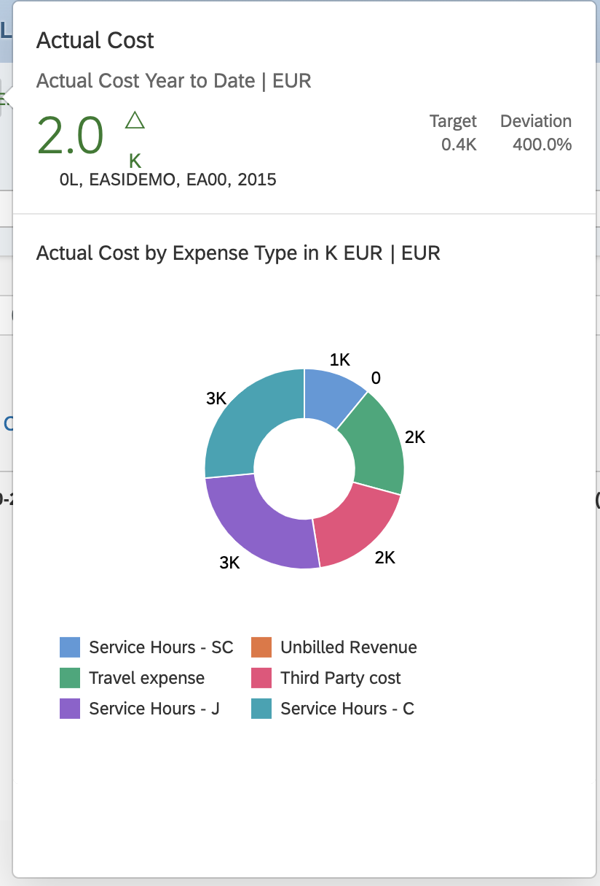 

</td>
<td valign="top">

KPI

DataPoint

analytics

cards

</td>
</tr>
<tr>
<td valign="top">

Add column to a table

</td>
<td valign="top">

-   Analytical list page
-   List report
-   Object page
-   Overview page

</td>
<td valign="top">

[Defining Line Items](defining-line-items-f0e1e17.md)

[Table Cards](table-cards-167bf7c.md)

[Grouping of Fields](grouping-of-fields-cb1748e.md)

</td>
<td valign="top">

[Table Overview](https://experience.sap.com/fiori-design-web/table-overview/)

</td>
<td valign="top">

   
  
**Add column to a table**

 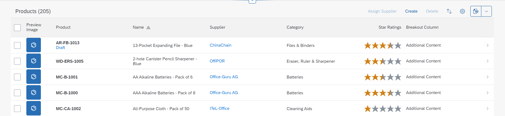 

</td>
<td valign="top">

showDataFieldsLabel

Table

Columns

UI.LineItem

width

column

Fieldgroups

UI.FieldGroup

</td>
</tr>
<tr>
<td valign="top">

Add card to insights

</td>
<td valign="top">

-   List report
-   Analytical list page

</td>
<td valign="top">

 [Creating Cards for the Insights Section of My Home in SAP S/4HANA Cloud](creating-cards-for-the-insights-section-of-my-home-in-sap-s-4hana-cloud-9b13559.md) 

</td>
<td valign="top">

 

</td>
<td valign="top">

   
  
**Add Card to Insights Option in List Report Table Toolbar**

  

   
  
**Add Card to Insights Option in Analytical List Page Chart Toolbar**

  

</td>
<td valign="top">

add cards

add cards to insights

insights

</td>
</tr>
<tr>
<td valign="top">

Add custom column

</td>
<td valign="top">

-   List report
-   Object page

</td>
<td valign="top">

 [Extension Points for Tables](extension-points-for-tables-d525522.md) 

</td>
<td valign="top">

[Table Overview](https://experience.sap.com/fiori-design-web/table-overview/)

</td>
<td valign="top">

   
  
**Custom Columns in a Table**

  

</td>
<td valign="top">

FMP

Flexible Programming Model

extensions

breakout

column width

</td>
</tr>
<tr>
<td valign="top">

Adaptation

</td>
<td valign="top">

-   List report
-   Object page

</td>
<td valign="top">

[UI Adaptation](adapting-the-ui-list-report-and-object-page-0d2f1a9.md)

[Extending Delivered Apps Using Adaptation Extensions](extending-delivered-apps-using-adaptation-extensions-52fc48b.md)

</td>
<td valign="top">

 

</td>
<td valign="top">

 

</td>
<td valign="top">

Adaptation project

</td>
</tr>
<tr>
<td valign="top">

Analytical table

</td>
<td valign="top">

-   Analytical list page \(OData V2\)
-   List report
-   Object page

</td>
<td valign="top">

 [Configuring Tables](configuring-tables-f4eb70f.md) 

</td>
<td valign="top">

[Analytical Table \(ALV\)](https://experience.sap.com/fiori-design-web/analytical-table-alv/)

</td>
<td valign="top">

   
  
**Analytical Table**

 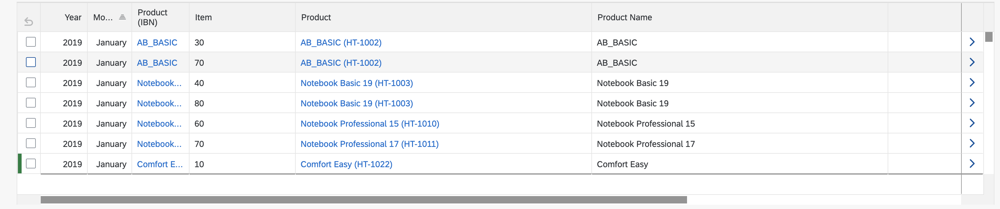 

</td>
<td valign="top">

 

</td>
</tr>
<tr>
<td valign="top">

Area micro chart

</td>
<td valign="top">

-   Analytical list page
-   List report
-   Object page

</td>
<td valign="top">

[Micro Chart Facet](micro-chart-facet-e219fd0.md)

[Area Micro Chart](area-micro-chart-1467f2b.md)

[Smart Micro Chart](../10_More_About_Controls/smart-micro-chart-2180a6f.md)

[Adding a Micro Chart to a Table](adding-a-micro-chart-to-a-table-b8312a4.md)

</td>
<td valign="top">

[Area Micro Chart](https://experience.sap.com/fiori-design-web/area-micro-chart/)

</td>
<td valign="top">

   
  
**Components of an Area Micro Chart**

 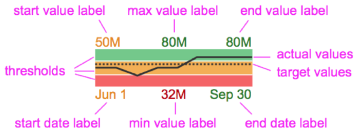 

</td>
<td valign="top">

Embedded chart

micro charts

micro-chart

showMicroChartLabel

microChartSize

</td>
</tr>
<tr>
<td valign="top">

Avatar

</td>
<td valign="top">

-   List report
-   Object page

</td>
<td valign="top">

[Using Images, Initials, and Icons](using-images-initials-and-icons-5760b63.md)

</td>
<td valign="top">

[Avatar](https://experience.sap.com/fiori-design-web/avatar/)

</td>
<td valign="top">

   
  
**Business Images**

  

</td>
<td valign="top">

ImageUrl

Image

Images

</td>
</tr>
<tr>
<td valign="top">

Breadcrumb

</td>
<td valign="top">

-   Analytical list page
-   Object page

</td>
<td valign="top">

[Object Page Classic Header](../10_More_About_Controls/object-page-classic-header-0fecbce.md)

</td>
<td valign="top">

[Breadcrumb](https://experience.sap.com/fiori-design-web/breadcrumb/)

</td>
<td valign="top">

   
  
**Navigation Bar, Breadcrumbs and Actions in Header Title of Object Page**

  

</td>
<td valign="top">

 

</td>
</tr>
<tr>
<td valign="top">

Building blocks

</td>
<td valign="top">

-   List report \(OData V4\)
-   Object page \(OData V4\)

</td>
<td valign="top">

[Building Blocks](building-blocks-24c1304.md)

[Field Building Block](the-field-building-block-5260b9c.md)

[Form Building Block](the-form-building-block-391aad2.md)

[FormElement Building Block](the-formelement-building-block-b45f038.md)

[Table Building Block](the-table-building-block-3801656.md)

[FilterBar Building Block](the-filterbar-building-block-7838611.md)

[FilterField Building Block](the-filterfield-building-block-2df7837.md)

[MicroChart Building Block](the-microchart-building-block-74554b4.md)

[Chart Building Block](the-chart-building-block-52d065a.md)

[FlexibleColumnLayoutActions Building Blocks](the-flexiblecolumnlayoutactions-building-block-1ba680b.md)

[Share Building Block](the-share-building-block-41b02df.md)

[Paginator Building Block](the-paginator-building-block-997292b.md)

</td>
<td valign="top">

 

</td>
<td valign="top">

 

</td>
<td valign="top">

buildable blocks

macro

free style app

free style application

free-style

</td>
</tr>
<tr>
<td valign="top">

Bullet chart

</td>
<td valign="top">

-   Analytical list page
-   Object page

</td>
<td valign="top">

 [Configuring Charts](configuring-charts-653ed0f.md) 

</td>
<td valign="top">

[Bullet Chart](https://experience.sap.com/fiori-design-web/bullet-chart/)

</td>
<td valign="top">

   
  
**Bullet Chart**

 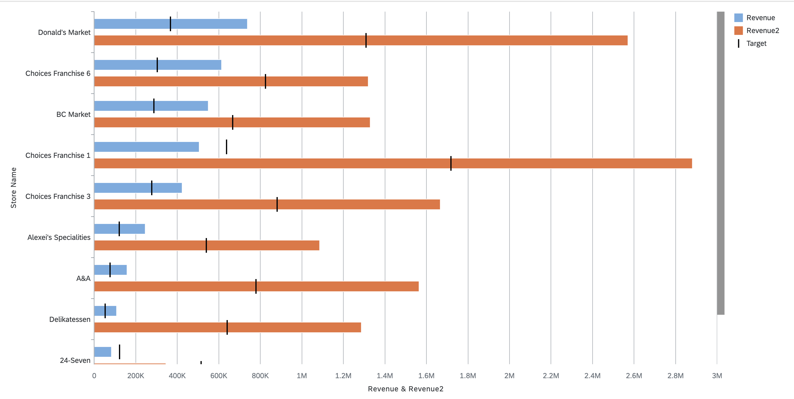 

</td>
<td valign="top">

charts

</td>
</tr>
<tr>
<td valign="top">

Bullet micro chart

</td>
<td valign="top">

-   Analytical list page
-   List report
-   Object page

</td>
<td valign="top">

[Micro Chart Facet](micro-chart-facet-e219fd0.md)

[Bullet Micro Chart](bullet-micro-chart-b915166.md)

[Smart Micro Chart](../10_More_About_Controls/smart-micro-chart-2180a6f.md)

[Adding a Micro Chart to a Table](adding-a-micro-chart-to-a-table-b8312a4.md)

</td>
<td valign="top">

[Bullet Micro Chart](https://experience.sap.com/fiori-design-web/bullet-micro-chart/)

</td>
<td valign="top">

   
  
**Bullet Micro Chart**

 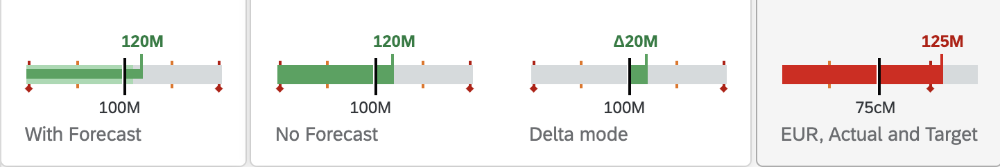 

</td>
<td valign="top">

Embedded chart

micro charts

micro-chart

showMicroChartLabel

microChartSize

</td>
</tr>
<tr>
<td valign="top">

Busy indicator

</td>
<td valign="top">

-   Analytical list page
-   List report
-   Object page
-   Overview page

</td>
<td valign="top">

 

</td>
<td valign="top">

[Busy Indicator](https://experience.sap.com/fiori-design-web/busy-indicator/)

</td>
<td valign="top">

   
  
**Busy Indicator**

  

</td>
<td valign="top">

 

</td>
</tr>
<tr>
<td valign="top">

Button/Action

</td>
<td valign="top">

-   Analytical list page
-   List report
-   Object page
-   Overview page

</td>
<td valign="top">

[Actions](actions-cbf16c5.md)

[Adding Custom Actions Using Extension Points](adding-custom-actions-using-extension-points-7619517.md)

</td>
<td valign="top">

[Button](https://experience.sap.com/fiori-design-web/button/)

</td>
<td valign="top">

   
  
**Common Button Types**

 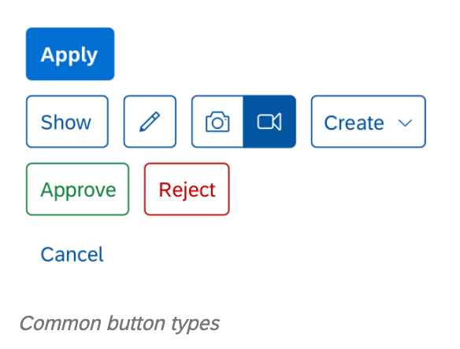 

</td>
<td valign="top">

DefaultValuesFunction

ParameterDefaultValue

create

operationAvailiable

DataFieldForAction

menu action

MenuActions

Placement

anchor

</td>
</tr>
<tr>
<td valign="top">

Canvas page

</td>
<td valign="top">

-   List report \(OData V2\)
-   Object page \(OData V2\)

</td>
<td valign="top">

[Extending Apps Using a Canvas Page](extending-apps-using-a-canvas-page-82c4b57.md)

</td>
<td valign="top">

 

</td>
<td valign="top">

   
  
**Canvas Page**

 

 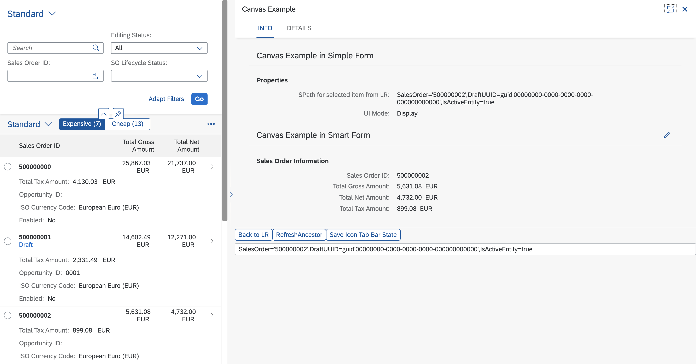 

</td>
<td valign="top">

 

</td>
</tr>
<tr>
<td valign="top">

Card filter

</td>
<td valign="top">

Overview page \(OData V2\)

</td>
<td valign="top">

[Configuring Card Filters](configuring-card-filters-ecde99f.md)

</td>
<td valign="top">

 

</td>
<td valign="top">

 

</td>
<td valign="top">

cards

</td>
</tr>
<tr>
<td valign="top">

Chart building block

</td>
<td valign="top">

-   List report \(OData V4\)
-   Object page \(OData V4\)

</td>
<td valign="top">

[Building Blocks](building-blocks-24c1304.md)

</td>
<td valign="top">

 

</td>
<td valign="top">

 

</td>
<td valign="top">

building blocks

buildable blocks

macro

free style application

free style app

free-style

</td>
</tr>
<tr>
<td valign="top">

Chart/Smart chart

</td>
<td valign="top">

-   Analytical list page
-   List report
-   Object page
-   Overview page

</td>
<td valign="top">

[Configuring the Chart-Only View as the Default Option](configuring-the-chart-only-view-as-the-default-option-8e6e885.md)

[Configuring Charts](configuring-charts-653ed0f.md)

[Chart Cards Used in Overview Pages](chart-cards-used-in-overview-pages-68e62ad.md)

</td>
<td valign="top">

[Chart](https://experience.sap.com/fiori-design-web/chart/)

[Smart Chart](https://experience.sap.com/fiori-design-web/smart-chart/)

</td>
<td valign="top">

   
  
**Common Chart Types**

 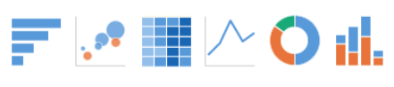 

</td>
<td valign="top">

defaultPath

</td>
</tr>
<tr>
<td valign="top">

Checkbox

</td>
<td valign="top">

-   Analytical list page
-   List report
-   Object page
-   Overview page

</td>
<td valign="top">

 [Enabling Multiple Selection in Tables](enabling-multiple-selection-in-tables-116b5d8.md) 

</td>
<td valign="top">

[Checkbox](https://experience.sap.com/fiori-design-web/checkbox/)

</td>
<td valign="top">

   
  
**Enabled Checkboxes**

 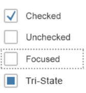 

</td>
<td valign="top">

multi-selection

multi selection

multiple selection

selectionMode

</td>
</tr>
<tr>
<td valign="top">

Coloring cards based on threshold values

</td>
<td valign="top">

Overview page

</td>
<td valign="top">

[Coloring Cards Based on Threshold Values](coloring-cards-based-on-threshold-values-02c53f4.md)

</td>
<td valign="top">

 

</td>
<td valign="top">

   
  
**Target and Maximizing Measures**

 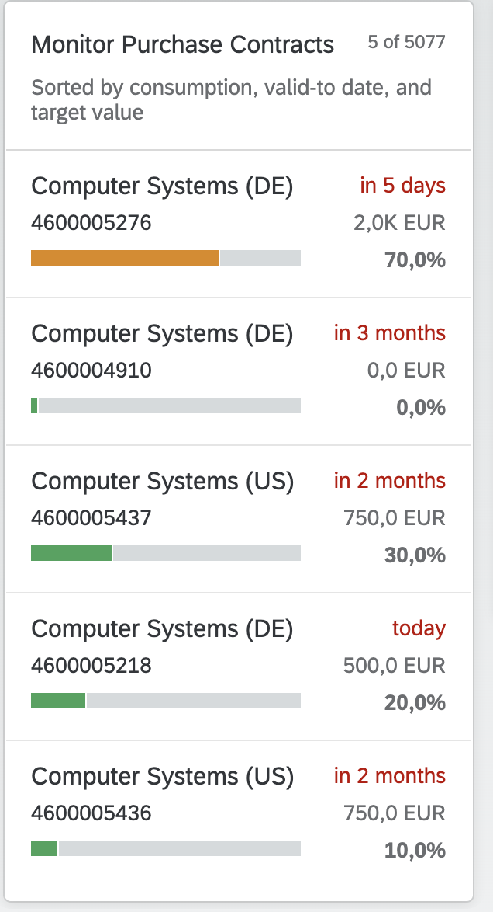 

</td>
<td valign="top">

 

</td>
</tr>
<tr>
<td valign="top">

Column chart

</td>
<td valign="top">

-   Analytical list page
-   Overview page

</td>
<td valign="top">

 [Chart Cards Used in Overview Pages](chart-cards-used-in-overview-pages-68e62ad.md) 

</td>
<td valign="top">

[Column Chart](https://experience.sap.com/fiori-design-web/column-chart/)

</td>
<td valign="top">

   
  
**Column Chart Card**

 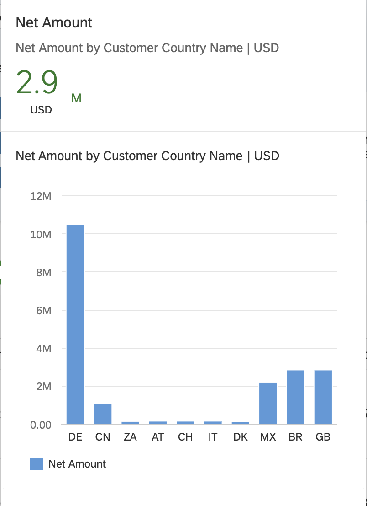 

</td>
<td valign="top">

charts

defaultPath

</td>
</tr>
<tr>
<td valign="top">

Column popin

</td>
<td valign="top">

Object page

</td>
<td valign="top">

[Tables](tables-c0f6592.md)

</td>
<td valign="top">

 

</td>
<td valign="top">

 

</td>
<td valign="top">

 

</td>
</tr>
<tr>
<td valign="top">

Combine buttons/actions in toolbar

</td>
<td valign="top">

-   List report

</td>
<td valign="top">

[Actions](actions-cbf16c5.md)

</td>
<td valign="top">

 

</td>
<td valign="top">

 

</td>
<td valign="top">

MenuAction

Menu button

</td>
</tr>
<tr>
<td valign="top">

Combo box

</td>
<td valign="top">

-   Analytical list page
-   List report
-   Object page
-   Overview page

</td>
<td valign="top">

[Value Help as a Dropdown List](value-help-as-a-dropdown-list-2a0a630.md)

[Configuring View Switch](configuring-view-switch-931f92d.md)

</td>
<td valign="top">

[Combo Box](https://experience.sap.com/fiori-design-web/combo-box/)

</td>
<td valign="top">

   
  
**Combobox with Autocomplete Function**

 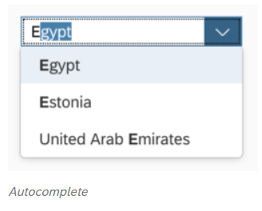 

</td>
<td valign="top">

Common.ValueListWithFixedValue

ValueListWithFixedValues

DDL

Dropdown List

</td>
</tr>
<tr>
<td valign="top">

Contact quick view

</td>
<td valign="top">

-   List report
-   Object page

</td>
<td valign="top">

[Adding a Contact Quick View to a Table](adding-a-contact-quick-view-to-a-table-677fbde.md)

</td>
<td valign="top">

 

</td>
<td valign="top">

   
  
**Contact Quick View**

 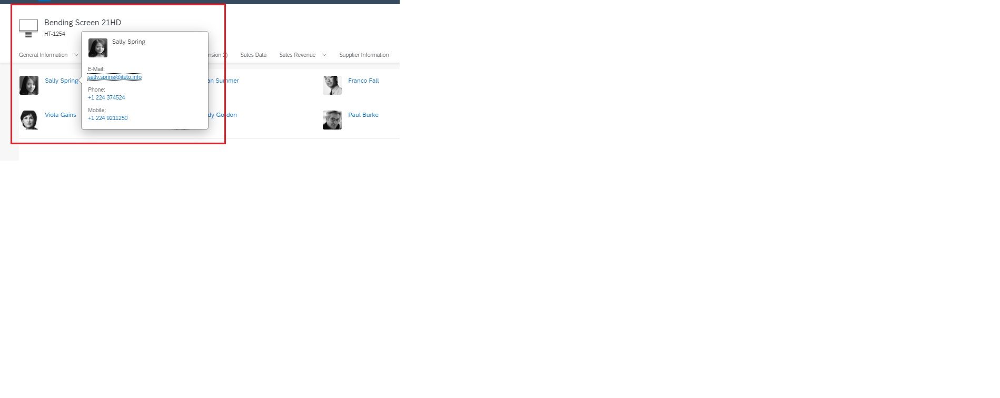 

</td>
<td valign="top">

 

</td>
</tr>
<tr>
<td valign="top">

Copying and Pasting from Spreadsheet Applications to Tables

</td>
<td valign="top">

Object page

</td>
<td valign="top">

[Copying and Pasting from Spreadsheet Applications to Tables](copying-and-pasting-from-spreadsheet-applications-to-tables-f6a8fd2.md)

</td>
<td valign="top">

 

</td>
<td valign="top">

   
  
**Copy from Excel to Table**

 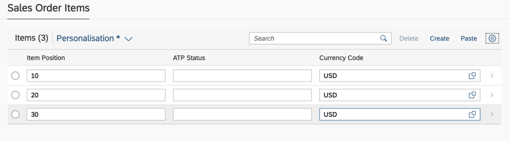 

</td>
<td valign="top">

microsoft excel

copy from

</td>
</tr>
<tr>
<td valign="top">

Cumulation \(Waterfall chart\)

</td>
<td valign="top">

-   Analytical list page
-   Object page

</td>
<td valign="top">

[Configuring the Chart-Only View as the Default Option](configuring-the-chart-only-view-as-the-default-option-8e6e885.md)

[Configuring Charts](configuring-charts-653ed0f.md)

</td>
<td valign="top">

[Cumulation \(Waterfall Chart\)](https://experience.sap.com/fiori-design-web/waterfall-chart/)

</td>
<td valign="top">

   
  
**Cumulation \(Waterfall Chart\)**

 ") 

</td>
<td valign="top">

defaultPath

</td>
</tr>
<tr>
<td valign="top">

Currency

</td>
<td valign="top">

-   Analytical list page
-   List report
-   Object page
-   Overview page

</td>
<td valign="top">

 [Different Representations of a Field](different-representations-of-a-field-c18ada4.md) 

</td>
<td valign="top">

[Currency](https://experience.sap.com/fiori-design-web/currency/)

</td>
<td valign="top">

   
  
**Examples of the Currency Control**

 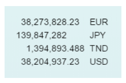 

</td>
<td valign="top">

UoM

Unit of Measure

isCurrency

currencies

</td>
</tr>
<tr>
<td valign="top">

Custom card

</td>
<td valign="top">

Overview page

</td>
<td valign="top">

[Custom Cards](custom-cards-6d260f7.md)

</td>
<td valign="top">

 

</td>
<td valign="top">

   
  
**Custom Cards**

 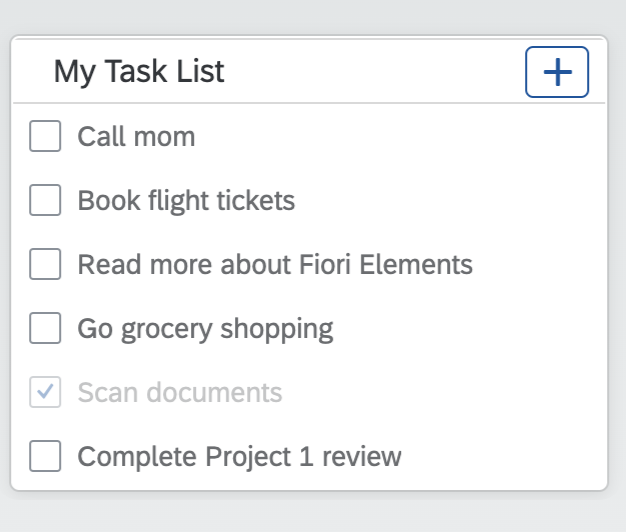 

</td>
<td valign="top">

 

</td>
</tr>
<tr>
<td valign="top">

Custom code

</td>
<td valign="top">

Overview page

</td>
<td valign="top">

[Using Custom Code Before Standard Operations](using-custom-code-before-standard-operations-877e5ff.md)

</td>
<td valign="top">

 

</td>
<td valign="top">

 

</td>
<td valign="top">

Extension

Extension API

on before

onbefore

hook

before save

</td>
</tr>
<tr>
<td valign="top">

Custom filter field

</td>
<td valign="top">

List report

</td>
<td valign="top">

[Adding Custom Fields to the Filter Bar](adding-custom-fields-to-the-filter-bar-5fb9f57.md)

</td>
<td valign="top">

[Filter Bar](https://experience.sap.com/fiori-design-web/filter-bar/)

</td>
<td valign="top">

 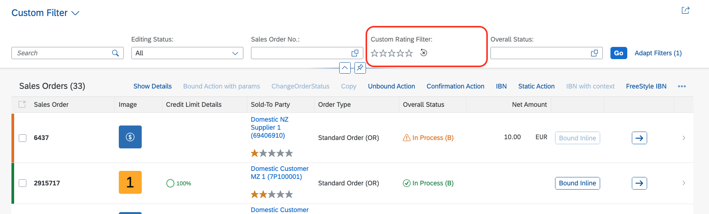 

</td>
<td valign="top">

fields

FPM

Flexible Programming Model

extensions

breakout

</td>
</tr>
<tr>
<td valign="top">

Custom action

</td>
<td valign="top">

-   List report
-   Object page

</td>
<td valign="top">

[Adding Custom Actions Using Extension Points](adding-custom-actions-using-extension-points-7619517.md)

</td>
<td valign="top">

[Action Placement](https://experience.sap.com/fiori-design-web/action-placement/)

</td>
<td valign="top">

 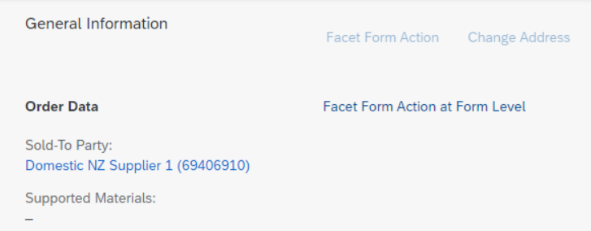 

</td>
<td valign="top">

FPM

Flexible Programming Model

extensions

breakout

Placement

anchor

</td>
</tr>
<tr>
<td valign="top">

Custom header facet

</td>
<td valign="top">

Object page

</td>
<td valign="top">

[Extension Points for Object Page Header Facets](extension-points-for-object-page-header-facets-61cf0ee.md)

</td>
<td valign="top">

[Object Page Floorplan](https://experience.sap.com/fiori-design-web/object-page/)

</td>
<td valign="top">

 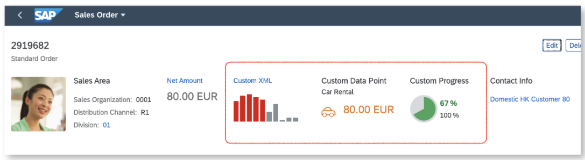 

</td>
<td valign="top">

FPM

Flexible Programming Model

extensions

breakout

</td>
</tr>
<tr>
<td valign="top">

Custom form

</td>
<td valign="top">

Object page

</td>
<td valign="top">

[Extension Points for Forms on the Object Page](extension-points-for-forms-on-the-object-page-4e49753.md)

</td>
<td valign="top">

[Form / Simple Form](https://experience.sap.com/fiori-design-web/form/)

</td>
<td valign="top">

 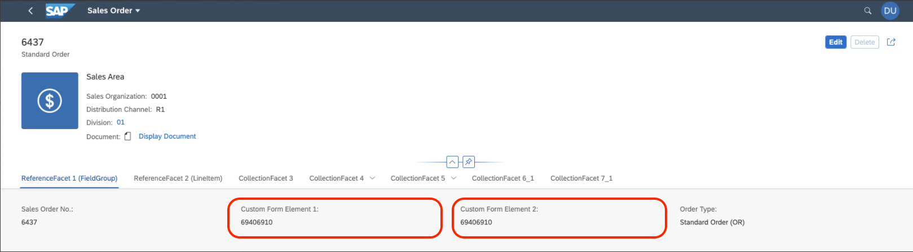 

</td>
<td valign="top">

FPM

Flexible Programming Model

extensions

breakout

</td>
</tr>
<tr>
<td valign="top">

Custom section

</td>
<td valign="top">

Object page

</td>
<td valign="top">

[Extension Points for Sections on the Object Page](extension-points-for-sections-on-the-object-page-92ad996.md)

</td>
<td valign="top">

[Object Page Floorplan](https://experience.sap.com/fiori-design-web/object-page/)

</td>
<td valign="top">

 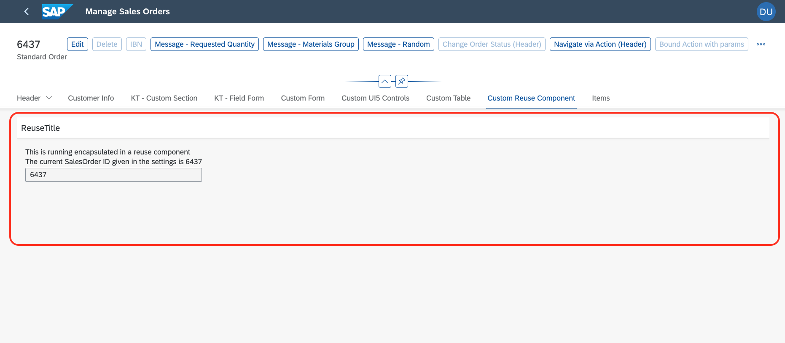 

</td>
<td valign="top">

FPM

Flexible Programming Model

extensions

breakout

</td>
</tr>
<tr>
<td valign="top">

Custom subsection

</td>
<td valign="top">

Object page

</td>
<td valign="top">

[Extension Points for Subsections on the Object Page](extension-points-for-subsections-on-the-object-page-ce8d468.md)

</td>
<td valign="top">

[Object Page Floorplan](https://experience.sap.com/fiori-design-web/object-page/)

</td>
<td valign="top">

  

</td>
<td valign="top">

FPM

Flexible Programming Model

extensions

breakout

</td>
</tr>
<tr>
<td valign="top">

Custom dynamic side content

</td>
<td valign="top">

Object page

</td>
<td valign="top">

[Adding Dynamic Side Content to Object Page Sections](adding-dynamic-side-content-to-object-page-sections-8e01a46.md)

</td>
<td valign="top">

[Dynamic Side Content](https://experience.sap.com/fiori-design-web/dynamic-side-content/)

</td>
<td valign="top">

 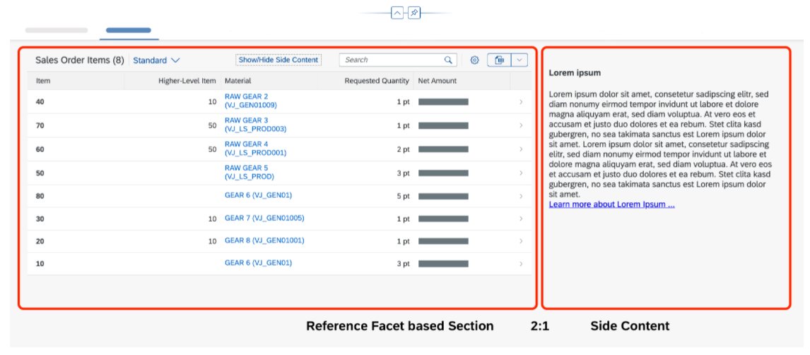 

</td>
<td valign="top">

FPM

Flexible Programming Model

extensions

breakout

</td>
</tr>
<tr>
<td valign="top">

Date/time picker

</td>
<td valign="top">

-   Analytical list page
-   List report
-   Object page
-   Overview page

</td>
<td valign="top">

 [Smart Field](../10_More_About_Controls/smart-field-4864403.md) [Field Help](field-help-a5608ea.md) 

</td>
<td valign="top">

[Date/Time Picker](https://experience.sap.com/fiori-design-web/datetime-picker/)

</td>
<td valign="top">

   
  
**Date/Time Picker**

 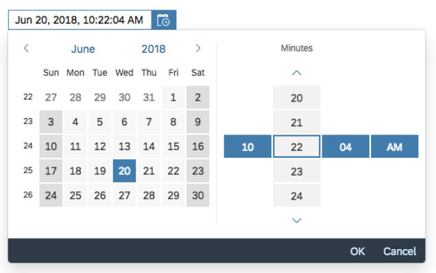 

</td>
<td valign="top">

date-time selection

</td>
</tr>
<tr>
<td valign="top">

Date picker

</td>
<td valign="top">

-   Analytical list page
-   List report
-   Object page
-   Overview page

</td>
<td valign="top">

[Smart Filter Bar](../10_More_About_Controls/smart-filter-bar-7bcdffc.md)

[Smart Field](../10_More_About_Controls/smart-field-4864403.md)

[Field Help](field-help-a5608ea.md)

</td>
<td valign="top">

[Date Picker](https://experience.sap.com/fiori-design-web/date-picker/)

</td>
<td valign="top">

   
  
**Date Picker with Footer**

 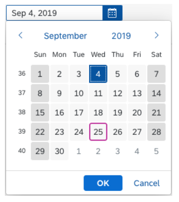 

</td>
<td valign="top">

date selection

</td>
</tr>
<tr>
<td valign="top">

Date range selection

</td>
<td valign="top">

-   Analytical list page
-   List report
-   Object page
-   Overview page

</td>
<td valign="top">

 [Enabling Semantic Operators in the Filter Bar](enabling-semantic-operators-in-the-filter-bar-fef65d0.md) 

</td>
<td valign="top">

[Date Range Selection](https://experience.sap.com/fiori-design-web/date-range-selection/)

</td>
<td valign="top">

   
  
**Date Range Selection**

 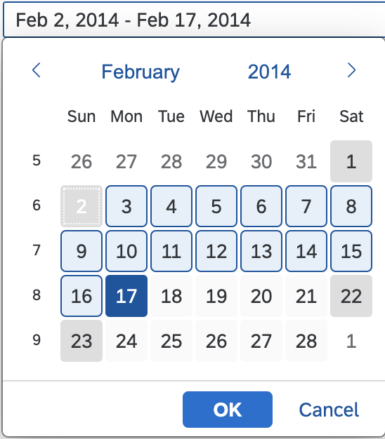 

</td>
<td valign="top">

date interval

interval selection

useSemanticDateRange

</td>
</tr>
<tr>
<td valign="top">

Default sort order in a table

</td>
<td valign="top">

-   List report
-   Object page

</td>
<td valign="top">

[Configuring Default Settings \(Visualizations, Sort Order, Filter Values\)](configuring-default-settings-visualizations-sort-order-filter-values-49a6ba5.md)

</td>
<td valign="top">

 

</td>
<td valign="top">

 

</td>
<td valign="top">

tables

sorting

annotationPath

defaultTemplateAnnotationPath

</td>
</tr>
<tr>
<td valign="top">

Default values for action parameter dialog

</td>
<td valign="top">

-   List report
-   Object page

</td>
<td valign="top">

Section *Default Values for Action Parameters* in the topic [Actions](actions-cbf16c5.md)

[Prefilling Fields Using the `DefaultValuesFunction`](prefilling-fields-using-the-defaultvaluesfunction-5ada91c.md)

</td>
<td valign="top">

[Dialog](https://experience.sap.com/fiori-design-web/dialog/)

</td>
<td valign="top">

   
  
**Default Values for Action Parameter**

 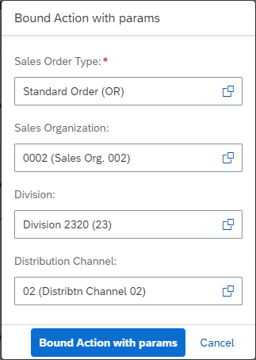 

</td>
<td valign="top">

prefill

pre-fill

</td>
</tr>
<tr>
<td valign="top">

Dialog box

</td>
<td valign="top">

-   Analytical list page
-   List report
-   Object page

</td>
<td valign="top">

[Adapting Texts in the Delete Dialog Box Using Extensions \(List Report\)](adapting-texts-in-the-delete-dialog-box-using-extensions-list-report-25885b6.md)

[Adapting Texts in the Delete Dialog Box \(Object Page Header\)](adapting-texts-in-the-delete-dialog-box-object-page-header-1fd8e52.md)

[Adapting Texts in the Delete Dialog Box \(Object Page with Nested Smart Table\)](adapting-texts-in-the-delete-dialog-box-object-page-with-nested-smart-table-b95adf3.md)

[Adding Action-Specific Messages to Confirmation Dialog Boxes](adding-action-specific-messages-to-confirmation-dialog-boxes-f5a04c7.md)

[Adapting Texts for Confirmation Dialog Box When Deleting Lines in a Table](adapting-texts-for-confirmation-dialog-box-when-deleting-lines-in-a-table-0d1fbf4.md)

[Confirmation Popups](confirmation-popups-9a53662.md)

[Enabling Object Creation Using the Dialog in the List Report](enabling-object-creation-using-the-dialog-in-the-list-report-ceb9284.md)

</td>
<td valign="top">

[Dialog](https://experience.sap.com/fiori-design-web/dialog/)

</td>
<td valign="top">

   
  
**Dialog**

 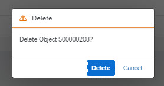 

</td>
<td valign="top">

critical actions

user confirmation

Action Parameter Dialog

NewAction

i18n

resource bundle

custom text

enhanceI18n

</td>
</tr>
<tr>
<td valign="top">

Direct edit

</td>
<td valign="top">

-   List report \(OData V2\)
-   Object page \(OData V2\)

</td>
<td valign="top">

 [Navigation to an Object Page in Edit Mode](navigation-to-an-object-page-in-edit-mode-8665847.md) 

</td>
<td valign="top">

 

</td>
<td valign="top">

   
  
**Direct Edit**

  

</td>
<td valign="top">

Edit

Direct Edit

Navigation

</td>
</tr>
<tr>
<td valign="top">

Draft handling

</td>
<td valign="top">

-   List report
-   Object page

</td>
<td valign="top">

[Draft Handling](draft-handling-ed9aa41.md)

</td>
<td valign="top">

[Draft Handling](https://experience.sap.com/fiori-design-web/draft-handling/)

</td>
<td valign="top">

   
  
**Draft Handling**

 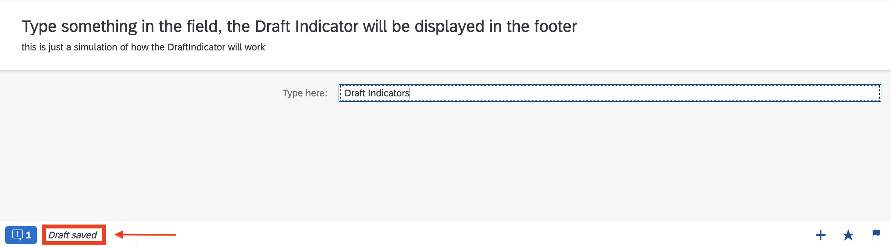 

</td>
<td valign="top">

 

</td>
</tr>
<tr>
<td valign="top">

Dynamic page layout

</td>
<td valign="top">

-   Analytical list page \(OData V2\)
-   List report
-   Overview page

</td>
<td valign="top">

[Descriptor Configuration for the Overview Page](descriptor-configuration-for-the-overview-page-f194b41.md)

</td>
<td valign="top">

[Dynamic Page Layout](https://experience.sap.com/fiori-design-web/dynamic-page-layout/)

</td>
<td valign="top">

   
  
**Dynamic page layout**

 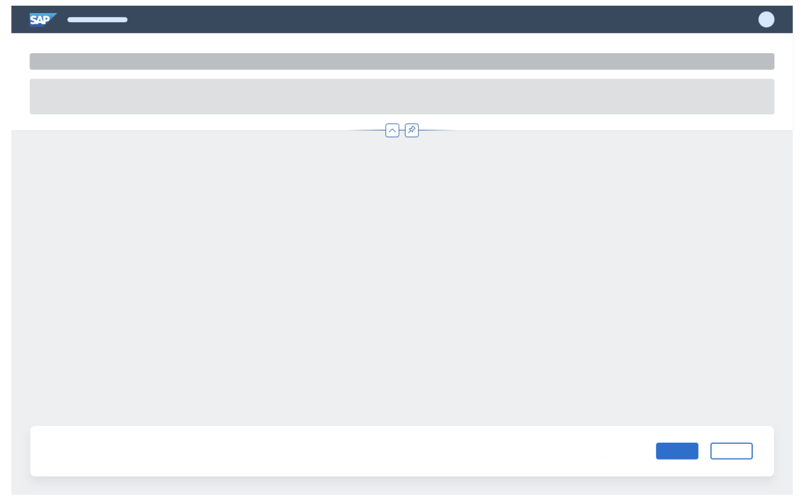 

</td>
<td valign="top">

 

</td>
</tr>
<tr>
<td valign="top">

Editing status

</td>
<td valign="top">

-   List report
-   Object page

</td>
<td valign="top">

[Editing Status](editing-status-668ea18.md)

[Disabling the Editing Status Filter](disabling-the-editing-status-filter-8eb695a.md)

[Settings for List Report Tables](settings-for-list-report-tables-4c2d17a.md)

</td>
<td valign="top">

 

</td>
<td valign="top">

   
  
**Editing status**

 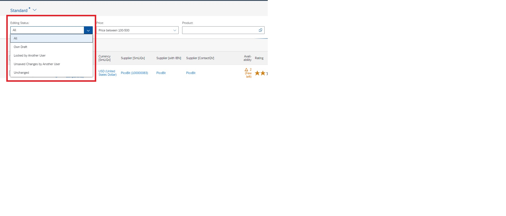 

</td>
<td valign="top">

 

</td>
</tr>
<tr>
<td valign="top">

Export to spreadsheet

</td>
<td valign="top">

-   List report
-   Object page

</td>
<td valign="top">

[Using the Export Feature](using-the-export-feature-4bab6f2.md)

</td>
<td valign="top">

 

</td>
<td valign="top">

 

</td>
<td valign="top">

enableExport

excel

</td>
</tr>
<tr>
<td valign="top">

Field building block

</td>
<td valign="top">

-   List report \(OData V4\)
-   Object page \(OData V4\)

</td>
<td valign="top">

[Building Blocks](building-blocks-24c1304.md)

</td>
<td valign="top">

 

</td>
<td valign="top">

 

</td>
<td valign="top">

building blocks

buildable blocks

macro

free style application

free style app

free-style

</td>
</tr>
<tr>
<td valign="top">

Filter bar

</td>
<td valign="top">

-   Analytical list page
-   List report
-   Overview page

</td>
<td valign="top">

[Enhancing ValueList Annotations for Visual Filters](enhancing-valuelist-annotations-for-visual-filters-16d43eb.md)

[Adapting the Filter Bar](adapting-the-filter-bar-609c39a.md)

[Disabling the Editing Status Filter](disabling-the-editing-status-filter-8eb695a.md)

[Adding Custom Fields to the Filter Bar](adding-custom-fields-to-the-filter-bar-5fb9f57.md)

[Configuring the Global Filter](configuring-the-global-filter-73d9693.md)

[Custom Filters](custom-filters-4739893.md)

[Configuring Filter Bars](configuring-filter-bars-4bd7590.md)

[Enabling the Search Function](enabling-the-search-function-3cdebee.md)

[Enabling Semantic Operators in the Filter Bar](enabling-semantic-operators-in-the-filter-bar-fef65d0.md)

[Configuring Default Filter Values](configuring-default-filter-values-f27ad7b.md)

[Defining Filter Facets](defining-filter-facets-89f63ef.md)

[Configuring Filter Fields](configuring-filter-fields-f5dcb29.md)

[Configuring Default Settings \(Visualizations, Sort Order, Filter Values\)](configuring-default-settings-visualizations-sort-order-filter-values-49a6ba5.md)

[Enable the History of Recently Entered Values](enable-the-history-of-recently-entered-values-37dbf1f.md)

</td>
<td valign="top">

[Filter Bar](https://experience.sap.com/fiori-design-web/filter-bar/)

</td>
<td valign="top">

   
  
**Filter Bar**

 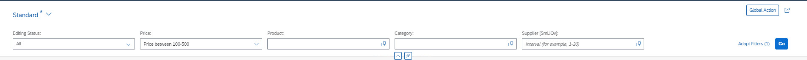 

</td>
<td valign="top">

semantic date

prefill

pre-filling

customization

customisation

FilterRestrictions

valuelist

value help

PresentationVariantQualifier

hideFilterBar

contextPath

useSemanticDateRange

navigationProperties

snap

</td>
</tr>
<tr>
<td valign="top">

FilterBar building block

</td>
<td valign="top">

-   List report \(OData V4\)
-   Object page \(OData V4\)

</td>
<td valign="top">

[Building Blocks](building-blocks-24c1304.md)

</td>
<td valign="top">

 

</td>
<td valign="top">

 

</td>
<td valign="top">

building blocks

buildable blocks

macros

free style application

free-style

</td>
</tr>
<tr>
<td valign="top">

Flexible column layout

</td>
<td valign="top">

-   Analytical list page \(OData V2\)
-   List report
-   Object page

</td>
<td valign="top">

[Enabling the Flexible Column Layout](enabling-the-flexible-column-layout-e762257.md)

</td>
<td valign="top">

[Flexible Column Layout \(Layout + SAP Fiori Elements\)](https://experience.sap.com/fiori-design-web/flexible-column-layout/)

</td>
<td valign="top">

   
  
**Flexible Column Layout**

  

</td>
<td valign="top">

FCL

</td>
</tr>
<tr>
<td valign="top">

FlexibleColumnLayoutActions building block

</td>
<td valign="top">

-   List report \(OData V4\)
-   Object page \(OData V4\)

</td>
<td valign="top">

[Building Blocks](building-blocks-24c1304.md)

</td>
<td valign="top">

 

</td>
<td valign="top">

 

</td>
<td valign="top">

 

</td>
</tr>
<tr>
<td valign="top">

Footer toolbar

</td>
<td valign="top">

-   Analytical list page \(OData V2\)
-   List report \(OData V2\)
-   Object page
-   Overview page \(OData V2\)

</td>
<td valign="top">

[Defining Determining Actions](defining-determining-actions-1743323.md)

[Adding Custom Actions Using Extension Points](adding-custom-actions-using-extension-points-7619517.md)

</td>
<td valign="top">

[Footer Toolbar](https://experience.sap.com/fiori-design-web/footer-toolbar/)

</td>
<td valign="top">

   
  
**Footer Toolbar**

 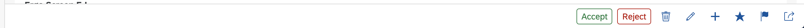 

</td>
<td valign="top">

 

</td>
</tr>
<tr>
<td valign="top">

Form

</td>
<td valign="top">

-   List report
-   Object page

</td>
<td valign="top">

-   [Defining and Adapting Sections](defining-and-adapting-sections-facfea0.md)
-   [Grouping of Fields](grouping-of-fields-cb1748e.md)

</td>
<td valign="top">

[Form](https://experience.sap.com/fiori-design-web/form/)

</td>
<td valign="top">

   
  
**Mixed Form**

 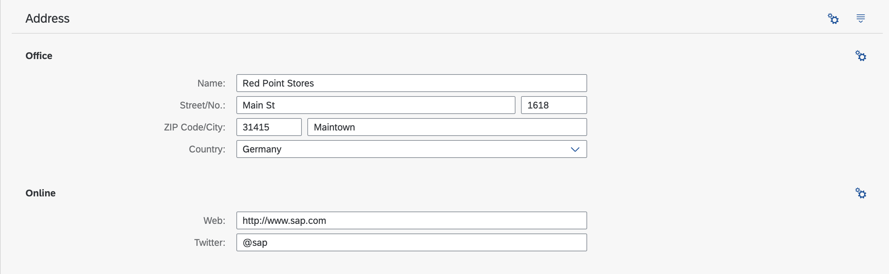 

</td>
<td valign="top">

Facets

dataField

ReferenceFacet

CollectionFacet

Subsection

FieldGroup

ConnectedFields

semantically connected

sectionLayout

editableHeaderContent

showDataFieldsLabel

</td>
</tr>
<tr>
<td valign="top">

Formatting numeric values

</td>
<td valign="top">

Overview page

</td>
<td valign="top">

[Formatting Numeric Values](formatting-numeric-values-735e518.md)

</td>
<td valign="top">

 

</td>
<td valign="top">

   
  
**Formatting numeric values**

 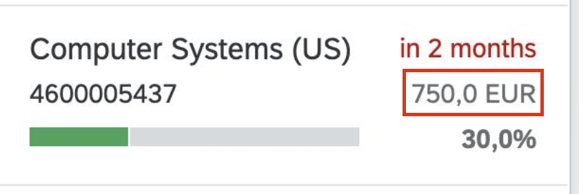 

</td>
<td valign="top">

 

</td>
</tr>
<tr>
<td valign="top">

FormElement building block

</td>
<td valign="top">

-   List report \(OData V4\)
-   Object page \(OData V4\)

</td>
<td valign="top">

[Building Blocks](building-blocks-24c1304.md)

</td>
<td valign="top">

 

</td>
<td valign="top">

 

</td>
<td valign="top">

 

</td>
</tr>
<tr>
<td valign="top">

Generic tag

</td>
<td valign="top">

Analytical list page \(OData V2\)

</td>
<td valign="top">

[Creating Key Performance Indicator Tags](creating-key-performance-indicator-tags-d80a360.md)

</td>
<td valign="top">

[Generic Tag](https://experience.sap.com/fiori-design-web/generic-tag/)

</td>
<td valign="top">

   
  
**Generic Tag**

 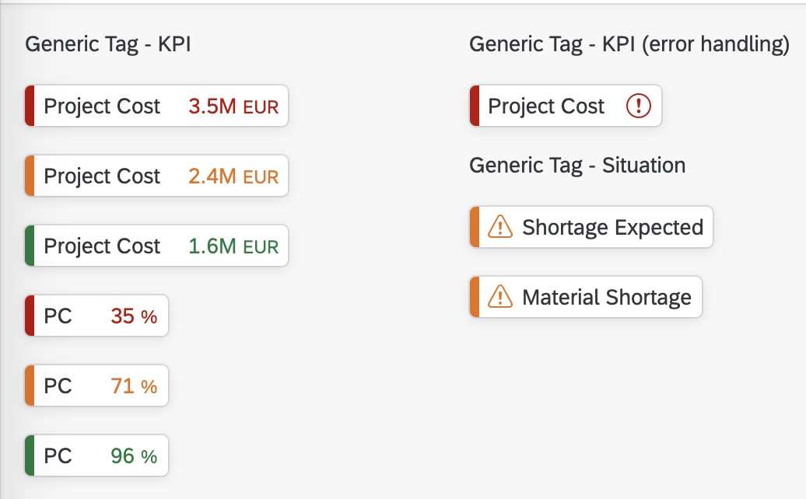 

</td>
<td valign="top">

tags

cards

</td>
</tr>
<tr>
<td valign="top">

Grid table

</td>
<td valign="top">

-   Analytical list page \(OData V2\)
-   List report
-   Object page

</td>
<td valign="top">

 [Setting the Table Type](setting-the-table-type-7f844f1.md) 

</td>
<td valign="top">

[Grid Table](https://experience.sap.com/fiori-design-web/grid-table/)

</td>
<td valign="top">

   
  
**Grid Table**

 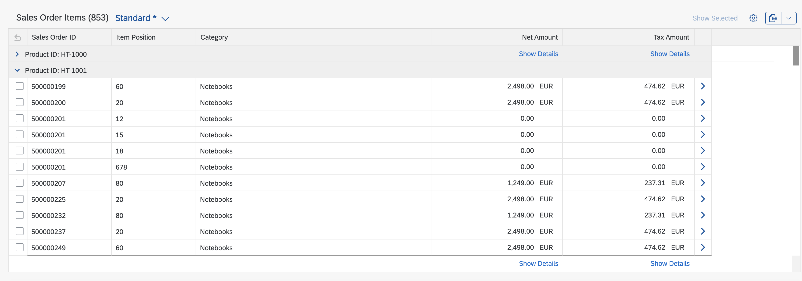 

</td>
<td valign="top">

 

</td>
</tr>
<tr>
<td valign="top">

Header toolbar

</td>
<td valign="top">

-   Analytical list page
-   List report
-   Object page
-   Overview page

</td>
<td valign="top">

[Actions](actions-cbf16c5.md)

[Enabling Actions in the Object Page Header](enabling-actions-in-the-object-page-header-5fe4396.md)

[Adding Custom Actions Using Extension Points](adding-custom-actions-using-extension-points-7619517.md)

[Custom Actions](custom-actions-02fb273.md)

[Defining Custom Actions](defining-custom-actions-c3de5c0.md)

</td>
<td valign="top">

[Header Toolbar](https://experience.sap.com/fiori-design-web/header-toolbar/)

</td>
<td valign="top">

   
  
**Header Bar with Share Icon**

 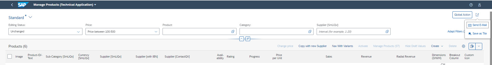 

</td>
<td valign="top">

actions

application actions

annotation actions

annotation-based actions

manifest-based actions

manifest actions

</td>
</tr>
<tr>
<td valign="top">

Highlighting line items based on criticality

</td>
<td valign="top">

-   List report
-   Object page

</td>
<td valign="top">

[Highlighting Line Items Based on Criticality](highlighting-line-items-based-on-criticality-0d501b1.md)

</td>
<td valign="top">

 

</td>
<td valign="top">

   
  
**Criticality of Line Items**

 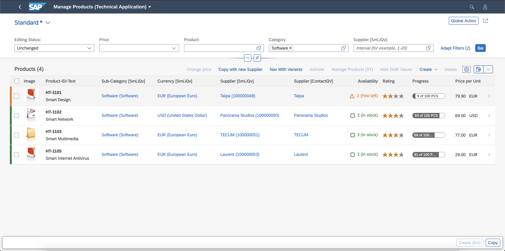 

</td>
<td valign="top">

 

</td>
</tr>
<tr>
<td valign="top">

Icon tab bar

</td>
<td valign="top">

-   Analytical list page \(OData V2\)
-   List report
-   Object page

</td>
<td valign="top">

[Defining and Adapting Sections](defining-and-adapting-sections-facfea0.md)

[Multiple Views on List Report Tables](multiple-views-on-list-report-tables-a37df40.md)

[Grouping of Fields](grouping-of-fields-cb1748e.md)

</td>
<td valign="top">

[Icon Tab Bar](https://experience.sap.com/fiori-design-web/icontabbar/)

</td>
<td valign="top">

   
  
**Icon Tabs**

 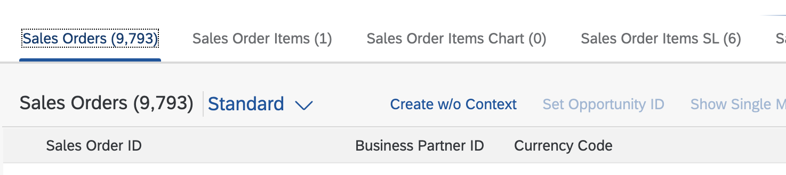 

</td>
<td valign="top">

 

</td>
</tr>
<tr>
<td valign="top">

Image

</td>
<td valign="top">

-   Analytical list page
-   List report
-   Object page
-   Overview page

</td>
<td valign="top">

[Displaying Images in Tables](displaying-images-in-tables-492bc79.md)

[Setting Up the Object Page Header](setting-up-the-object-page-header-cce93e6.md)

[List Cards](list-cards-56f39e0.md)

[Link List Cards](link-list-cards-0326f91.md)

[Using Images, Initials, and Icons](using-images-initials-and-icons-5760b63.md)

</td>
<td valign="top">

[Image](https://experience.sap.com/fiori-design-web/image/)

</td>
<td valign="top">

  
  
**Image Used in a Dialog**

 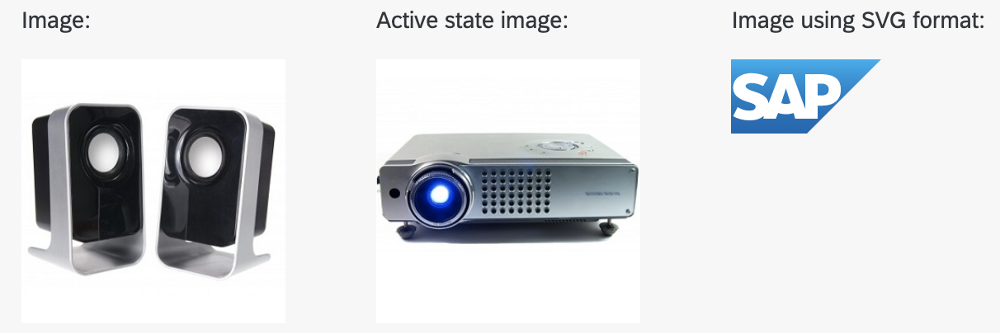 

CDO:/content/authoring/mor1590823160236.image

</td>
<td valign="top">

IsImageUrl

ImageUrl

Stream

HeaderInfo

</td>
</tr>
<tr>
<td valign="top">

Inline creation of table entries

</td>
<td valign="top">

Object page

</td>
<td valign="top">

[Enabling Inline Creation Mode or Empty Rows Mode for Table Entries](enabling-inline-creation-mode-or-empty-rows-mode-for-table-entries-cfb04f0.md)

</td>
<td valign="top">

 

</td>
<td valign="top">

   
  
**Inline Create**

 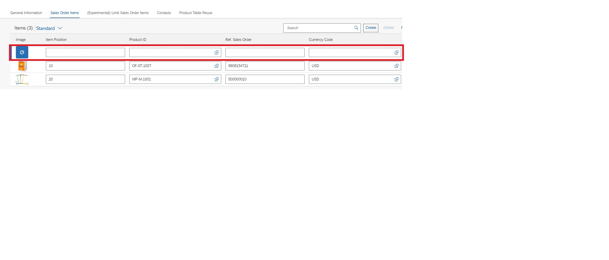 

</td>
<td valign="top">

 

</td>
</tr>
<tr>
<td valign="top">

Input field

</td>
<td valign="top">

-   Analytical list page \(OData V2\)
-   List report
-   Object page
-   Overview page \(OData V2\)

</td>
<td valign="top">

-   [Adapting the Filter Bar](adapting-the-filter-bar-609c39a.md)
-   [Defining and Adapting Sections](defining-and-adapting-sections-facfea0.md)
-   [Grouping of Fields](grouping-of-fields-cb1748e.md)

</td>
<td valign="top">

[Input Field](https://experience.sap.com/fiori-design-web/input-field/)

</td>
<td valign="top">

   
  
**Input**

 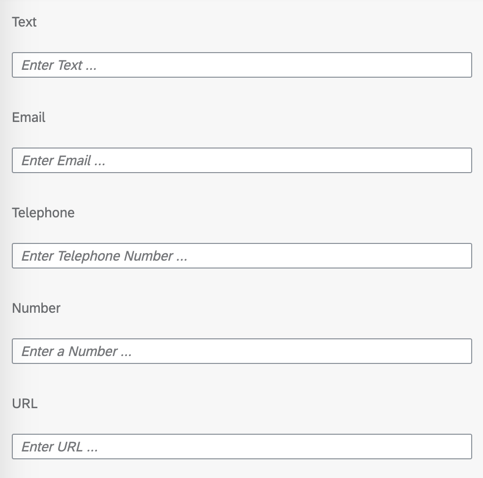 

</td>
<td valign="top">

 

</td>
</tr>
<tr>
<td valign="top">

Interactive chart

</td>
<td valign="top">

Analytical list page

</td>
<td valign="top">

[Visual Filters](visual-filters-1714720.md)

</td>
<td valign="top">

[Interactive Chart](https://experience.sap.com/fiori-design-web/interactive-chart/)

</td>
<td valign="top">

   
  
**Interactive Chart Types**

 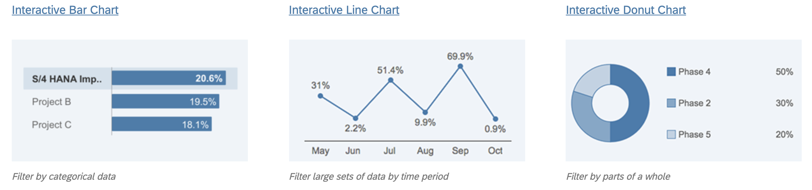 

</td>
<td valign="top">

charts

bars

</td>
</tr>
<tr>
<td valign="top">

Internal navigation

</td>
<td valign="top">

-   List report
-   Object page

</td>
<td valign="top">

[Example: Enable Internal Navigation to Different Detail Page](example-enable-internal-navigation-to-different-detail-page-75002b3.md)

</td>
<td valign="top">

 

</td>
<td valign="top">

 

</td>
<td valign="top">

 

</td>
</tr>
<tr>
<td valign="top">

Keep alive

</td>
<td valign="top">

-   List report
-   Object page

</td>
<td valign="top">

-   [Configure refresh for specific case with keep alive](refresh-data-set-for-back-navigation-when-sap-keep-alive-is-set-to-true-f1c2704.md)

</td>
<td valign="top">

 

</td>
<td valign="top">

 

</td>
<td valign="top">

sap-keep-alive

view cache

</td>
</tr>
<tr>
<td valign="top">

Keyboard shortcuts

</td>
<td valign="top">

-   List report
-   Object page
-   Analytical list page

</td>
<td valign="top">

[Keyboard Shortcuts](keyboard-shortcuts-0cd318c.md)

</td>
<td valign="top">

 

</td>
<td valign="top">

 

</td>
<td valign="top">

 

</td>
</tr>
<tr>
<td valign="top">

Label

</td>
<td valign="top">

-   List report
-   Object page
-   Overview page \(OData V2\)

</td>
<td valign="top">

-   [Defining and Adapting Sections](defining-and-adapting-sections-facfea0.md)
-   [Grouping of Fields](grouping-of-fields-cb1748e.md)

</td>
<td valign="top">

[Label](https://experience.sap.com/fiori-design-web/label/)

</td>
<td valign="top">

   
  
**Label**

 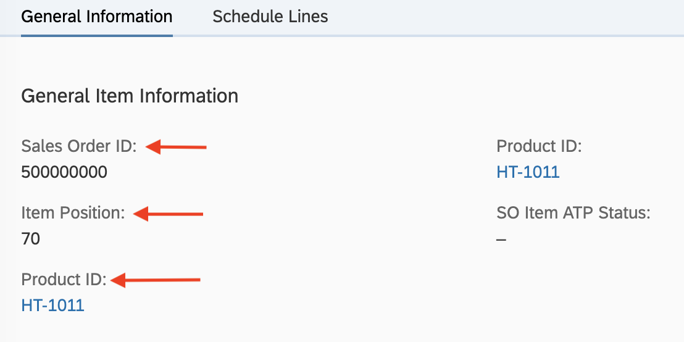 

</td>
<td valign="top">

fields

</td>
</tr>
<tr>
<td valign="top">

Line chart

</td>
<td valign="top">

-   Analytical list page
-   Object page

</td>
<td valign="top">

[Configuring the Chart-Only View as the Default Option](configuring-the-chart-only-view-as-the-default-option-8e6e885.md)

[Configuring Charts](configuring-charts-653ed0f.md)

</td>
<td valign="top">

[Line Chart](https://experience.sap.com/fiori-design-web/line-chart/)

</td>
<td valign="top">

   
  
**Line Chart**

 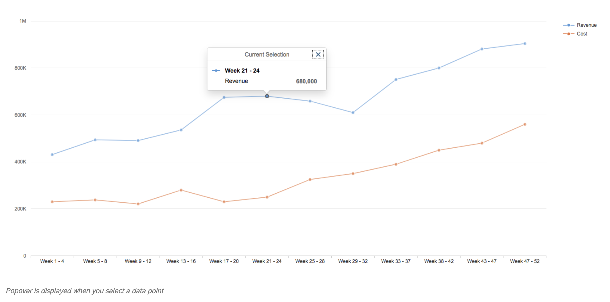 

</td>
<td valign="top">

charts

</td>
</tr>
<tr>
<td valign="top">

Line micro chart

</td>
<td valign="top">

-   Analytical list page
-   List report
-   Object page

</td>
<td valign="top">

[Micro Chart Facet](micro-chart-facet-e219fd0.md)

[Line Micro Chart](line-micro-chart-e5cb2af.md)

[Smart Micro Chart](../10_More_About_Controls/smart-micro-chart-2180a6f.md)

[Adding a Micro Chart to a Table](adding-a-micro-chart-to-a-table-b8312a4.md)

</td>
<td valign="top">

[Line Micro Chart](https://experience.sap.com/fiori-design-web/line-micro-chart/)

</td>
<td valign="top">

   
  
**Line Micro Chart with Labels**

 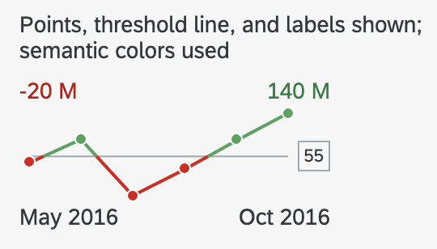 

</td>
<td valign="top">

microchart

micro chart

micro-chart

</td>
</tr>
<tr>
<td valign="top">

Link

</td>
<td valign="top">

-   Analytical list page \(OData V2\)
-   List report
-   Object page
-   Overview page

</td>
<td valign="top">

[Adding a Contact Quick View to a Table](adding-a-contact-quick-view-to-a-table-677fbde.md)

[Configuring the List Area](configuring-the-list-area-f57373d.md)

</td>
<td valign="top">

[Link](https://experience.sap.com/fiori-design-web/link/)

</td>
<td valign="top">

   
  
**Link**

 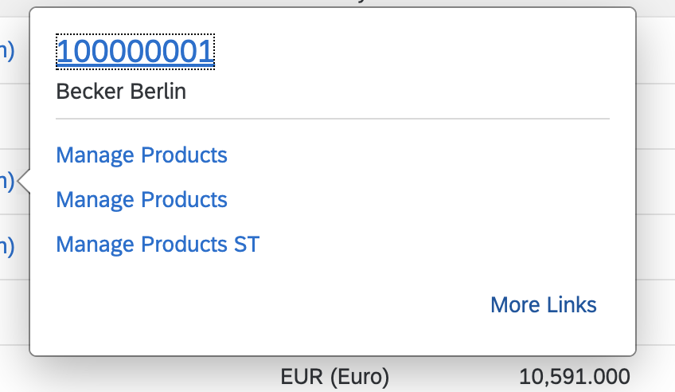 

</td>
<td valign="top">

 

</td>
</tr>
<tr>
<td valign="top">

Link list card

</td>
<td valign="top">

Overview page

</td>
<td valign="top">

[Link List Cards](link-list-cards-0326f91.md)

</td>
<td valign="top">

[Link List Card](https://experience.sap.com/fiori-design-web/overview-page-list-cards/#link-list-card)

</td>
<td valign="top">

   
  
**Carousel-Based View**

  

</td>
<td valign="top">

cards

</td>
</tr>
<tr>
<td valign="top">

Add multiple fields to one column

</td>
<td valign="top">

-   Analytical list page
-   List report
-   Object page
-   Overview page

</td>
<td valign="top">

[Adding Multiple Fields to One Column in Responsive Tables](adding-multiple-fields-to-one-column-in-responsive-tables-d318e42.md)

</td>
<td valign="top">

 

</td>
<td valign="top">

   
  
**Multiple Fields to One Column**

 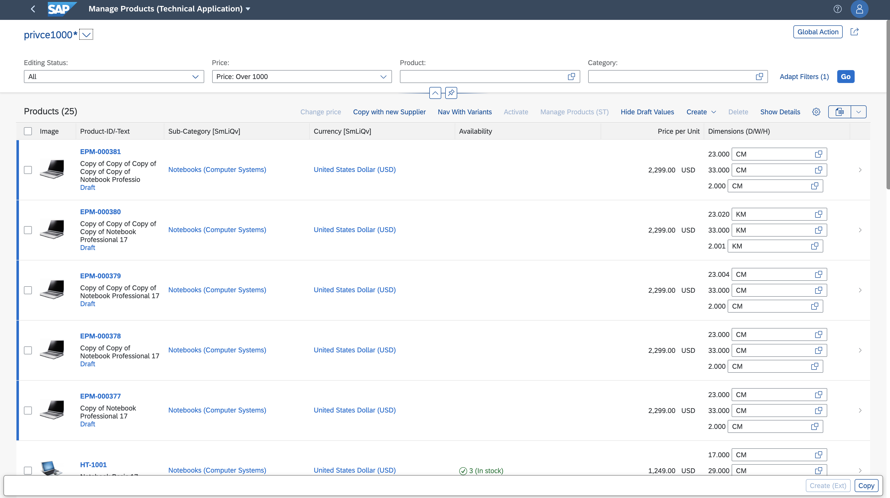 

</td>
<td valign="top">

FieldGroup

</td>
</tr>
<tr>
<td valign="top">

Display text and ID for value help

</td>
<td valign="top">

-   Object page \(OData V2\)

</td>
<td valign="top">

[Displaying Text and ID for Value Help Input Fields](displaying-text-and-id-for-value-help-input-fields-080886d.md)

</td>
<td valign="top">

 

</td>
<td valign="top">

   
  
**Text and ID for Value Help**

 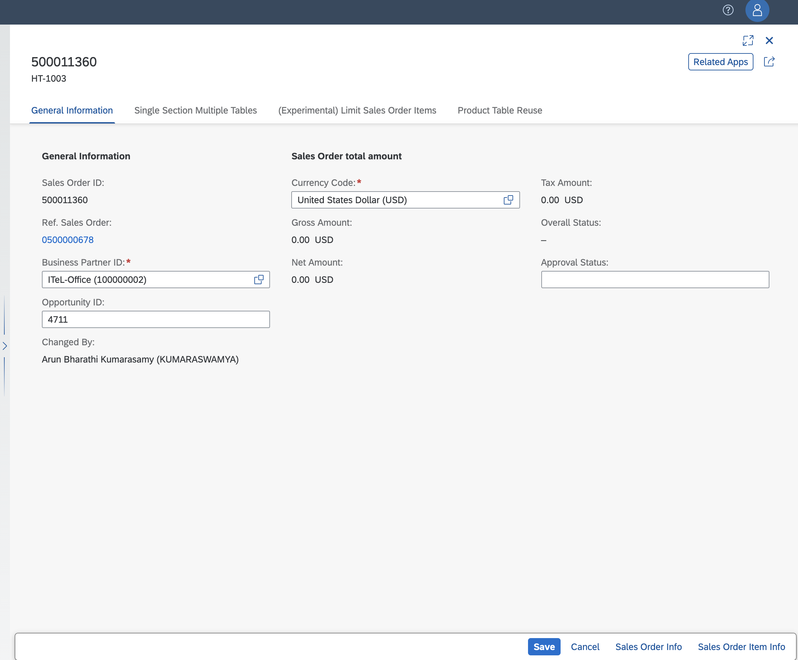 

</td>
<td valign="top">

Text

TextArrangement

</td>
</tr>
<tr>
<td valign="top">

Semantic date range on filter bar

</td>
<td valign="top">

-   Analytical list page
-   List report
-   Object page
-   Overview page

</td>
<td valign="top">

[Enabling Semantic Operators in the Filter Bar](enabling-semantic-operators-in-the-filter-bar-fef65d0.md)

</td>
<td valign="top">

 

</td>
<td valign="top">

   
  
**Semantic Date Range on Filter Bar**

 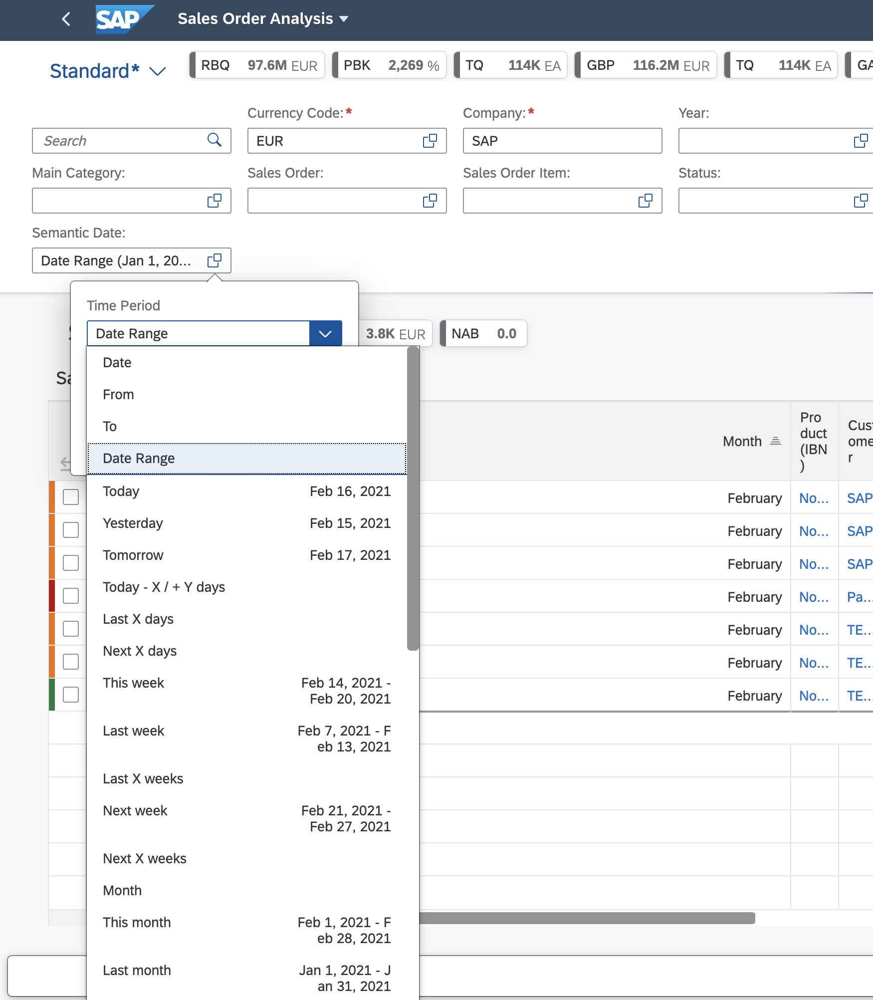 

</td>
<td valign="top">

semantic dates

dynamic dates

</td>
</tr>
<tr>
<td valign="top">

List card

</td>
<td valign="top">

Overview page

</td>
<td valign="top">

[List Cards](list-cards-56f39e0.md)

</td>
<td valign="top">

[List Cards](https://experience.sap.com/fiori-design-web/overview-page-list-cards/)

</td>
<td valign="top">

   
  
**List Card**

 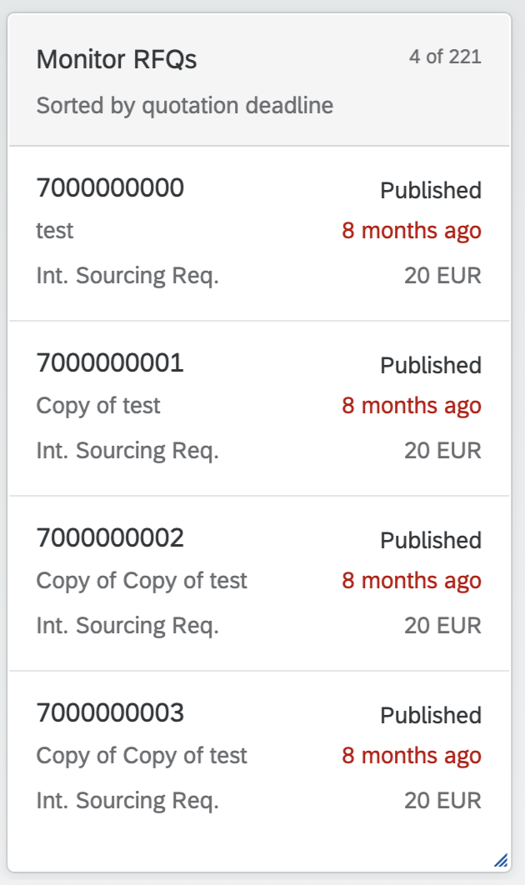 

</td>
<td valign="top">

cards

</td>
</tr>
<tr>
<td valign="top">

Manage cards

</td>
<td valign="top">

Overview page

</td>
<td valign="top">

[Customizing Overview Pages Using Runtime Capabilities](customizing-overview-pages-using-runtime-capabilities-5b1dd11.md)

</td>
<td valign="top">

 

</td>
<td valign="top">

   
  
**Manage Cards**

 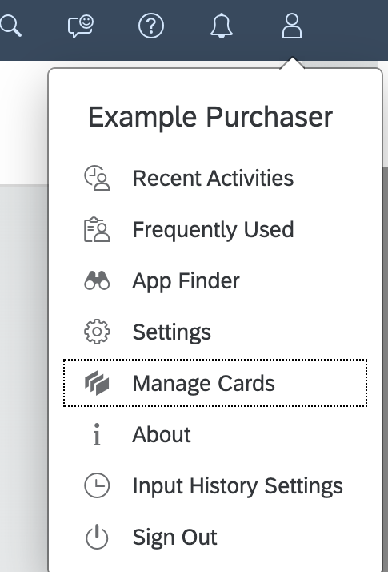 

</td>
<td valign="top">

 

</td>
</tr>
<tr>
<td valign="top">

Mass edit

</td>
<td valign="top">

-   List report

</td>
<td valign="top">

[Enabling Editing Using a Dialog \(Mass Edit\)](enabling-editing-using-a-dialog-mass-edit-965ef5b.md)

[Enabling Editing Using a Dialog \(Mass Edit\) in the List Report](enabling-editing-using-a-dialog-mass-edit-in-the-list-report-7cc4f04.md)

</td>
<td valign="top">

[Enabling Editing Using a Dialog in the List Report](https://experience.sap.com/fiori-design-web/mass-editing/)

</td>
<td valign="top">

   
  
**Mass Edit**

 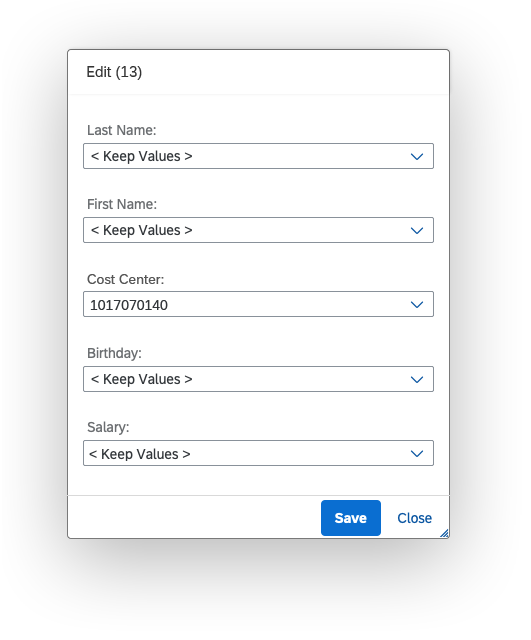 

</td>
<td valign="top">

multi edit

multi-edit

simultaneous

multiple

record

records

enableMassEdit

dialog

</td>
</tr>
<tr>
<td valign="top">

Menu button

</td>
<td valign="top">

-   List report \(OData V2\)
-   Object page \(OData V2\)

</td>
<td valign="top">

 [Adapting the UI: List Report and Object Page](adapting-the-ui-list-report-and-object-page-0d2f1a9.md) 

</td>
<td valign="top">

[Menu Button](https://experience.sap.com/fiori-design-web/menu-button/)

</td>
<td valign="top">

   
  
**Menu Buttons**

 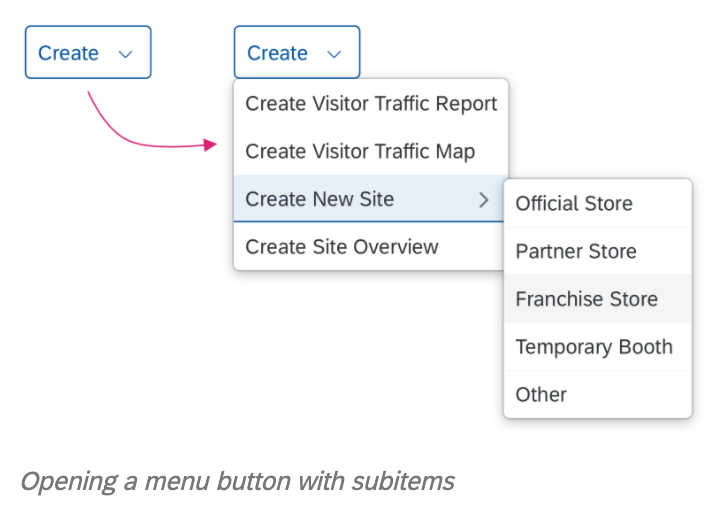 

</td>
<td valign="top">

 

</td>
</tr>
<tr>
<td valign="top">

Message box

</td>
<td valign="top">

-   Analytical list page
-   List report
-   Object page
-   Overview page

</td>
<td valign="top">

[Adding Confirmation Popovers for Actions](adding-confirmation-popovers-for-actions-87130de.md)

</td>
<td valign="top">

[Message Box](https://experience.sap.com/fiori-design-web/message-box/)

</td>
<td valign="top">

   
  
**Message Box**

 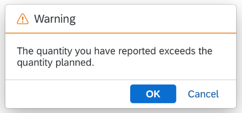 

</td>
<td valign="top">

critical actions

confirmation actions

</td>
</tr>
<tr>
<td valign="top">

Message page

</td>
<td valign="top">

-   Analytical list page
-   List report
-   Object page
-   Overview page

</td>
<td valign="top">

[Maintaining Standard Texts for Tables](maintaining-standard-texts-for-tables-aacfac5.md)

</td>
<td valign="top">

[Message Page](https://experience.sap.com/fiori-design-web/message-page/)

</td>
<td valign="top">

   
  
**Message Page**

 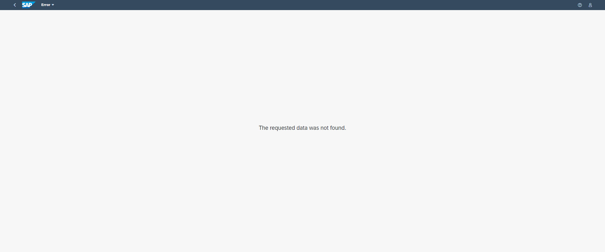 

</td>
<td valign="top">

 

</td>
</tr>
<tr>
<td valign="top">

Message popover

</td>
<td valign="top">

-   List report
-   Object page

</td>
<td valign="top">

[Using Messages](using-messages-239b192.md)

</td>
<td valign="top">

[Message Popover](https://experience.sap.com/fiori-design-web/message-popover/)

</td>
<td valign="top">

   
  
**Message Popover with Filter**

 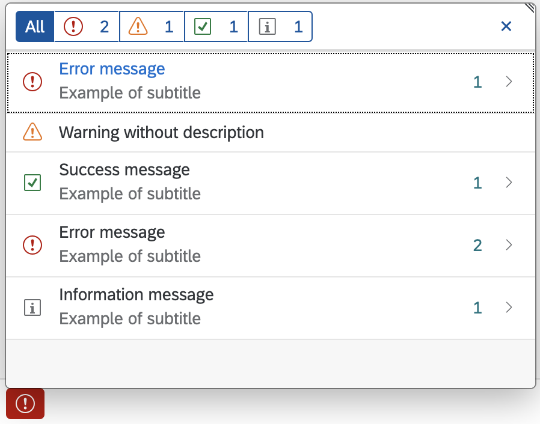 

</td>
<td valign="top">

 

</td>
</tr>
<tr>
<td valign="top">

Message toast

</td>
<td valign="top">

-   Analytical list page
-   List report
-   Object page
-   Overview page

</td>
<td valign="top">

[Using Messages](using-messages-239b192.md)

</td>
<td valign="top">

[Message Toast](https://experience.sap.com/fiori-design-web/message-toast/)

</td>
<td valign="top">

   
  
**Message Toast**

 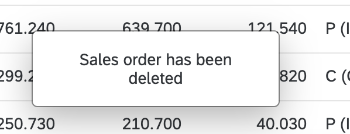 

</td>
<td valign="top">

 

</td>
</tr>
<tr>
<td valign="top">

MicroChart building block

</td>
<td valign="top">

-   List report \(OData V4\)
-   Object page \(OData V4\)

</td>
<td valign="top">

[Building Blocks](building-blocks-24c1304.md)

</td>
<td valign="top">

 

</td>
<td valign="top">

 

</td>
<td valign="top">

building blocks

buildable blocks

macro

free style application

free style app

free-style

</td>
</tr>
<tr>
<td valign="top">

Micro chart/Smart micro chart

</td>
<td valign="top">

-   Analytical list page
-   List report
-   Object page

</td>
<td valign="top">

[Micro Chart Facet](micro-chart-facet-e219fd0.md)

[Smart Micro Chart](../10_More_About_Controls/smart-micro-chart-2180a6f.md)

[Adding a Micro Chart to a Table](adding-a-micro-chart-to-a-table-b8312a4.md)

</td>
<td valign="top">

[Micro Chart](https://experience.sap.com/fiori-design-web/micro-chart/)

</td>
<td valign="top">

   
  
**Comparison Micro Chart**

 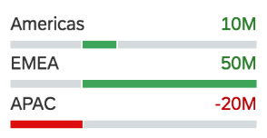 

</td>
<td valign="top">

microchart

micro-chart

</td>
</tr>
<tr>
<td valign="top">

Multi-combo box

</td>
<td valign="top">

-   Analytical list page \(OData V2\)
-   List report
-   Object page

</td>
<td valign="top">

[Value Help as a Dropdown List](value-help-as-a-dropdown-list-2a0a630.md)

</td>
<td valign="top">

[Multi-Combo Box](https://experience.sap.com/fiori-design-web/multi-combobox/)

</td>
<td valign="top">

   
  
**Multi-combo Box**

 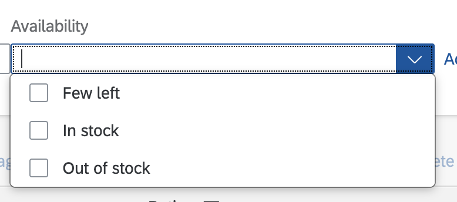 

</td>
<td valign="top">

 

</td>
</tr>
<tr>
<td valign="top">

Multi-input field

</td>
<td valign="top">

-   Analytical list page \(OData V2\)
-   List report \(OData V2\)
-   Object page \(OData V2\)
-   Overview page

</td>
<td valign="top">

[Using the Multi-Input Field on the Object Page](using-the-multi-input-field-on-the-object-page-04ff5b1.md)

</td>
<td valign="top">

 

</td>
<td valign="top">

   
  
**Multi-Input Field**

 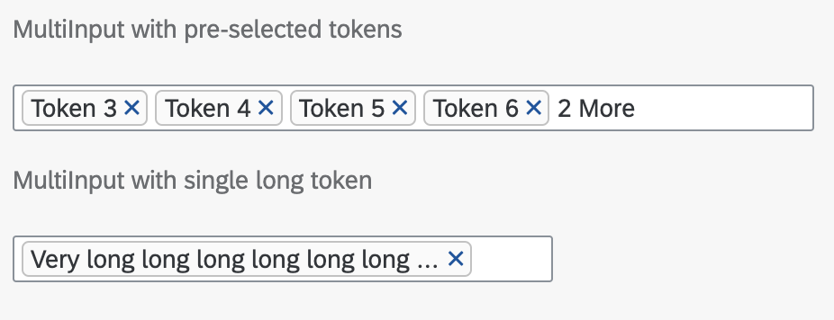 

</td>
<td valign="top">

fields

</td>
</tr>
<tr>
<td valign="top">

Multiple selection of lines in tables

</td>
<td valign="top">

-   List report
-   Object page

</td>
<td valign="top">

 [Enabling Multiple Selection in Tables](enabling-multiple-selection-in-tables-116b5d8.md) 

</td>
<td valign="top">

 

</td>
<td valign="top">

   
  
**Multiple selection of lines in tables**

 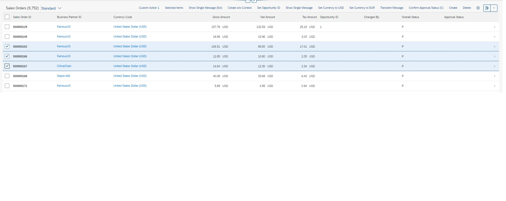 

</td>
<td valign="top">

 

</td>
</tr>
<tr>
<td valign="top">

Multiple views on list report tables

</td>
<td valign="top">

List report

</td>
<td valign="top">

[Multiple Views on List Report Tables](multiple-views-on-list-report-tables-a37df40.md)

</td>
<td valign="top">

 

</td>
<td valign="top">

   
  
**Multiple views on list report tables**

 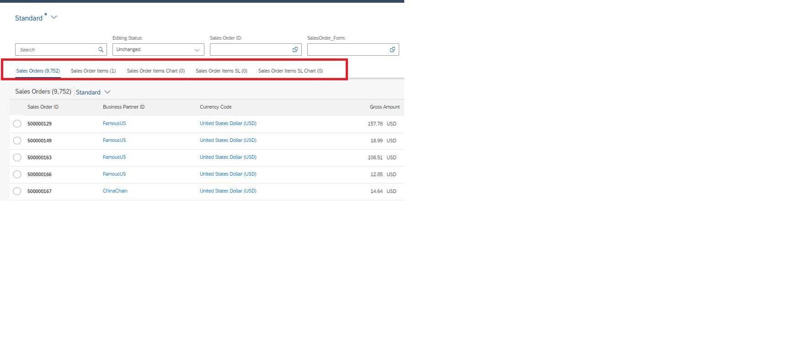 

</td>
<td valign="top">

 

</td>
</tr>
<tr>
<td valign="top">

Navigation

</td>
<td valign="top">

-   Analytical list page
-   List report
-   Object page
-   Overview page

</td>
<td valign="top">

[Configuring Navigation](configuring-navigation-a424275.md) [Example: Enable Internal Navigation to Different Detail Page](example-enable-internal-navigation-to-different-detail-page-75002b3.md) [Handling of the preferredMode Parameter](handling-of-the-preferredmode-parameter-bfaf3cc.md)

</td>
<td valign="top">

[Navigation](https://experience.sap.com/fiori-design-web/navigation/)

</td>
<td valign="top">

   
  
**Deep Link Navigation Flow**

 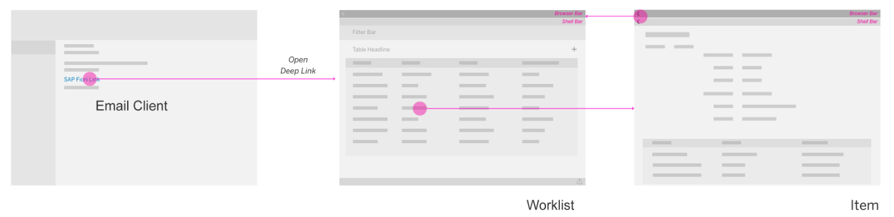 

</td>
<td valign="top">

external navigation

internal navigation

changing navigation to object page

</td>
</tr>
<tr>
<td valign="top">

Navigation extension

</td>
<td valign="top">

-   List report
-   Object page
-   Analytical list page

</td>
<td valign="top">

[Example: Replacing Standard Navigation in a Responsive Table in the List Report](example-replacing-standard-navigation-in-a-responsive-table-in-the-list-report-a12ad60.md)

[Example: Replacing Standard Navigation in a Responsive Table on the Object Page](example-replacing-standard-navigation-in-a-responsive-table-on-the-object-page-b20dc7a.md)

[Creating an Extension to Modify Properties in the Navigation Context](creating-an-extension-to-modify-properties-in-the-navigation-context-199a496.md)

[Example: Enable Internal Navigation to Different Detail Page](example-enable-internal-navigation-to-different-detail-page-75002b3.md)

</td>
<td valign="top">

 

</td>
<td valign="top">

 

</td>
<td valign="top">

extensions

modify context

context modification

modifying route

</td>
</tr>
<tr>
<td valign="top">

P13n dialog

</td>
<td valign="top">

-   Analytical list page
-   List report
-   Object page

</td>
<td valign="top">

 

</td>
<td valign="top">

[P13n Dialog](https://experience.sap.com/fiori-design-web/p13n-dialog/)

</td>
<td valign="top">

   
  
**P13n Dialog**

 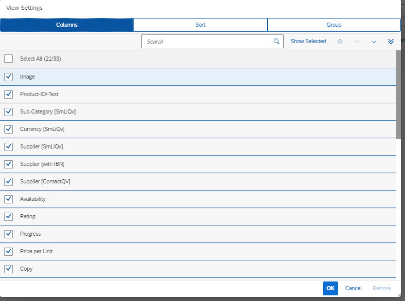 

</td>
<td valign="top">

personalization

personalisation

</td>
</tr>
<tr>
<td valign="top">

Paginator building block

</td>
<td valign="top">

-   List report \(OData V4\)
-   Object page \(OData V4\)

</td>
<td valign="top">

[Building Blocks](building-blocks-24c1304.md)

</td>
<td valign="top">

 

</td>
<td valign="top">

 

</td>
<td valign="top">

up/down arrow keys

next/previous

navigation keys

</td>
</tr>
<tr>
<td valign="top">

Popover

</td>
<td valign="top">

-   Analytical list page
-   List report
-   Object page
-   Overview page

</td>
<td valign="top">

[Value Help as a Dropdown List](value-help-as-a-dropdown-list-2a0a630.md)

</td>
<td valign="top">

[Popover](https://experience.sap.com/fiori-design-web/popover/)

</td>
<td valign="top">

   
  
**Popover**

 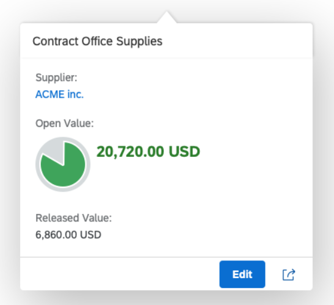 

</td>
<td valign="top">

Value help

VH

Dropdown List

DDL

</td>
</tr>
<tr>
<td valign="top">

Prefilling fields when creating a new entity

</td>
<td valign="top">

-   List report
-   Object page

</td>
<td valign="top">

[Prefilling Fields When Creating a New Entity](prefilling-fields-when-creating-a-new-entity-11ff444.md)

</td>
<td valign="top">

 

</td>
<td valign="top">

 

</td>
<td valign="top">

entities

pre-fill

prefill

</td>
</tr>
<tr>
<td valign="top">

Progress indicator

</td>
<td valign="top">

-   Analytical list page
-   List report
-   Object page

</td>
<td valign="top">

[Adding a Progress Indicator to a Table](adding-a-progress-indicator-to-a-table-43f6f0f.md)

[Progress Indicator Facet](progress-indicator-facet-3b5e01c.md)

</td>
<td valign="top">

[Progress Indicator](https://experience.sap.com/fiori-design-web/progress-indicator/)

</td>
<td valign="top">

   
  
**Group of Progress Indicators**

 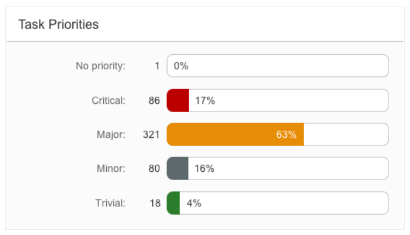 

</td>
<td valign="top">

progress bar

</td>
</tr>
<tr>
<td valign="top">

Quick view

</td>
<td valign="top">

Overview page \(OData V2\)

</td>
<td valign="top">

[Quick View Cards](quick-view-cards-c4bd35e.md)

</td>
<td valign="top">

[Quick View](https://experience.sap.com/fiori-design-web/quickview/)

</td>
<td valign="top">

   
  
**Company Information**

 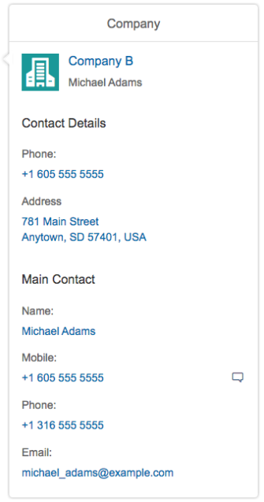 

</td>
<td valign="top">

Quick views

</td>
</tr>
<tr>
<td valign="top">

Quick views for smart link navigation

</td>
<td valign="top">

-   List report
-   Object page

</td>
<td valign="top">

[Enabling Quick Views for Link Navigation](enabling-quick-views-for-link-navigation-307ced1.md)

</td>
<td valign="top">

 

</td>
<td valign="top">

   
  
**Quick Views for Smart Link Navigation**

 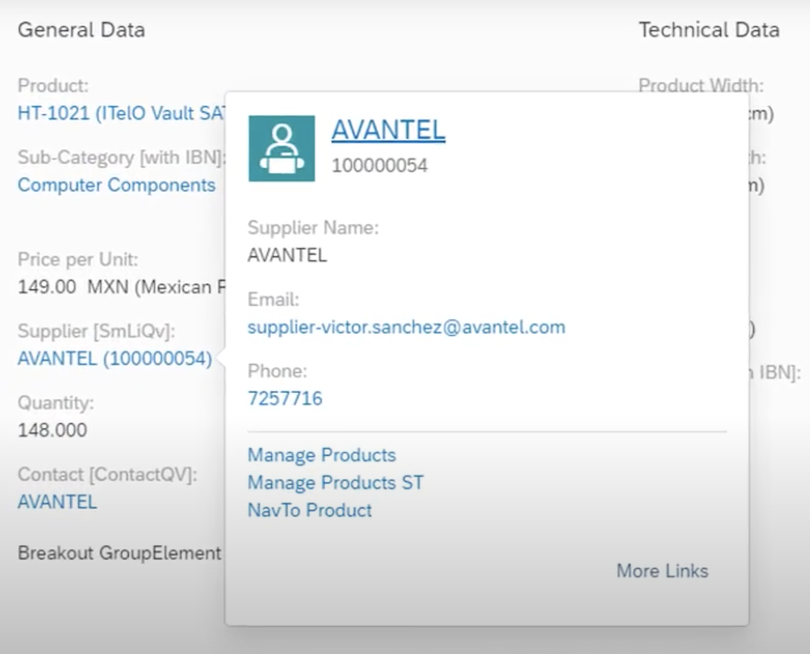 

</td>
<td valign="top">

view

</td>
</tr>
<tr>
<td valign="top">

Radial micro chart

</td>
<td valign="top">

-   Analytical list page
-   List report
-   Object page

</td>
<td valign="top">

[Micro Chart Facet](micro-chart-facet-e219fd0.md)

[Radial Micro Chart](radial-micro-chart-51eb569.md)

[Smart Micro Chart](../10_More_About_Controls/smart-micro-chart-2180a6f.md)

[Adding a Micro Chart to a Table](adding-a-micro-chart-to-a-table-b8312a4.md)

</td>
<td valign="top">

[Radial Micro Chart](https://experience.sap.com/fiori-design-web/radial-micro-chart/)

</td>
<td valign="top">

   
  
**Different Radial Charts**

 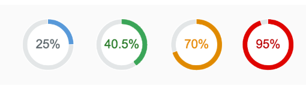 

</td>
<td valign="top">

microchart

micro-chart

</td>
</tr>
<tr>
<td valign="top">

Rating indicator

</td>
<td valign="top">

-   Analytical list page
-   List report
-   Object page

</td>
<td valign="top">

[Adding a Rating Indicator to a Table](adding-a-rating-indicator-to-a-table-a797173.md)

</td>
<td valign="top">

[Rating Indicator](https://experience.sap.com/fiori-design-web/rating-indicator/)

</td>
<td valign="top">

   
  
**Rating Indicator**

 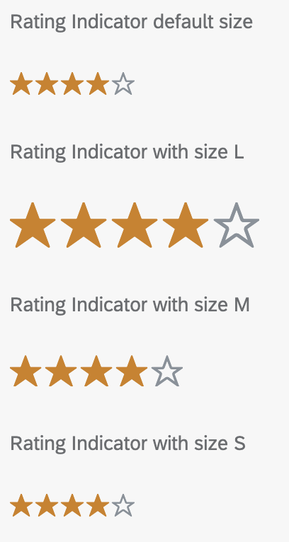 

</td>
<td valign="top">

 

</td>
</tr>
<tr>
<td valign="top">

Related apps button

</td>
<td valign="top">

Object page

</td>
<td valign="top">

[Enabling the Related Apps Button](enabling-the-related-apps-button-8dcfe2e.md)

</td>
<td valign="top">

 

</td>
<td valign="top">

   
  
**Related Apps Button**

 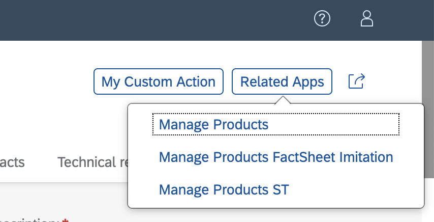 

</td>
<td valign="top">

associated apps

linked apps

</td>
</tr>
<tr>
<td valign="top">

Resizing cards

</td>
<td valign="top">

Overview page

</td>
<td valign="top">

[Customizing Overview Pages Using Runtime Capabilities](customizing-overview-pages-using-runtime-capabilities-5b1dd11.md)

</td>
<td valign="top">

 

</td>
<td valign="top">

 

</td>
<td valign="top">

 

</td>
</tr>
<tr>
<td valign="top">

Responsive table

</td>
<td valign="top">

-   Analytical list page \(OData V2\)
-   List report
-   Object page
-   Overview page

</td>
<td valign="top">

[Configuring the Table-Only View as the Default Option](configuring-the-table-only-view-as-the-default-option-d074e26.md)

[Setting the Table Type](setting-the-table-type-7f844f1.md)

[Table Cards](table-cards-167bf7c.md)

</td>
<td valign="top">

[Responsive Table](https://experience.sap.com/fiori-design-web/responsive-table/)

</td>
<td valign="top">

   
  
**Typical Example of Responsive Table**

 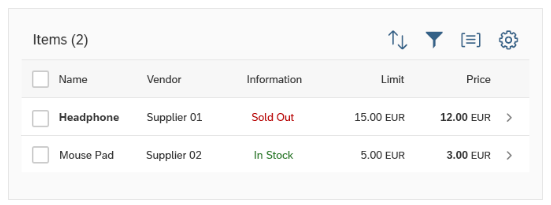 

</td>
<td valign="top">

 

</td>
</tr>
<tr>
<td valign="top">

sap-keep-alive mode

</td>
<td valign="top">

-   Object page
-   List report

</td>
<td valign="top">

[Refresh Entity Sets in sap-keep-alive Mode](refresh-entity-sets-in-sap-keep-alive-mode-3c65f2c.md)

</td>
<td valign="top">

 

</td>
<td valign="top">

</td>
<td valign="top">

 

</td>
</tr>
<tr>
<td valign="top">

Reuse components

</td>
<td valign="top">

Object page

</td>
<td valign="top">

[Including Reuse Components on an Object Page](including-reuse-components-on-an-object-page-d869d7a.md)

</td>
<td valign="top">

 

</td>
<td valign="top">

   
  
**Reuse components**

 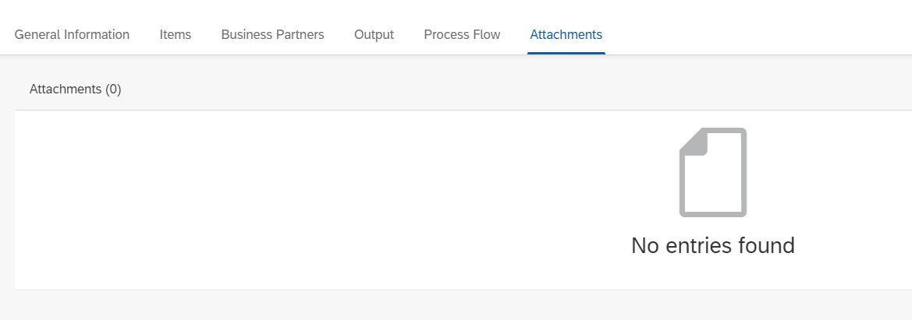 

</td>
<td valign="top">

 

</td>
</tr>
<tr>
<td valign="top">

Save

</td>
<td valign="top">

-   Object page

</td>
<td valign="top">

[Adapting Logic Before Save Operation](adapting-logic-before-save-operation-6a0a050.md)

[Save and Navigation Options on the Object Page](save-and-navigation-options-on-the-object-page-55d81bc.md)

[Toggling Between Draft and Saved Values](toggling-between-draft-and-saved-values-fd3950a.md)

[Extending the Bookmark Function to Save Static Tiles to the SAP Fiori Launchpad](extending-the-bookmark-function-to-save-static-tiles-to-the-sap-fiori-launchpad-7e34ea9.md)

</td>
<td valign="top">

 

</td>
<td valign="top">

 

</td>
<td valign="top">

onBeforeSave

on before save

</td>
</tr>
<tr>
<td valign="top">

Search

</td>
<td valign="top">

-   Analytical list page \(OData V2\)
-   List report \(OData V2\)
-   Object page \(OData V2\)
-   Overview page

</td>
<td valign="top">

[Enabling the Search Function](enabling-the-search-function-3cdebee.md)

</td>
<td valign="top">

[Search](https://experience.sap.com/fiori-design-web/search/)

</td>
<td valign="top">

   
  
**Search Field**

 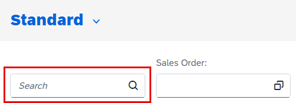 

</td>
<td valign="top">

 

</td>
</tr>
<tr>
<td valign="top">

Segmented buttons

</td>
<td valign="top">

Object page

</td>
<td valign="top">

[Adding Segmented Buttons to a Table Toolbar](adding-segmented-buttons-to-a-table-toolbar-5532c89.md)

</td>
<td valign="top">

[Segmented Buttons](https://experience.sap.com/fiori-design-web/button/#segmented-button)

</td>
<td valign="top">

   
  
**Segmented Button**

 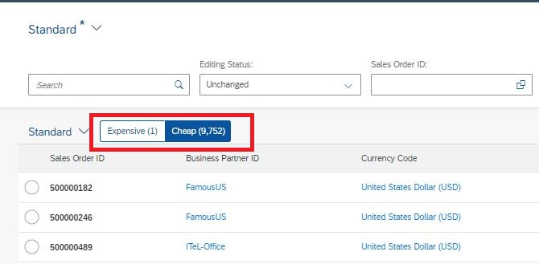 

</td>
<td valign="top">

 

</td>
</tr>
<tr>
<td valign="top">

"Share" functionality

</td>
<td valign="top">

-   List report
-   Object page

</td>
<td valign="top">

["Share" Functionality](share-functionality-022bf0d.md)

[Store/Restore the Application State](store-restore-the-application-state-46bf248.md)

</td>
<td valign="top">

 

</td>
<td valign="top">

 

</td>
<td valign="top">

Save as Tile

Send email

iAppState

appState

app-state

app state

</td>
</tr>
<tr>
<td valign="top">

Side effects

</td>
<td valign="top">

-   List report
-   Object page

</td>
<td valign="top">

[Side Effects](side-effects-18b17bd.md)

</td>
<td valign="top">

 

</td>
<td valign="top">

 

</td>
<td valign="top">

 

</td>
</tr>
<tr>
<td valign="top">

Share building block

</td>
<td valign="top">

-   List report \(OData V4\)
-   Object page \(OData V4\)

</td>
<td valign="top">

[Building Blocks](building-blocks-24c1304.md)

</td>
<td valign="top">

 

</td>
<td valign="top">

 

</td>
<td valign="top">

building blocks

buildable blocks

macro

free style application

free-style

</td>
</tr>
<tr>
<td valign="top">

Smart link

</td>
<td valign="top">

-   Analytical list page
-   List report
-   Object page
-   Overview page

</td>
<td valign="top">

[Adding a Contact Quick View to a Table](adding-a-contact-quick-view-to-a-table-677fbde.md)

[Enabling Quick Views for Link Navigation](enabling-quick-views-for-link-navigation-307ced1.md)

</td>
<td valign="top">

[Smart Link](https://experience.sap.com/fiori-design-web/smart-link/)

</td>
<td valign="top">

   
  
**Smart Link**

 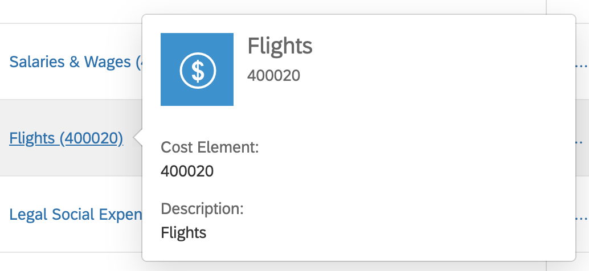 

</td>
<td valign="top">

semantic links

navigation links

link-based navigation

Contact card

Communication.Contact

</td>
</tr>
<tr>
<td valign="top">

Smart table

</td>
<td valign="top">

-   Analytical list page \(OData V2\)
-   List report
-   Object page
-   Overview page

</td>
<td valign="top">

[Configuring the Table-Only View as the Default Option](configuring-the-table-only-view-as-the-default-option-d074e26.md)

[Setting the Table Type](setting-the-table-type-7f844f1.md)

[Table Cards](table-cards-167bf7c.md)

</td>
<td valign="top">

[Smart Table](https://experience.sap.com/fiori-design-web/smart-table/)

</td>
<td valign="top">

   
  
**Smart Table**

  

</td>
<td valign="top">

 

</td>
</tr>
<tr>
<td valign="top">

Sorting on cards

</td>
<td valign="top">

Overview page

</td>
<td valign="top">

[Configuring Sort Properties](configuring-sort-properties-41af842.md)

</td>
<td valign="top">

 

</td>
<td valign="top">

 

</td>
<td valign="top">

 

</td>
</tr>
<tr>
<td valign="top">

Stack card

</td>
<td valign="top">

Overview page \(OData V2\)

</td>
<td valign="top">

[Stack Cards](stack-cards-756c49c.md)

</td>
<td valign="top">

[Stack Card](https://experience.sap.com/fiori-design-web/overview-page-stack-card-quick-view-card/)

</td>
<td valign="top">

   
  
**Stack Card**

  

</td>
<td valign="top">

 

</td>
</tr>
<tr>
<td valign="top">

Stacked bar micro chart

</td>
<td valign="top">

-   Analytical list page
-   List report
-   Object page

</td>
<td valign="top">

[Micro Chart Facet](micro-chart-facet-e219fd0.md)

[Stacked Bar Micro Chart](stacked-bar-micro-chart-9c93837.md)

[Smart Micro Chart](../10_More_About_Controls/smart-micro-chart-2180a6f.md)

[Adding a Micro Chart to a Table](adding-a-micro-chart-to-a-table-b8312a4.md)

</td>
<td valign="top">

[Stacked Bar Micro Chart](https://experience.sap.com/fiori-design-web/stacked-bar-micro-chart/)

</td>
<td valign="top">

   
  
**Stacked Bar Micro Chart**

 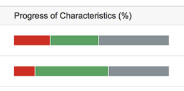 

</td>
<td valign="top">

micro-chart

microchart

</td>
</tr>
<tr>
<td valign="top">

Status colors and icons

</td>
<td valign="top">

-   List report
-   Object page

</td>
<td valign="top">

[Status Colors and Icons](status-colors-and-icons-1641180.md)

</td>
<td valign="top">

 

</td>
<td valign="top">

   
  
**Status Colors and Icons**

 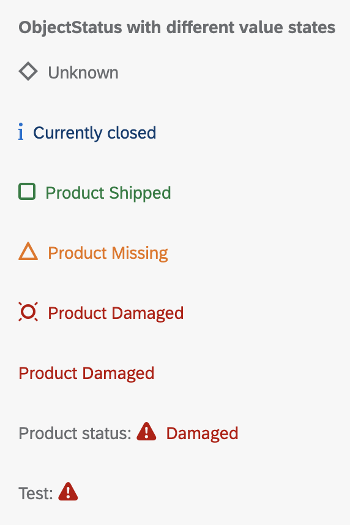 

</td>
<td valign="top">

colour

criticality

</td>
</tr>
<tr>
<td valign="top">

Stream support

</td>
<td valign="top">

Object page

</td>
<td valign="top">

[Enabling Stream Support](enabling-stream-support-b236d32.md)

</td>
<td valign="top">

 

</td>
<td valign="top">

   
  
**File Upload in Edit Mode**

  

</td>
<td valign="top">

Edm.Stream

Upload

Download

File

MediaType

form

Attachment

</td>
</tr>
<tr>
<td valign="top">

Table building block

</td>
<td valign="top">

-   List report \(OData V4\)
-   Object page \(OData V4\)

</td>
<td valign="top">

[Building Blocks](building-blocks-24c1304.md)

</td>
<td valign="top">

 

</td>
<td valign="top">

 

</td>
<td valign="top">

table macro

tables

</td>
</tr>
<tr>
<td valign="top">

Table card

</td>
<td valign="top">

Overview page

</td>
<td valign="top">

[Table Cards](table-cards-167bf7c.md)

</td>
<td valign="top">

 

</td>
<td valign="top">

   
  
**Table Card**

 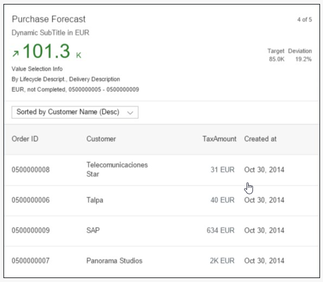 

</td>
<td valign="top">

tables

</td>
</tr>
<tr>
<td valign="top">

Table personalization

</td>
<td valign="top">

-   Analytical list page
-   List report
-   Object page
-   Overview page

</td>
<td valign="top">

 [Enabling Table Personalization](enabling-table-personalization-3e2b4d2.md) 

</td>
<td valign="top">

[Table Personalization \(Overview\)](https://experience.sap.com/fiori-design-web/overview-table-personalization/)

</td>
<td valign="top">

   
  
**Table Personalization Dialog**

 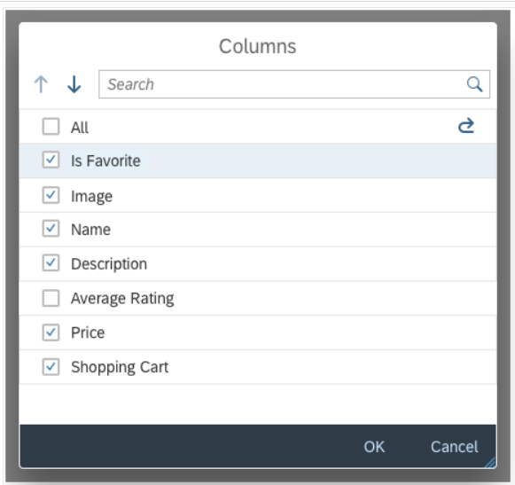 

</td>
<td valign="top">

Vm

Variant Management

Filtering

Sorting

</td>
</tr>
<tr>
<td valign="top">

Tables

</td>
<td valign="top">

-   Analytical list page \(OData V2\)
-   List report
-   Object page
-   Overview page

</td>
<td valign="top">

[Configuring Tables](configuring-tables-f4eb70f.md)

[Configuring the Table-Only View as the Default Option](configuring-the-table-only-view-as-the-default-option-d074e26.md)

[Setting the Table Type](setting-the-table-type-7f844f1.md)

[Table Cards](table-cards-167bf7c.md)

</td>
<td valign="top">

[Tree Table](https://experience.sap.com/fiori-design-web/tree-table/)

[Responsive Table](https://experience.sap.com/fiori-design-web/responsive-table/)

[Grid Table](https://experience.sap.com/fiori-design-web/grid-table/)

[Analytical Table \(ALV\)](https://experience.sap.com/fiori-design-web/analytical-table-alv/)

</td>
<td valign="top">

   
  
**Table**

 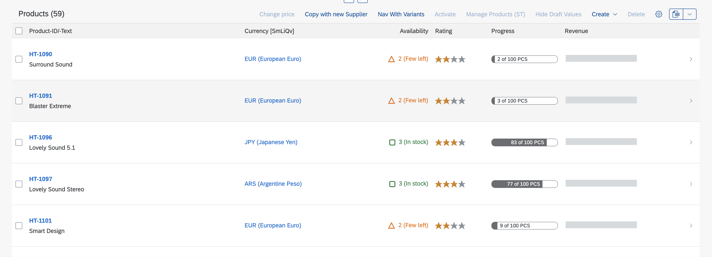 

</td>
<td valign="top">

 

</td>
</tr>
<tr>
<td valign="top">

Table toolbar

</td>
<td valign="top">

-   Analytical list page \(OData V2\)
-   List report
-   Object page

</td>
<td valign="top">

[Adding Segmented Buttons to a Table Toolbar](adding-segmented-buttons-to-a-table-toolbar-5532c89.md)

[Adaptation Extension Example: Adding a Button to the Table Toolbar in the List Report](adaptation-extension-example-adding-a-button-to-the-table-toolbar-in-the-list-report-a269671.md)

</td>
<td valign="top">

[Table Toolbar](https://experience.sap.com/fiori-design-web/table-bar/)

</td>
<td valign="top">

   
  
**Table Toolbar with Segmented Text Button**

 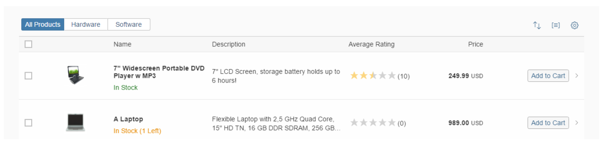 

</td>
<td valign="top">

Adaptation project

Quick filter

quickVariantSelection

</td>
</tr>
<tr>
<td valign="top">

Text

</td>
<td valign="top">

-   Analytical list page
-   List report
-   Object page
-   Overview page

</td>
<td valign="top">

[Plain Text Facet](plain-text-facet-1da0926.md)

</td>
<td valign="top">

-   [Text](https://experience.sap.com/fiori-design-web/text/)
-   [Plain Text Facet](https://experience.sap.com/fiori-design-web/object-page/#plain-text-facet/)

</td>
<td valign="top">

   
  
**Text Control: Hyphenation**

 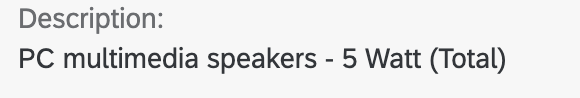 

</td>
<td valign="top">

Header Facet

</td>
</tr>
<tr>
<td valign="top">

Text area

</td>
<td valign="top">

-   Analytical list page
-   List report
-   Object page
-   Overview page

</td>
<td valign="top">

[Different Representations of a Field](different-representations-of-a-field-c18ada4.md)

</td>
<td valign="top">

[Text Area](https://experience.sap.com/fiori-design-web/text-area/)

</td>
<td valign="top">

   
  
**Text Area Counter**

 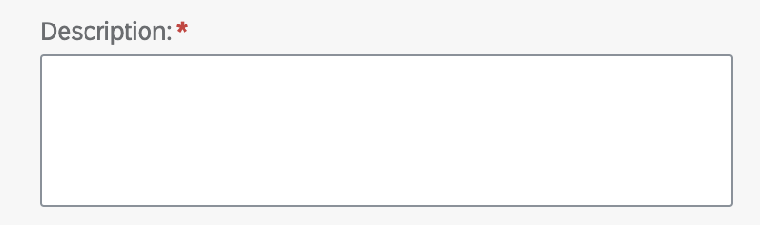 

</td>
<td valign="top">

Multiline Text

UI.MultiLineText

MultiLineText

Expandable Text

</td>
</tr>
<tr>
<td valign="top">

Title

</td>
<td valign="top">

-   Analytical list page
-   List report
-   Object page
-   Overview page

</td>
<td valign="top">

[Adding Titles to Object Page Tables](adding-titles-to-object-page-tables-d9a4539.md)

[Adapting the Object Page Header Title and Description](adapting-the-object-page-header-title-and-description-333f850.md)

[Changing Default Titles of New and Unnamed Objects](changing-default-titles-of-new-and-unnamed-objects-63946c0.md)

[Configuring the Table Card Header Area \(Optional\)](configuring-the-table-card-header-area-optional-05887bd.md)

</td>
<td valign="top">

[Title](https://experience.sap.com/fiori-design-web/title/)

</td>
<td valign="top">

   
  
**Title**

 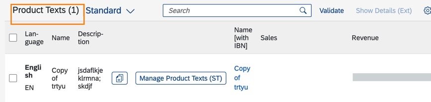 

</td>
<td valign="top">

header title

header description

page title

page description

object title

object description

record title

record description

no title

remove title

blank title

</td>
</tr>
<tr>
<td valign="top">

Token

</td>
<td valign="top">

-   Analytical list page \(OData V2\)
-   List report
-   Object page
-   Overview page \(OData V2\)

</td>
<td valign="top">

[Field Help](field-help-a5608ea.md)

[Using the Multi-Input Field on the Object Page](using-the-multi-input-field-on-the-object-page-04ff5b1.md)

</td>
<td valign="top">

[Token](https://experience.sap.com/fiori-design-web/token/)

</td>
<td valign="top">

   
  
**Token Styles**

 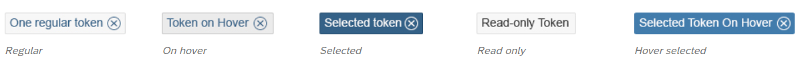 

</td>
<td valign="top">

 

</td>
</tr>
<tr>
<td valign="top">

Tree table

</td>
<td valign="top">

-   Analytical list page \(OData V2\)
-   List report
-   Object page

</td>
<td valign="top">

[Setting the Table Type](setting-the-table-type-7f844f1.md)

[Example: Adding Columns to a Tree Table in the List Report](example-adding-columns-to-a-tree-table-in-the-list-report-b903da5.md)

</td>
<td valign="top">

[Tree Table](https://experience.sap.com/fiori-design-web/tree-table/)

</td>
<td valign="top">

   
  
**Tree Table with Multiple Selection**

 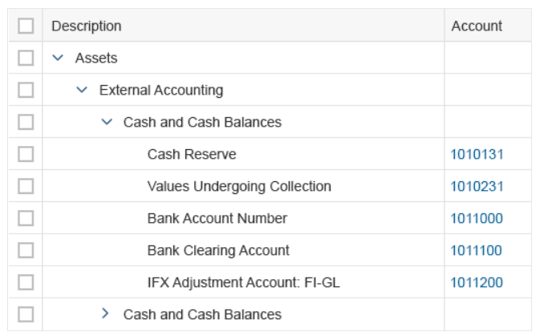 

</td>
<td valign="top">

 

</td>
</tr>
<tr>
<td valign="top">

Unit of measure on cards

</td>
<td valign="top">

Overview page

</td>
<td valign="top">

[Setting Units of Measure](setting-units-of-measure-0d6c1d5.md)

</td>
<td valign="top">

 

</td>
<td valign="top">

 

</td>
<td valign="top">

 

</td>
</tr>
<tr>
<td valign="top">

Value help

</td>
<td valign="top">

-   Analytical list page
-   List report
-   Object page
-   Overview page

</td>
<td valign="top">

[Enhancing ValueList Annotations for Visual Filters](enhancing-valuelist-annotations-for-visual-filters-16d43eb.md)

[Value Help as a Dropdown List](value-help-as-a-dropdown-list-2a0a630.md)

</td>
<td valign="top">

[Value Help Dialog](https://experience.sap.com/fiori-design-web/value-help-dialog/)

</td>
<td valign="top">

   
  
**Value Help Dialog**

 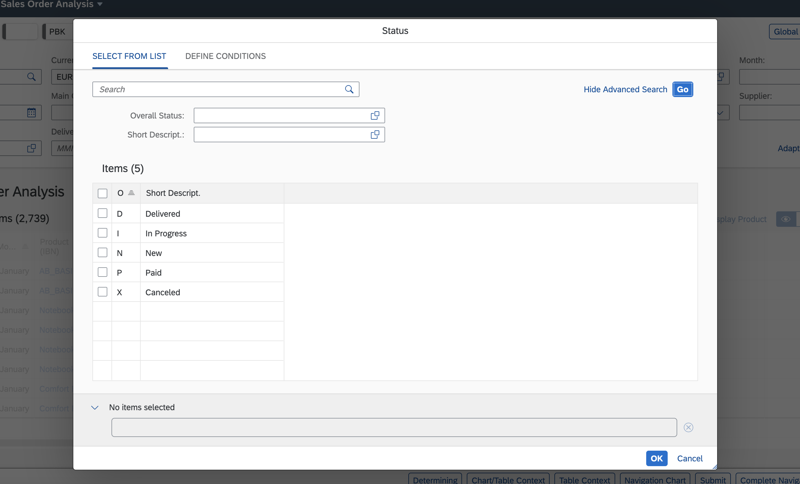 

</td>
<td valign="top">

VH

ValueList

ValueListWithFixedValues

DDL

PresentationVariantQualifier

</td>
</tr>
<tr>
<td valign="top">

Variant management

</td>
<td valign="top">

-   Analytical list page
-   List report
-   Object page
-   Overview page

</td>
<td valign="top">

[Managing Variants](managing-variants-8ce658e.md)

[Descriptor Configuration for the Analytical List Page](descriptor-configuration-for-the-analytical-list-page-2a9df06.md)

[Creating a List Report without Variant Management](creating-a-list-report-without-variant-management-094fe8c.md)

[Descriptor Configuration for the Overview Page](descriptor-configuration-for-the-overview-page-f194b41.md)

</td>
<td valign="top">

[Variant Management](https://experience.sap.com/fiori-design-web/variant-management/)

</td>
<td valign="top">

   
  
**Manage Views Dialog**

 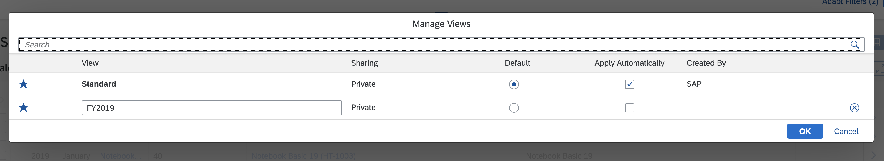 

</td>
<td valign="top">

VM

personalisation

personalization

</td>
</tr>
<tr>
<td valign="top">

Visual filter bar

</td>
<td valign="top">

Analytical list page

</td>
<td valign="top">

[Visual Filters](visual-filters-1714720.md)

</td>
<td valign="top">

[Visual Filter Bar](https://experience.sap.com/fiori-design-web/visual-filter-bar/)

</td>
<td valign="top">

   
  
**Visual Filter Setup**

 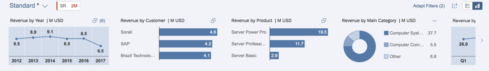 

</td>
<td valign="top">

 

</td>
</tr>
<tr>
<td valign="top">

Worklist

</td>
<td valign="top">

-   Worklist

</td>
<td valign="top">

[Worklist](worklist-d1d588f.md)

</td>
<td valign="top">

[Worklist](https://experience.sap.com/fiori-design-web/work-list/)

</td>
<td valign="top">

  

</td>
<td valign="top">

 

</td>
</tr>
</table>

