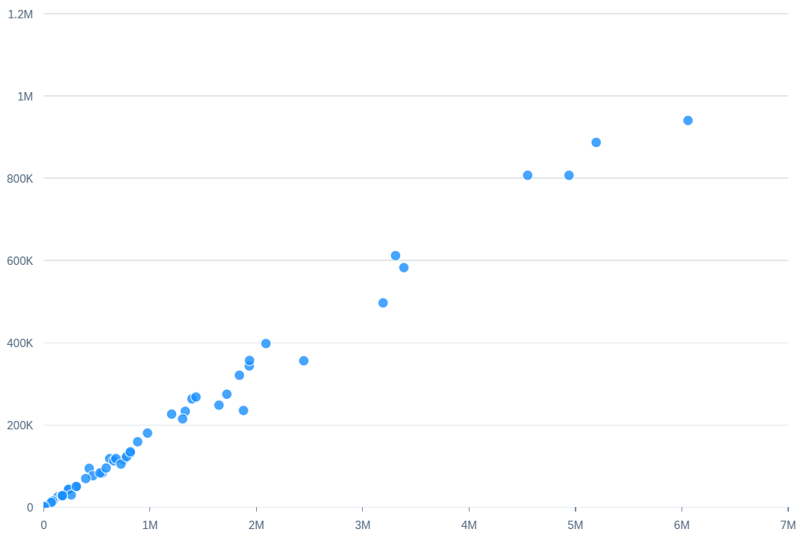

<!-- loio7471c1f3a8ed4f6db2401246edbb573f -->

# Scatter Chart

You can render the chart as a scatter chart in SAP Fiori elements for OData V4.


A scatter chart allows you to visualize the distribution of data points across two measures and supports a maximum of two dimensions.

  
  
**Example of a Scatter Chart**



For the first measure, the role is set to an axis is assigned to the `valueAxis` feed UID makes up the x-axis.

The first measure is plotted on the x-axis and the second measure on the y-axis. Dimensions assigned with `Series` role get a different color for each of its members.

The following code samples show how to configure a scatter chart with two measures \(`salesshare` and `totalsales`\) and one dimension \(`suppliercompany`\) with no role:

> ### Sample Code:  
> XML Annotation
> 
> ```xml
> <Annotation Term="UI.Chart" Qualifier="Eval_by_Currency_Scatter">
>     <Record Type="UI.ChartDefinitionType">
>         <PropertyValue Property="Title" String="Scatter Chart no role" />
>         <PropertyValue Property="ChartType" EnumMember="UI.ChartType/Scatter" />
>         <PropertyValue Property="MeasureAttributes">
>             <Collection>
>                 <Record Type="UI.ChartMeasureAttributeType">
>                     <PropertyValue Property="Measure" PropertyPath="salesshare" />
>                     <PropertyValue Property="Role" EnumMember="UI.ChartMeasureRoleType/Axis1" />
>                 </Record>
>                 <Record Type="UI.ChartMeasureAttributeType">
>                     <PropertyValue Property="Measure" PropertyPath="totalsales" />
>                     <PropertyValue Property="Role" EnumMember="UI.ChartMeasureRoleType/Axis2" />
>                 </Record>
>             </Collection>
>         </PropertyValue>
>         <PropertyValue Property="DimensionAttributes">
>             <Collection>
>                 <Record Type="UI.ChartDimensionAttributeType">
>                     <PropertyValue Property="Dimension" PropertyPath="suppliercompany" />
>                 </Record>
>             </Collection>
>         </PropertyValue>
>     </Record>
> </Annotation>
> ```

> ### Sample Code:  
> ABAP CDS Annotation
> 
> ```
> 
> @UI.chart: [
>   {
>     qualifier         : 'Eval_by_Currency_Scatter',
>     title             : 'Scatter Chart no role',
>     chartType         : #SCATTER,
>     dimensions        : [ 'suppliercompany' ],
>     measures          : [ 'salesshare', 'totalsales' ],
>     measureAttributes : [
>       {
>         measure : 'salesshare',
>         role    : #AXIS_1
>       },
>       {
>         measure : 'totalsales',
>         role    : #AXIS_2
>       }
>     ]
>   }
> ]
> 
> ```

> ### Sample Code:  
> CAP CDS Annotation
> 
> ```
> 
> annotate MyService.MyEntity with @(
>   UI.Chart #Eval_by_Currency_Scatter : {
>     Title             : 'Scatter Chart no role',
>     ChartType         : #Scatter,
>     Dimensions        : [ suppliercompany ],
>     Measures          : [
>       salesshare,
>       totalsales
>     ],
>     MeasureAttributes : [
>       {
>         Measure : salesshare,
>         Role    : #Axis1
>       },
>       {
>         Measure : totalsales,
>         Role    : #Axis2
>       }
>     ]
>   }
> );
> 
> ```

> ### Note:  
> For information about scatter chart cards on the overview page, see [Scatter Chart](scatter-chart-7471c1f.md).

