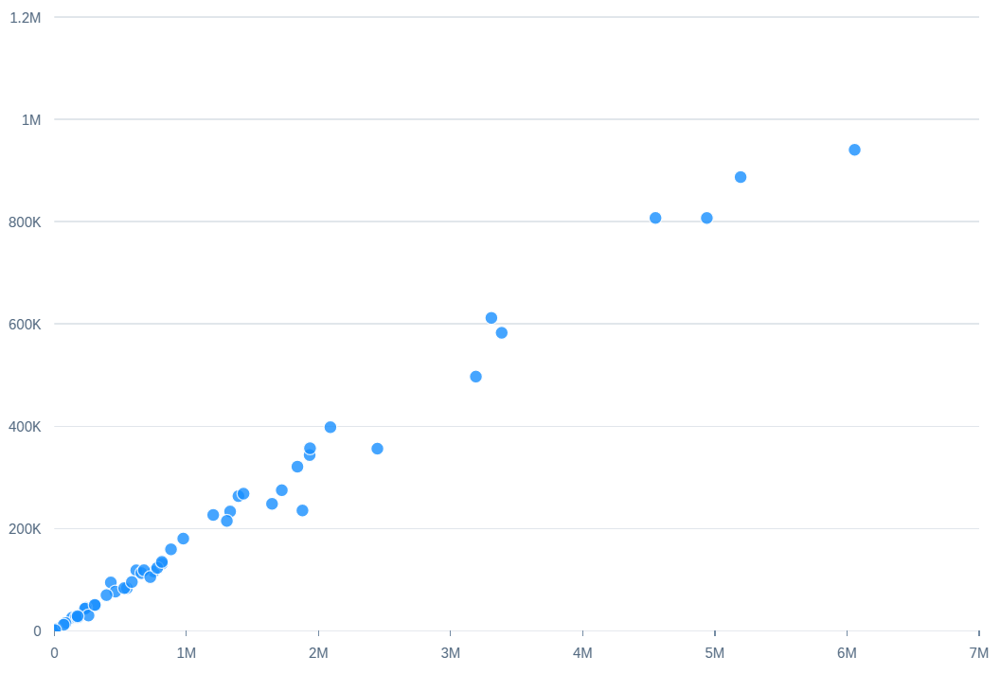

<!-- loio0dd2fa83306d4860b0a7495c9f040e95 -->

# Scatter Chart Card

You can render the chart as a scatter chart, which allows you visualize the distribution of data points over two measures.


  
  
**Example of a Scatter Chart Card**



A scatter chart has the following requirements:

-   Two measures. One for the x-axis and one for the y-axis.

-   Up to two dimensions.


Each measure is assigned to an axis based on its `Role`:

-   X-axis \(`valueAxis` feed\): The first measure with an axis role is assigned to the x-axis. The role is set to `Axis1`, or `Axis2` \(if there's no `Axis1`\), or `Axis3` \(if there's no `Axis2`\).

-   Y-axis: The other measure is plotted on the y-axis.


Dimensions are visualized based on their role:

-   No role: All members of the dimension are plotted as equal-sized bubbles of the same color.

-   `Series` role: All members of the dimension get a different color. Only one dimension can be assigned the `Series` role.

-   `Category` role: All members of the dimension get a different shape. Only one dimension can be assigned the `Category` role.


The following code samples show how to configure a scatter chart with two measures \(`salesshare` and `totalsales`\) and one dimension \(`suppliercompany`\) with no role:

> ### Sample Code:  
> XML Annotation
> 
> ```xml
> <Annotation Term="UI.Chart" Qualifier="Eval_by_Currency_Scatter">
>     <Record Type="UI.ChartDefinitionType">
>         <PropertyValue Property="Title" String="Scatter Chart no role" />
>         <PropertyValue Property="ChartType" EnumMember="UI.ChartType/Scatter" />
>         <PropertyValue Property="MeasureAttributes">
>             <Collection>
>                 <Record Type="UI.ChartMeasureAttributeType">
>                     <PropertyValue Property="Measure" PropertyPath="salesshare" />
>                     <PropertyValue Property="Role" EnumMember="UI.ChartMeasureRoleType/Axis1" />
>                 </Record>
>                 <Record Type="UI.ChartMeasureAttributeType">
>                     <PropertyValue Property="Measure" PropertyPath="totalsales" />
>                     <PropertyValue Property="Role" EnumMember="UI.ChartMeasureRoleType/Axis2" />
>                 </Record>
>             </Collection>
>         </PropertyValue>
>         <PropertyValue Property="DimensionAttributes">
>             <Collection>
>                 <Record Type="UI.ChartDimensionAttributeType">
>                     <PropertyValue Property="Dimension" PropertyPath="suppliercompany" />
>                 </Record>
>             </Collection>
>         </PropertyValue>
>     </Record>
> </Annotation>
> ```

> ### Sample Code:  
> ABAP CDS Annotation
> 
> ```
> 
> @UI.Chart: [
>   {
>     title: 'Scatter Chart no role',
>     chartType: #SCATTER,
>     measureAttributes: [
>       {
>         measure: 'salesshare',
>         role: #AXIS_1
>       },
>       {
>         measure: 'totalsales',
>         role: #AXIS_2
>       }
>     ],
>     dimensionAttributes: [
>       {
>         dimension: 'suppliercompany'
>       }
>     ],
>     qualifier: 'Eval_by_Currency_Scatter'
>   }
> ]
> annotate view VIEWNAME with { }
> 
> ```

> ### Sample Code:  
> CAP CDS Annotation
> 
> ```
> 
> UI.Chart #Eval_by_Currency_Scatter : {
>     $Type : 'UI.ChartDefinitionType',
>     Title : 'Scatter Chart no role',
>     ChartType : #Scatter,
>     MeasureAttributes : [
>         {
>             $Type : 'UI.ChartMeasureAttributeType',
>             Measure : salesshare,
>             Role : #Axis1
>         },
>         {
>             $Type : 'UI.ChartMeasureAttributeType',
>             Measure : totalsales,
>             Role : #Axis2
>         }
>     ],
>     DimensionAttributes : [
>         {
>             $Type : 'UI.ChartDimensionAttributeType',
>             Dimension : suppliercompany
>         }
>     ]
> },
> 
> ```

