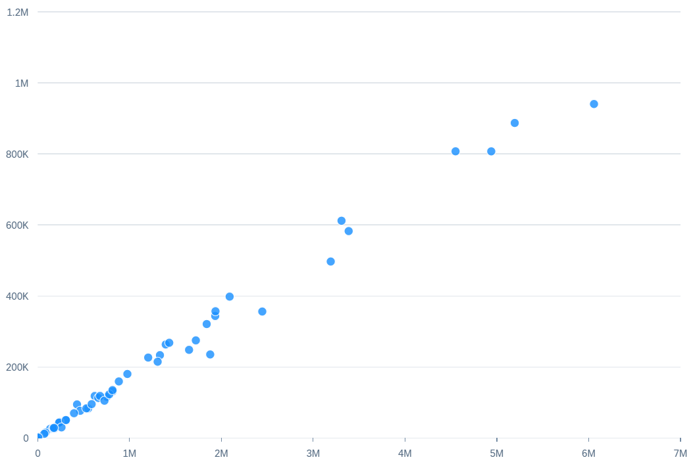

<!-- loio7471c1f3a8ed4f6db2401246edbb573f -->

# Scatter Chart Card

With a scatter chart card, you can visualize the distribution of data points over two measures.


For the first measure, the role is set to an axis is assigned to the `valueAxis` feed UID makes up the x-axis.

> ### Note:  
> The role is set to `axis1`, `axis2` \(if there's no `axis1`\), or `axis3` \(if there's no `axis2`\).

The other measure is plotted on the y-axis.

A scatter chart card supports a maximum of two dimensions. If the dimension is not marked with a role, then all members of the dimension are plotted as equal-sized bubbles of the same color in the chart. You can assign only one dimension to the `Series` role and all members of this dimension get a different color. A maximum of only one dimension can be assigned to the `Category` role and all members of such a dimension get a different shape.

> ### Sample Code:  
> XML Annotation
> 
> ```xml
> <Annotation Term="UI.Chart" Qualifier="Eval_by_Currency_Scatter">
>     <Record Type="UI.ChartDefinitionType">
>         <PropertyValue Property="Title" String="Scatter Chart no role" />
>         <PropertyValue Property="ChartType" EnumMember="UI.ChartType/Scatter" />
>         <PropertyValue Property="MeasureAttributes">
>             <Collection>
>                 <Record Type="UI.ChartMeasureAttributeType">
>                     <PropertyValue Property="Measure" PropertyPath="salesshare" />
>                     <PropertyValue Property="Role" EnumMember="UI.ChartMeasureRoleType/Axis1" />
>                 </Record>
>                 <Record Type="UI.ChartMeasureAttributeType">
>                     <PropertyValue Property="Measure" PropertyPath="totalsales" />
>                     <PropertyValue Property="Role" EnumMember="UI.ChartMeasureRoleType/Axis2" />
>                 </Record>
>             </Collection>
>         </PropertyValue>
>         <PropertyValue Property="DimensionAttributes">
>             <Collection>
>                 <Record Type="UI.ChartDimensionAttributeType">
>                     <PropertyValue Property="Dimension" PropertyPath="suppliercompany" />
>                 </Record>
>             </Collection>
>         </PropertyValue>
>     </Record>
> </Annotation>
> ```

> ### Sample Code:  
> ABAP CDS Annotation
> 
> ```
> 
> @UI.Chart: [
>   {
>     title: 'Scatter Chart no role',
>     chartType: #SCATTER,
>     measureAttributes: [
>       {
>         measure: 'salesshare',
>         role: #AXIS_1
>       },
>       {
>         measure: 'totalsales',
>         role: #AXIS_2
>       }
>     ],
>     dimensionAttributes: [
>       {
>         dimension: 'suppliercompany'
>       }
>     ],
>     qualifier: 'Eval_by_Currency_Scatter'
>   }
> ]
> annotate view VIEWNAME with { }
> 
> ```

> ### Sample Code:  
> CAP CDS Annotation
> 
> ```
> 
> UI.Chart #Eval_by_Currency_Scatter : {
>     $Type : 'UI.ChartDefinitionType',
>     Title : 'Scatter Chart no role',
>     ChartType : #Scatter,
>     MeasureAttributes : [
>         {
>             $Type : 'UI.ChartMeasureAttributeType',
>             Measure : salesshare,
>             Role : #Axis1
>         },
>         {
>             $Type : 'UI.ChartMeasureAttributeType',
>             Measure : totalsales,
>             Role : #Axis2
>         }
>     ],
>     DimensionAttributes : [
>         {
>             $Type : 'UI.ChartDimensionAttributeType',
>             Dimension : suppliercompany
>         }
>     ]
> },
> 
> ```

   
  
**Example of a Scatter Chart Card**

  

