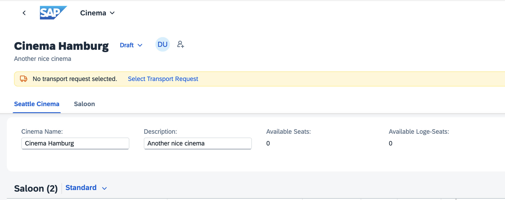
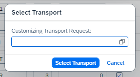
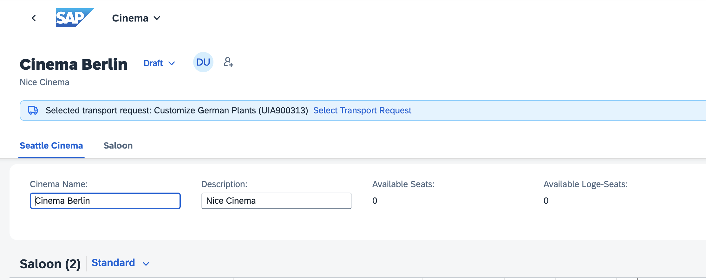

<!-- loio29cd1945f2ce4d9c98fd271c2a5f86d1 -->

# Selecting Transports for Business Configuration Content

SAP Fiori elements provides the *Select Transport Request* feature on an object page, allowing users to select a transport request for the document they are currently editing.

Business configuration content follows a controlled deployment process. Rather than making changes directly in a production environment, content is created in dedicated development environments. These environments can be specialized content development systems for standard configurations or development systems/clients for customer-specific content. The content is then systematically transported through test environments before final deployment to production.

Users can use the *Select Transport Request* feature on an object page to select a transport request for the document they are currently editing.

The feature is not visible in read-only mode. It appears in the header toolbar when a user starts editing the object page. If selecting a transport is mandatory, a warning is shown in the message strip until a transport request is selected.



When users click on *Select Transport Request*, a dialog displaying available transport requests opens. Users can select a request from the list and confirm their selection.

If users click *Save* and have not selected a transport request yet, a dialog prompts them to choose a transport request before proceeding with the save operation:



The selected transport request is then shown in the header toolbar. Users can change the selected transport request at any time:




<a name="loio29cd1945f2ce4d9c98fd271c2a5f86d1__section_alj_zg2_dgc"/>

## Prerequisites

To use this feature, applications or the framework service must ensure the following:

-   A transport request property must be available in the entity set that contains the currently selected transport request.

-   A `select transport` action must be available in the entity set that allows the user to select a transport request.

    -   The action must contain a parameter that allows the user to select a transport request.

    -   The parameter must be of string type and must have a meaningful label.

    -   The action must use the `@Common.SideEffects` annotation to ensure that the UI is refreshed after the transport request is selected.

    -   The action parameter must have a value list annotation to provide the list of available transport requests.


> ### Tip:  
> Define the value list as `ValueListWithFixedValues` if you expect the number of transport requests to be small. That way, the parameter is shown as a dropdown box.


<a name="loio29cd1945f2ce4d9c98fd271c2a5f86d1__section_dft_zh2_dgc"/>

## Configuration

Make the required settings as shown in the following sample code:

> ### Sample Code:  
> ```
> {
>      "sap.ui5": {
>           "routing": {
>                "targets": {
>                     "<yourRootPage>": {
>                          "options": {
>                               "settings": {
>                                    "content": {
>                                         "transportSelection": {
>                                              "transportRequestProperty": "<TransportRequestProperty>",
>                                              "selectTransportAction": "<Namespace>.<SelectTransportAction>"
>                                         }
>                                    }
>                               }
>                          }
>                     }
>                }
>           }
>      }
> }
> ```

Developers working with the ABAP RESTful Application Programming Model can use the *Enable Transport Selection Strip* option in the *Generate ABAP Repository Objects Wizard*. For more information, see [Generating a Business Configuration Maintenance Object with the Generate ABAP Repository Objects Wizard](https://help.sap.com/docs/ABAP_PLATFORM_NEW/b5670aaaa2364a29935f40b16499972d/047e01c3bcdd4303a60b61364bd5b31d.html).


### Enable/Disable the *Select Transport Request* Feature Using `OperationAvailable`

If you enable the feature using the manifest setting, you can still disable it by using the `OperationAvailable` annotation on the `SelectTransport` action, as shown in the following sample code:

> ### Sample Code:  
> ```
> <Annotations Target="Namespace.SelectTransportAction">
>      <Annotation Term="Common.OperationAvailable" Path="selectTransportEnabled" />
> </Annotations>
> 
> ```


### Enable Mandatory Transport Requests Using `FieldControl`

Use the `@Common.FieldControl` annotation on the transport request property to make transport requests mandatory. Doing so ensures that users are unable to save the document without selecting a transport request. In addition, a warning is shown in the message strip until a transport request is selected.

The following sample code shows a static annotation:

> ### Sample Code:  
> ```
> <Annotations Target="Namespace.TransportRequestProperty">
>      <Annotation Term="Common.FieldControl" EnumMember="Common.FieldControlType/Mandatory" />
> </Annotations>
> 
> ```

The following sample code shows a dynamic annotation:

> ### Sample Code:  
> ```
> <Annotations Target="Namespace.TransportRequestProperty">
>      <Annotation Term="Common.FieldControl" Path="transportRequestFieldControl" />
> </Annotations>
> 
> ```

