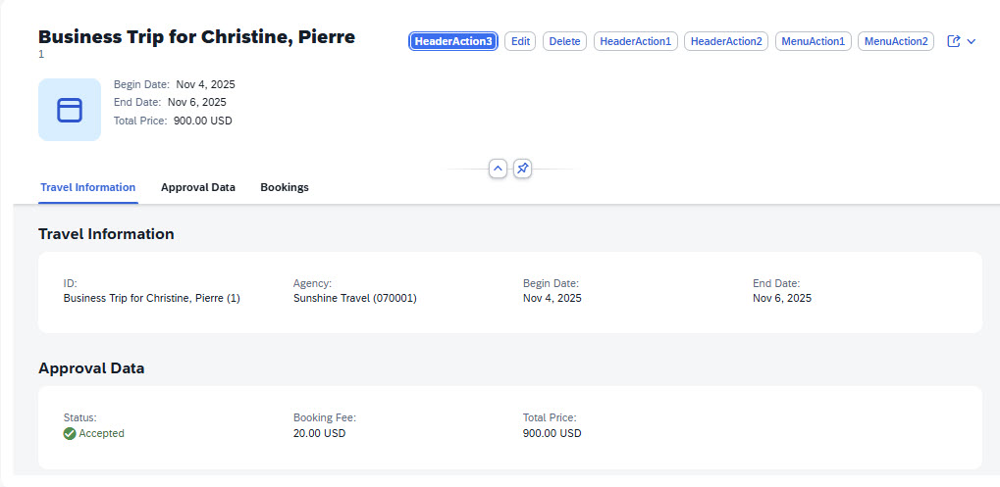
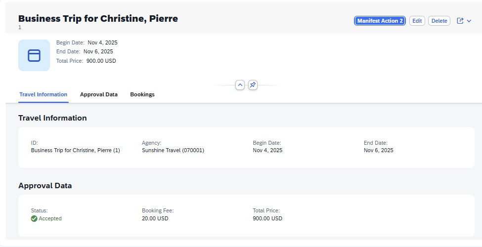
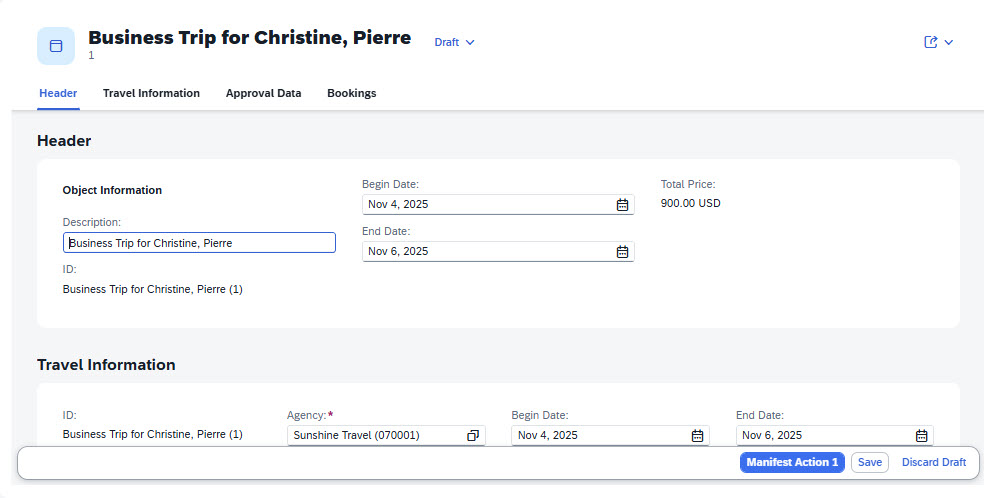
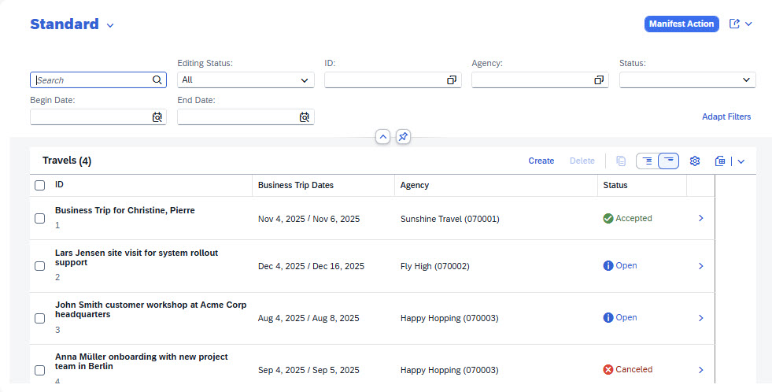

<!-- loio57e5ad020ba044b39254386589c25f70 -->

# Setting Emphasized Actions

You can use an emphasized button for any annotation-based or custom action in the header or footer of the page in SAP Fiori elements for OData V4.

You can emphasize an action by using the `UI.Emphasized` annotation in `DataFieldForAction` or `DataFieldForIntentBasedNavigation`, or by using the `isPrimaryAction` parameter for custom or annotation-based actions in the manifest.

`UI.Emphasized` and `isPrimaryAction` parameters support Boolean values only.

The following rules apply when dealing with emphasized actions and with any potential conflicts:

-   You can emphasize only one action per page.
-   An emphasized action is always placed in the first position in the header or footer.
-   If a footer with one or more actions is displayed, the emphasized action must be located in the footer.
-   If an action has a defined criticality, no emphasis is displayed for any other action.
-   An emphasized action is never added to the overflow area.
-   You can only emphasize a menu action if the menu contains a default action. The default action itself can't be emphasized. For more information, see the [Grouping Actions as Menu Buttons](actions-cbf16c5.md#loiocbf16c599f2d4b8796e3702f7d4aae6c__grouping_actions_subsection) and [Defining a Default Action for a Menu Button](actions-cbf16c5.md#loiocbf16c599f2d4b8796e3702f7d4aae6c__section_ofh_r3j_1jc)sections in [Actions](actions-cbf16c5.md).
-   Manifest configuration overrides the annotation.

If an emphasis defined for an action is not applied because of the preceding rules, the action is placed at its standard position as defined in the annotation or in the manifest.

-   An emphasized action can be triggered with the following shortcuts:
    -   Microsoft Windows: [Ctrl\] + [Enter\] 

    -   macOS: [CMD\] + [Enter\] 


The following sample code show the annotation-based emphasized action `HeaderAction3`:

> ### Sample Code:  
> XML Annotation
> 
> ```
> 
> <Annotation Term="UI.Identification">
>     <Collection>
>         <Record Type="UI.DataFieldForAction">
>             <PropertyValue Property="Label" String="HeaderAction1"/>
>             <PropertyValue Property="Action" String="com.c_travel.HeaderAction1"/>
>         </Record>
>         <Record Type="UI.DataFieldForAction">
>             <PropertyValue Property="Label" String="HeaderAction2"/>
>             <PropertyValue Property="Action" String="com.c_travel.HeaderAction2"/>
>         </Record>
>         <Record Type="UI.DataFieldForAction">
>             <PropertyValue Property="Label" String="HeaderAction3"/>
>             <PropertyValue Property="Action" String="com.c_travel.HeaderAction3"/>
>             <Annotation Term="UI.Emphasized" Bool="true"/>
>         </Record>
>         <Record Type="UI.DataFieldForAction">
>             <PropertyValue Property="Label" String="MenuAction1"/>
>             <PropertyValue Property="Action" String="com.c_travel.MenuAction1"/>
>         </Record>
>         <Record Type="UI.DataFieldForAction">
>             <PropertyValue Property="Label" String="MenuAction2"/>
>             <PropertyValue Property="Action" String="com.c_travel.MenuAction2"/>
>         </Record>
>     </Collection>
> </Annotation>
> 
> ```

> ### Sample Code:  
> ABAP CDS Annotation
> 
> No ABAP CDS annotation sample is available. Please use the local XML annotation.

> ### Sample Code:  
> CAP CDS Annotation
> 
> ```
> 
> annotate service.Travel with @(UI: {
>     Identification : [
>         {
>             $Type        : 'UI.DataFieldForAction',
>             Label        : 'HeaderAction1',
>             Action       : 'com.c_travel.HeaderAction1'     
>         },
>         {
>             $Type        : 'UI.DataFieldForAction',
>             Label        : 'HeaderAction2',
>             Action       : 'com.c_travel.HeaderAction2'
>         },
>         {
>             $Type        : 'UI.DataFieldForAction',
>             Label        : 'HeaderAction3',
>             Action       : 'com.c_travel.HeaderAction3',
>             ![@UI.Emphasized]: true
>         },
>         {
>             $Type        : 'UI.DataFieldForAction',
>             Label        : 'MenuAction1',
>             Action       : 'com.c_travel.MenuAction1'
>         },
>         {
>             $Type        : 'UI.DataFieldForAction',
>             Label        : 'MenuAction2',
>             Action       : 'com.c_travel.MenuAction2'
>         }
>     ]});
> ```

The following screenshot shows the appearance of the emphasized action `HeaderAction3` in the object page header:

  
  
**Emphasized Action in Object Page Header**



The following sample code shows emphasized actions defined in the `manifest.json` file.

> ### Sample Code:  
> `manifest.json`
> 
> ```
> 
> "objectPage": {
>     "type": "Component",
>     "id": "Default",
>     "name": "sap.fe.templates.ObjectPage",
>     "options": {
>         "settings": {
>             "contextPath": "/Travel",
>             "content": {
>                 "footer": {
>                     "actions": {
>                         "ManifestMenuAction1": {
>                             "text": "Manifest Action 1",
>                             "isPrimaryAction": true,
>                             "visible": "{= ${ui>/isEditable}}"
>                         }                                  
>                     }
>                 },
>                 "header": {
>                     "actions": {
>                         "ManifestMenuAction2": {
>                             "text": "Manifest Action 2",
>                             "visible": "{= !${ui>/isEditable}}",
>                             "isPrimaryAction": true
>                         }
>                     }
>                 }
>             },
>             ...
>         }
>     }
> }
> ```

The following screenshot shows `ManifestMenuAction2` displayed in the header of the object page in display mode as the emphasized action *Manifest Action 2*:

  
  
**Emphasized Action in Object Page Header in Display Mode**



The following screenshot shows `ManifestMenuAction1` displayed in the footer of the object page in edit mode as the emphasized action *Manifest Action 1*:

  
  
**Emphasized Action in Object Page Footer in Edit Mode**



On the list report page, the emphasis is by default on the *Go* button in the filter bar. Therefore, an emphasis on a list report page header action is applied only if the filter bar is hidden or if the list report page is in live mode.

The following sample code shows an emphasized header action defined in the `manifest.json` file.

> ### Sample Code:  
> `manifest.json`
> 
> ```
> 
> "listPage": {
>     "type": "Component",
>     "id": "Default",
>     "name": "sap.fe.templates.ListReport",
>     "options": {
>         "settings": {
>             "contextPath": "/Travel",
>             "variantManagement": "Page",
>             "initialLoad": "Enabled",
>             "liveMode": true,
>             "content": {
>                 "header": {
>                     "actions": {
>                         "ManifestAction": {                                    
>                             "text": "Manifest Action",
>                             "isPrimaryAction": true
>                         }
>                     }
>                 }
>             },
>             "navigation": {
>                 "Travel": {
>                     "detail": {
>                         "route": "objectPage"
>                     }
>                 }
>             }
>         }
>     }
> }
> ```

The following screenshot shows `ManifestAction` displayed in the header of the list report page in live mode as the emphasized action *Manifest Action*:

  
  
**Emphasized Action in List Report Page Header in Live Mode**



