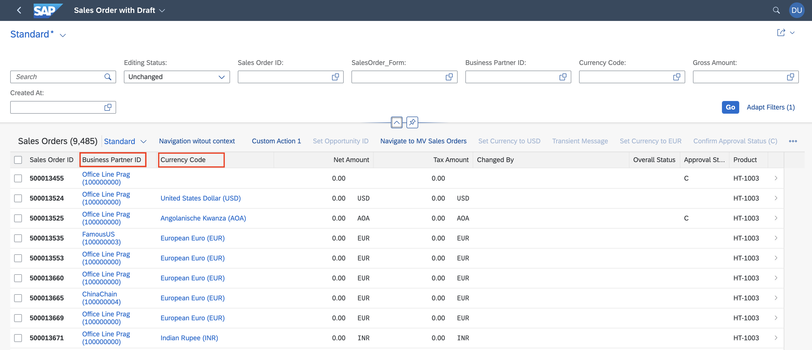

<!-- loioa76525362b754354a85981a7389ca7af -->

# Setting the Default Column Width

You can customize the width of a column defined in a line item using the `com.sap.vocabularies.HTML5.v1.CssDefaults` UI annotation.

SAP Fiori elements automatically calculates the default width of columns. The calculation algorithm takes into account numerous metadata parameters such as type, column label, referenced properties and text arrangement. Providing a more precise `maxLength` value for the String type or `Precision` value for numeric types can help this algorithm to produce better results. The lower limit is set to 3 rem and the upper limit is set to 20 rem.

The default width of columns containing different controls/UI elements is as follows:

****


<table>
<tr>
<th valign="top">

Columns with Controls/UI Elements

</th>
<th valign="top">

Default Width

</th>
</tr>
<tr>
<td valign="top">

Images

</td>
<td valign="top">

5 rem

</td>
</tr>
<tr>
<td valign="top">

Rating indicator

</td>
<td valign="top">

6.875 rem

</td>
</tr>
<tr>
<td valign="top">

Progress indicator

</td>
<td valign="top">

6.875 rem

</td>
</tr>
<tr>
<td valign="top">

Charts

</td>
<td valign="top">

20 rem

</td>
</tr>
</table>

-   Using the `CssDefaults` annotation

    The sample code below shows how to set the column width using the `com.sap.vocabularies.HTML5.v1.CssDefaults` annotation.

    > ### Sample Code:  
    > XML Annotation
    > 
    > ```xml
    > 
    > <Annotation Term="UI.LineItem">
    >     <Collection>
    >         <Record Type="UI.DataFieldWithIntentBasedNavigation">
    >             <PropertyValue Property="SemanticObject" String="EPMSalesOrder" />
    >             <PropertyValue Property="Action" String="display_sttabupa" />
    >             <PropertyValue Property="Value" Path="bp_id" />
    >                 <Annotation Term="com.sap.vocabularies.HTML5.v1.CssDefaults">
    >                     <Record>
    >                         <PropertyValue Property="width" String="10rem"/>
    >                     </Record>
    >                 </Annotation>
    >         </Record>
    >         <Record Type="UI.DataField">
    >             <PropertyValue Property="Value" Path="currency_code" />
    >                 <Annotation Term="com.sap.vocabularies.HTML5.v1.CssDefaults">
    >                     <Record>
    >                         <PropertyValue Property="width" String="15rem"/>
    >                     </Record>
    >                 </Annotation>
    >         </Record>
    >     </Collection>
    > </Annotation>
    > ```

    > ### Sample Code:  
    > CAP CDS Annotation
    > 
    > ```
    > LineItem : {
    > 	{
    > 		$Type : 'UI.DataFieldForIntentBasedNavigation',
    > 		SemanticObject : 'EPMSalesOrder',
    > 		Action : 'display_sttabupa',
    > 		Value: 'bp_id',
    > 		Label : 'IBN',
    > 		![@HTML5.CssDefaults] : {width : '10rem'}
    > 	},
    > 	{
    > 		$Type : 'UI.DataField',
    > 		Value : currency_code,
    > 		![@HTML5.CssDefaults] : {width : '15rem'}
    > 	},
    > }
    > 
    > ```

-   Using the `manifest.json` configuration

    You can also configure the width of a column in the manifest:

    > ### Sample Code:  
    > `manifest.json`
    > 
    > ```
    > "controlConfiguration": {
    >     "_Item/@com.sap.vocabularies.UI.v1.LineItem": {
    >         "columns": {
    >             "DataField::SalesOrderItemCategory": {
    >                 "width": "10em"
    > 		    }
    >         }
    >     }
    > }
    > 
    > ```

    The column key \(`"DataField::SalesOrderItemCategory"` in our sample code above\) is used to identify the column for which you want to set the width.




> ### Note:  
> -   When the application is rendered in mobile phones, the table column width is adjusted automatically so that the displayed columns can occupy the complete available width.
> 
> -   You can use em, rem, or % \(relative to the table width\) to specify the width of a column using a `CssDefaults` annotation or settings in the `manifest.json`.


<a name="loioa76525362b754354a85981a7389ca7af__section_cn3_qx3_31c"/>

## Additional Features in SAP Fiori Elements for OData V2


### Including Column Label in Column Width Calculation

You can include the column label while calculating the default width by setting `widthIncludingColumnHeader` to `true` in the `manifest.json` file:

> ### Sample Code:  
> manifest.json
> 
> ```
> "settings": {
>                         "tableSettings": {
>                             "multiEdit": {
>                                 "enabled": true
>                             },
>                             "widthIncludingColumnHeader": true
>                         },
>                         "columns": {
>                             "com.sap.vocabularies.UI.v1.DataFieldWithIntentBasedNavigation::bp_id": {
>                                 "widthIncludingColumnHeader": true
>                             },
>                             "com.sap.vocabularies.UI.v1.DataField::gross_amount" : {
>                                 "widthIncludingColumnHeader": true
>                             }
>                         }
>                     }
> ```


<a name="loioa76525362b754354a85981a7389ca7af__section_pgy_jcd_gsb"/>

## More Information

For more information about how to find the right key for a column, see [Finding the Right Key for the Anchor](finding-the-right-key-for-the-anchor-6ffb084.md).

For information about custom columns in list reports and object pages, see [Extension Points for Tables](extension-points-for-tables-d525522.md).

