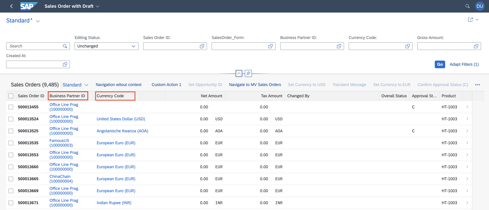

<!-- loioa76525362b754354a85981a7389ca7af -->

# Setting the Default Column Width

Column width configurations allow you to override automatic width calculations using the `CssDefaults` annotations or manifest settings in SAP Fiori elements for OData V4. Use this to optimize table layouts with rem, em, or percentage-based measurements.

SAP Fiori elements for OData V4 automatically calculates the default width of columns. The calculation algorithm takes into account numerous metadata parameters such as type, column label, referenced properties and text arrangement. Providing a more precise `maxLength` value for the String type or `Precision` value for numeric types can help this algorithm to produce better results. The lower limit is set to 3 rem and the upper limit is set to 20 rem.

The default width of columns containing different controls/UI features is as follows:

**Default Column Width by Content**


<table>
<tr>
<th valign="top">

Controls/UI Features in the Column

</th>
<th valign="top">

Default Column Width

</th>
</tr>
<tr>
<td valign="top">

Images

</td>
<td valign="top">

6.2 rem

</td>
</tr>
<tr>
<td valign="top">

Rating indicator

</td>
<td valign="top">

1.375 rem multiplied by the number of stars

</td>
</tr>
<tr>
<td valign="top">

Progress indicator

</td>
<td valign="top">

5 rem

</td>
</tr>
<tr>
<td valign="top">

Charts

</td>
<td valign="top">

-   XS: 4.4 rem

-   S: 4.6 rem

-   M: 5.5 rem

-   L: 6.9 rem


</td>
</tr>
</table>

The following screenshot shows two columns with the width of 10 rem and 15 rem, respectively:

  
  
**Columns With Different Width in a Table**



You can specify the width of a column using a `CssDefaults` annotation or settings in the `manifest.json` file.

> ### Note:  
> -   When the application is rendered in mobile phones, the table column width is adjusted automatically so that the displayed columns can occupy the complete available width.
> 
> -   You can use em, rem, or % \(relative to the table width\) to specify the column width.


## Setting the Column Width Using Annotations

You can set the column width using annotations. To do so, use the `com.sap.vocabularies.HTML5.v1.CssDefaults` annotation under `UI.LineItem` as shown in the following sample code:

> ### Sample Code:  
> XML Annotation
> 
> ```xml
> 
> <Annotation Term="UI.LineItem">
>     <Collection>
>         <Record Type="UI.DataFieldWithIntentBasedNavigation">
>             <PropertyValue Property="SemanticObject" String="EPMSalesOrder" />
>             <PropertyValue Property="Action" String="display_sttabupa" />
>             <PropertyValue Property="Value" Path="bp_id" />
>                 <Annotation Term="com.sap.vocabularies.HTML5.v1.CssDefaults">
>                     <Record>
>                         <PropertyValue Property="width" String="10rem"/>
>                     </Record>
>                 </Annotation>
>         </Record>
>         <Record Type="UI.DataField">
>             <PropertyValue Property="Value" Path="currency_code" />
>                 <Annotation Term="com.sap.vocabularies.HTML5.v1.CssDefaults">
>                     <Record>
>                         <PropertyValue Property="width" String="15rem"/>
>                     </Record>
>                 </Annotation>
>         </Record>
>     </Collection>
> </Annotation>
> ```

> ### Sample Code:  
> CAP CDS Annotation
> 
> ```
> LineItem : {
>     {
>         $Type : 'UI.DataFieldForIntentBasedNavigation',
>         SemanticObject : 'EPMSalesOrder',
>         Action : 'display_sttabupa',
>         Value: 'bp_id',
>         Label : 'IBN',
>         ![@HTML5.CssDefaults] : {width : '10rem'}
>     },
>     {
>         $Type : 'UI.DataField',
>         Value : currency_code,
>         ![@HTML5.CssDefaults] : {width : '15rem'}
>     },
> }
> 
> ```


## Setting the Column Width in the Manifest

You can also configure the width of a column in the `manifest.json` file as shown in the following sample code:

> ### Sample Code:  
> `manifest.json`
> 
> ```
> "controlConfiguration": {
>     "_Item/@com.sap.vocabularies.UI.v1.LineItem": {
>         "columns": {
>             "DataField::SalesOrderItemCategory": {
>                 "width": "10em"
>             }
>         }
>     }
> }
> 
> ```

Use the column key \(`"DataField::SalesOrderItemCategory"` in the previous sample code\) to identify the column for which you want to set the width.


<a name="loioa76525362b754354a85981a7389ca7af__section_pgy_jcd_gsb"/>

## More Information

For more information about how to find the right key for a column, see [Finding the Right Key for the Anchor](finding-the-right-key-for-the-anchor-6ffb084.md).

For information about custom columns on list report pages and object pages, see [Extension Points for Tables](extension-points-for-tables-d525522.md).


> ### Note:  
> For information about SAP Fiori elements for OData V2, see [Setting the Default Column Width](setting-the-default-column-width-cd262f2.md).

