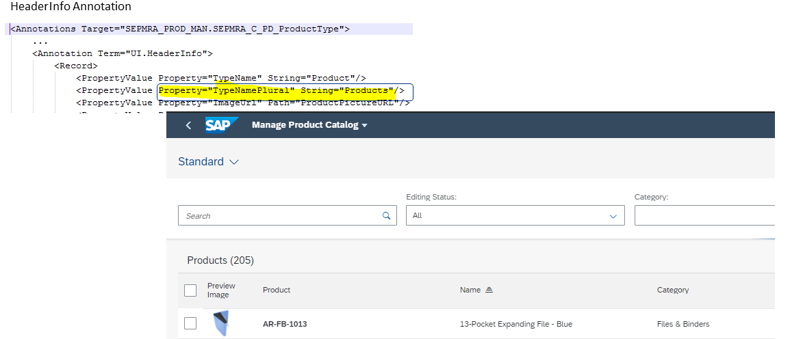

<!-- loiob224570e3291419eb49276d0f4f9c384 -->

# Setting the Table Header

You can set the header of the table with `com.sap.vocabularies.UI.v1.HeaderInfo TypeNamePlural`.

> ### Note:  
> For information about SAP Fiori elements for OData V4, see [Setting the Table Header](setting-the-table-header-f996207.md).

  
  
**List Report Page: Header**




<a name="loiob224570e3291419eb49276d0f4f9c384__section_edw_lnt_21c"/>

## Defining and Hiding the Table Header

You can define the table header text and control the visibility of the header text using the `header` and `headerVisible` settings in `manifest.json`. The header setting specifies the text displayed in the table header. If `headerVisible` is set to `true`, the header text is shown in the table. If `headerVisible` is set to `false`, the header text is not shown.

> ### Sample Code:  
> `manifest.json`
> 
> ```
> 
> "sap.ui5": {
>     "routing": {
>         "targets": {
>             "SalesOrderManageList": {
>                 "options": {
>                     "settings": {
>                         "controlConfiguration": {
>                             "@com.sap.vocabularies.UI.v1.LineItem": {
>                                 "tableSettings": {
>                                     "header": "Another header",
>                                     "headerVisible": true
>                                 }
>                             }
>                         }
>                     }
>                 }
>             },
>             "SalesOrderManageObjectPage": {
>                 "options": {
>                     "settings": {
>                         "controlConfiguration": {
>                             "_Partner/@com.sap.vocabularies.UI.v1.LineItem": {
>                                 "tableSettings": {
>                                     "header": "Another header for the Partners",
>                                     "headerVisible": true
>                                 }
>                             },
>                             "_Item/@com.sap.vocabularies.UI.v1.LineItem": {
>                                 "tableSettings": {
>                                     "headerVisible": false
>                                 }
>                             }
>                         }
>                     }
>                 }
>             }
>         }
>     }
> }
> ```

