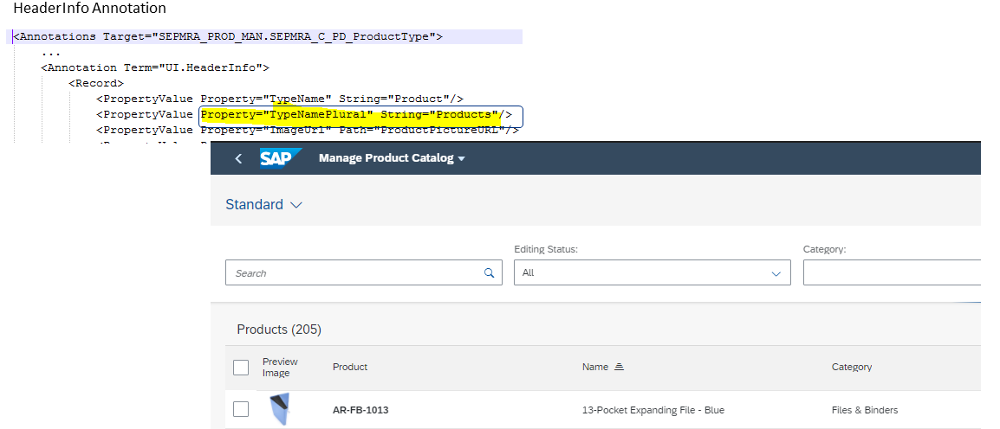

<!-- loiof9962074132a43db9e1381291f8f3af8 -->

# Setting the Table Header

The header of the table is set using `com.sap.vocabularies.UI.v1.HeaderInfo TypeNamePlural`.

  
  
**List Report: Page Header**

  

