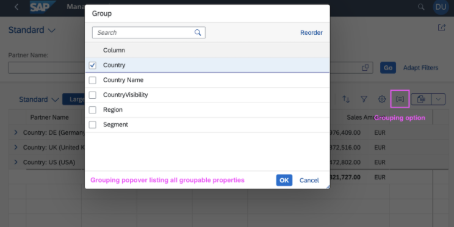

<!-- loio7f844f1021cd4791b8f7408eac7c1cec -->

# Setting the Table Type

In the `manifest.json` file, and through annotations, you can control which table type is rendered in the list report and on the object page.

These are the `type` properties available within `tableSettings`:

-   `ResponsiveTable`
-   `GridTable`
-   `AnalyticalTable`


<a name="loio7f844f1021cd4791b8f7408eac7c1cec__section_bqd_r2f_dmb"/>

## Additional Features in SAP Fiori Elements for OData V2

The following logic is used to determine the table type of an analytical list page \(ALP\) and a list report:

-   If the table type is specified in the manifest:

    If the table type is specified and set to analytical, but the `entitySet` doesn’t have analytical capabilities, a grid table is used as the fallback option. Otherwise, the table is created with the specified table type.

-   If the table type is **not** specified in the manifest, the default table type is determined as follows:

    -   For smartphone and tablet devices, a responsive table is used.

    -   For desktop devices, an analytical table is used if the service is an aggregate-based service.

    -   For a non-aggregate-based service, a responsive table is used.

    -   For an aggregate-based service, an analytical table is used.


> ### Tip:  
> For more information about the guidelines and restrictions that apply to grid tables, see [SAP Fiori Design Guidelines](https://experience.sap.com/fiori-design-web/grid-table/).

In addition to using the `manifest.json` file, you can also use annotations to control which table type is rendered in the list report and on the object page.

The additional `type` property available within `tableSettings` is:

-   `TreeTable`

> ### Note:  
> -   On smart phones, responsive tables are shown.
> 
> -   List report only: If the `type` property within `tableSettings` is `AnalyticalTable`, set the annotation `sap:semantics` to `aggregate` for the specified entity type. Note that `sap:semantics` is a back-end entity type definition and can't be changed in the SAP Web IDE.
> 
> -   If you don't maintain the `type` property within `tableSettings` , and if `sap:semantics` to `aggregate` has been set in the back end, an analytical table is rendered.


### Examples

Set the `type` property within `tableSettings` to the required value in the `sap.ui.generic.app` section of the `manifest.json`:

Example for the list report:

```js
"sap.ui.generic.app": {
			"pages": [{
				"entitySet": "Zfarvd_Bs_Hd_Bo",
				"component": {
					"name": "sap.suite.ui.generic.template.ListReport",
					"list": true,
					"settings": {
						"tableSettings": {
							"type": "GridTable"
							}
					}
				},	
```

Examples for the object page:

```js
"sap.ui.generic.app": {
        "pages": [
            {
                "entitySet": "STTA_C_MP_Product",
                "component": {
                    "name": "sap.suite.ui.generic.template.ListReport",
                    "list": true
                },
                "pages": [
                    {
                        "entitySet": "STTA_C_MP_Product",
                        "component": {
                            "name": "sap.suite.ui.generic.template.ObjectPage"
                            "settings": {
                                "sections": {
                                    "to_ProductText::com.sap.vocabularies.UI.v1.LineItem": {
                                        "navigationProperty": "to_ProductText",
                                        "entitySet": "STTA_C_MP_ProductText",
                                        "tableSettings": {
								      "type": "TreeTable"
								 }
                                    }
                                }
                            }
                        },
```

Defining `tableTypes` under the settings is supported for backward compatibility. However, using `tableSettings` is recommended for defining table types.

> ### Note:  
> If you maintain the `type` property within `tableSettings` in `sections`, it has a higher priority than the `type` property of `tableSettings` in an object page.

```js
"pages": [{
                "entitySet": "STTA_C_MP_Product",
                "component": {
                    "name": "sap.suite.ui.generic.template.ObjectPage",
                    "settings": {
                        "showRelatedApps": true,
                        "tableSettings": {
                            "type":"ResponsiveTable"
                        },
                        "sections": {
                            "to_ProductText::com.sap.vocabularies.UI.v1.LineItem": {
                                "navigationProperty": "to_ProductText",
                                "entitySet": "STTA_C_MP_ProductText",
                                "tableSettings": {
                                    "type":"GridTable"
                                }
                            }
                        }
                    }

```


<a name="loio7f844f1021cd4791b8f7408eac7c1cec__section_dw3_vks_mlb"/>

## Additional Features in SAP Fiori Elements for OData V4

The following logic is used to determine the table type of an analytical list page \(ALP\) and a list report:

-   If the table type is specified in the manifest:

    If the table type is specified and set to analytical, but the `entitySet` doesn’t have analytical capabilities, an empty table is displayed. Otherwise, the table is created with the specified table type.

-   If the table type is **not** specified in the manifest, the `ResponsiveTable` is used by default.


> ### Tip:  
> For more information about the guidelines and restrictions that apply to grid tables, see [SAP Fiori Design Guidelines](https://experience.sap.com/fiori-design-web/grid-table/).

In the `manifest.json` file, you can control which table type is rendered in the list report and on the object page.


### Examples

Set the `type` property within `tableSettings` to the required values in *sap.ui5:* \> *routing:* \> *targets* of the `manifest.json` file.

Example for the list report:

> ### Sample Code:  
> ```
> "targets": {
>      "SalesOrderManageList": {
>           "type": "Component",
>           "id": "SalesOrderManageList",
>           "name": "sap.fe.templates.ListReport",
>           "options": {
>                "settings" : {
>                     "controlConfiguration" : {
>                          "@com.sap.vocabularies.UI.v1.LineItem" : {
>                               "tableSettings": {
>                                    "type": "ResponsiveTable"
>                                }
>                          }
>                     }
>                     ...
>                }
>           }
>      }
> }
> ```

Example for the object page:

> ### Sample Code:  
> ```
> "targets": {
>      "SalesOrderManageObjectPage": { 
>           "type": "Component", 
>           "id": "SalesOrderManageObjectPage", 
>           "name": "sap.fe.templates.ObjectPage", 
>           "options": { 
>                "settings": { 
>                     "controlConfiguration": { 
>                          "_Item/@com.sap.vocabularies.UI.v1.LineItem": { 
>                               "tableSettings": { 
>                                    "type": "GridTable" 
>                               } 
>                          } 
>                     } 
>                } 
>           }
>      }
> } 
> ```


### How to Annotate Your Service as an Analytical Service

To set the analytical capabilities of your service or entity, use the `Aggregation.ApplySupported` annotation at the entity set level.

> ### Sample Code:  
> XML Annotation
> 
> ```xml
> <Annotations Target="sap.fe.managepartners.ManagePartnersService.Customers">
>    <Annotation Term="Aggregation.ApplySupported">
>    </Annotation>
> </Annotations>
> ```

> ### Sample Code:  
> CAP CDS Annotation
> 
> ```
> // at root level of your entity
> @Aggregation.ApplySupported : {
> }
> ```

The analytical table renders data that can be grouped and aggregated.

-   How to Define Groupable Properties

    The analytical table offers the possibility to group rows based on groupable properties. You must define which properties are groupable so that the table allows to group on the relevant properties.

    To annotate a set of properties as groupable, add it to the `GroupableProperties` annotation:

    > ### Sample Code:  
    > XML Annotation
    > 
    > ```xml
    > <Annotations Target="sap.fe.managepartners.ManagePartnersService.Customers">
    >    <Annotation Term="Aggregation.ApplySupported">
    >    <PropertyValue Property="GroupableProperties">
    >         <Collection>
    >             <PropertyPath>Segment</PropertyPath>
    >             <PropertyPath>Country</PropertyPath>
    >         </Collection>
    >    </PropertyValue>
    >    </Annotation>
    > </Annotations>
    > ```

    > ### Sample Code:  
    > CAP CDS Annotation
    > 
    > ```
    > @Aggregation.ApplySupported : {
    >     GroupableProperties: [Segment, Country]
    > }
    > ```

    Users can then group rows of the table:

      

-   How to Define Aggregable Properties

    The properties can also be annotated as aggregable \(measures\). To do so, at the entity level you must also define the `Aggregation.CustomAggregate` annotation, which has the property name as the qualifier:

    > ### Sample Code:  
    > XML Annotation
    > 
    > ```xml
    > <Annotations Target="sap.fe.managepartners.ManagePartnersService.BusinessPartners/SalesAmount">
    >     <Annotation Term="Aggregation.default" EnumMember="Aggregation.defaultType/SUM"/>
    >     <Annotation Term="Analytics.Measure" Bool="true"/>
    > </Annotations>
    >  
    > // At the entity level you must also define the Aggregation.CustomAggregate annotation which has the property name as the qualifier: 
    > <Annotations Target="sap.fe.managepartners.ManagePartnersService.EntityContainer">
    >     <Annotation Term="Aggregation.CustomAggregate" Qualifier="SalesAmount" String="Edm.Decimal"/>
    > </Annotations>
    > ```

    > ### Sample Code:  
    > CAP CDS Annotation
    > 
    > ```
    > SalesAmount @Analytics.Measure : true @Aggregation.default : #SUM; //use the aggregation function you want
    > // At the entity level you must also define the Aggregation.CustomAggregate annotation which has the property name as the qualifier: 
    > @Aggregation.CustomAggregate #SalesAmount : 'Edm.Decimal'
    > ```

    > ### Caution:  
    > The analytical table displays only properties that are annotated as groupable and/or aggregable. Otherwise, the property won't be requested and will have no value in the table.

-   How to Enable and Disable the *Search* Field

    You can use the `Transformation` annotation to enable and disable the *Search* field in an analytical table \(as well as in a chart\). You enable the *Search* field by listing it in the corresponding annotation. If you don't specify any transformation, the *Search* field is enabled by default. This is shown in the following sample code:

    > ### Sample Code:  
    > XML Annotation
    > 
    > ```xml
    > <Annotations Target="sap.fe.managepartners.ManagePartnersService.Customers">
    >      <Annotation Term="Aggregation.ApplySupported">
    >           <Record Type="Aggregation.ApplySupportedType">
    >                <PropertyValue Property="Transformations">
    >                     <Collection>
    >                          <String>search</String>
    >                          <String>topcount</String>
    >                          <String>bottomcount</String>
    >                          <String>identity</String>
    >                          ...
    >                     </Collection>
    >                </PropertyValue>
    >           </Record>
    >       </Annotation>
    > </Annotations>
    > ```

    > ### Sample Code:  
    > CAP CDS Annotation
    > 
    > ```
    > @Aggregation.ApplySupported : {
    >    Transformations : [
    >       'search',
    >       'topcount',
    >       'bottomcount',
    >       'identity',
    >       ...
    >    ],
    > }
    > ```


> ### Restriction:  
> -   Analytical tables support draft-enabled services. But you must avoid editing them since tables always reflect the active state of entities.
> 
> -   Analytical tables don’t support navigation properties, so if you include them through a `LineItem`, an empty column is displayed. You also cannot add navigation properties through the table personalization settings.
> 
> -   You can't use aggregable properties to filter the data on analytical tables.


### How to Set Transformation Filters on Aggregate Controls

SAP Fiori elements for OData V4 assumes that the back end supports transformation filters for aggregate controls, such as analytical tables. For more information about transformation filters, see [OData Extension for Data Aggregation Version 4.0](http://docs.oasis-open.org/odata/odata-data-aggregation-ext/v4.0/cs01/odata-data-aggregation-ext-v4.0-cs01.html).

> ### Note:  
> You must ensure the following:
> 
> -   The back end supports transformation filters for aggregate controls.
> 
> -   The following annotations must be added for aggregate entities:
> 
>     > ### Sample Code:  
>     > XML Annotation
>     > 
>     > ```
>     > <Annotations Target="sap.fe.managepartners.ManagePartnersService.Customers">
>     >      <Annotation Term="Aggregation.ApplySupported">
>     >           <Record Type="Aggregation.ApplySupportedType">
>     >                <PropertyValue Property="Transformations">
>     >                     <Collection>
>     >                          <String>filter</String>
>     >                          ...
>     >                     </Collection>
>     >                </PropertyValue>
>     >           </Record>
>     >       </Annotation>
>     > </Annotations>
>     > ```
> 
>     > ### Sample Code:  
>     > CAP CDS Annotation
>     > 
>     > ```
>     > @Aggregation.ApplySupported : {
>     >    Transformations : [
>     >       'filter',
>     >       ...
>     >    ],
>     > }
>     > 
>     > ```


<a name="loio7f844f1021cd4791b8f7408eac7c1cec__section_ipf_sff_dmb"/>

## More Information

For a description of the available table types, see [Tables](tables-c0f6592.md).

For information about setting up tables in the list report through annotations, see [Settings for List Report Tables](settings-for-list-report-tables-4c2d17a.md).

For information about setting up tables in the object page, see [Settings for Object Page Tables](settings-for-object-page-tables-47425bb.md).

For information about table groupings, see [Table Groupings](table-groupings-d344c5a.md).

