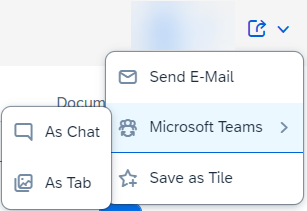

<!-- loio022bf0dcae1d4d90961ebe23d642fca3 -->

# "Share" Functionality

The "share" functionality allows users to share the current application state using options such as *Send Email* and *Save as Tile*.

-   *Send Email*

    When a user chooses this option, the link to the page opens in the default email client that is configured in the system. When a user chooses the link, the application page opens in the same state in which it was shared: filter settings, personalization options, and selections for charts and tables, as well app-specific button states such as the filter mode or view mode, are all transferred.

-   *Share in SAP Jam*

    You can also share the current application state using *Share in SAP Jam*. A dialog appears to allow users to select an existing Jam group, comments can be added, and Jam users can be tagged. Please note that this option is only available on platforms that are integrated with SAP Jam.

-   *Save as Tile*

    When a user chooses this option, the corresponding *Save as Tile* dialog is displayed. When a user chooses the tile, the application page opens in the same state in which the tile was created. Application developers can customize the title and the sub-title of the tile. In the list report, a dynamic tile with a record count is created, where the applied filter is also taken into account.

-   *Share Menu: Microsoft Teams*

      

    When a user clicks the *Share* button and then the *Share Menu: Microsoft Teams* option, a separate window opens with the available sharing options:

    -   As Chat

        Collaborate and quickly resolve issues, if necessary, simply by using Microsoft Teams chat to share a direct link with co-workers. You can provide them with access to a specific state of an SAP Fiori application, for example, so they can easily process any requests you have or tasks that come up.

    -   As Tab

        Work efficiently with a group of co-workers on specific content that you share in the form of a Microsoft Teams tab. Use the Microsoft Teams environment to work on the same context of an SAP Fiori application, and use the tab conversation option in parallel to share ideas, discuss, and collaborate.


    Please note the following:

    -   The *Share Menu: Microsoft Teams* option is only available if the required settings have been made by the system administrators of SAP S/4HANA Cloud.

        For more information, see [Integrating Microsoft Teams](https://help.sap.com/docs/SAP_S4HANA_CLOUD/0f69f8fb28ac4bf48d2b57b9637e81fa/257ec7408db6420682462cd1d000e744.html).

    -   The *Share Menu: Microsoft Teams* option is part of collaborative ERP \(enterprise resource planning\), which integrates the best of SAP S/4HANA Cloud with Microsoft Teams. So this option is not available for all users.


> ### Note:  
> -   The "share" functionality is available for the list report, object page, and subobject page.
> 
> -   For applications using the flexible column layout, the "share" functionality is shown on the highest view level.
> 
> -   A dynamic tile is not created if the filter bar contains a semantic date. For more information about the semantic date range, see [Enabling Semantic Operators in the Filter Bar](enabling-semantic-operators-in-the-filter-bar-fef65d0.md).
> 
> -   The "share" functionality is not available for newly created objects in draft mode, so the button is not visible.
> 
> -   In SAP Fiori elements for OData V2, for draft objects with an existing active instance the "share" functionality will directly share the URL of the active instance.
> 
>     In SAP Fiori elements for OData V4, for draft objects with an existing active instance the "share" functionality will use the semantic bookmarking feature \(see the corresponding section in this topic below\), but if semantic keys are not defined then the URL of the active instance is shared.


<a name="loio022bf0dcae1d4d90961ebe23d642fca3__section_t52_jql_ymb"/>

## Additional Features in SAP Fiori Elements for OData V2

The "share" functionality is hidden for the creation pages of non-draft objects.

During tile creation, you can change the tile type from dynamic to static using an extension. For more information, see [Extending the Bookmark Function to Save Static Tiles to the SAP Fiori Launchpad](extending-the-bookmark-function-to-save-static-tiles-to-the-sap-fiori-launchpad-7e34ea9.md).


<a name="loio022bf0dcae1d4d90961ebe23d642fca3__section_r4n_lql_ymb"/>

## Additional Features in SAP Fiori Elements for OData V4

\- Send Email -

You can also use controller extension methods to change the subject line of the email.

For information about the `controllerextensions.Share` API, see the [API Reference](https://ui5.sap.com/#/api/sap.fe.core.controllerextensions.Share).

Make the following changes in the `manifest.json` file:

> ### Sample Code:  
> ```
> "sap.ui5": {
>         "extends": { 
>             "extensions": {
>                 "sap.ui.controllerExtensions": {
>                     "sap.fe.templates.ObjectPage.ObjectPageController": {
>                         "controllerName": "SalesOrder.custom.OPExtend"
>                     }
>                 }
>             }
>         },
> ```

Make the following changes in the `OPExtend.controller.js` file:

> ### Sample Code:  
> ```
> sap.ui.define(["sap/ui/core/mvc/ControllerExtension"], function(ControllerExtension) {
>         "use strict";
>         return ControllerExtension.extend("SalesOrder.custom.OPExtend", {
>             // this section allows to extend lifecycle hooks or override public methods of the base controller
>             override: {
>                onInit: function() {},
>                share: {
>                     adaptShareMetadata: function(oShareMetadata) {
>                         oShareMetadata.email.title = "test email subject"; // customise or change email subject
>                         return oShareMetadata;
>                     }
>                 }
>             }
>         });
>     }
> );
> ```

\- Semantic Bookmarking -

Semantic bookmarking enables the sharing of an object page even while it is being edited by a user, that is, even when the object page has the status `draft`.

When a user clicks on the chevron in a list report table and navigates to an object page, the URL contains technical keys or semantic keys \(depending on whether the application developer has defined semantic keys in the metadata for the entity set of the list report\).

Here’s an annotation snippet showing the semantic key annotation:

> ### Sample Code:  
> XML Annotation
> 
> ```xml
> <Annotation Term="Common.SemanticKey">
>    <Collection>
>       <PropertyPath>SalesOrder</PropertyPath>
>    </Collection>
> </Annotation>
> ```

> ### Sample Code:  
> ABAP CDS Annotation
> 
> ```
> 
> @ObjectModel: {
>   semanticKey: [ 'SalesOrder' ]
> }
> 
> define view SALESORDERMANAGE {
> 
> }
> ```

> ### Sample Code:  
> CAP CDS Annotation
> 
> ```
> 
> Common.SemanticKey : [
>     SalesOrder
> ],
> ```

If the application developer does not define the annotations for the semantic keys, the URL contains only the technical keys. In this case, if user A shares the URL via the "share" functionality with user B, user B will only be able to open the list report page if user A shares while being in display mode. If user A is already in edit mode when the URL is shared, then user B will not be able to open the link, since user B cannot access the draft of user A.

If, however, the application developer has defined semantic keys, the URL only contains semantic keys. In this case, user B will be able to open the shared URL, irrespective of whether user A shares the active copy \(display mode\) or the draft copy \(edit mode\). If user A shares the draft copy, then user B sees the corresponding active copy of the object.

> ### Note:  
> Semantic bookmarking is currently not supported in the following cases:
> 
> -   for subobject pages
> 
> -   if not all of the semantic keys defined for the entity set are part of the available context
> 
> 
> In these cases, changing to edit mode results in the technical keys being added to the URL. If user A now shares the URL while in edit mode, then user B will not be able to open the link, since user B cannot access the draft of user A for the same record.

