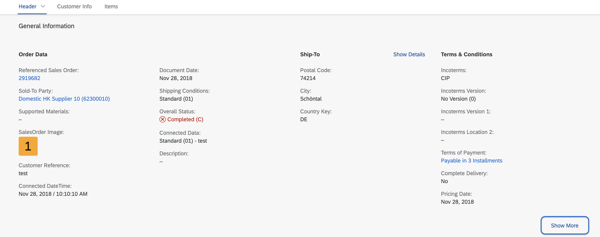
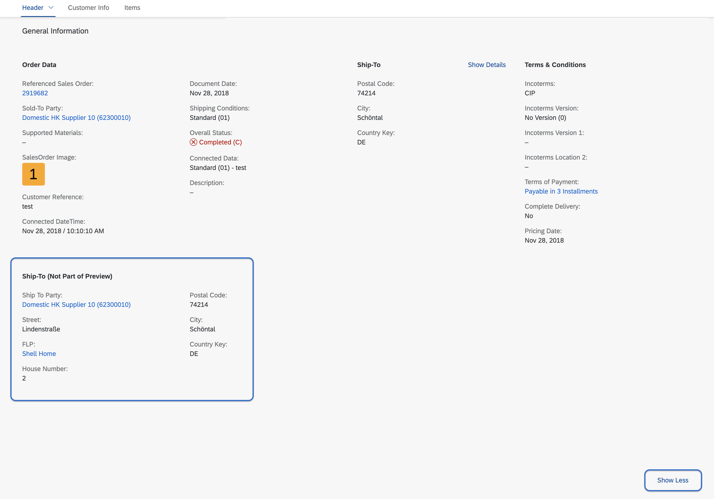
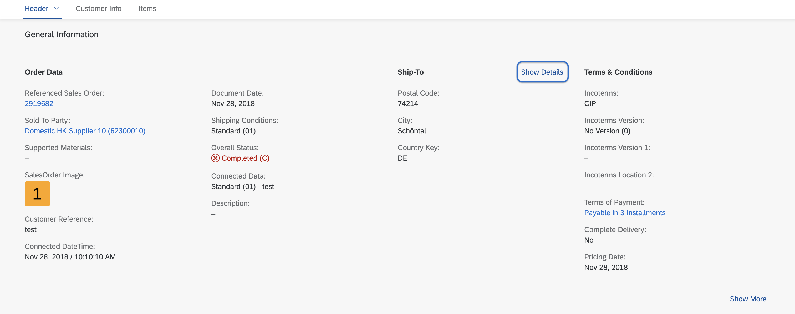
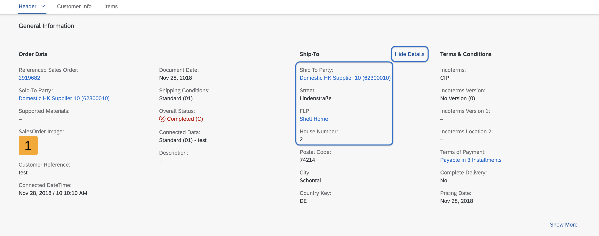

<!-- loio9fcea86d8ffd48459dd053eb5255a046 -->

# Showing and Hiding Content in Object Page Facets

You can show or hide reference facets on the UI using the *Show More* and *Show Less* buttons, and show or hide fields inside reference facets using the *Show Details* and *Hide Details* buttons.


<a name="loio9fcea86d8ffd48459dd053eb5255a046__section_tyc_fb1_ppb"/>

## Showing and Hiding Reference Facets Using *Show More* and *Show Less* Buttons

The *Show More* button appears in the bottom right corner if hidden facets are available.

   
  
**Show More**

  

The *Show Less* button appears in the bottom right corner if a user has clicked the *Show More* button, allowing users to hide the additional information.

   
  
**Show Less**

  

To enable this feature, set the `UI.PartOfPreview` annotation of the relevant reference facet to `false`, as shown in the following sample code:

> ### Tip:  
> If you don't set this annotation explicitly, the system uses the default setting, where `UI.PartOfPreview` equals `true`.

> ### Sample Code:  
> XML Annotation
> 
> ```xml
> <Record Type="UI.ReferenceFacet">
>     <PropertyValue Property="Label" String="{@i18n>@ShipToAddress}"/>
>     <PropertyValue Property="ID" String="ShipToAddress"/>
>     <PropertyValue Property="Target"
>     AnnotationPath="@UI.FieldGroup#ShipToAddress"/>
>     <Annotation Term="UI.PartOfPreview" Bool="false"/>
> </Record>
> ```

> ### Sample Code:  
> ABAP CDS Annotation
> 
> ```
> @UI.Facet: [{
>         type: #FIELDGROUP_REFERENCE,
>         label: 'Ship-To Address',
>         targetQualifier: 'ShipToAddress',
>         isPartOfPreview: false
> }]
> 
> ```

> ### Sample Code:  
> CAP CDS Annotation
> 
> ```
> Facets: [{
>     $Type : 'UI.ReferenceFacet',
>     Label : '{@i18n>@ShipTo_NotPartOfPreview}',
>     Target : '@UI.FieldGroup#ShipToAddress',
>     ![@UI.PartOfPreview] : false
> }]
> ```

> ### Note:  
> This feature is available for reference facets that are implemented under a collection facet.


<a name="loio9fcea86d8ffd48459dd053eb5255a046__section_d3n_xzs_qrb"/>

## Additional Features in SAP Fiori Elements for OData V4

You can show or hide fields and tables inside reference facets on the UI using the *Show Details* and *Hide Details* buttons.

The *Show Details* button appears in the facet toolbar if hidden fields and tables are available:

  

The *Hide Details* button appears in the facet toolbar if the user has clicked the *Show Details* button. This allows users to hide the additional information again.

  

To enable this feature, set the `UI.PartOfPreview` annotation of the relevant reference facet to `false`, as shown in the following sample code:

> ### Tip:  
> If you don't set this annotation explicitly, the system uses the default setting, where `UI.PartOfPreview` equals `true`.

> ### Sample Code:  
> XML Annotation
> 
> ```xml
> <Record Type=“UI.DataField”>
>     <PropertyValue Property=“Label” String=“{@i18n>@StreetName}” />
>     <PropertyValue Property=“Value” Path=“StreetName” />
>     <Annotation Term=“UI.PartOfPreview” Bool=“false” />
> </Record>
> ```

> ### Sample Code:  
> ABAP CDS Annotation
> 
> No ABAP CDS annotation sample is available. Use the local XML annotation.

> ### Sample Code:  
> CAP CDS Annotation
> 
> ```
> FieldGroup#ShipToAddress: {
>     Data: [{
>             $Type                : 'UI.DataField',
>             Label                : '{@i18n>@StreetName}',
>             Value                : StreetName,
>             ![@UI.PartOfPreview] : false
>     }]
> }
> ```

> ### Note:  
> This feature is available for tables and data fields that are included in a visible reference facet. You can't use this feature for tables and data fields that are part of a reference facet that is initially hidden. This means that nesting of the `UI.PartOfPreview` annotation isn't possible.


### Using *Show More* and *Show Less* Buttons

> ### Restriction:  
> This feature is applicable only to reference facets that have a `FieldGroup` as their target, for instance, a form representation. This feature isn't applicable to other target types, for instance, reference facets that point to a table or a chart.

