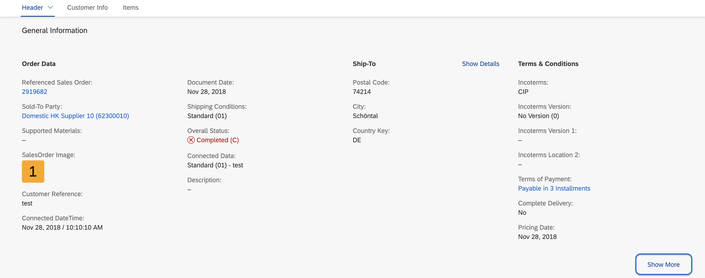
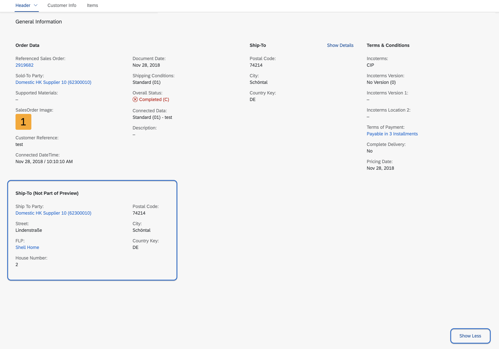

<!-- loiodaef89aa6c7e4557a045375f2ceb4890 -->

# Showing and Hiding Content in Object Page Facets

You can show or hide reference facets on the UI using the *Show More* and *Show Less* buttons, and show or hide fields inside reference facets using the *Show Details* and *Hide Details* buttons.


> ### Note:  
> For information about SAP Fiori elements for OData V4, see [Showing and Hiding Content in Object Page Facets](showing-and-hiding-content-in-object-page-facets-9fcea86.md).


<a name="loiodaef89aa6c7e4557a045375f2ceb4890__section_tyc_fb1_ppb"/>

## Showing and Hiding Reference Facets Using *Show More* and *Show Less* Buttons

The *Show More* button appears in the bottom right corner if hidden facets are available.

  
  
**Show More**



The *Show Less* button appears in the bottom right corner if a user has clicked the *Show More* button, allowing users to hide the additional information.

  
  
**Show Less**



To enable this feature, set the `UI.PartOfPreview` annotation of the relevant reference facet to `false`, as shown in the following sample code:

> ### Tip:  
> If you don't set this annotation explicitly, the system uses the default setting, where `UI.PartOfPreview` equals `true`.

> ### Sample Code:  
> XML Annotation
> 
> ```xml
> <Record Type="UI.ReferenceFacet">
>     <PropertyValue Property="Label" String="{@i18n>@ShipToAddress}"/>
>     <PropertyValue Property="ID" String="ShipToAddress"/>
>     <PropertyValue Property="Target"
>     AnnotationPath="@UI.FieldGroup#ShipToAddress"/>
>     <Annotation Term="UI.PartOfPreview" Bool="false"/>
> </Record>
> ```

> ### Sample Code:  
> ABAP CDS Annotation
> 
> ```
> @UI.Facet: [{
>         type: #FIELDGROUP_REFERENCE,
>         label: 'Ship-To Address',
>         targetQualifier: 'ShipToAddress',
>         isPartOfPreview: false
> }]
> 
> ```

> ### Sample Code:  
> CAP CDS Annotation
> 
> ```
> Facets: [{
>     $Type : 'UI.ReferenceFacet',
>     Label : '{@i18n>@ShipTo_NotPartOfPreview}',
>     Target : '@UI.FieldGroup#ShipToAddress',
>     ![@UI.PartOfPreview] : false
> }]
> ```

> ### Note:  
> This feature is available for reference facets that are implemented under a collection facet.

