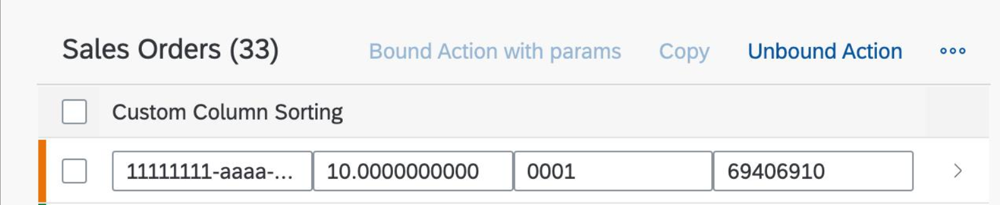
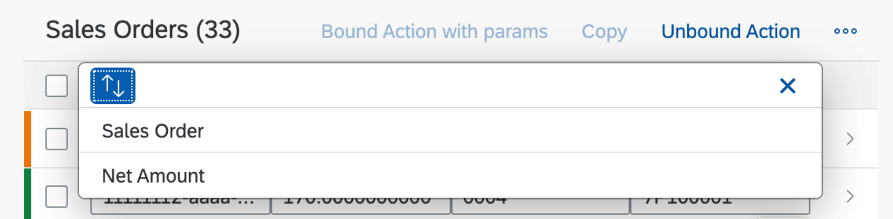
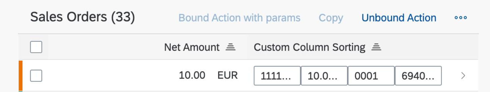
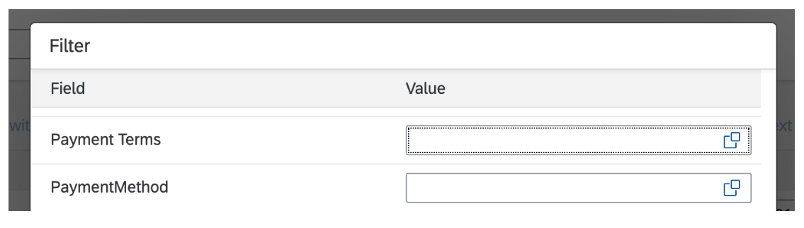

<!-- loio73fb9c4477f14647b5558a469091228b -->

# Sorting and Filtering in Custom Columns

Configuration that enables sorting and filtering for custom columns by defining an array of properties in SAP Fiori elements for OData V4. This makes custom column headers interactive and allows users to sort and filter data.

You can add the configuration to support sorting and filtering by using `"properties"` for any custom column as an array of properties:

> ### Sample Code:  
> ```
> "properties": [
>     "TotalNetAmount",
>     "_CustomerPaymentTerms/CustomerPaymentTerms"
> ]
> ```

The header of a custom column is clickable, as shown in the following screenshot:



Upon selection of the icon shown in the screenshot, the provided properties are displayed:



If sorting is applied, the indicator is added to any column that points to the property used for sorting:



Properties added to any custom column can also be found in the sorting and filtering dialog \(ensure that sorting and filtering is available for your table\):



