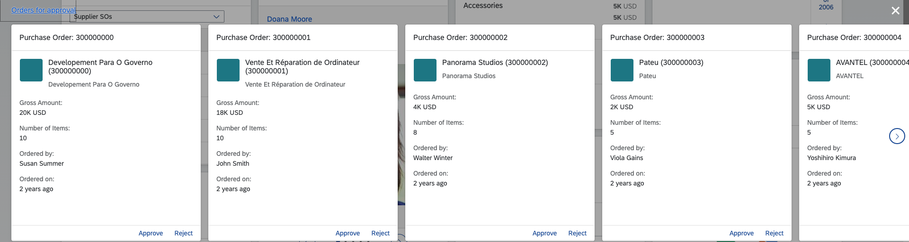

<!-- loio756c49c9271248e7b980bee17668f617 -->

# Stack Cards

Stack cards aggregate a set of cards of the same type, which are based on a common topic or action. When clicked, up to 20 stacked cards can be displayed in the object stream.


The left-hand side of the card contains the application title \(which is also the title of the object stream\) and stack description \(optional\). Click this section of the card or *View All* to open the application.


### Object Stream

On the right-hand side of the card you can view the number of items in the stack. Click this section to view the object stream \(up to 20 quick view cards\) excluding the placeholder card that appears as the last card in the object stream\).

> ### Note:  
> The placeholder card provides additional information and appears only when the object stream has 20 quick view cards.

You can configure the quick view cards to provide actions \(such as confirm or reject\) and a navigation link. The object stream's header is also navigable and navigates to the same destination as the navigation from the header of the stack card.



Because of the relationship between the stack card and its object stream, some of the configurations for the object stream cards are included in the stack card definitions.

-   `entitySet` – the dominant entity set \(for example, `SalesOrderSet`\).
-   `objectStreamCardsNavigationProperty` – the navigation property used to display information from a secondary entity set. For example, to display sales orders by business partner, the entity set would be `BusinessPartnersSet` and the navigation property `SalesOrder`.

    > ### Note:  
    > This definition is not relevant for quick view cards.

-   `objectStreamCardsSettings` – an optional configuration of additional settings for the cards displayed in the object stream.

    A `showFirstActionInFooter` flag is added to the `objectStreamCardsSettings` object in the stack card. The default value of the flag is `false`. If this flag is set to *true*, the first action on the footer of the quick view card will be a navigation action. If the flag is set to *false*, the navigation action on the footer of the quick view card won't be displayed. Other actions will be shown instead.

-   `itemText` - lets you include custom text along with the existing message in the placeholder card.


## Example

In the following example, the stack card displays information about business partners in a quick view card, using the information configured in `com.sap.vocabularies.UI.v1.Identification` with a qualifier.

> ### Sample Code:  
> ```
> 
> "sap.ovp": {
>     ...
>     "cards": {
>         "card00": {
>             "model": "salesOrder",
> 				"template": "sap.ovp.cards.stack",
> 				"settings": {
> 					"title": "Stack Card Title",
> 					"subTitle": "Stack Card",
> 					"requireAppAuthorization": "#Action-toappnavsample",
> 					"itemText": "items awaiting approval",
> 					"entitySet": "SalesOrderSet",
> 					"identificationAnnotationPath": "com.sap.vocabularies.UI.v1.Identification,com.sap.vocabularies.UI.v1.Identification#item2",
> 					"objectStreamCardsSettings": {
> 						"showFirstActionInFooter": false
> 					}
> 				}
>         },
>         ...
>     }
> }
> 
> ```

Continuing the example above, the following metadata demonstrates the relationship between the `BusinessPartner` and `SalesOrder` entity sets. The `BusinessPartner` entity type contains the configured navigation `ToSalesOrders` property to the `SalesOrder` using the `Assoc_BusinessPartner_SalesOrders` association and the `Assoc_BusinessPartner_SalesOrders_AssocS` association set.

> ### Sample Code:  
> ```
> 
> <EntityType Name="BusinessPartner" sap:content-version="1">
>     <Key>
>         <PropertyRef Name="BusinessPartnerID"/>
>     </Key>
>     <Property Name="Address" Type="GWSAMPLE_BASIC.CT_Address" Nullable="false"/>
>     <Property Name="BusinessPartnerID" Type="Edm.String" Nullable="false" MaxLength="10" sap:label="Bus. Part. ID" sap:creatable="false" sap:updatable="false"/>
>     <Property Name="CompanyName" Type="Edm.String" MaxLength="80" sap:label="Company Name"/>
>     <Property Name="WebAddress" Type="Edm.String" sap:label="Web Address" sap:sortable="false" sap:filterable="false" sap:semantics="url"/>
>     <Property Name="EmailAddress" Type="Edm.String" MaxLength="255" sap:label="E-Mail Address" sap:semantics="email"/>
>     <Property Name="PhoneNumber" Type="Edm.String" MaxLength="30" sap:label="Phone No." sap:semantics="tel"/>
>     <Property Name="FaxNumber" Type="Edm.String" MaxLength="30" sap:label="Fax Number"/>
>     <Property Name="LegalForm" Type="Edm.String" MaxLength="10" sap:label="Legal Form"/>
>     <Property Name="CurrencyCode" Type="Edm.String" MaxLength="5" sap:label="Currency" sap:semantics="currency-code"/>
>     <Property Name="BusinessPartnerRole" Type="Edm.String" MaxLength="3" sap:label="Bus. Part. Role"/>
>     <Property Name="CreatedAt" Type="Edm.DateTime" Precision="7" sap:label="Time Stamp" sap:creatable="false" sap:updatable="false"/>
>     <Property Name="ChangedAt" Type="Edm.DateTime" Precision="7" ConcurrencyMode="Fixed" sap:label="Time Stamp" sap:creatable="false" sap:updatable="false"/>
>     <NavigationProperty Name="ToSalesOrders" Relationship="GWSAMPLE_BASIC.Assoc_BusinessPartner_SalesOrders" FromRole="FromRole_Assoc_BusinessPartner_SalesOrders" ToRole="ToRole_Assoc_BusinessPartner_SalesOrders"/>
>     <NavigationProperty Name="ToContacts" Relationship="GWSAMPLE_BASIC.Assoc_BusinessPartner_Contacts" FromRole="FromRole_Assoc_BusinessPartner_Contacts" ToRole="ToRole_Assoc_BusinessPartner_Contacts"/>
>     <NavigationProperty Name="ToProducts" Relationship="GWSAMPLE_BASIC.Assoc_BusinessPartner_Products" FromRole="FromRole_Assoc_BusinessPartner_Products" ToRole="ToRole_Assoc_BusinessPartner_Products"/>
> </EntityType>
> <EntityType Name="SalesOrder" sap:content-version="1">
>     <Key>
>         <PropertyRef Name="SalesOrderID"/>
>     </Key>
>     <Property Name="SalesOrderID" Type="Edm.String" Nullable="false" MaxLength="10" sap:label="Sa. Ord. ID" sap:creatable="false" sap:updatable="false"/>
>     <Property Name="SalesOrderGuid" Type="Edm.Guid" Nullable="false" sap:label="SalesOrder GUID" sap:creatable="false" sap:updatable="false"/>
>     <Property Name="Note" Type="Edm.String" MaxLength="255" sap:label="Description" sap:updatable="false" sap:sortable="false" sap:filterable="false"/>
>     <Property Name="NoteLanguage" Type="Edm.String" MaxLength="1" sap:label="Language" sap:creatable="false" sap:updatable="false" sap:sortable="false" sap:filterable="false"/>
>     <Property Name="CustomerID" Type="Edm.String" MaxLength="10" sap:label="Bus. Part. ID" sap:updatable="false"/>
>     <Property Name="CustomerName" Type="Edm.String" MaxLength="80" sap:label="Company Name" sap:creatable="false" sap:updatable="false"/>
>     <Property Name="CurrencyCode" Type="Edm.String" MaxLength="5" sap:label="Currency" sap:updatable="false" sap:semantics="currency-code"/>
>     <Property Name="GrossAmount" Type="Edm.Decimal" Precision="16" Scale="3" sap:unit="CurrencyCode" sap:label="Gross Amt." sap:creatable="false" sap:updatable="false"/>
>     <Property Name="NetAmount" Type="Edm.Decimal" Precision="16" Scale="3" sap:unit="CurrencyCode" sap:label="Net Amt." sap:creatable="false" sap:updatable="false"/>
>     <Property Name="TaxAmount" Type="Edm.Decimal" Precision="16" Scale="3" sap:unit="CurrencyCode" sap:label="Tax Amt." sap:creatable="false" sap:updatable="false"/>
>     <Property Name="LifecycleStatus" Type="Edm.String" MaxLength="1" sap:label="PO Lifecycle" sap:creatable="false" sap:updatable="false"/>
>     <Property Name="LifecycleStatusDescription" Type="Edm.String" MaxLength="60" sap:label="Lifecycle Descript." sap:creatable="false" sap:updatable="false" sap:sortable="false" sap:filterable="false"/>
>     <Property Name="BillingStatus" Type="Edm.String" MaxLength="1" sap:label="PO Confirmation" sap:creatable="false" sap:updatable="false"/>
>     <Property Name="BillingStatusDescription" Type="Edm.String" MaxLength="60" sap:label="Billing Description" sap:creatable="false" sap:updatable="false" sap:sortable="false" sap:filterable="false"/>
>     <Property Name="DeliveryStatus" Type="Edm.String" MaxLength="1" sap:label="PO Ordering" sap:creatable="false" sap:updatable="false"/>
>     <Property Name="DeliveryStatusDescription" Type="Edm.String" MaxLength="60" sap:label="Delivery Description" sap:creatable="false" sap:updatable="false" sap:sortable="false" sap:filterable="false"/>
>     <Property Name="CreatedAt" Type="Edm.DateTime" Precision="7" sap:label="Time Stamp" sap:creatable="false" sap:updatable="false"/>
>     <Property Name="ChangedAt" Type="Edm.DateTime" Precision="7" sap:label="Time Stamp" sap:creatable="false" sap:updatable="false"/>
>     <NavigationProperty Name="ToBusinessPartner" Relationship="GWSAMPLE_BASIC.Assoc_BusinessPartner_SalesOrders" FromRole="ToRole_Assoc_BusinessPartner_SalesOrders" ToRole="FromRole_Assoc_BusinessPartner_SalesOrders"/>
>     <NavigationProperty Name="ToLineItems" Relationship="GWSAMPLE_BASIC.Assoc_SalesOrder_SalesOrderLineItems" FromRole="FromRole_Assoc_SalesOrder_SalesOrderLineItems" ToRole="ToRole_Assoc_SalesOrder_SalesOrderLineItems"/>
> </EntityType>
> <Association Name="Assoc_BusinessPartner_SalesOrders" sap:content-version="1">
>     <End Type="GWSAMPLE_BASIC.BusinessPartner" Multiplicity="1" Role="FromRole_Assoc_BusinessPartner_SalesOrders"/>
>     <End Type="GWSAMPLE_BASIC.SalesOrder" Multiplicity="*" Role="ToRole_Assoc_BusinessPartner_SalesOrders"/>
>     <ReferentialConstraint>
>         <Principal Role="FromRole_Assoc_BusinessPartner_SalesOrders">
>             <PropertyRef Name="BusinessPartnerID"/>
>         </Principal>
>         <Dependent Role="ToRole_Assoc_BusinessPartner_SalesOrders">
>             <PropertyRef Name="CustomerID"/>
>         </Dependent>
>     </ReferentialConstraint>
> </Association>
> <EntityContainer Name="GWSAMPLE_BASIC_Entities" m:IsDefaultEntityContainer="true">
>     <EntitySet Name="BusinessPartnerSet" EntityType="GWSAMPLE_BASIC.BusinessPartner" sap:content-version="1"/>
>     <EntitySet Name="SalesOrderSet" EntityType="GWSAMPLE_BASIC.SalesOrder" sap:updatable="false" sap:content-version="1"/>
>     <AssociationSet Name="Assoc_BusinessPartner_SalesOrders_AssocS" Association="GWSAMPLE_BASIC.Assoc_BusinessPartner_SalesOrders" sap:creatable="false" sap:updatable="false" sap:deletable="false" sap:content-version="1">
>         <End EntitySet="BusinessPartnerSet" Role="FromRole_Assoc_BusinessPartner_SalesOrders"/>
>         <End EntitySet="SalesOrderSet" Role="ToRole_Assoc_BusinessPartner_SalesOrders"/>
>     </AssociationSet>
> </EntityContainer>
> 
> ```

