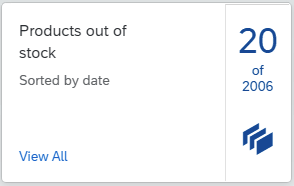
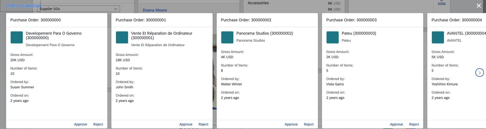

<!-- loio756c49c9271248e7b980bee17668f617 -->

# Stack Cards

You can use stack cards to group multiple cards of the same type that are related to a common topic or action. When clicked, the object stream can display up to 20 stacked cards.





### 

Hover over each action for a description. Click the action for more information.


### Manifest Settings: Title

Property: `title`

Description: Configuring this property displays the card title on top of the stack card.

> ### Sample Code:  
> `manifest.json`
> 
> ```
> "sap.ovp": {
>     "globalFilterModel": "salesOrder",
>     "globalFilterEntitySet": "GlobalFilters",
>     ...
>     "cards": {
>         "card001_cardchartsTabbed": {
>             "model": "salesOrder",
>             "template": "sap.ovp.cards.v4.stack",
>             "settings": {
>                 "title": "Products Out of Stock",
>                 "entitySet": "salesOrder",
>                 ...
>             }
>         }
>     }
> }
> ```


### Manifest Settings: Subtitle

Property: `subTitle`

Description: Configuring this property displays the card subtitle below the title of the stack card.

> ### Sample Code:  
> `manifest.json`
> 
> ```
> "sap.ovp": {
>     "globalFilterModel": "salesOrder",
>     "globalFilterEntitySet": "GlobalFilters",
>     ...
>     "cards": {
>         "card001_cardchartsTabbed": {
>             "model": "salesShare",
>             "template": "sap.ovp.cards.v4.stack",
>             "settings": {
>                 "title": "Sales Forecast",
>                 "subTitle": "SalesOrderSet Stack Card",
>                 "entitySet": "SalesShare",
>                 ...
>             }
>         }
>     }
> }
> ```


### Configuring the Object Stream

> ### Sample Code:  
> `manifest.json`
> 
> ```
> "sap.ovp": {
>     "globalFilterModel": "salesOrder",
>     "globalFilterEntitySet": "GlobalFilters",
>     "showDateInRelativeFormat": false,
>     "disableTableCardFlexibility": false,
>     "useDateRangeType": false,
>     "card007_ProductsOutOfStock": {
>         "model": "salesOrder",
>         "template": "sap.ovp.cards.v4.stack",
>         "settings": {
>             "itemText": "{{stackCard_itemText}}",
>             "title": "Products Out of Stock",
>             "subTitle": "SalesOrderSet Stack Card",
>             "requireAppAuthorization": "#Action-toappnavsample",
>             "entitySet": "SalesOrderSet",
>             "identificationAnnotationPath": "com.sap.vocabularies.UI.v1.Identification",
>             "objectStreamCardsSettings": {
>                 "showFirstActionInFooter": false,
>                 "customActions": [
>                     {
>                         ...
>                     }
>                 ]
>             }
>         }
>     }
> }
> ```

**Annotation Sample for `Identification`**

> ### Sample Code:  
> XML Annotation
> 
> ```xml
> <Annotation Term="com.sap.vocabularies.UI.v1.Identification">
>     <Collection>
>         <Record Type="com.sap.vocabularies.UI.v1.DataFieldWithUrl">
>             <PropertyValue Property="Label" String="Link to url"/>
>             <PropertyValue Property="Value" String="Google Maps"/>
>             <PropertyValue Property="Url" String="https://www.google.com"/>
>             <Annotation Term="com.sap.vocabularies.UI.v1.Importance" EnumMember="com.sap.vocabularies.UI.v1.ImportanceType/Medium"/>
>         </Record>
>         <Record Type="com.sap.vocabularies.UI.v1.DataFieldWithUrl">
>             <PropertyValue Property="Label" String="Link to"/>
>             <PropertyValue Property="Value" String="Some Intent"/>
>             <PropertyValue Property="Url" String="#Action-toappnavsample2&amp;/ShowView2/"/>
>             <Annotation Term="com.sap.vocabularies.UI.v1.Importance" EnumMember="com.sap.vocabularies.UI.v1.ImportanceType/High"/>
>         </Record>
>         <Record Type="com.sap.vocabularies.UI.v1.DataFieldForIntentBasedNavigation">
>             <PropertyValue Property="SemanticObject" String="Action"/>
>             <PropertyValue Property="Action" String="toappnavsample"/>
>             <PropertyValue Property="Label" String="SO Navigation (M)"/>
>             <Annotation Term="com.sap.vocabularies.UI.v1.Importance" EnumMember="com.sap.vocabularies.UI.v1.ImportanceType/Medium"/>
>         </Record>
>     </Collection>
> </Annotation>
> ```

> ### Sample Code:  
> ABAP CDS Annotation
> 
> ```
> @UI.identification: [
>   {
>     importance: #MEDIUM,
>     label: 'Link to url',
>     type: #WITH_URL,
>     position: 10
>   },
>   {
>     importance: #HIGH,
>     label: 'Link to',
>     type: #WITH_URL,
>     position: 20
>   },
>   {
>     importance: #MEDIUM,
>     semanticObjectAction: 'toappnavsample',
>     label: 'SO Navigation (M)',
>     type: #FOR_INTENT_BASED_NAVIGATION,
>     position: 30
>   }
> ]
> PROPERT_NAME;
> 
> @Consumption.semanticObject: 'Action'
> annotate view VIEWNAME with { }
> 
> ```

> ### Sample Code:  
> CAP CDS Annotation
> 
> ```
> UI.Identification : [
>     {
>         $Type : 'UI.DataFieldWithUrl',
>         Label : 'Link to url',
>         Value : 'Google Maps',
>         Url : 'https://www.google.com',
>         ![@UI.Importance] : #Medium
>     },
>     {
>         $Type : 'UI.DataFieldWithUrl',
>         Label : 'Link to',
>         Value : 'Some Intent',
>         Url : '#Action-toappnavsample2&amp;/ShowView2/',
>         ![@UI.Importance] : #High
>     },
>     {
>         $Type : 'UI.DataFieldForIntentBasedNavigation',
>         SemanticObject : 'Action',
>         Action : 'toappnavsample',
>         Label : 'SO Navigation (M)',
>         ![@UI.Importance] : #Medium
>     }
> ]
> 
> ```


### Configuring the Navigation Area

> ### Sample Code:  
> ```
> "sap.ovp": {
>     "globalFilterModel": "salesOrder",
>     "globalFilterEntitySet": "GlobalFilters",
>     "showDateInRelativeFormat": false,
>     "disableTableCardFlexibility": false,
>     "useDateRangeType": false,
>     "card007_ProductsOutOfStock": {
>         "model": "salesOrder",
>         "template": "sap.ovp.cards.v4.stack",
>         "settings": {
>             "itemText": "{{stackCard_itemText}}",
>             "title": "Products Out of Stock",
>             "subTitle": "SalesOrderSet Stack Card",
>             "requireAppAuthorization": "#Action-toappnavsample",
>             "entitySet": "SalesOrderSet",
>             "identificationAnnotationPath": "com.sap.vocabularies.UI.v1.Identification,com.sap.vocabularies.UI.v1.Identification#item2",
>             "objectStreamCardsSettings": {
>                 "showFirstActionInFooter": false,
>                 "customActions": [
>                     {
>                         ...
>                     }
>                 ]
>             }
>         }
>     }
> }
> ```

**Annotation Sample for `Identification#item2`**

> ### Sample Code:  
> XML Annotation
> 
> ```xml
>                 <Annotation Term="com.sap.vocabularies.UI.v1.Identification" Qualifier="item2">
>                     <Collection>
>                         <Record Type="com.sap.vocabularies.UI.v1.DataFieldWithUrl">
>                             <PropertyValue Property="Label" String="Link to url"/>
>                             <PropertyValue Property="Value" String="Google Maps"/>
>                             <PropertyValue Property="Url" String="https://www.google.com"/>
>                             <Annotation Term="com.sap.vocabularies.UI.v1.Importance" EnumMember="com.sap.vocabularies.UI.v1.ImportanceType/Medium"/>
>                         </Record>
>                         <Record Type="com.sap.vocabularies.UI.v1.DataFieldForIntentBasedNavigation">
>                             <PropertyValue Property="SemanticObject" String="Action"/>
>                             <PropertyValue Property="Action" String="toappnavsample"/>
>                             <PropertyValue Property="Label" String="SO Navigation (M)"/>
>                             <Annotation Term="com.sap.vocabularies.UI.v1.Importance" EnumMember="com.sap.vocabularies.UI.v1.ImportanceType/High"/>
>                         </Record>
>                     </Collection>
>                 </Annotation>
> ```

> ### Sample Code:  
> ABAP CDS Annotation
> 
> ```
> 
> @UI.identification: [
>   {
>     importance: #MEDIUM,
>     label: 'Link to url',
>     type: #WITH_URL,
>     position: 10
>   },
>   {
>     importance: #HIGH,
>     semanticObjectAction: 'toappnavsample',
>     label: 'SO Navigation (M)',
>     type: #FOR_INTENT_BASED_NAVIGATION,
>     position: 20
>   }
> ]
> PROPERT_NAME;
> 
> @Consumption.semanticObject: 'Action'
> annotate view VIEWNAME with { 
> 
> }
> 
> ```

> ### Sample Code:  
> CAP CDS Annotation
> 
> ```
> UI.Identification #item2 : [
>     {
>         $Type : 'UI.DataFieldWithUrl',
>         Label : 'Link to url',
>         Value : 'Google Maps',
>         Url : 'https://www.google.com',
>         ![@UI.Importance] : #Medium
>     },
>     {
>         $Type : 'UI.DataFieldForIntentBasedNavigation',
>         SemanticObject : 'Action',
>         Action : 'toappnavsample',
>         Label : 'SO Navigation (M)',
>         ![@UI.Importance] : #High
>     }
> ]
> ```


### Example

In the following example, the stack card displays information about business partners in a quick view card, using the information configured in `com.sap.vocabularies.UI.v1.Identification` with a qualifier.

> ### Sample Code:  
> `manifest.json`
> 
> ```
> 
> "sap.ovp": {
>   ...
>   "cards": {
>     "card00": {
>       "model": "salesOrder",
>       "template": "sap.ovp.cards.v4.stack",
>       "settings": {
>         "title": "Stack Card Title",
>         "subTitle": "Stack Card",
>         "requireAppAuthorization": "#Action-toappnavsample",
>         "itemText": "items awaiting approval",
>         "entitySet": "SalesOrderSet",
>         "identificationAnnotationPath": "com.sap.vocabularies.UI.v1.Identification,com.sap.vocabularies.UI.v1.Identification#item2",
>         "objectStreamCardsSettings": {
>           "showFirstActionInFooter": false
>         }
>       }
>     },
>     ...
>   }
> }
> ```

> ### Note:  
> The template setting in the `manifest.json` file depends on your OData version. Use `sap.ovp.cards.v4.<cardType>` for SAP Fiori elements for OData V4 and `sap.ovp.cards.<cardType>` for SAP Fiori elements for OData V2.

The left-hand side of the card contains the application title \(which is also the title of the object stream\) and stack description \(optional\). Click this section of the card or *View All* to open the application.

On the right-hand side of the card you can view the number of items in the stack. Click this section to view the object stream \(up to 20 quick view cards\) excluding the placeholder card that appears as the last card in the object stream\).

> ### Note:  
> The placeholder card provides additional information and appears only when the object stream has 20 quick view cards.


### Object Stream

You can configure the quick view cards to provide actions \(such as confirm or reject\) and a navigation link. The object stream's header is also navigable and navigates to the same destination as the navigation from the header of the stack card.



Because of the relationship between the stack card and its object stream, some of the configurations for the object stream cards are included in the stack card definitions.

-   `entitySet` – the dominant entity set \(for example, `SalesOrderSet`\).
-   `objectStreamCardsNavigationProperty` – the navigation property used to display information from a secondary entity set. For example, to display sales orders by business partner, the entity set would be `BusinessPartnersSet` and the navigation property `SalesOrder`.

    > ### Note:  
    > This definition is not relevant for quick view cards.

-   `objectStreamCardsSettings` – an optional configuration of additional settings for the cards displayed in the object stream.

    A `showFirstActionInFooter` flag is added to the `objectStreamCardsSettings` object in the stack card. The default value of the flag is `false`. If this flag is set to *true*, the first action on the footer of the quick view card will be a navigation action. If the flag is set to *false*, the navigation action on the footer of the quick view card won't be displayed. Other actions will be shown instead.

-   `itemText` - lets you include custom text along with the existing message in the placeholder card.


## Example

The following sample code configures a stack card displaying sales order items awaiting approval, using the `SalesOrderSet` entity and `Identification` annotations:

> ### Sample Code:  
> `manifest.json`
> 
> ```
> "sap.ovp": {
>     ...
>     "cards": {
>         "card00": {
>             "model": "salesOrder",
>             "template": "sap.ovp.cards.v4.stack",
>             "settings": {
>                 "title": "Stack Card Title",
>                 "subTitle": "Stack Card",
>                 "requireAppAuthorization": "#Action-toappnavsample",
>                 "itemText": "items awaiting approval",
>                 "entitySet": "SalesOrderSet",
>                 "identificationAnnotationPath": "com.sap.vocabularies.UI.v1.Identification,com.sap.vocabularies.UI.v1.Identification#item2",
>                 "objectStreamCardsSettings": {
>                     "showFirstActionInFooter": false
>                 }
>             }
>         },
>         ...
>     }
> }
> ```

> ### Note:  
> The template setting in the `manifest.json` file depends on your OData version. Use `sap.ovp.cards.v4.<cardType>` for SAP Fiori elements for OData V4 and `sap.ovp.cards.<cardType>` for SAP Fiori elements for OData V2.

Continuing the code sample above, the following metadata demonstrates the relationship between the `BusinessPartner` and `SalesOrder` entity sets. The `BusinessPartner` entity type contains the configured navigation `ToSalesOrders` property to the `SalesOrder` using the `Assoc_BusinessPartner_SalesOrders` association and the `Assoc_BusinessPartner_SalesOrders_AssocS` association set.

> ### Sample Code:  
> ```
> 
> <EntityType Name="BusinessPartner" sap:content-version="1">
>     <Key>
>         <PropertyRef Name="BusinessPartnerID"/>
>     </Key>
>     <Property Name="Address" Type="GWSAMPLE_BASIC.CT_Address" Nullable="false"/>
>     <Property Name="BusinessPartnerID" Type="Edm.String" Nullable="false" MaxLength="10" sap:label="Bus. Part. ID" sap:creatable="false" sap:updatable="false"/>
>     <Property Name="CompanyName" Type="Edm.String" MaxLength="80" sap:label="Company Name"/>
>     <Property Name="WebAddress" Type="Edm.String" sap:label="Web Address" sap:sortable="false" sap:filterable="false" sap:semantics="url"/>
>     <Property Name="EmailAddress" Type="Edm.String" MaxLength="255" sap:label="E-Mail Address" sap:semantics="email"/>
>     <Property Name="PhoneNumber" Type="Edm.String" MaxLength="30" sap:label="Phone No." sap:semantics="tel"/>
>     <Property Name="FaxNumber" Type="Edm.String" MaxLength="30" sap:label="Fax Number"/>
>     <Property Name="LegalForm" Type="Edm.String" MaxLength="10" sap:label="Legal Form"/>
>     <Property Name="CurrencyCode" Type="Edm.String" MaxLength="5" sap:label="Currency" sap:semantics="currency-code"/>
>     <Property Name="BusinessPartnerRole" Type="Edm.String" MaxLength="3" sap:label="Bus. Part. Role"/>
>     <Property Name="CreatedAt" Type="Edm.DateTime" Precision="7" sap:label="Time Stamp" sap:creatable="false" sap:updatable="false"/>
>     <Property Name="ChangedAt" Type="Edm.DateTime" Precision="7" ConcurrencyMode="Fixed" sap:label="Time Stamp" sap:creatable="false" sap:updatable="false"/>
>     <NavigationProperty Name="ToSalesOrders" Relationship="GWSAMPLE_BASIC.Assoc_BusinessPartner_SalesOrders" FromRole="FromRole_Assoc_BusinessPartner_SalesOrders" ToRole="ToRole_Assoc_BusinessPartner_SalesOrders"/>
>     <NavigationProperty Name="ToContacts" Relationship="GWSAMPLE_BASIC.Assoc_BusinessPartner_Contacts" FromRole="FromRole_Assoc_BusinessPartner_Contacts" ToRole="ToRole_Assoc_BusinessPartner_Contacts"/>
>     <NavigationProperty Name="ToProducts" Relationship="GWSAMPLE_BASIC.Assoc_BusinessPartner_Products" FromRole="FromRole_Assoc_BusinessPartner_Products" ToRole="ToRole_Assoc_BusinessPartner_Products"/>
> </EntityType>
> <EntityType Name="SalesOrder" sap:content-version="1">
>     <Key>
>         <PropertyRef Name="SalesOrderID"/>
>     </Key>
>     <Property Name="SalesOrderID" Type="Edm.String" Nullable="false" MaxLength="10" sap:label="Sa. Ord. ID" sap:creatable="false" sap:updatable="false"/>
>     <Property Name="SalesOrderGuid" Type="Edm.Guid" Nullable="false" sap:label="SalesOrder GUID" sap:creatable="false" sap:updatable="false"/>
>     <Property Name="Note" Type="Edm.String" MaxLength="255" sap:label="Description" sap:updatable="false" sap:sortable="false" sap:filterable="false"/>
>     <Property Name="NoteLanguage" Type="Edm.String" MaxLength="1" sap:label="Language" sap:creatable="false" sap:updatable="false" sap:sortable="false" sap:filterable="false"/>
>     <Property Name="CustomerID" Type="Edm.String" MaxLength="10" sap:label="Bus. Part. ID" sap:updatable="false"/>
>     <Property Name="CustomerName" Type="Edm.String" MaxLength="80" sap:label="Company Name" sap:creatable="false" sap:updatable="false"/>
>     <Property Name="CurrencyCode" Type="Edm.String" MaxLength="5" sap:label="Currency" sap:updatable="false" sap:semantics="currency-code"/>
>     <Property Name="GrossAmount" Type="Edm.Decimal" Precision="16" Scale="3" sap:unit="CurrencyCode" sap:label="Gross Amt." sap:creatable="false" sap:updatable="false"/>
>     <Property Name="NetAmount" Type="Edm.Decimal" Precision="16" Scale="3" sap:unit="CurrencyCode" sap:label="Net Amt." sap:creatable="false" sap:updatable="false"/>
>     <Property Name="TaxAmount" Type="Edm.Decimal" Precision="16" Scale="3" sap:unit="CurrencyCode" sap:label="Tax Amt." sap:creatable="false" sap:updatable="false"/>
>     <Property Name="LifecycleStatus" Type="Edm.String" MaxLength="1" sap:label="PO Lifecycle" sap:creatable="false" sap:updatable="false"/>
>     <Property Name="LifecycleStatusDescription" Type="Edm.String" MaxLength="60" sap:label="Lifecycle Descript." sap:creatable="false" sap:updatable="false" sap:sortable="false" sap:filterable="false"/>
>     <Property Name="BillingStatus" Type="Edm.String" MaxLength="1" sap:label="PO Confirmation" sap:creatable="false" sap:updatable="false"/>
>     <Property Name="BillingStatusDescription" Type="Edm.String" MaxLength="60" sap:label="Billing Description" sap:creatable="false" sap:updatable="false" sap:sortable="false" sap:filterable="false"/>
>     <Property Name="DeliveryStatus" Type="Edm.String" MaxLength="1" sap:label="PO Ordering" sap:creatable="false" sap:updatable="false"/>
>     <Property Name="DeliveryStatusDescription" Type="Edm.String" MaxLength="60" sap:label="Delivery Description" sap:creatable="false" sap:updatable="false" sap:sortable="false" sap:filterable="false"/>
>     <Property Name="CreatedAt" Type="Edm.DateTime" Precision="7" sap:label="Time Stamp" sap:creatable="false" sap:updatable="false"/>
>     <Property Name="ChangedAt" Type="Edm.DateTime" Precision="7" sap:label="Time Stamp" sap:creatable="false" sap:updatable="false"/>
>     <NavigationProperty Name="ToBusinessPartner" Relationship="GWSAMPLE_BASIC.Assoc_BusinessPartner_SalesOrders" FromRole="ToRole_Assoc_BusinessPartner_SalesOrders" ToRole="FromRole_Assoc_BusinessPartner_SalesOrders"/>
>     <NavigationProperty Name="ToLineItems" Relationship="GWSAMPLE_BASIC.Assoc_SalesOrder_SalesOrderLineItems" FromRole="FromRole_Assoc_SalesOrder_SalesOrderLineItems" ToRole="ToRole_Assoc_SalesOrder_SalesOrderLineItems"/>
> </EntityType>
> <Association Name="Assoc_BusinessPartner_SalesOrders" sap:content-version="1">
>     <End Type="GWSAMPLE_BASIC.BusinessPartner" Multiplicity="1" Role="FromRole_Assoc_BusinessPartner_SalesOrders"/>
>     <End Type="GWSAMPLE_BASIC.SalesOrder" Multiplicity="*" Role="ToRole_Assoc_BusinessPartner_SalesOrders"/>
>     <ReferentialConstraint>
>         <Principal Role="FromRole_Assoc_BusinessPartner_SalesOrders">
>             <PropertyRef Name="BusinessPartnerID"/>
>         </Principal>
>         <Dependent Role="ToRole_Assoc_BusinessPartner_SalesOrders">
>             <PropertyRef Name="CustomerID"/>
>         </Dependent>
>     </ReferentialConstraint>
> </Association>
> <EntityContainer Name="GWSAMPLE_BASIC_Entities" m:IsDefaultEntityContainer="true">
>     <EntitySet Name="BusinessPartnerSet" EntityType="GWSAMPLE_BASIC.BusinessPartner" sap:content-version="1"/>
>     <EntitySet Name="SalesOrderSet" EntityType="GWSAMPLE_BASIC.SalesOrder" sap:updatable="false" sap:content-version="1"/>
>     <AssociationSet Name="Assoc_BusinessPartner_SalesOrders_AssocS" Association="GWSAMPLE_BASIC.Assoc_BusinessPartner_SalesOrders" sap:creatable="false" sap:updatable="false" sap:deletable="false" sap:content-version="1">
>         <End EntitySet="BusinessPartnerSet" Role="FromRole_Assoc_BusinessPartner_SalesOrders"/>
>         <End EntitySet="SalesOrderSet" Role="ToRole_Assoc_BusinessPartner_SalesOrders"/>
>     </AssociationSet>
> </EntityContainer>
> 
> ```

**Related Information**  


[Quick View Cards](quick-view-cards-c4bd35e.md "You can configure quick view cards to display detailed information about a single record—more than a table or list card can show. You can also assign actions to a quick view card; these actions appear as buttons in the card footer.")

