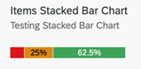

<!-- loio7328c4f967384ba58d838ae0ab3e011c -->

# Stacked Bar Micro Chart

You can render the micro chart as a stacked bar micro chart.

> ### Note:  
> For information about SAP Fiori elements for OData V4, see [Stacked Bar Micro Chart](stacked-bar-micro-chart-9c93837.md).



The stacked bar micro chart displays all the values from the back end for the configured measure as a percentage of the total measure value. For more information about this chart type, see [Samples](https://ui5.sap.com/1.82.5/#/entity/sap.suite.ui.microchart.StackedBarMicroChart).

> ### Note:  
> The chart dimensions and measures cannot be of the same entity; they must be from a 1:n navigation entity.


<a name="loio7328c4f967384ba58d838ae0ab3e011c__section_mhj_wgq_qmb"/>

## `UI.Chart` Annotation

The `UI.Chart Title` property is used to define the title, while the `UI.Chart Description` property is used to specify the subtitle.

> ### Sample Code:  
> XML Annotation
> 
> ```xml
> <Annotation Term="UI.Chart" Qualifier="SalesPriceStackedBarChart">
>     <Record Type="UI.ChartDefinitionType">
>         <PropertyValue Property="Title" String="Sales Price"/>
>         <PropertyValue Property="Description" String="Stacked BarChart"/>
>         <PropertyValue Property="ChartType" EnumMember="UI.ChartType/BarStacked"/>
>         <PropertyValue Property="Measures">
>             <Collection>
>                 <PropertyPath>Width</PropertyPath>
>             </Collection>
>         </PropertyValue>
>         <PropertyValue Property="MeasureAttributes">
>             <Collection>
>                 <Record Type="UI.ChartMeasureAttributeType">
>                     <PropertyValue Property="Measure" PropertyPath="Width"/>
>                     <PropertyValue Property="Role" EnumMember="UI.ChartMeasureRoleType/Axis1"/>
>                     <PropertyValue Property="DataPoint" AnnotationPath="@UI.DataPoint#Width"/>
>                 </Record>
>             </Collection>
>         </PropertyValue>
>     </Record>
> </Annotation>
> 
> ```

> ### Sample Code:  
> ABAP CDS Annotation
> 
> ```
> 
> @UI.Chart: [
>   {
>     title: 'Sales Price',
>     description: 'Stacked BarChart',
>     chartType: #BAR_STACKED,
>     measures: [
>       'WIDTH'
>     ],
>     measureAttributes: [
>       {
>         measure: 'Width',
>         role: #AXIS_1,
>         asDataPoint: true
>       }
>     ],
>     qualifier: 'SalesPriceStackedBarChart'
>   }
> ]
> annotate view STTA_C_MP_PRODUCT with {
> 
> }
> ```

> ### Sample Code:  
> CAP CDS Annotation
> 
> ```
> 
> UI.Chart #SalesPriceStackedBarChart : {
>     $Type : 'UI.ChartDefinitionType',
>     Title : 'Sales Price',
>     Description : 'Stacked BarChart',
>     ChartType : #BarStacked,
>     Measures : [
>         Width
>     ],
>     MeasureAttributes : [
>         {
>             $Type : 'UI.ChartMeasureAttributeType',
>             Measure : Width,
>             Role : #Axis1,
>             DataPoint : '@UI.DataPoint#Width'
>         }
>     ]
> }
> 
> ```


<a name="loio7328c4f967384ba58d838ae0ab3e011c__section_dfw_txm_ghc"/>

## `UI.DataPoint` Annotation

> ### Sample Code:  
> XML Annotation
> 
> ```xml
> 
> <Annotation Term="UI.DataPoint" Qualifier="Width">
>     <Record>
>         <PropertyValue Property="Value" Path="Width"/>
>         <PropertyValue Property="Criticality" Path="criticalityValue"/>
>     </Record>
> </Annotation>
> ```

> ### Sample Code:  
> ABAP CDS Annotation
> 
> ```
> 
> @UI.dataPoint: {
>   criticality: 'criticalityValue'
> }
> Width;
> ```

> ### Sample Code:  
> CAP CDS Annotation
> 
> ```
> 
> UI.DataPoint #Width : {
>     Value : Width,
>     Criticality : criticalityValue
> }
> 
> ```


> ### Note:  
> The following properties must all point to the same property in the `entityType`:
> 
> -   `Measures` property of the `Chart` annotation.
> 
> -   `Measure` property of the `MeasureAttributes` property of the `Chart` annotation.
> 
> -   `Value` property of the `DataPoint` annotation.

