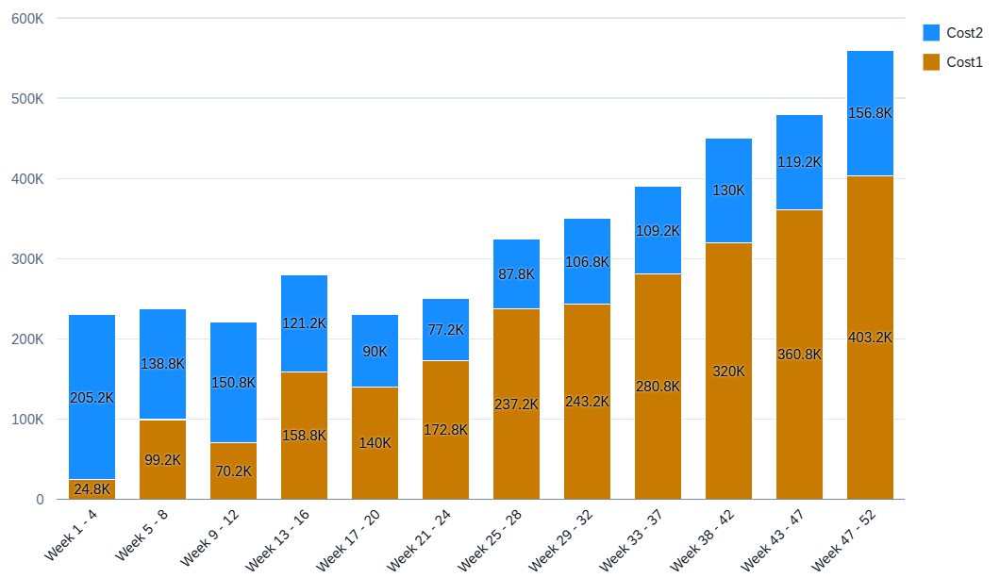

<!-- loioc54b815a908f423695d0e080d3830b7f -->

# Stacked Column Chart

You can render the chart as a stacked column chart in SAP Fiori elements for OData V4.

A stacked column chart is similar to a column chart. However, its measures are stacked on top of each other, irrespective of role.

  
  
**Example of a Stacked Column**



There should be at least one dimension with the assigned **category** role and all dimensions with this role are added to the **axis** category \(x-axis\). All dimensions with the **series** role are also stacked. We recommend stacking based on either dimensions or measures, but not mixing both in the same chart.

> ### Note:  
> The stacked column chart can have an optional dimension with role series. Assign a dimension with the **series** role for the property containing the semantic values.

> ### Sample Code:  
> XML Annotation
> 
> ```xml
> <Annotation Term="UI.Chart" Qualifier="ColumnStackedPath">
>   <Record Type="UI.ChartDefinitionType">
>     <PropertyValue Property="Title"       String="Items Stacked Column Chart"/>
>     <PropertyValue Property="Description" String="Testing Stacked Column Chart"/>
>     <PropertyValue Property="ChartType"   EnumMember="UI.ChartType/ColumnStacked"/>
>     <PropertyValue Property="Dimensions">
>       <Collection>
>         <PropertyPath>CalendarWeek</PropertyPath>
>       </Collection>
>     </PropertyValue>
>     <PropertyValue Property="Measures">
>       <Collection>
>         <PropertyPath>DirectCost</PropertyPath>
>         <PropertyPath>IndirectCost</PropertyPath>
>       </Collection>
>     </PropertyValue>
>     <PropertyValue Property="MeasureAttributes">
>       <Collection>
>         <Record Type="UI.ChartMeasureAttributeType">
>           <PropertyValue Property="Measure"   PropertyPath="DirectCost"/>
>           <PropertyValue Property="Role"      EnumMember="UI.ChartMeasureRoleType/Axis1"/>
>           <PropertyValue Property="DataPoint" AnnotationPath="@UI.DataPoint#DirectCostDP"/>
>         </Record>
>         <Record Type="UI.ChartMeasureAttributeType">
>           <PropertyValue Property="Measure"   PropertyPath="IndirectCost"/>
>           <PropertyValue Property="Role"      EnumMember="UI.ChartMeasureRoleType/Axis1"/>
>           <PropertyValue Property="DataPoint" AnnotationPath="@UI.DataPoint#IndirectCostDP"/>
>         </Record>
>       </Collection>
>     </PropertyValue>
>   </Record>
> </Annotation>
> ```

> ### Sample Code:  
> ABAP CDS Annotation
> 
> No ABAP CDS annotation sample is available. Please use the local XML annotation.

> ### Sample Code:  
> CAP CDS Annotation
> 
> ```
> @UI.Chart #ColumnStackedPath: {
>   Title:       'Items Stacked Column Chart',
>   Description: 'Testing Stacked Column Chart',
>   ChartType:   #ColumnStacked,
>   Dimensions:  [ CalendarWeek ],
>   Measures:    [ DirectCost, IndirectCost ],
>   MeasureAttributes: [
>     {
>       Measure:   DirectCost,
>       Role:      #Axis1,
>       DataPoint: '@UI.DataPoint#DirectCostDP'
>     },
>     {
>       Measure:   IndirectCost,
>       Role:      #Axis1,
>       DataPoint: '@UI.DataPoint#IndirectCostDP'
>     }
>   ]
> }
> ```

The stacked column chart supports a color palette for semantic coloring.


> ### Note:  
> For information about stacked column chart cards on the overview page, see [Stacked Column Chart Card](stacked-column-chart-card-23f89e3.md).

