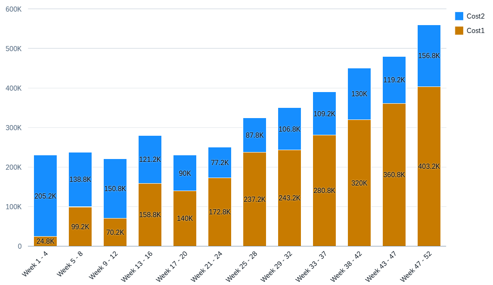

<!-- loio23f89e32c7c0444ca84b9d5752adbb09 -->

# Stacked Column Chart Card

You can render the chart as a stacked column chart. Similar to a column chart, its measures are stacked on top of each other irrespective of role.

  
  
**Example of a Stacked Column Chart**



Use a stacked column chart to compare the breakdown of multiple measures across one or more categories.

A stacked column chart has the following requirements:

-   At least one dimension with the `category` role.
-   One or more measures.

All dimensions with the `category` role are added to the category axis \(x-axis\). All dimensions with the `series` role are also stacked. We recommend either stacking based on dimensions or measures, but not mixing both in a single chart card.

> ### Note:  
> The column stack card can optionally include dimension with the `series` role. Assign a dimension with the **series** role to the property that contains the semantic values.

There should be at least one dimension with the assigned **category** role and all dimensions with this role are added to the **axis** category \(x-axis\). All dimensions with the **series** role are also stacked. We recommend either stacking based on dimensions or measures, but not mixing both in a single chart card.

The stacked column chart supports a color palette for semantic coloring. For more information, see [Configuring Charts on the Overview Page](configuring-charts-on-the-overview-page-c7c5a82.md).

The following code samples show how to configure a stacked column chart chart:

> ### Sample Code:  
> XML Annotation
> 
> ```xml
> <Annotation Term="UI.Chart" Qualifier="BarStackedPath">
>     <Record Type="UI.ChartDefinitionType">
>         <PropertyValue Property="Title" String="Items Stacked Bar Chart"/>
>         <PropertyValue Property="Description" String="Testing Stacked Bar Chart"/>
>         <PropertyValue Property="ChartType" EnumMember="UI.ChartType/BarStacked"/>
>         <PropertyValue Property="Measures">
>             <Collection>
>                 <PropertyPath>NetAmount</PropertyPath>
>             </Collection>
>         </PropertyValue>
>         <PropertyValue Property="MeasureAttributes">
>             <Collection>
>                 <Record Type="UI.ChartMeasureAttributeType">
>                     <PropertyValue Property="Measure" PropertyPath="NetAmount"/>
>                     <PropertyValue Property="Role" EnumMember="UI.ChartMeasureRoleType/Axis1"/>
>                     <PropertyValue Property="DataPoint" AnnotationPath="@UI.DataPoint#BarStackedPath"/>
>                 </Record>
>             </Collection>
>         </PropertyValue>
>     </Record>
> </Annotation>
> ```

> ### Sample Code:  
> ABAP CDS Annotation
> 
> No ABAP CDS annotation sample is available. Please use the local XML annotation.

> ### Sample Code:  
> CAP CDS Annotation
> 
> ```
> Chart #BarStackedPath                 : {
>     $Type            : 'UI.ChartDefinitionType',
>     Title            : 'Items Stacked Bar Chart',
>     Description      : 'Testing Stacked Bar Chart',
>     ChartType        : #BarStacked,
>     Measures         : [NetAmount],
>     MeasureAttributes: [{
>         $Type    : 'UI.ChartMeasureAttributeType',
>         Measure  : NetAmount,
>         Role     : #Axis1,
>         DataPoint: '@UI.DataPoint#BarStackedPath'
>     }]
> },
> ```

