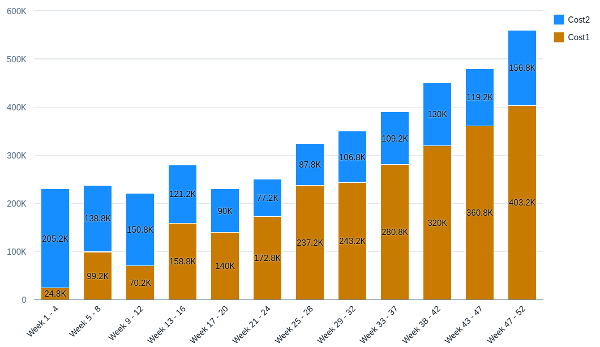

<!-- loioc54b815a908f423695d0e080d3830b7f -->

# Stacked Column Chart Card

A stacked column chart is similar to a column chart; however, all measures, irrespective of role, are stacked on top of each other

There should be at least one dimension with the assigned **category** role and all dimensions with this role are added to the **axis** category \(x-axis\). All dimensions with the **series** role are also stacked. We recommend either stacking based on dimensions or measures, but not mixing both in a single chart card.

> ### Note:  
> The column stack card can have an optional dimension with role series. Assign a dimension with the **series** role for the property containing the semantic values.

The stacked column chart supports a color palette for semantic coloring.

   
  
**Example of a Stacked Column Chart**

  

