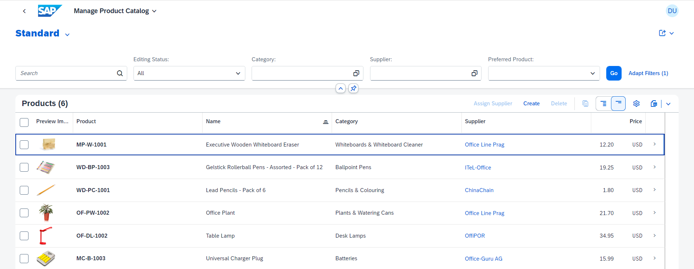
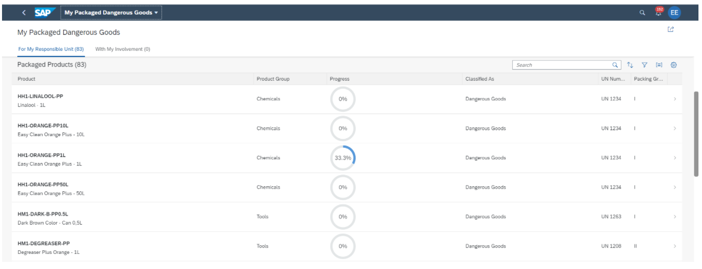
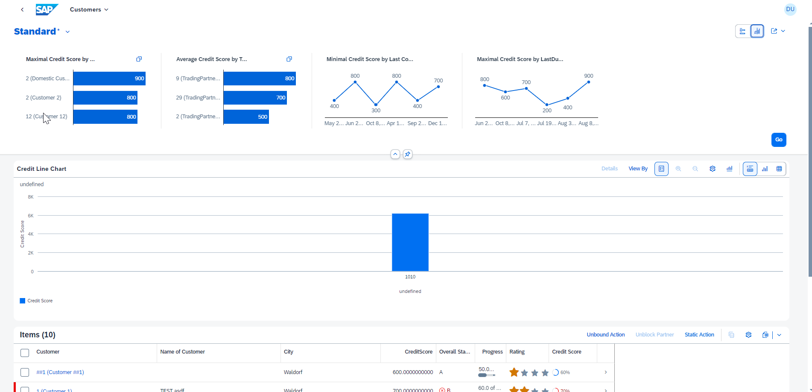
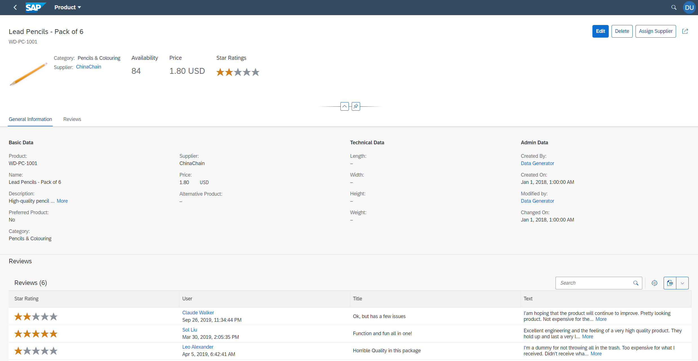
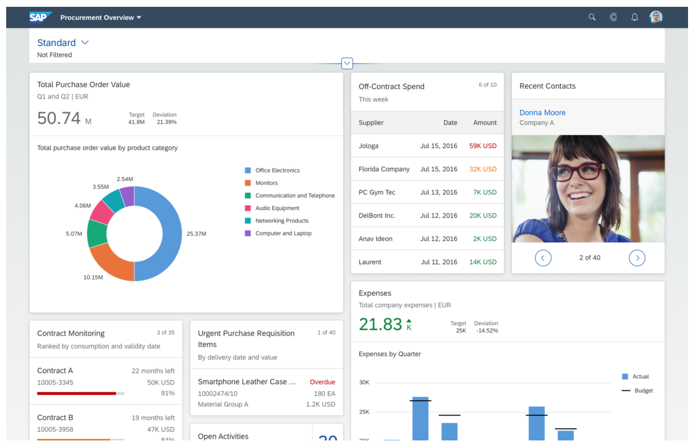

<!-- loio797c3239b2a9491fa137e4998fd76aa7 -->

# Standard Floorplans

Our floorplans provide you with predefined templates for common application use cases.

SAP Fiori elements floorplans provide you with predefined combinations of our building blocks that suit most standard use cases. You can create apps using the following  floorplans:

-   [List Report Page](list-report-elements-1cf5c7f.md)

    The list report page lets users filter, view, and work with a list of objects visualized as line items in a table.

    The list report page is typically used in conjunction with the object page.

      
      
    **List Report Page**

    

    You can also use the following specialized configurations of the list report page:

    -   [Worklist Page](worklist-d1d588f.md)

        This variant of the list report page displays a collection of items to be processed by the user in a table without filtering options. Working through the item list usually involves reviewing details of the list items and taking action. In most cases, the user has to either complete a work item or delegate it.

          
          
        **Worklist Page**

        

    -   [Analytical List Page](analytical-list-page-3d33684.md)

        This variant of the list report page supports analytical capabilities. It provides a unique way to analyze data step by step from different perspectives, to investigate a root cause through drilldown, and to act on transactional content. The analytical list page uses interactive charts and other data points, such as KPIs \(key performance indicators\).

          
          
        **Analytical List Page**

        

-   [Object Page](object-page-elements-645e27a.md)

    The object page lets users work with the details of an object. It provides functions for viewing, editing, and creating objects.

    The object page is typically used in conjunction with the list report page.

      
      
    **Object Page**

    

-   [Overview Page](overview-pages-c64ef8c.md)

    An overview page is a data-driven SAP Fiori app for organizing large amounts of information. Information is visualized in a card format in an attractive and efficient way. Different cards are used for different types of content. The user-friendly experience makes viewing, filtering, and acting on data quick and easy. While presenting the big picture, business users can focus on the most important tasks enabling faster decision making as well as immediate action.

      
      
    **Overview Page**

    

Generic information that applies to various floorplans can be found under [Building Blocks](building-blocks-24c1304.md) and [Global Patterns](global-patterns-56dce56.md).

> ### Note:  
> For information aboutSAP Fiori elements for OData V2, see [Using SAP Fiori Elements Floorplans](using-sap-fiori-elements-floorplans-0a0925d.md).

