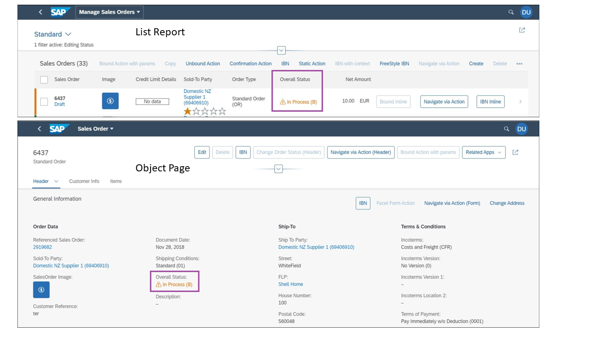

<!-- loio16411809012845a993198bc94c8a99a5 -->

# Status Colors and Icons

You can define status colors and icons.


The UI annotations in CDS for `LineItem`, `Identification` and `FieldGroup` have an attribute in the corresponding fields that indicates how critical the field is using colors and icons. This attribute has to refer to another property, which contains the value of the criticality.

> ### Sample Code:  
> XML Annotation
> 
> ```xml
> <Annotation Term="UI.LineItem">
>    <Collection>
>       <Record Type="UI.DataField">
>          <PropertyValue Property="Criticality" Path="to_ProductStock/StockCriticality"/>
>          <PropertyValue Property="Value" Path="to_ProductStock/StockEmergencyLevel"/>
>          <Annotation Term="UI.Importance" EnumMember="UI.ImportanceType/High"/>
>       </Record>
>    </Collection>
> </Annotation>
> ```

> ### Sample Code:  
> ABAP CDS Annotation
> 
> ```
> @UI.lineItem: [
>   {
>     criticality: '_ProductStock.StockCriticality',
>     value: '_ProductStock.StockEmergencyLevel',
>     importance: #HIGH
>   }
> ]
> ```

> ### Sample Code:  
> CAP CDS Annotation
> 
> ```
> UI.LineItem : [
>     {
>         $Type : 'UI.DataField',
>         Criticality : to_ProductStock.StockCriticality,
>         Value : to_ProductStock.StockEmergencyLevel,
>         ![@UI.Importance] : #High
>     }
> ]]
> ```


The property containing the criticality can have the following values \(derived from the complex type `CriticalityType` of the vocabulary `com.sap.vocabularies.UI.v1`\):

-   0 - Neutral

-   1 - Negative \(red\)

-   2 - Critical \(orange\)

-   3 - Positive \(green\)

-   > ### Note:  
    > -   By default, SAP Fiori elements assumes that the `DataField` is also marked with "CriticalityRepresentationType/WithIcon" and sets the icon of the `ObjectStatus` appropriately \(for example, for fields marked with "com.sap.vocabularies.UI.v1.CriticalityType/Negative", SAP Fiori elements sets the 'sap-icon://status-negative'\).
    > 
    > -   If the field is marked with "CriticalityRepresentationType/WithoutIcon", then the `ObjectStatus` is rendered without the icon.


The texts are not static, so you can change them to suit your needs by defining them in the criticality path. The following image shows examples of using these values in stock availability of products both in the list report and the object page:

  


<a name="loio16411809012845a993198bc94c8a99a5__section_ut3_p5b_jpb"/>

## Additional Features in SAP Fiori Elements for OData V4

SAP Fiori elements for OData V4 also supports an additional criticality type for items that need the user's: attention: 5 - Information \(blue\).

