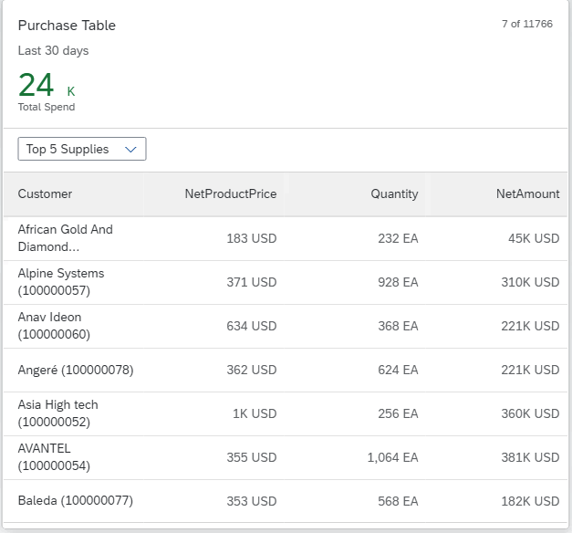

<!-- loio167bf7ccbb084afab7d846e1fa30b49c -->

# Table Cards

A table card displays a list of records in a 3-column table layout.


To create a table card, you need these annotations:

> ### Note:  
> \(Optional\) You can configure smart links in table cards to access quick links.




### Descriptor Settings: Title

Property: `title`

Description: Configuring this property displays the card title at the top of the table card.

**Configuration Sample:**

```
	"sap.ovp": {
		"globalFilterModel": "salesOrder",
		"globalFilterEntityType": "GlobalFilters",
              ...
              ...
		"cards": {
          "card014": {
            "model": "salesOrder",
            "template": "sap.ovp.cards.table",
            "settings": {
              "title": "Purchase Forecast",
              "entitySet": "SalesShare",
              ...
              ...
              ...
                }
              ]
            }
          },
```


### Descriptor Settings: Subtitle

Property: `subTitle`

Description: Configuring this property displays the card subtitle below the title of the table card.

**Configuration Sample:**

```
	"sap.ovp": {
		"globalFilterModel": "salesOrder",
		"globalFilterEntityType": "GlobalFilters",
              ...
              ...
		"cards": {
          "card014": {
            "model": "salesOrder",
            "template": "sap.ovp.cards.table",
            "settings": {
              "title": "Sales Forecast",
              "subTitle": "per Supplier",
              "entitySet": "SalesShare",
              ...
              ...
                }
              ]
            }
          },
```

You can display the unit of measure next to numeric values by providing the `sap:unit` attribute in the OData metadata file or by annotating the unit in the annotation document. For example, if you have the following data, and want to display 850 kg after the subtitle text

```
{
   CurrencyCode:"KG"
   GrossAmount:850
}
```

Use one of the following options:

Option 1: Define `sap:unit` in the metadata

```
<Property Name="CurrencyCode" Type="Edm.String" MaxLength="5" sap:label="Currency" sap:updatable="false" sap:semantics="currency-code"/>
<Property Name="GrossAmount" Type="Edm.Decimal" Precision="16" Scale="3" sap:unit="CurrencyCode" sap:label="Gross Amt." sap:creatable="false" sap:updatable="false"/>
```

Option 2: Define `Org.OData.Measures.V1.ISOCurrency` in annotations

```
<Annotations Target="GWSAMPLE_BASIC.SalesOrder/GrossAmount">
<Annotation Term="Org.OData.Measures.V1.ISOCurrency" Path="CurrencyCode"/>
</Annotations> 
```


### KPI annotation

Descriptor Settings

```
"sap.ovp": {//section for ovp-specific app descriptor settings
	...

	"kpiAnnotationPath":"com.sap.vocabularies.UI.v1.KPI#AllActualCosts", // Represents the KPI annotation path
	
     ...
}
}

```

**Annotation Sample**

> ### Sample Code:  
> XML Annotation
> 
> ```xml
> <Annotation Term="UI.KPI" Qualifier="Eval_by_Country-Generic">
>     <Record>
>         <PropertyValue Property="DataPoint" Path="@UI.DataPoint#Eval_by_Country-Generic" />
>         <PropertyValue Property="Detail">
>             <Record Type="UI.KPIDetailType">
>                 <PropertyValue Property="DefaultPresentationVariant" Path="@UI.PresentationVariant#Eval_by_Currency1" />
>                 <PropertyValue Property="AlternativePresentationVariants">
>                     <Collection>
>                         <Path>@UI.PresentationVariant#Eval_by_Currency_Column</Path>
>                     </Collection>
>                 </PropertyValue>
>                 <PropertyValue String="Action" Property="SemanticObject" />
>                 <PropertyValue String="toappnavsample" Property="Action" />
>             </Record>
>         </PropertyValue>
>         <PropertyValue String="String for KPI Annotation" Property="ID" />
>         <PropertyValue Property="SelectionVariantQualifier" Path="@UI.SelectionVariant#Eval_by_Currency_1" />
>     </Record>
> </Annotation>
> <Annotation Term="UI.DataPoint" Qualifier="Eval_by_Country_Generic">
>     <Record>
>         <PropertyValue Property="Value" Path="Currency" />
>         <PropertyValue String="test" Property="Title" />
>     </Record>
> </Annotation>
> ```

> ### Sample Code:  
> ABAP CDS Annotation
> 
> ```
> @UI.KPI: [
>   {
>     detail: {
>       defaultPresentationVariantQualifier: 'Eval_by_Currency1',
>       alternativePresentationVariantQualifiers: [
>         'Eval_by_Currency_Column'
>       ],
>       semanticObject: 'Action',
>       semanticObjectAction: 'toappnavsample'
>     },
>     selectionVariantQualifier: 'Eval_by_Currency_1',
>     id: 'String for KPI Annotation',
>     qualifier: 'Eval_by_Country-Generic',
>     dataPoint.title: 'test'
>   }
> ]
> ```

> ### Sample Code:  
> CAP CDS Annotation
> 
> ```
> UI.KPI #AllActualCosts : {
>     $Type : 'UI.KPIType',
>     Detail : {
>         $Type : 'UI.KPIDetailType',
>         DefaultPresentationVariant : ![@UI.PresentationVariant#Eval_by_Currency1],
>         AlternativePresentationVariants : [
>             ![@UI.PresentationVariant#Eval_by_Currency_Column]
>         ],
>         SemanticObject : 'Action',
>         Action : 'toappnavsample'
>     },
>     SelectionVariant : ![@UI.SelectionVariant#Eval_by_Currency_1],
>     DataPoint : ![@UI.DataPoint#Eval_by_Country-Generic],
>     ID : 'String for KPI Annotation'
> },
> ```

**`PresentationVariant` annotation**

> ### Sample Code:  
> XML Annotation
> 
> ```xml
> <Annotation Term="UI.PresentationVariant" Qualifier="Eval_by_Currency1">
>    <Record>
>       <PropertyValue Property="MaxItems" Int="5" />
>       <PropertyValue Property="GroupBy">
>          <Collection>
>             <PropertyPath>Country</PropertyPath>
>             <PropertyPath>Currency</PropertyPath>
>          </Collection>
>       </PropertyValue>
>       <PropertyValue Property="SortOrder">
>          <Collection>
>             <Record>
>                <PropertyValue Property="Property" PropertyPath="TotalSales" />
>                <PropertyValue Property="Descending" Bool="true" />
>             </Record>
>          </Collection>
>       </PropertyValue>
>       <PropertyValue Property="Visualizations">
>          <Collection>
>             <AnnotationPath>@UI.Chart#Eval_by_Currency_Donut</AnnotationPath>
>          </Collection>
>       </PropertyValue>
>    </Record>
> </Annotation>
> ```

> ### Sample Code:  
> ABAP CDS Annotation
> 
> ```
> 
> @UI.PresentationVariant: [
>   {
>     maxItems: 5,
>     groupBy: [
>       'COUNTRY',
>       'CURRENCY'
>     ],
>     sortOrder: [
>       {
>         by: 'TOTALSALES'
>       }
>     ],
>     visualizations: [
>       {
>         type: #AS_CHART,
>         qualifier: 'Eval_by_Currency_Donut'
>       }
>     ],
>     qualifier: 'Eval_by_Currency1'
>   }
> ]
> annotate view VIEWNAME with {
> 
> }
> ```

> ### Sample Code:  
> CAP CDS Annotation
> 
> ```
> UI.PresentationVariant #Eval_by_Currency1 : {
>     MaxItems : 5,
>     GroupBy : [
>         Country,
>         Currency
>     ],
>     SortOrder : [
>         {
>             Property : TotalSales,
>             Descending : true
>         },
>     ],
>     Visualizations : [
>         '@UI.Chart#Eval_by_Currency_Donut'
>     ],
> },
> ```

**`SelectionVariant` annotation**

> ### Sample Code:  
> XML Annotation
> 
> ```xml
> <Annotation Term="UI.SelectionVariant" Qualifier="Eval_by_Currency_1">
>    <Record>
>       <PropertyValue Property="SelectOptions">
>          <Collection>
>             <Record>
>                <PropertyValue Property="PropertyName" PropertyPath="Country" />
>                <PropertyValue Property="Ranges">
>                   <Collection>
>                      <Record>
>                         <PropertyValue Property="Sign" EnumMember="UI.SelectionRangeSignType/I" />
>                         <PropertyValue Property="Option" EnumMember="UI.SelectionRangeOptionType/EQ" />
>                         <PropertyValue Property="Low" String="IN" />
>                      </Record>
>                   </Collection>
>                </PropertyValue>
>             </Record>
>          </Collection>
>       </PropertyValue>
>       <PropertyValue Property="Parameters">
>          <Collection>
>             <Record Type="UI.Parameter">
>                <PropertyValue Property="PropertyName" PropertyPath="Currency_Target" />
>                <PropertyValue Property="PropertyValue" String="EUR" />
>             </Record>
>             <Record Type="UI.Parameter">
>                <PropertyValue Property="PropertyName" PropertyPath="UoM_Target" />
>                <PropertyValue Property="PropertyValue" String="KGM" />
>             </Record>
>          </Collection>
>       </PropertyValue>
>    </Record>
> </Annotation>
> ```

> ### Sample Code:  
> CAP CDS Annotation
> 
> ```
> UI.SelectionVariant #Eval_by_Currency_1 : {
>     SelectOptions : [
>         {
>             PropertyName : Country,
>             Ranges : [
>                 {
>                     Sign : #I,
>                     Option : #EQ,
>                     Low : 'IN'
>                 }
>             ]
>         }
>     ],
>     Parameters : [
>         {
>             $Type : 'UI.Parameter',
>             PropertyName : Currency_Target,
>             PropertyValue : 'EUR'
>         },
>         {
>             $Type : 'UI.Parameter',
>             PropertyName : UoM_Target,
>             PropertyValue : 'KGM'
>         }
>     ]
> }
> 
> 
> ```

**`DataPoint` annotation**

> ### Sample Code:  
> XML Annotation
> 
> ```xml
> <Annotation Term="UI.DataPoint" Qualifier="Eval_by_Country_Generic">
> 	<Record Type="UI.DataPointType">
> 		<PropertyValue Property="Title" String="Sales India - Generic Card" />
> 		<PropertyValue Property="Value" Path="Sales" />
> 		<PropertyValue Property="ValueFormat">
> 			<Record>
> 				<PropertyValue Property="ScaleFactor" Decimal="2" />
> 				<PropertyValue Property="NumberOfFractionalDigits" Int="1" />
> 			</Record>
> 		</PropertyValue>
> 		<PropertyValue Property="CriticalityCalculation">
> 			<Record>
> 				<PropertyValue Property="ImprovementDirection" EnumMember="UI.ImprovementDirectionType/Minimize" />
> 				<PropertyValue Property="DeviationRangeHighValue" String="7300" />
> 				<PropertyValue Property="ToleranceRangeHighValue" String="7200" />
> 			</Record>
> 		</PropertyValue>
> 		<PropertyValue Property="TargetValue" String="2.000 " />
> 		<PropertyValue Property="TrendCalculation">
> 			<Record>
> 				<PropertyValue Property="ReferenceValue" String="5201680" />
> 				<PropertyValue Property="DownDifference" Decimal="10000000.0" />
> 			</Record>
> 		</PropertyValue>
> 	</Record>
> </Annotation>
> ```

> ### Sample Code:  
> ABAP CDS Annotation
> 
> ```
> @UI.dataPoint: { 
> 	 title: 'Sales India - Generic Card',
> 	 valueFormat: { scaleFactor: 2, numberOfFractionalDigits: 1 },
> 	 criticalityCalculation: { 
> 	   improvementDirection: #MINIMIZE,
> 	   deviationRangeHighValue: 7300,
> 	   toleranceRangeHighValue: 7200
> 	 },
> 	 targetValue: 2.000,
> 	 trendCalculation: { referenceValue: 'refValElement', downDifference: 10000000.0 }
> }
> Sales;
> ```

> ### Sample Code:  
> CAP CDS Annotation
> 
> ```
> UI.DataPoint #Eval_by_Country-Generic : {
>     $Type : 'UI.DataPointType',
>     Title : 'Sales India - Generic Card',
>     Value : Sales,
>     ValueFormat : {
>         ScaleFactor : 2,
>         NumberOfFractionalDigits : 1
>     },
>     CriticalityCalculation : {
>         ImprovementDirection : #Minimizing,
>         DeviationRangeHighValue : '7300',
>         ToleranceRangeHighValue : '7200'
>     },
>     TargetValue : '2.000 ',
>     TrendCalculation : {
>         ReferenceValue : '5201680',
>         DownDifference : 10000000.0
>     }
> }
> ```


### Configuring View Switch

Property: `valueSelectionInfo`

Description: Configuring this property allows you to define a dropdown list to filter/view data at the card level.

Descriptor Settings

```
	"sap.ovp": {
		"globalFilterModel": "salesOrder",
		"globalFilterEntityType": "GlobalFilters",
		"showDateInRelativeFormat": false,
		"disableTableCardFlexibility": false,
		"considerAnalyticalParameters": true,
		"useDateRangeType": false,
		"cards": {
          "card014": {
            "model": "salesOrder",
            "template": "sap.ovp.cards.table",
            "settings": {
              "title": "Sales Forecast",
              "subTitle": "per Supplier",
              "valueSelectionInfo": "Value Selection Info",
              "entitySet": "SalesShare",
              "tabs": [
                {
                  "dynamicSubtitleAnnotationPath": "com.sap.vocabularies.UI.v1.HeaderInfo#dynamicSubtitle",
                  "annotationPath": "com.sap.vocabularies.UI.v1.LineItem#View1",
                  "selectionAnnotationPath": "com.sap.vocabularies.UI.v1.SelectionVariant#line1",
                  "presentationAnnotationPath": "com.sap.vocabularies.UI.v1.PresentationVariant#line",
                  "identificationAnnotationPath": "com.sap.vocabularies.UI.v1.Identification",
                  "dataPointAnnotationPath": "com.sap.vocabularies.UI.v1.DataPoint#line",
                  "value": "{{dropdown_value2}}"
                },
                {
                  "dynamicSubtitleAnnotationPath": "com.sap.vocabularies.UI.v1.HeaderInfo#dynamicSubtitle",
                  "annotationPath": "com.sap.vocabularies.UI.v1.LineItem#View4",
                  "identificationAnnotationPath": "com.sap.vocabularies.UI.v1.Identification#item2",
                  "dataPointAnnotationPath": "com.sap.vocabularies.UI.v1.DataPoint#line",
                  "value": "{{dropdown_value4}}"
                }
              ]
            }
          },
```


### Configuring the Table Area

Annotation: `LineItem`

Description: Configuring this annotation displays the table header title \(`Label` property\) and the corresponding values \(`Value` property\) for the row items.

**Descriptor Settings**

```
	"sap.ovp": {
		"globalFilterModel": "salesOrder",
		"globalFilterEntityType": "GlobalFilters",
		"showDateInRelativeFormat": false,
		"disableTableCardFlexibility": false,
		"considerAnalyticalParameters": true,
		"useDateRangeType": false,
		"cards": {
          "card014": {
            "model": "salesOrder",
            "template": "sap.ovp.cards.table",
            "settings": {
              "title": "Sales Forecast",
              "subTitle": "per Supplier",
              "valueSelectionInfo": "Value Selection Info",
              "entitySet": "SalesShare",
              "tabs": [
                {
                  "dynamicSubtitleAnnotationPath": "com.sap.vocabularies.UI.v1.HeaderInfo#dynamicSubtitle",
                  "annotationPath": "com.sap.vocabularies.UI.v1.LineItem#View1",
                  "selectionAnnotationPath": "com.sap.vocabularies.UI.v1.SelectionVariant#line1",
                  "presentationAnnotationPath": "com.sap.vocabularies.UI.v1.PresentationVariant#line",
                  "identificationAnnotationPath": "com.sap.vocabularies.UI.v1.Identification",
                  "dataPointAnnotationPath": "com.sap.vocabularies.UI.v1.DataPoint#line",
                  "value": "{{dropdown_value2}}"
                },
                {
                  "dynamicSubtitleAnnotationPath": "com.sap.vocabularies.UI.v1.HeaderInfo#dynamicSubtitle",
                  "annotationPath": "com.sap.vocabularies.UI.v1.LineItem#View4",
                  "identificationAnnotationPath": "com.sap.vocabularies.UI.v1.Identification#item2",
                  "dataPointAnnotationPath": "com.sap.vocabularies.UI.v1.DataPoint#line",
                  "value": "{{dropdown_value4}}"
                }
              ]
            }
          },
```

**Annotation Sample for `LineItem#View4`**

> ### Sample Code:  
> XML Annotation
> 
> ```xml
> <Annotation Term="com.sap.vocabularies.UI.v1.LineItem" Qualifier="View4">
>     <Collection>
>         <Record Type="com.sap.vocabularies.UI.v1.DataField">
>             <PropertyValue Property="Label" String="Order ID"/>
>             <PropertyValue Property="Value" Path="SalesOrderID"/>
>         </Record>
>         <Record Type="com.sap.vocabularies.UI.v1.DataField">
>             <PropertyValue Property="Label" String="Customer"/>
>             <PropertyValue Property="Value" Path="ToBusinessPartner/EmailAddress"/>
>         </Record>
>         <Record Type="com.sap.vocabularies.UI.v1.DataField">
>             <PropertyValue Property="Label" String="Customer"/>
>             <PropertyValue Property="Value" Path="CustomerName"/>
>         </Record>
>         <Record Type="com.sap.vocabularies.UI.v1.DataFieldForAnnotation">
>             <PropertyValue Property="Label" String="TaxAmount"/>
>             <PropertyValue Property="Target" AnnotationPath="@com.sap.vocabularies.UI.v1.DataPoint#TaxAmount"/>
>         </Record>
>     </Collection>
> </Annotation>
> ```

> ### Sample Code:  
> ABAP CDS Annotation
> 
> ```
> @UI.lineItem: [
>   {
>     label: 'Order ID',
>     position: 10,
>     qualifier: 'View4'
>   }
> ]
> SALESORDERID;
> 
> @UI.lineItem: [
>   {
>     label: 'Customer',
>     value: '_BUSINESSPARTNER.EMAILADDRESS',
>     position: 20,
>     qualifier: 'View4'
>   }
> ]
> _BUSINESSPARTNER;
> 
> @UI.lineItem: [
>   {
>     label: 'Customer',
>     position: 30,
>     qualifier: 'View4'
>   }
> XML Annotation
> 
> <Annotations Target="GWSAMPLE_BASIC.GWSAMPLE_BASIC_Entities/RegenerateAllData">
>         <Annotation Term="com.sap.vocabularies.Common.v1.IsActionCritical" Bool="true"/>
> </Annotations>
> CAP CDS Annotation
> 
> annotate GWSAMPLE_BASIC.RegenerateAllData with @(
>     Common.IsActionCritical : true
> );
> ]
> CUSTOMERNAME;
> 
> @UI.lineItem: [
>   {
>     label: 'TaxAmount',
>     valueQualifier: 'TaxAmount',
>     type: #AS_DATAPOINT,
>     position: 40,
>     qualifier: 'View4'
>   }
> ]
> PROPERTY_NAME;
> 
> ```

> ### Sample Code:  
> CAP CDS Annotation
> 
> ```
> UI.LineItem #View4 : [
>     {
>         $Type : 'UI.DataField',
>         Label : 'Order ID',
>         Value : SalesOrderID
>     },
>     {
>         $Type : 'UI.DataField',
>         Label : 'Customer',
>         Value : ToBusinessPartner.EmailAddress
>     },
>     {
>         $Type : 'UI.DataField',
>         Label : 'Customer',
>         Value : CustomerName
>     },
>     {
>         $Type : 'UI.DataFieldForAnnotation',
>         Label : 'TaxAmount',
>         Target : '@UI.DataPoint#TaxAmount'
>     }
> ]
> 
> ```

**Annotation Sample for `DataPoint#TaxAmount`**

> ### Sample Code:  
> XML Annotation
> 
> ```xml
> <Annotation Term="com.sap.vocabularies.UI.v1.DataPoint" Qualifier="TaxAmount">
>     <Record Type="com.sap.vocabularies.UI.v1.DataPointType">
>         <PropertyValue Property="Title" String="TaxAmount"/>
>         <PropertyValue Property="Value" Path="TaxAmount"/>
>     </Record>
> </Annotation>
> ```

> ### Sample Code:  
> ABAP CDS Annotation
> 
> ```
> 
> @UI.dataPoint: {
>   title: 'TaxAmount'
> }
> TaxAmount;
> ```

> ### Sample Code:  
> CAP CDS Annotation
> 
> ```
> UI.DataPoint #TaxAmount : {
>     $Type : 'UI.DataPointType',
>     Title : 'TaxAmount',
>     Value : TaxAmount
> }
> ```


The `com.sap.vocabularies.UI.v1.LineItem` term can be configured in the application manifest file by setting the `annotationPath` property with a qualifier, as shown in the example below. If the `annotationPath` property is not configured, the `com.sap.vocabularies.UI.v1.LineItem` term, without a qualifier, is used.

> ### Sample Code:  
> ```
> "sap.ovp": {
>     ...
>     "disableTableCardFlexibility": false,
>     ...
>     "card02": {
> 	"model": "salesOrder",
> 	"template": "sap.ovp.cards.table",
> 	"settings": {
> 		"title": "Sales Orders With Analytical Header",
> 		"subTitle": "Sales Orders With Analytical Header",
> 		"listFlavor": "bar",
> 		"listType": "extended",
> 		"entitySet": "SalesOrderSet",
> 		"dataPointAnnotationPath": "com.sap.vocabularies.UI.v1.DataPoint#line_without_trend",
> 		"selectionAnnotationPath": "com.sap.vocabularies.UI.v1.SelectionVariant#line1",
>           "annotationPath": "com.sap.vocabularies.UI.v1.LineItem#View1",
> 		"presentationAnnotationPath": "com.sap.vocabularies.UI.v1.PresentationVariant#line"
> 	  }
>     },
>       ...
>   }
> }
> ```

> ### Note:  
> In SAP Fiori elements for OData V4, add `sap.ovp.cards.v4.table` as the `template`. All other manifest settings are the same as in SAP Fiori elements for OData V2.

You can use different `com.sap.vocabularies.UI.v1.LineItem` annotations for different card instances of the same entity type by using different qualifiers and setting the `annotationPath` property with the qualifier in the card configuration. For example `com.sap.vocabularies.UI.v1.LineItem#Qualifier1`.

If you set `"disableTableCardFlexibility": true`, then at runtime, `DataField` records are sorted according to importance set in the `com.sap.vocabularies.UI.v1.ImportanceType` annotation, and their order of entry. The first two `DataField` records are displayed in the first two columns of the table. If there is a `DataFieldForAnnotation` record that has a `DataPoint` target, it is used for the third column and its value is highlighted according to the criticality of the `DataPoint`. If no `DataFieldForAnnotation` is defined, the next `DataField` record is displayed in the third column.

If you set `"disableTableCardFlexibility": false`, then at runtime, table columns are sorted according to the importance set in the `com.sap.vocabularies.UI.v1.ImportanceType` annotation, and their order of entry.

> ### Note:  
> If a `DataField` record points to a path that exists in a `DataPoint` target, it is skipped so that the property is not displayed more than once in the same table.


## Example

In this example, the first column in the table displays **Product Name**, the second column displays **Supplier**, and the third column displays **Weight Measure** \(according to the `DataPoint` target\).

> ### Sample Code:  
> XML Annotation
> 
> ```xml
> <Annotation Term="com.sap.vocabularies.UI.v1.DataPoint" Qualifier="WeightMeasure">
>     <Record Type="com.sap.vocabularies.UI.v1.DataPointType">
>         <PropertyValue Property="Title" String="Weight"/>
>         <PropertyValue Property="Description" Path="Name"/>
>         <PropertyValue Property="Value" Path="WeightMeasure"/>
>         <PropertyValue Property="CriticalityCalculation">
>             <Record Type="com.sap.vocabularies.UI.v1.CriticalityCalculationType">
>                 <PropertyValue Property="ImprovementDirection" EnumMember="com.sap.vocabularies.UI.v1.CriticalityCalculationType/Maximize"/>
>                 <PropertyValue Property="ToleranceRangeLowValue" Int="2"/>
>                 <PropertyValue Property="DeviationRangeLowValue" Int="4"/>
>             </Record>
>         </PropertyValue>
>     </Record>
> </Annotation>
> 
> <Annotation Term="com.sap.vocabularies.UI.v1.LineItem">
>     <Collection>
>         <Record Type="com.sap.vocabularies.UI.v1.DataField">
>             <PropertyValue Property="Label" String="Product ID"/>
>             <PropertyValue Property="Value" Path="ProductID"/>
>         </Record>
>         <Record Type="com.sap.vocabularies.UI.v1.DataField">
>             <PropertyValue Property="Label" String="Category"/>
>             <PropertyValue Property="Value" Path="Category"/>
>         </Record>
>         <Record Type="com.sap.vocabularies.UI.v1.DataField">
>             <PropertyValue Property="Label" String="Product Name"/>
>             <PropertyValue Property="Value" Path="Name"/>
>             <Annotation Term="com.sap.vocabularies.UI.v1.Importance" EnumMember="com.sap.vocabularies.UI.v1.ImportanceType/High"/>
>         </Record>
>         <Record Type="com.sap.vocabularies.UI.v1.DataField">
>             <PropertyValue Property="Label" String="Supplier"/>
>             <PropertyValue Property="Value" Path="SupplierName"/>
>             <Annotation Term="com.sap.vocabularies.UI.v1.Importance" EnumMember="com.sap.vocabularies.UI.v1.ImportanceType/High"/>
>         </Record>
>         <Record Type="com.sap.vocabularies.UI.v1.DataField">
>             <PropertyValue Property="Label" String="Unit Price"/>
>             <PropertyValue Property="Value" Path="Price"/>
>             <Annotation Term="com.sap.vocabularies.UI.v1.Importance" EnumMember="com.sap.vocabularies.UI.v1.ImportanceType/High"/>
>         </Record>
>         <Record Type="com.sap.vocabularies.UI.v1.DataFieldForAnnotation">
>             <PropertyValue Property="Label" String="Weight Measure"/>
>             <PropertyValue Property="Target" AnnotationPath="@com.sap.vocabularies.UI.v1.DataPoint#WeightMeasure"/>
>         </Record>
>     </Collection>
> </Annotation>
> ```

> ### Sample Code:  
> ABAP CDS Annotation
> 
> ```
> 
> @UI.dataPoint: { 
>  title: 'Weight',
>  description: 'Name',
>  valueFormat: { scaleFactor: 2, numberOfFractionalDigits: 1 },
>  criticalityCalculation: { 
>    improvementDirection: #MAXIMIZE,
>    deviationRangeHighValue: 4.3,
>    toleranceRangeHighValue: 2.5
> }
> WeightMeasure;
> 
> @UI.lineItem: [
>   {
>     label: 'Product ID',
>     position: 10 
>   }
> ]
> PRODUCTID;
> 
> @UI.lineItem: [
>   {
>     label: 'Category',
>     position: 20
>   }
> ]
> CATEGORY;
> 
> @UI.lineItem: [
>   {
>     importance: #HIGH,
>     label: 'Product Name',
>     position: 30
>   }
> ]
> NAME;
> 
> @UI.lineItem: [
>   {
>     importance: #HIGH,
>     label: 'Supplier',
>     position: 40 
>   }
> ]
> SUPPLIERNAME;
> 
> @UI.lineItem: [
>   {
>     importance: #HIGH,
>     label: 'Unit Price',
>     position: 50
>   }
> ]
> PRICE;
> 
> @UI.lineItem: [
>   {
>     label: 'Weight Measure',
>     valueQualifier: 'WeightMeasure',
>     type: #AS_DATAPOINT,
>     position: 60 
>   }
> ]
> PROPERTY_NAME;
> 
> ```

> ### Sample Code:  
> CAP CDS Annotation
> 
> ```
> 
> UI.DataPoint #WeightMeasure : {
>     $Type : 'UI.DataPointType',
>     Title : 'Weight',
>     Description : Name,
>     Value : WeightMeasure,
>     CriticalityCalculation : {
>         $Type : 'UI.CriticalityCalculationType',
>         ImprovementDirection : #Maximize,
>         ToleranceRangeLowValue : 2.5,
>         DeviationRangeLowValue : 4.3
>     }
> },
> UI.LineItem : [
>     {
>         $Type : 'UI.DataField',
>         Label : 'Product ID',
>         Value : ProductID
>     },
>     {
>         $Type : 'UI.DataField',
>         Label : 'Category',
>         Value : Category
>     },
>     {
>         $Type : 'UI.DataField',
>         Label : 'Product Name',
>         Value : Name,
>         ![@UI.Importance] : #High
>     },
>     {
>         $Type : 'UI.DataField',
>         Label : 'Supplier',
>         Value : SupplierName,
>         ![@UI.Importance] : #High
>     },
>     {
>         $Type : 'UI.DataField',
>         Label : 'Unit Price',
>         Value : Price,
>         ![@UI.Importance] : #High
>     },
>     {
>         $Type : 'UI.DataFieldForAnnotation',
>         Label : 'Weight Measure',
>         Target : '@UI.DataPoint#WeightMeasure'
>     }
> ]
> 
> ```


<a name="loio167bf7ccbb084afab7d846e1fa30b49c__section_ds3_s1l_2bb"/>

## Smart Links

Define a semantic object for the entity set and its property using the annotation target to enable smart links in a table card. For example:

> ### Sample Code:  
> XML Annotation
> 
> ```xml
> <Annotations Target="GWSAMPLE_BASIC.SalesOrder/SalesOrderID">
>     <Annotation Term="com.sap.vocabularies.Common.v1.SemanticObject" String="OVP" />
> </Annotations>
> ```

> ### Sample Code:  
> ABAP CDS Annotation
> 
> ```
> 
> annotate view SALESORDER with {
>   @Consumption.semanticObject: 'OVP'
>   salesorderid;
> }
> ```

> ### Sample Code:  
> CAP CDS Annotation
> 
> ```
> 
> annotate GWSAMPLE_BASIC.SalesOrder with {
>   @Common.SemanticObject : 'OVP'
>   SalesOrderID
> };
> ```

Table cards also let you view contact information if you have defined the `com.sap.vocabularies.Communication.v1.Contact` annotation.

> ### Sample Code:  
> XML Annotation
> 
> ```xml
> <Annotation Term="com.sap.vocabularies.UI.v1.LineItem" Qualifier="NewSalesOrders">
>     <Collection>
>         <Record Type="com.sap.vocabularies.UI.v1.DataField">
>             <PropertyValue Property="Label" String="Order ID (Company)"/>
>             <PropertyValue Property="Value" Path="SalesOrderID"/>
>         </Record>
>         <Record Type="com.sap.vocabularies.UI.v1.DataFieldForAnnotation">
>             <PropertyValue Property="Label" String="Created by (Role)" />
>             <PropertyValue Property="Target" AnnotationPath="ToBusinessPartner/@com.sap.vocabularies.Communication.v1.Contact" />
>         </Record>
>     </Collection>
> </Annotation>
> ```

> ### Sample Code:  
> ABAP CDS Annotation
> 
> ```
> 
> @UI.lineItem: [
>   {
>     label: 'Order ID (Company)',
>     position: 10,
>     qualifier: 'NewSalesOrders'
>   }
> ]
> SALESORDERID;
> 
> @UI.lineItem: [
>   {
>     label: 'Created by (Role)',
>     value: '_BUSINESSPARTNER',
>     type: #AS_CONTACT,
>     position: 20 ,
>     qualifier: 'NewSalesOrders'
>   }
> ]
> PROPERT_NAME;
> 
> ```

> ### Sample Code:  
> CAP CDS Annotation
> 
> ```
> 
> UI.LineItem #NewSalesOrders : [
>     {
>         $Type : 'UI.DataField',
>         Label : 'Order ID (Company)',
>         Value : SalesOrderID
>     },
>     {
>         $Type : 'UI.DataFieldForAnnotation',
>         Label : 'Created by (Role)',
>         Target : 'ToBusinessPartner/@Communication.Contact'
>     }
> ]
> 
> ```

> ### Sample Code:  
> XML Annotation
> 
> ```xml
> <Annotation Term="com.sap.vocabularies.Communication.v1.Contact">
>    <Record>
>       <PropertyValue Property="tel">
>          <Collection>
>             <Record>
>                <PropertyValue Property="type" EnumMember="com.sap.vocabularies.Communication.v1.PhoneType/fax" />
>                <PropertyValue Property="uri" Path="FaxNumber" />
>             </Record>
>             <Record>
>                <PropertyValue Property="type" EnumMember="com.sap.vocabularies.Communication.v1.PhoneType/work com.sap.vocabularies.Communication.v1.PhoneType/preferred" />
>                <PropertyValue Property="uri" Path="PhoneNumber" />
>             </Record>
>          </Collection>
>       </PropertyValue>
>       <PropertyValue Property="email">
>          <Collection>
>             <Record>
>                <PropertyValue Property="type" EnumMember="com.sap.vocabularies.Communication.v1.ContactInformationType/preferred com.sap.vocabularies.Communication.v1.ContactInformationType/work" />
>                <PropertyValue Property="address" Path="EmailAddress" />
>             </Record>
>          </Collection>
>       </PropertyValue>
>    </Record>
> </Annotation>
> ```

> ### Sample Code:  
> ABAP CDS Annotation
> 
> ```
> 
> define view VIEWNAME
> {
>   @Semantics.name.fullName: true
>   CompanyName,
> 
>   @Semantics.eMail.address: true
>   @Semantics.eMail.type:  [#WORK]
>   EmailAddress,
>    
>   @Semantics.telephone.type:  [ #FAX ] 
>   FaxNumber,
>   
>   @Semantics.telephone.type:  [ #WORK]
>   PhoneNumber
> }
> 
> ```

> ### Sample Code:  
> CAP CDS Annotation
> 
> ```
> 
> Communication.Contact : {
>     tel : [
>         {
>             type : #fax,
>             uri : FaxNumber
>         },
>         {
>             type : [ #work, #pref ],
>             uri : PhoneNumber
>         },
>     ],
>     email : [
>         {
>             type : [ #pref, #work ],
>             address : EmailAddress
>         }
>     ]
> }
> ```


<a name="loio167bf7ccbb084afab7d846e1fa30b49c__section_f3m_ftv_kcb"/>

## Text Arrangement

The text arrangement annotation lets you to format of text.

> ### Sample Code:  
> XML Annotation
> 
> ```xml
> <Annotations xmlns="http://docs.oasis-open.org/odata/ns/edm" Target="GWSAMPLE_BASIC.SalesOrder/CustomerID">
>     <Annotation Term="com.sap.vocabularies.Common.v1.Text" Path="Supplier_Name">
>         <Annotation Term="com.sap.vocabularies.UI.v1.TextArrangement" EnumMember="com.sap.vocabularies.UI.v1.TextArrangementType/TextLast" />
>     </Annotation>
> </Annotations>
> ```

> ### Sample Code:  
> ABAP CDS Annotation
> 
> ```
> 
> annotate view SALESORDER with {
>  @UI.TextArrangement: #TEXT_LAST
>  customerid;
> }
> ```

> ### Sample Code:  
> CAP CDS Annotation
> 
> ```
> 
> annotate GWSAMPLE_BASIC.SalesOrder with {
>   @Common.Text : Supplier_Name
>   @UI.TextArrangement : #TextLast
>   CustomerID
> };
> 
> ```

In the preceding example, the text `Customer` is bound to the `ContactID` property and appears as shown in the table:


<table>
<tr>
<th valign="top">

Text Arrangement Type


</th>
<th valign="top">

Result


</th>
</tr>
<tr>
<td valign="top">

 `TextLast` 


</td>
<td valign="top">

ContractID \(Customer\)


</td>
</tr>
<tr>
<td valign="top">

 `TextFirst` 


</td>
<td valign="top">

Customer \(ContractID\)


</td>
</tr>
<tr>
<td valign="top">

 `TextOnly` 


</td>
<td valign="top">

Customer


</td>
</tr>
</table>


<a name="loio167bf7ccbb084afab7d846e1fa30b49c__section_fwt_qbr_w3b"/>

## Text Alignment

The DataPoint or DataField is aligned as shown in the table below:


<table>
<tr>
<th valign="top">

Annotation Field


</th>
<th valign="top">

Table Alignment


</th>
</tr>
<tr>
<td valign="top">

DataField, Contact annotation


</td>
<td valign="top">

Left Aligned


</td>
</tr>
<tr>
<td valign="top">

DataPoint with or without Criticality/CriticalityCalculation OR property \(either DataField or DataPoint\) of type Edm.DateTime or Edm.DateTimeOffset


</td>
<td valign="top">

Right Aligned


</td>
</tr>
<tr>
<td valign="top">

DataPoint with Criticality and property of type Edm.String


</td>
<td valign="top">

Center Aligned


</td>
</tr>
</table>

