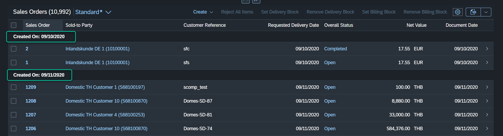
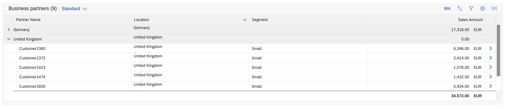
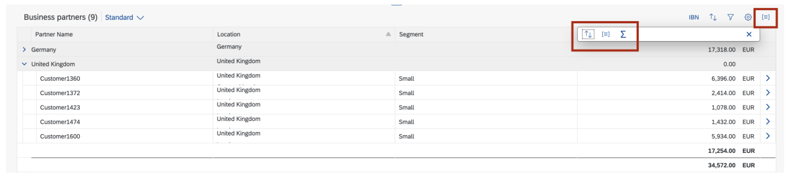

<!-- loiod344c5aa5c81483482dbbed5b3abb142 -->

# Table Groupings

SAP Fiori elements handles table groupings automatically.

The grouping of rows is supported in analytical tables \(`sap.ui.Table.AnalyticalTable`\) and responsive tables \(`sap.m.Table`\). Grid tables and tree tables are not supported.

Table grouping of rows looks like this:

  


<a name="loiod344c5aa5c81483482dbbed5b3abb142__section_nzy_r1y_rgb"/>

## Restrictions

For analytical tables, take the following restrictions into account:

-   Grouping can only be activated for dimension columns.

-   Grouping takes place on the server. The header formatter has no effect on the grouping itself. This means that groups stay separate even if they have the same header after formatting.

-   The `TextArrangement` annotation is not supported. A property with a text property is displayed as follows: “m – Meter”. For more information, see the *API Reference* for [`TextArrangement`](https://ui5.sap.com/#/api/sap.ui.comp.smarttable.SmartTable/annotations/TextArrangement).

-   Displaying values with units of measure is not supported.


<a name="loiod344c5aa5c81483482dbbed5b3abb142__section_ijw_ywg_bsb"/>

## Additional Features in SAP Fiori Elements for OData V2


### Grouping Header Text

These group header formatters are automatically set by SAP Fiori elements:

-   Responsive table: Set a grouping function on the sorter: `fnGroup of sap.ui.model.Sorter`.

-   Analytical table: Set property `groupHeaderFormatter` of `sap.ui.table.AnalyticalColumn`.


### Grouping Header Types

SAP Fiori elements supports these group header formatters:


<table>
<tr>
<th valign="top">

OData Type


</th>
<th valign="top">

SAP Display Format


</th>
<th valign="top">

OData Example


</th>
<th valign="top">

Unformatted


</th>
<th valign="top">

Formatted


</th>
<th valign="top">

Comments


</th>
</tr>
<tr>
<td valign="top">

Edm.DateTimeOffsetDate


</td>
<td valign="top">

Date


</td>
<td valign="top">

/Date\(1485471600000 +0000\)/


</td>
<td valign="top">

Fri Jan 27 2017 00:00:00 GMT+0100 \(Central European Standard Time\)


</td>
<td valign="top">

Jan 26, 2017


</td>
<td valign="top">

UTC


</td>
</tr>
<tr>
<td valign="top">

Edm.DateTimeOffset


</td>
<td valign="top">

 


</td>
<td valign="top">

/Date\(1485471600000 +0000\)/


</td>
<td valign="top">

Fri Jan 27 2017 00:00:00 GMT+0100 \(Central European Standard Time\)


</td>
<td valign="top">

Jan 27, 2017, 12:00:00 AM


</td>
<td valign="top">

 


</td>
</tr>
<tr>
<td valign="top">

Edm.DateTime


</td>
<td valign="top">

Date


</td>
<td valign="top">

/Date\(1485471600000 +0000\)/


</td>
<td valign="top">

Fri Jan 27 2017 00:00:00 GMT+0100 \(Central European Standard Time\)


</td>
<td valign="top">

Jan 26, 2017


</td>
<td valign="top">

UTC


</td>
</tr>
<tr>
<td valign="top">

Edm.DateTime


</td>
<td valign="top">

 


</td>
<td valign="top">

/Date\(1485471600000 +0000\)/


</td>
<td valign="top">

Fri Jan 27 2017 00:00:00 GMT+0100 \(Central European Standard Time\)


</td>
<td valign="top">

Jan 27, 2017, 12:00:00 AM


</td>
<td valign="top">

 


</td>
</tr>
<tr>
<td valign="top">

Edm.Time


</td>
<td valign="top">

Time


</td>
<td valign="top">

PT11H13M01S


</td>
<td valign="top">

\[object Object\] is: \{ms: 43980000, \_\_edmType: "Edm.Time"\}


</td>
<td valign="top">

11:13:01 AM


</td>
<td valign="top">

 


</td>
</tr>
<tr>
<td valign="top">

Edm.String


</td>
<td valign="top">

Date


</td>
<td valign="top">

20180313


</td>
<td valign="top">

20180313


</td>
<td valign="top">

Mar 13, 2018


</td>
<td valign="top">

 


</td>
</tr>
<tr>
<td valign="top">

Edm.Boolean


</td>
<td valign="top">

 


</td>
<td valign="top">

true


</td>
<td valign="top">

true


</td>
<td valign="top">

Yes


</td>
<td valign="top">

 


</td>
</tr>
<tr>
<td valign="top">

Edm.Decimal


</td>
<td valign="top">

 


</td>
<td valign="top">

10


</td>
<td valign="top">

10


</td>
<td valign="top">

10.000 m\*


</td>
<td valign="top">

Unit of measure


</td>
</tr>
<tr>
<td valign="top">

Edm.Decimal


</td>
<td valign="top">

 


</td>
<td valign="top">

2498.00


</td>
<td valign="top">

2498.00


</td>
<td valign="top">

2,498.00 EUR\*


</td>
<td valign="top">

Currency


</td>
</tr>
<tr>
<td valign="top">

Edm.String


</td>
<td valign="top">

 


</td>
<td valign="top">

m


</td>
<td valign="top">

m


</td>
<td valign="top">

Meter \(m\)\*


</td>
<td valign="top">

Unit of measure and TextArrangement


</td>
</tr>
<tr>
<td valign="top">

Edm.String


</td>
<td valign="top">

 


</td>
<td valign="top">

EUR


</td>
<td valign="top">

EUR


</td>
<td valign="top">

Euro \(EUR\)\*


</td>
<td valign="top">

Currency and TextArrangement


</td>
</tr>
</table>

\* Units of measure or currencies in the grouping header are supported only in responsive tables.


<a name="loiod344c5aa5c81483482dbbed5b3abb142__section_sh2_xc4_3qb"/>

## Additional Features in SAP Fiori Elements for OData V4


### Table Groupings

Grouping is enabled by default for responsive columns. Ensure that all sortable columns can be grouped.

You can disable grouping in a responsive table using the table personalization in the `manifest.json` as shown in the following sample code:

> ### Sample Code:  
> ```
> "_Item/@com.sap.vocabularies.UI.v1.LineItem": {
>      "tableSettings": {
>           "type": "ResponsiveTable",
>           "condensedTableLayout": true,
>           "personalization": {
>                "column": true,
>                "sort": false,
>                "group": false
>           },
>           ...
>      }
> }
> ```


### Defining Default Groups and Totals

You can define default groups to be loaded when the application is launched. For analytical tables, you can also define totals.

You can define one or several group levels. To do so, use the `PresentationVariant` annotation. For details about how to use a particular `PresentationVariant` \(PV\) or `SelectionPresentationVariant` \(SPV\), see [Configuring Default Settings \(Visualizations, Sort Order, Filter Values\)](configuring-default-settings-visualizations-sort-order-filter-values-49a6ba5.md).

The default SPV or PV is read as follows:

> ### Sample Code:  
> XML Annotation
> 
> ```xml
> <Annotations Target="sap.fe.managepartners.ManagePartnersService.EntityContainer/BusinessPartners">
> <Annotation Term="UI.PresentationVariant">
>   <Record Type="UI.PresentationVariantType">
>     <PropertyValue Property="GroupBy">
>       <Collection>
>         <PropertyPath>Country</PropertyPath>
>       </Collection>
>     </PropertyValue>
>     <PropertyValue Property="Total">
>       <Collection>
>         <PropertyPath>SalesAmount</PropertyPath>
>       </Collection>
>     </PropertyValue>
>     <PropertyValue Property="Visualizations">
>       <Collection>
>         <AnnotationPath>@UI.Chart</AnnotationPath>
>         <AnnotationPath>@UI.LineItem</AnnotationPath>
>       </Collection>
>     </PropertyValue>
>   </Record>
> </Annotation>
> </Annotations>
> ```

> ### Sample Code:  
> CAP CDS Annotation
> 
> ```
> UI.PresentationVariant : {
>     GroupBy : [
>         Country
>     ],
>     Total : [
>         SalesAmount
>     ],
>     Visualizations : [
>         '@UI.Chart',
>         '@UI.LineItem',
>     ]
> }
> ```

> ### Caution:  
> You must provide a `PresentationVariant.Visualizations` entry. Otherwise, the presentation variant won't be considered.
> 
> The chart visualization is only rendered in the analytical list page template. In the list report, only the line item is rendered.

You can see the grouping applied on the *Country* property, and the totals for the *Sales Amount* in the following screenshot:

  

End users can always change groups and totals via the column header and the aggregation icon of the analytical table:

  


### Restrictions

-   Filtering on aggregatable properties is currently not supported and is also removed from the filter bar and from the filter dialog of the table.

-   If a group has multiple units or currencies in its data, the total canot be computed. It then displays an asterisk \("\*"\) instead of the aggregated value.

-   Only one level of grouping is supported in a responsive table. If you have specified multiple levels through a `PresentationVariant`, for example, only the first level is applied.


