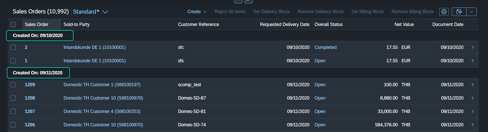
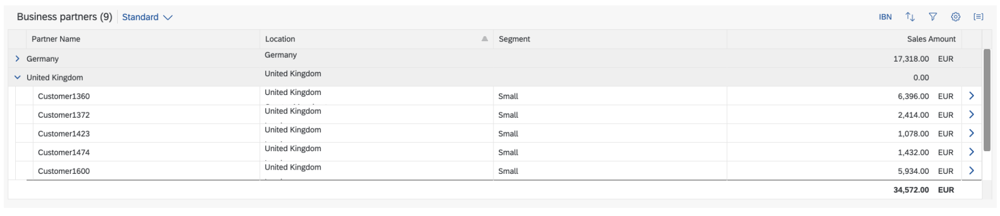
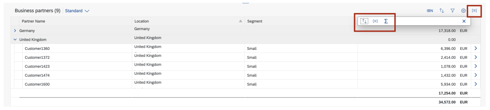

<!-- loiod344c5aa5c81483482dbbed5b3abb142 -->

# Table Groupings

You can disable table grouping or define default table groups in different table types.

SAP Fiori elements handles table groupings automatically.

The grouping of rows is supported in analytical tables \(`sap.ui.Table.AnalyticalTable`\) and responsive tables \(`sap.m.Table`\). Grid tables and tree tables are not supported.

An example of row grouping in a table is shown in the following screenshot:



Grouping is enabled by default for responsive columns. Ensure that all sortable columns can be grouped.

You can disable grouping in a responsive table using the table personalization in the `manifest.json` as shown in the following sample code:

> ### Sample Code:  
> `manifest.json`
> 
> ```
> "_Item/@com.sap.vocabularies.UI.v1.LineItem": {
>      "tableSettings": {
>           "type": "ResponsiveTable",
>           "condensedTableLayout": true,
>           "personalization": {
>                "column": true,
>                "sort": false,
>                "group": false
>           },
>           ...
>      }
> }
> ```

> ### Restriction:  
> In analytical tables, grouping can only be activated for dimension columns.


<a name="loiod344c5aa5c81483482dbbed5b3abb142__section_sh2_xc4_3qb"/>

## Defining Default Groups and Totals

You can define default groups to be loaded when the application is launched. For analytical tables, you can also define totals.

You can define one or several group levels. To do so, use the `PresentationVariant` annotation. For details about how to use a particular `PresentationVariant` \(PV\) or `SelectionPresentationVariant` \(SPV\), see [Configuring Default Settings \(Visualizations, Sort Order, Filter Values\)](configuring-default-settings-visualizations-sort-order-filter-values-49a6ba5.md).

The default SPV or PV is read as follows:

> ### Sample Code:  
> XML Annotation
> 
> ```xml
> <Annotations Target="sap.fe.managepartners.ManagePartnersService.EntityContainer/BusinessPartners">
> <Annotation Term="UI.PresentationVariant">
>   <Record Type="UI.PresentationVariantType">
>     <PropertyValue Property="GroupBy">
>       <Collection>
>         <PropertyPath>Country</PropertyPath>
>       </Collection>
>     </PropertyValue>
>     <PropertyValue Property="Total">
>       <Collection>
>         <PropertyPath>SalesAmount</PropertyPath>
>       </Collection>
>     </PropertyValue>
>     <PropertyValue Property="Visualizations">
>       <Collection>
>         <AnnotationPath>@UI.Chart</AnnotationPath>
>         <AnnotationPath>@UI.LineItem</AnnotationPath>
>       </Collection>
>     </PropertyValue>
>   </Record>
> </Annotation>
> </Annotations>
> ```

> ### Sample Code:  
> CAP CDS Annotation
> 
> ```
> UI.PresentationVariant : {
>     GroupBy : [
>         Country
>     ],
>     Total : [
>         SalesAmount
>     ],
>     Visualizations : [
>         '@UI.Chart',
>         '@UI.LineItem',
>     ]
> }
> ```

> ### Caution:  
> You must provide a `PresentationVariant.Visualizations` entry. Otherwise, the presentation variant won't be considered.
> 
> The chart visualization is only rendered in the analytical list page template. On the list report page, only the line item is rendered.

You can see the grouping applied on the *Country* property, and the totals for the *Sales Amount* in the following screenshot:



Users can always change groups and totals using the column header and the aggregation icon of the analytical table:



> ### Note:  
> If no `PresentationVariant` is defined for the analytical table, a total is provided by default for all the columns with an aggregatable property.
> 
> If a `PresentationVariant` is defined, a total is provided for the columns with aggregatable properties listed in the `Total` attribute of the `PresentationVariant`.
> 
> If the `Total` attribute is defined but empty, no total is provided. If the `Total` attribute is missing, a total is provided by default for all the columns with an aggregatable property.

> ### Restriction:  
> -   If a group has multiple units or currencies in its data, the total cannot be computed directly. In this case, the table displays a *Show Details* link which opens a popup. The total or subtotal amounts per unit or per currency are shown in the popup.
> 
> -   Only one level of grouping is supported in a responsive table. If you have specified multiple levels through a `PresentationVariant`, for example, only the first level is applied.


> ### Note:  
> For information about SAP Fiori elements for OData V2, see [Table Groupings](table-groupings-87d810a.md).

