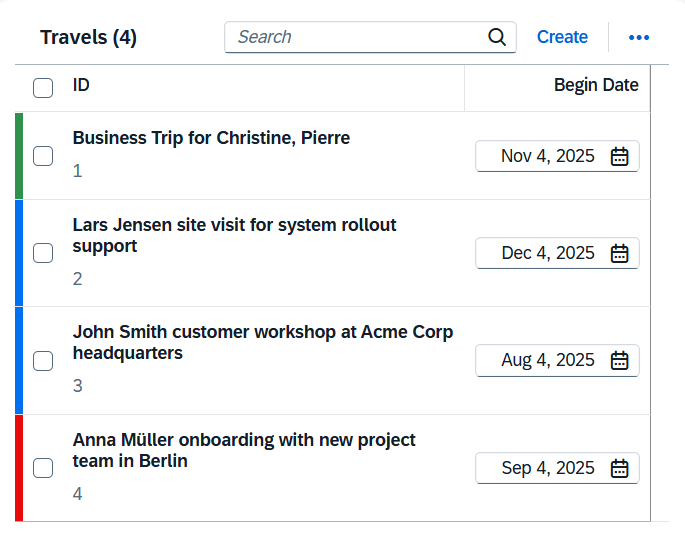
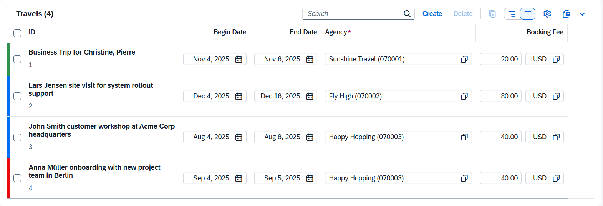
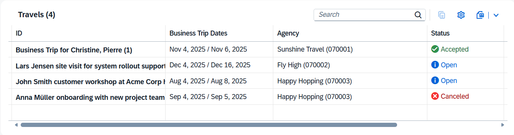
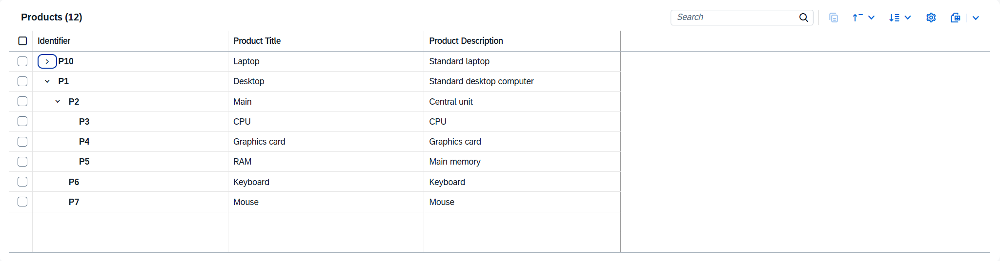
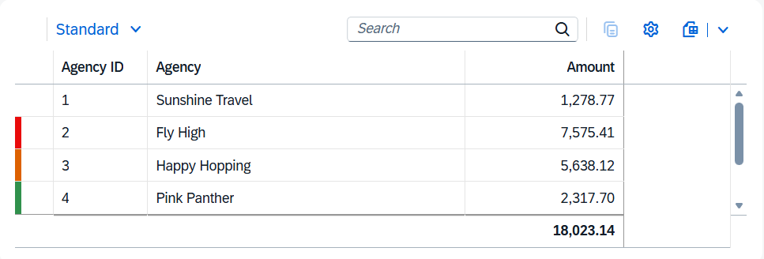

<!-- loioc0f6592a592e47f9bb6d09900de47412 -->

# Table Types

Table types define the visual presentation and data handling capabilities of tables. Choose from responsive, grid, tree, or analytical table types based on your data volume, device requirements, and feature needs in SAP Fiori elements for OData V4.

The following table types are available:

**Table Types**

<table>
<tr>
<th valign="top">

Table Type

</th>
<th valign="top">

Description

</th>
<th valign="top">

More information

</th>
<th valign="top">

Example

</th>
</tr>
<tr>
<td valign="top">

Responsive table

</td>
<td valign="top">

The responsive table is optimized for mobile use. Line items can be viewed without scrolling or with vertical scrolling only, regardless of the display width.

The responsive table is intended for use on the line level instead of cell level, and with a small number of items.

> ### Restriction:  
> Only use the responsive table if the total number of items in the table doesn't exceed 200.

</td>
<td valign="top">

[Configuring the Popin Layout for Responsive Tables](configuring-the-popin-layout-for-responsive-tables-e6eddda.md)

[SAP Design System guidelines](https://www.sap.com/design-system/fiori-design-web/ui-elements/responsive-table)

</td>
<td valign="top">

  
  
**Responsive Table on a Narrow Screen**

  
  
**Responsive Table on a Wide Screen**

</td>
</tr>
<tr>
<td valign="top">

Grid table

</td>
<td valign="top">

The grid table is designed to contain a larger number of items \(several thousand or more\), with convenient comparison of items in different rows or columns.

The grid table is suitable to most use cases on a list report page.

</td>
<td valign="top">

[SAP Design System guidelines](https://www.sap.com/design-system/fiori-design-web/ui-elements/grid-table) 

</td>
<td valign="top">

  
  
**Grid Table**

</td>
</tr>
<tr>
<td valign="top">

Tree table

</td>
<td valign="top">

The tree table provides a comprehensive set of features to display hierarchical data.

</td>
<td valign="top">

[The TreeTable Building Block](the-treetable-building-block-667851f.md)

[SAP Design System guidelines](https://www.sap.com/design-system/fiori-design-web/ui-elements/tree-table)

</td>
<td valign="top">

  
  
**Tree Table**

</td>
</tr>
<tr>
<td valign="top">

Analytical table

</td>
<td valign="top">

The analytical table offers a comprehensive set of features for working with analytical data, such as advanced grouping options and data aggregation.

> ### Restriction:  
> Analytical tables aren't supported on draft-enabled entities.

</td>
<td valign="top">

[Configuring Analytical Tables](configuring-analytical-tables-41957ec.md)

[SAP Design System guidelines](https://www.sap.com/design-system/fiori-design-web/ui-elements/analytical-table-alv)

</td>
<td valign="top">

  
  
**Analytical Table**

</td>
</tr>
</table>

> ### Note:  
> Grid tables, tree tables, and analytical tables don't support columns with micro charts or multi-line content, such as those using the `FieldGroup` annotation, multi-line text fields, or progress indicators.

Each table type in SAPUI5 supports different features. For more information, see [Tables: Which One Should I Choose?](../10_More_About_Controls/tables-which-one-should-i-choose-148892f.md).

The table representation that suits the service is chosen by default during the app creation. For more information, see [Determining the Default Table Type](determining-the-default-table-type-3fd4c37.md). You can change the table type to suit your needs. For more information, see [Setting the Table Type](setting-the-table-type-7f844f1.md).

Use the `UI.LineItem` annotation to define table columns. For more information, see [Defining Line Items](defining-line-items-f0e1e17.md).

## Table Control Features

The table control uses page mechanisms while loading data. It contains the following:

-   Layout management

-   A toolbar with actions rendered as text icons, for example, *Personalize*

-   Application-specific actions rendered as text buttons, for example, *Copy*, *Approve*, and *Delete*

-   An indication of draft status \(only for tables on the list report page\)

-   A display of items locked by other users \(only for tables on the list report page\)

> ### Note:  
> For information about SAP Fiori elements for OData V2, see [Tables](tables-f242a02.md).

**Related Information**  

[Setting the Table Type](setting-the-table-type-7f844f1.md "Table type configuration allows you to specify which table rendering type (responsive table, grid table, analytical table, or tree table) is used on list report pages and object pages in SAP Fiori elements for OData V4.")

[Tables: Which One Should I Choose?](../10_More_About_Controls/tables-which-one-should-i-choose-148892f.md "The libraries provided by SAPUI5 contain various different table controls that are suitable for different use cases. The table below outlines which table controls are available, and what features are supported by each one.")

[Configuring the Selection Mode for Tables](configuring-the-selection-mode-for-tables-116b5d8.md "You can configure single or multiple selection in tables while triggering table toolbar actions that require context in SAP Fiori elements for OData V4.")

