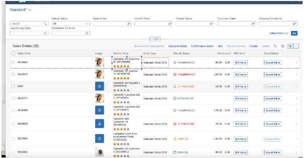

<!-- loioc0f6592a592e47f9bb6d09900de47412 -->

# Tables

You can configure the appearance, interactivity, and loading behavior of tables..

The following table types are available:

**Table Types**


<table>
<tr>
<th valign="top">

Table Type

</th>
<th valign="top">

Description

</th>
</tr>
<tr>
<td valign="top">

Responsive table

</td>
<td valign="top">

The responsive table is optimized for mobile use. Line items can be viewed without scrolling or with vertical scrolling only, regardless of the display width.

The responsive table is intended for use on the line level instead of cell level, and with a small number of items.

> ### Restriction:  
> Only use the responsive table if the total number of items in the table doesn't exceed 200.


</td>
</tr>
<tr>
<td valign="top">

Grid table

</td>
<td valign="top">

The grid table is designed to contain a larger number of items \(several thousand or more\), with convenient comparison of items in different rows or columns.

The grid table is suitable to most use cases on a list report page.

</td>
</tr>
<tr>
<td valign="top">

Tree table

</td>
<td valign="top">

The tree table provides a comprehensive set of features to display hierarchical data. For more information, see [Tree Tables](tree-tables-7cf7a31.md).

</td>
</tr>
<tr>
<td valign="top">

Analytical table

</td>
<td valign="top">

The analytical table offers a comprehensive set of features for working with analytical data, such as advanced grouping options and data aggregation.

> ### Restriction:  
> Analytical tables aren't supported on draft-enabled entities.


</td>
</tr>
</table>

The table representation that suits the service is chosen by default during the app creation.

You can change the default table type to suit your needs.

For more information about defining the `UI.LineItem` annotation that describes the table, see [Defining Line Items](defining-line-items-f0e1e17.md).

The table control uses page mechanisms while loading data. It contains the following:

-   Layout management
-   A toolbar with actions rendered as text icons, for example, *Personalize*.

-   Application-specific actions rendered as text buttons, for example, *Copy*, *Approve*, and *Delete*.

-   An indication of draft status \(only for list report page tables\)

-   A display of items locked by other users \(only for list report page tables\)


## Determining the Default Table Type

SAP Fiori elements for OData V4 determines the table type based on the configuration specified in the `manifest.json` file.

If the table type is not specified, the default table type is set based on the characteristics of the entity set with the following precedence:

-   The table type defaults to an analytical table if the table entity set supports analytical usage. This is indicated by the `@Aggregation.ApplySupported` annotation along with the following transformation functions:
    -   `filter`
    -   `identity`
    -   `orderby`
    -   `skip`
    -   `top`
    -   `groupby`
    -   `aggregate`
    -   `concat`

-   The table type defaults to a tree table if the table entity set supports hierarchical usage. This is indicated by both the `@Aggregation.RecursiveHierarchy` and the `@Hierarchy.RecursiveHierarchy` annotations with a common `RecursiveHierarchy` qualifier.
-   The table type defaults to a responsive table if neither analytical nor hierarchical usage is detected.


<a name="loioc0f6592a592e47f9bb6d09900de47412__section_pcz_qxd_x1c"/>

## Context Menu in Tables

Tables in list report page, object page, and analytical list page applications support a context menu. The context menu is available as a default option and appears only when users perform a right-click on a row or a set of selected rows. This menu displays all context-dependent actions, including both standard and custom actions that appear on the table toolbar. Additionally, an option to open the selected row or rows in a new browser tab or window is available within the menu. Inline actions are not included as part of context menu actions.

> ### Note:  
> When the table is configured to navigate to an object page in edit mode by setting `openInEditMode` to `true`, the *Open in New Tab* option is not shown in the context menu. For more information, see [Navigation to an Object Page in Edit Mode](navigation-to-an-object-page-in-edit-mode-8665847.md).

When implementing custom actions, you can use the `extensionAPI.getSelectedContexts` API to identify the rows associated with the context menu.

> ### Note:  
> You must use the `extensionAPI.getSelectedContexts` API only within synchronous code blocks.


<a name="loioc0f6592a592e47f9bb6d09900de47412__section_kgk_phh_wpb"/>

## Showing or Hiding Columns Based on Importance and Available Screen Size in Responsive Tables

You can show or hide columns of the list report page and object page tables depending on the screen width for situations like the following:

-   The browser window is small.
-   The application is running on a devise with a smaller screen.
-   You are using the flexible column layout.

The value of the `UI.Importance` annotation for the field determines which columns are hidden or moved when the screen size is reduced.

You can use the `UI.Importance` annotation to set the importance for table columns as follows:

-   `High`: Columns with a `High` importance setting are visible on all screen sizes. When the screen size is reduced, the columns shift to a pop-in area but remain visible on the screen.

-   `Low`: Columns with a `Low` importance setting are hidden on the screen when the screen size is reduced.

-   `None` \(default\) and `Medium`: Columns with `None` \(default\) and `Medium` importance settings are hidden automatically when the screen size is reduced.


For columns with `Low`, `None`, and `Medium` settings, the *Show More per Row* / *Show Less per Row* buttons appear in the table toolbar only if there's at least one hidden column. When the end user clicks the *Show More per Row* button, the hidden column information appears as a text in the pop-in area. To hide the pop-in area, click the *Show Less per Row* button.

> ### Note:  
> -   Columns that have no importance setting \(`None`\) but containing a semantic key are considered of `High` importance \(also when used in a `FieldGroup`\).
> 
> -   Columns with a `Low` importance setting are hidden first on smaller screens, followed by columns with the settings `None` \(default\) and `Medium`.

> ### Sample Code:  
> XML annotation
> 
> ```xml
> <Annotations Target="STTA_PROD_MAN.STTA_C_MP_ProductSalesPriceType">
>     <Annotation Term="UI.LineItem">
>         <Collection>
>             <Record Type="UI.DataField">
>                 <PropertyValue Property="Value" Path="PriceDay" />
>                 <Annotation Term="UI.Importance" EnumMember="UI.ImportanceType/High" />
>             </Record>
>             <Record Type="UI.DataField">
>                 <PropertyValue Property="Value" Path="TargetPrice" />
>                 <!-- This will be treated with default importance "None" which is the same as "Medium" -->
>             </Record>
>             <Record Type="UI.DataField">
>                 <PropertyValue Property="Value" Path="DiscountPriceTarget" />
>                 <Annotation Term="UI.Importance" EnumMember="UI.ImportanceType/Low" />
>             </Record>
>         </Collection>
>     </Annotation>
> </Annotations>
> 
> ```

> ### Note:  
> Starting from SAPUI5 1.87, SAP Fiori elements automatically calculates the default column width and provides an option to resize the column width in responsive tables. This is the default behavior. Having fewer columns in a table increases the free space available on the right side of the table.


<a name="loioc0f6592a592e47f9bb6d09900de47412__section_zln_qlc_s1c"/>

## Hiding Table Columns Using the `UI.Hidden` Annotation

You can hide the table columns or specific fields within the table column in analytical list page, list report page, and object page tables. To hide the entire table column, set the `UI.Hidden` annotation value for any field as static `true`. To hide a specific field of a table column, set the `UI.Hidden` annotation value as a path-based value, and the fields for which `UI.Hidden` evaluates to `true` are hidden. For more information, see [Hiding Features Using the UI.Hidden Annotation](hiding-features-using-the-ui-hidden-annotation-ca00ee4.md).

> ### Note:  
> If the path-based value for `UI.Hidden` evaluates to `true` for all rows, then only the fields are hidden and not the entire column.

  
  
**DataField Records in Tables**



> ### Sample Code:  
> XML Annotation
> 
> ```
> <Annotation Term="UI.LineItem">
>     <Collection>
>         <Record Type="UI.DataFieldForAnnotation">
>             <PropertyValue Property="Target" AnnotationPath="@UI.FieldGroup#multipleActionFields" />
>             <PropertyValue Property="Label" String="Sold-To Party" />
>             <Annotation Term="UI.Hidden" Path="Delivered" />
>         </Record>
>     </Collection>
> </Annotation>
> 
> ```

> ### Sample Code:  
> ABAP CDS Annotation
> 
> ```
> @UI.lineItem: [{
>     type: #AS_FIELDGROUP,
>     valueQualifier: 'multipleActionFields',
>     label: 'Sold-To Party',
>     hidden: #( 'Delivered' )
> }]
> TEST;
> 
> ```

> ### Sample Code:  
> CAP CDS Annotation
> 
> ```
> LineItem: {
>     $value: [
>         {
>             $Type: 'UI.DataFieldForAnnotation',
>             Target: '@UI.FieldGroup#multipleActionFields',
>             Label: 'Sold-To Party',
>             ![@UI.Hidden]: Delivered
>         }
>     ]
> }
> 
> ```


<a name="loioc0f6592a592e47f9bb6d09900de47412__section_u3p_z5q_sqb"/>

## Searching for Rows in a Table on an Object Page

A search field is displayed in the table toolbar if the used entity set is searchable. You can use the search bar to search for particular rows in the table.


### Handling of Search Restrictions

The search field is displayed in the toolbar of a responsive table or grid table if the entity is searchable. To define an entity as searchable, use the annotation `Capabilities.SearchRestrictions`. The search restriction for a table is first looked up in the parent entity \(using `NavigationRestrictions` at the parent entity, with the `NavigationProperty` pointing to the association of the table entity\).

-   Navigation Restrictions at Parent Entity

    > ### Sample Code:  
    > XML Annotation \(non-containment scenario\): `/SalesOrderManage/_Items`
    > 
    > ```xml
    > <Annotations Target="com.c_salesordermanage_sd.Container/SalesOrderManage">
    >     <Annotation Term="Capabilities.NavigationRestrictions">
    >         <Record>
    >             <PropertyValue Property="RestrictedProperties">
    >                 <Collection>
    >                     <Record>
    >                         <PropertyValue Property="NavigationProperty" NavigationPropertyPath="_Items" />
    >                         <PropertyValue Property="SearchRestrictions">
    >                             <Record>
    >                                 <PropertyValue Property="Searchable" Bool="false" />
    >                             </Record>
    >                         </PropertyValue>
    >                     </Record>
    >                 </Collection>
    >             </PropertyValue>
    >         </Record>
    >     </Annotation>
    > </Annotations>
    > 
    > ```

    > ### Sample Code:  
    > ABAP CDS Annotation
    > 
    > No ABAP CDS annotation sample is available. Use the local XML annotation.

    > ### Sample Code:  
    > CAP CDS Annotation \(non-containment scenario\)
    > 
    > ```
    > entity SalesOrderManage
    >     @(Capabilities: {
    >         NavigationRestrictions: {
    >             RestrictedProperties: [{
    >                 NavigationProperty: '_Items',
    >                 SearchRestrictions: {
    >                     Searchable: false
    >                 }
    >             }]
    >         }
    >     })
    > 
    > ```

    In a containment scenario \(for example, where the main entity set is from a parameterized entity\), you can maintain the annotations as shown in the following sample code:

    > ### Sample Code:  
    > XML Annotation \(containment scenario\): `/Customer/Set/_PartnerItems`
    > 
    > ```xml
    > <Annotations Target="sap.fe.test.MyService.EntityContainer/Customer">
    >     <Annotation Term="Capabilities.NavigationRestrictions">
    >         <Record>
    >             <PropertyValue Property="RestrictedProperties">
    >                 <Collection>
    >                     <Record>
    >                         <PropertyValue Property="NavigationProperty" NavigationPropertyPath="Set/_PartnerItems" />
    >                         <PropertyValue Property="SearchRestrictions">
    >                             <Record>
    >                                 <PropertyValue Property="Searchable" Bool="false" />
    >                             </Record>
    >                         </PropertyValue>
    >                     </Record>
    >                 </Collection>
    >             </PropertyValue>
    >         </Record>
    >     </Annotation>
    > </Annotations>
    > 
    > ```

    > ### Sample Code:  
    > ABAP CDS Annotation
    > 
    > No ABAP CDS annotation sample is available. Please use the local XML annotation.

    > ### Sample Code:  
    > CAP CDS Annotation \(containment scenario\)
    > 
    > ```
    > service MyService {
    >     @Capabilities.NavigationRestrictions.RestrictedProperties: [{
    >         $Type              : 'Capabilities.NavigationPropertyRestriction',
    >         NavigationProperty : 'Set/_PartnerItems',
    >         SearchRestrictions : { Searchable: false }
    >     }]
    > }
    > 
    > ```

-   Restrictions Directly at Child Entity

    If no search restriction is defined at the parent entity using `NavigationRestriction`, the search restriction defined directly on the table entity set \(child entity\) is considered.

    > ### Sample Code:  
    > XML Annotation \(non-containment scenario\): `/SalesOrderManage/_Items`
    > 
    > ```xml
    > <Annotations Target="com.c_salesordermanage_sd.Container/SalesOrderItem">
    >     <Annotation Term="SAP__capabilities.SearchRestrictions">
    >         <Record>
    >             <PropertyValue Property="Searchable" Bool="false" />
    >         </Record>
    >     </Annotation>
    > </Annotations>
    > 
    > ```

    > ### Sample Code:  
    > ABAP CDS Annotation
    > 
    > No ABAP CDS annotation sample is available. Use the local XML annotation.

    > ### Sample Code:  
    > CAP CDS Annotation \(non-containment scenario\)
    > 
    > ```
    > entity SalesOrderItem
    >     @(Capabilities: {
    >         SearchRestrictions: {
    >             Searchable: false
    >         }
    >     })
    > 
    > ```

    In a containment scenario \(for example, where the main entity set is from a parameterized entity\), you can maintain the annotations as shown in the following sample code:

    > ### Sample Code:  
    > XML Annotation \(containment scenario\): `/Customer/Set/_PartnerItems`
    > 
    > ```xml
    > <Annotations Target="SAP__self.Container/ItemPartner">
    >     <Annotation Term="SAP__capabilities.SearchRestrictions">
    >         <Record>
    >             <PropertyValue Property="Searchable" Bool="false" />
    >         </Record>
    >     </Annotation>
    > </Annotations>
    > 
    > ```

    > ### Sample Code:  
    > ABAP CDS Annotation
    > 
    > No ABAP CDS annotation sample is available. Use the local XML annotation.

    > ### Sample Code:  
    > CAP CDS Annotation \(containment scenario\)
    > 
    > ```
    > entity ItemPartner
    >     @(Capabilities: {
    >         SearchRestrictions: {
    >             Searchable: false
    >         }
    >     })
    > 
    > ```


The search field is displayed in the toolbar of an analytical table or tree table if the entity is searchable. To define an entity as searchable, use the search transformation in the `Transformations` of the `ApplySupported` annotation. If no `Transformations` are available, then the search field is enabled as well.

> ### Sample Code:  
> ```
> 
> <Annotation Term="SAP__aggregation.ApplySupported">
>     <Record>
>         <PropertyValue Property="Transformations">
>             <Collection>
>                 <String>filter</String>
>                 <String>orderby</String>
>                 <String>search</String>
>                 <String>descendants</String>
>             </Collection>
>         </PropertyValue>
>     </Record>
> </Annotation>
> 
> ```


<a name="loioc0f6592a592e47f9bb6d09900de47412__section_uzk_54j_x4b"/>

## Defining the Column Width Using an Annotation

SAP Fiori elements automatically calculates the default width of columns containing texts based on the `MaxLength` property of the field defined in the metadata. The lower limit is set to 3 rem and the upper limit is set to 20 rem.

By default, the column width is calculated based on the type of the content. You can include the column header while calculating the column width by configuring the `widthIncludingColumnHeader` setting in the `manifest.json` file. This setting can be defined at the table level or at the column level. The `widthIncludingColumnHeader` setting defined at the column level has a higher priority than the `widthIncludingColumnHeader` setting defined at the table level.

> ### Sample Code:  
> `manifest.json`
> 
> ```json
> "controlConfiguration": {
>     "@com.sap.vocabularies.UI.v1.LineItem": {
>         "tableSettings": {
>             "widthIncludingColumnHeader": true
>         },
>         "columns": {
>             "DataField::commonProperty": {
>                 "widthIncludingColumnHeader": false
>             }
>         }
>     }
> }
> 
> ```

To customize the width of a column defined in a line item, use the UI annotation `com.sap.vocabularies.HTML5.v1.CssDefaults`. For more information, see [Setting the Default Column Width](setting-the-default-column-width-a765253.md).


<a name="loioc0f6592a592e47f9bb6d09900de47412__section_ey5_lvv_gnb"/>

## Default Selection Mode for Rows in Tables

By default, the table generated by the template uses the multi-selection mode. In the multi-selection mode, users select an item from the table to trigger a custom action, such as *Validate*, which then returns the results for the selected item.

You can change the selection mode from multi-selection to single-selection. For more information, see [Configuring the Selection Mode for Tables](configuring-the-selection-mode-for-tables-116b5d8.md).


<a name="loioc0f6592a592e47f9bb6d09900de47412__section_pth_3mb_dzb"/>

## Copying Multiple Rows and Range Selections

Users can copy multiple rows as well as ranges of rows and columns to the clipboard. The selected content \(rows or ranges\) can then be pasted to another application such as Microsoft Excel, Microsoft Word, or to another SAP Fiori elements table.

> ### Note:  
> When using custom columns, the cell content is the properties listed in the `property` array of the custom column definition. For more information, see [Extension Points for Tables](extension-points-for-tables-d525522.md).

To select a range with the mouse, click and hold while dragging to make a selection. As tables can have cells with editable fields, these fields automatically gain focus upon cell selection. To prevent this, press [CTRL\] on Microsoft Windows or [CMD\] on macOS before selecting a cell with the mouse. Keyboard shortcuts are also available as an alternative for cell selection.


<table>
<tr>
<th valign="top">

Key Combination

</th>
<th valign="top">

Behavior

</th>
</tr>
<tr>
<td valign="top">

[Space\]

</td>
<td valign="top">

Selects the cell that the focus is set on. If used inside a selection, removes the selection.

</td>
</tr>
<tr>
<td valign="top">

[Shift\] + [Arrow keys\] 

</td>
<td valign="top">

Adjusts an existing selection. If used outside a selection, creates a new selection.

</td>
</tr>
<tr>
<td valign="top">

[Shift\] + [Space\] 

</td>
<td valign="top">

Transforms the current selection into a row selection, based on the selection mode applied to the table.

</td>
</tr>
<tr>
<td valign="top">

[Control\] + [Space\] 

</td>
<td valign="top">

Expands the selection to all cells in a column \(up to the range limit\).

</td>
</tr>
<tr>
<td valign="top">

[Control\] + [Shift\] + [A\] 

</td>
<td valign="top">

Clears the selection.

</td>
</tr>
</table>

For more information about pasting data to tables and the expected format, see [Copying and Pasting from External Applications to Tables](copying-and-pasting-from-external-applications-to-tables-f6a8fd2.md).


<a name="loioc0f6592a592e47f9bb6d09900de47412__section_ygl_t1s_kdc"/>

## Optimizing Data Loading Using the `scrollThreshold` Property

As users scroll within grid tables, tree tables, or analytical tables, the application dynamically loads additional records from the back-end system. By default, it loads 300 additional records while scrolling.

You can modify this value by configuring the `scrollThreshold` property.

For analytical tables and tree tables, `scrollThreshold` must be higher than `threshold` to take effect.


### Configuring the `scrollThreshold` Property for Dynamic Data Loading

You can configure the `scrollThreshold` property in the `manifest.json` file as shown in the following sample code:

> ### Sample Code:  
> `manifest.json`
> 
> ```
> "sap.ui5": {
>     "routing": {
>         "targets": {
>             "SalesOrderManageList": {
>                 "options": {
>                     "settings": {
>                         "controlConfiguration": {
>                             "@com.sap.vocabularies.UI.v1.LineItem": {
>                                 "tableSettings": {
>                                     "type": "GridTable",
>                                     "scrollThreshold": 200
>                                 }
>                             }
>                         }
>                     }
>                 }
>             }
>         }
>     }
> }
> 
> ```

Key users can configure the `scrollThreshold` property using the UI adaptation mode. For more information, see [Extending Delivered Apps With Key User Adaptation](extending-delivered-apps-with-key-user-adaptation-59bfd31.md).


<a name="loioc0f6592a592e47f9bb6d09900de47412__section_xkq_dhx_rfc"/>

## Initial Data Loading Using the `threshold` Property

As responsive, grid, tree, and analytical tables load, the `threshold` property defines the number of initially loaded rows.

You can configure the `threshold` property in the `manifest.json` file to specify the number of additional rows that can be preloaded from the back-end system. The specified value is added to the number of visible rows. For example, if `threshold` is set to 100 and there are ten visible rows, the table loads a total of 110 records. This property applies to actions such as initial loading, sorting, and filtering.

> ### Sample Code:  
> `manifest.json` 
> 
> ```
>  
> "targets": {
>     "EntityList": {
>         ...
>     },
>     "controlConfiguration": {
>         "@com.sap.vocabularies.UI.v1.LineItem#entityListItem": {
>             "tableSettings": {
>                 "threshold": 100,
>                 ...
>             }
>         },
>         ...
>     }
> }
> 
> ```

> ### Note:  
> If `threshold` is set to 0, no additional records are preloaded, and `scrollThreshold` is used instead.


### Configuring the `threshold` Property for Initial Data Loading

You can configure the `threshold` property in the `manifest.json` file as shown in the following sample code:

> ### Sample Code:  
> `manifest.json`
> 
> ```
> "targets": {
>                 "SalesOrderManageList": {
>                     "type": "Component",
>                     "id": "SalesOrderManageList",
>                     "name": "sap.fe.templates.ListReport",
>                     "options": {
>                         "settings": {
>                             "contextPath": "/SalesOrderManage",
>                             "controlConfiguration": {
>                                 "@com.sap.vocabularies.UI.v1.LineItem": {
>                                     "tableSettings": {
>                                         "type": "ResponsiveTable",
>                                         "threshold": 100
>                                     }
>                                 }
>                             }
>                         }
>                     }
>                 }
>             }
> ```

**Default threshold Values**


<table>
<tr>
<th valign="top" colspan="2">

Table Type

</th>
<th valign="top">

Number of Preloaded Rows

</th>
</tr>
<tr>
<td valign="top" rowspan="2">

Responsive table

</td>
<td valign="top">

List report page

</td>
<td valign="top">

30

</td>
</tr>
<tr>
<td valign="top">

Object page

</td>
<td valign="top">

10

</td>
</tr>
<tr>
<td valign="top" colspan="2">

Tree table

</td>
<td valign="top">

200

</td>
</tr>
<tr>
<td valign="top" colspan="2">

Grid table

</td>
<td valign="top">

100

</td>
</tr>
<tr>
<td valign="top" colspan="2">

Analytical table

</td>
<td valign="top">

100

</td>
</tr>
</table>

The `threshold` value set by this property overrides the `MaxItems` annotation in the presentation variant.

The `Table` building block also supports the threshold option. For more information, see [API Reference](https://ui5.sap.com/#/api/sap.fe.macros.Table%23overview)

Key users can configure the `threshold` property using the UI adaptation mode. For more information, see [Extending Delivered Apps With Key User Adaptation](extending-delivered-apps-with-key-user-adaptation-59bfd31.md).


## Excluding Fields from Table Personalization

You can exclude specific fields from the table personalization dialog on the list report page and the object page by setting the `availability` property of the column to `hidden`. For more information, see [Enabling Table Personalization](enabling-table-personalization-3e2b4d2.md).


## Freezing Table Columns

You can freeze table columns to keep them visible when scrolling the table horizontally. To do so, choose one of the following options:

-   You can use the *Column Settings* dialog to select a column to freeze. The selected column and all the columns to the left of it \(or right, if you use right-to-left mode\) are frozen.

-   You can use the `frozenColumnCount` parameter to choose a number of columns to freeze. To do this, add the `frozenColumnCount` parameter in the `manifest.json` file and specify how many columns to freeze. In the example below, the first three columns are frozen.

    > ### Sample Code:  
    > `manifest.json`
    > 
    > ```json
    > 
    > "_Item/@com.sap.vocabularies.UI.v1.LineItem": {
    >     "tableSettings": {
    >         "type": "GridTable",
    >         "frozenColumnCount": 3,
    >         …
    >     },
    >     …
    > }
    > 
    > ```


You can disable freezing columns using the *Column Settings* dialog with the `disableColumnFreeze` parameter at the table level of the `manifest.json` file.

> ### Sample Code:  
> `manifest.json`
> 
> ```json
> "_Item/@com.sap.vocabularies.UI.v1.LineItem": {
>      "tableSettings": {
>           "type": "GridTable",
>           "disableColumnFreeze": true,
>           …
>      },
>      ...
> }
> 
> ```

> ### Note:  
> Freezing table columns is not available in the responsive table.


## Showing or Hiding the *Copy to Clipboard* Button

By default, the *Copy to Clipboard* button is displayed in the table toolbar if the selection mode, such as single selection or multi selection, is configured for the corresponding table. However, you can also configure the visibility of the *Copy to Clipboard* button by defining the `disableCopyToClipboard` settings in the `manifest.json` file as shown in the following sample code:

> ### Sample Code:  
> `manifest.json`
> 
> ```
> "sap.ui5": {
>     "routing": {
>         "targets": {
>             "SalesOrderManageList": {
>                 "options": {
>                     "settings": {
>                         "controlConfiguration": {
>                             "@com.sap.vocabularies.UI.v1.LineItem": {
>                                 "tableSettings": {
>                                     "disableCopyToClipboard": true
>                                 }
>                             }
>                         }
>                     }
>                 }
>             }
>         }
>     }
> }
> 
> ```

For more security-related information, see [Security Configuration](security-configuration-ba0484b.md).

The `Table` building block also supports the copy to clipboard option. For more information, see [API Reference](https://ui5.sap.com/#/api/sap.fe.macros.Table%23overview).


> ### Note:  
> For information about SAP Fiori elements for OData V2, see [Tables](tables-f242a02.md).

**Related Information**  


[Configuring Tables](configuring-tables-f4eb70f.md "You can use the annotations and entries in the manifest.json file to control various aspects of tables.")

[Setting the Table Type](setting-the-table-type-7f844f1.md "You can control which table type is rendered on the list report page and on the object page by configuring the manifest.json file and by using annotations.")

[Tables: Which One Should I Choose?](../10_More_About_Controls/tables-which-one-should-i-choose-148892f.md "The libraries provided by SAPUI5 contain various different table controls that are suitable for different use cases. The table below outlines which table controls are available, and what features are supported by each one.")

[Configuring the Selection Mode for Tables](configuring-the-selection-mode-for-tables-116b5d8.md "You can configure single or multiple selection in tables while triggering table toolbar actions that require context.")

