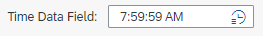
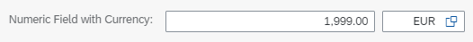
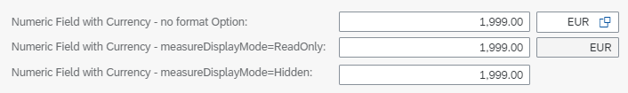
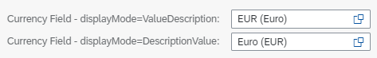

<!-- loio5260b9ca249f465ab33769b9edb442aa -->

# The `Field` Building Block

The `Field` building block provides an easy way to instantiate a property that was configured as part of the service metadata. The `Field` analyzes the different annotations that are defined for the property to create the most appropriate controls and additionally offers you configuration options for adjusting the behavior to fit your needs.


<a name="loio5260b9ca249f465ab33769b9edb442aa__section_pzn_nmr_j5b"/>

## Usage

You can instantiate the building block by referencing the building block namespace within a fragment enabled for building block usage:

> ### Sample Code:  
> ```
> <macros:Field xmlns:macro="sap.fe.macros" metaPath="MyProperty"/>
> ```

This instantiates the actual control tree that corresponds to this building block.

You can use the `Field` building block either stand alone or inside the `fields` aggregation of a `FormElement` building block for automatically getting a label for the field corresponding to the metadata. You can use the `Field` building block inside custom header facets, custom sections, custom pages, and custom table columns.


<a name="loio5260b9ca249f465ab33769b9edb442aa__section_idk_qmr_j5b"/>

## API

For information about the `Field` API, see the [API Reference](https://ui5.sap.com/#/api/sap.fe.macros.Field).


<a name="loio5260b9ca249f465ab33769b9edb442aa__section_r5c_5mr_j5b"/>

## Examples

1.  When you use a `Field` building block, the differences in the bound data elements result in different UI appearances. You can see this in the examples given below.

    -   A data element of type `Time` will appear as an input field with a time picker value help in edit mode.

        > ### Sample Code:  
        > Custom Section Fragment for Data Element `timeData` \(XML\)
        > 
        > ```xml
        > <core:FragmentDefinition
        > 	xmlns="sap.m"
        > 	xmlns:core="sap.ui.core"
        > 	xmlns:macro="sap.fe.macros"
        > >
        > 	<VBox width="30vw">
        > 		<Text text="Time Data Field: " />
        > 		<macro:Field metaPath="timeData" id="timeDataField" />
        > 	</VBox>
        > </core:FragmentDefinition>
        > ```

        The image below shows how this will look on the UI:

        

    -   A numerical field with a currency using the type `Currency` from sap/cds/common will appear as 2 input fields.

        While the XML in the custom section fragment looks the same as in the previous example, a data element with a currency will appear as 2 input fields: one for the numerical value and one for the selection of the currency in edit mode.

        > ### Sample Code:  
        > Custom Section Fragment for Data Element `numberWithCurrency` \(XML\)
        > 
        > ```xml
        > <core:FragmentDefinition
        > 	xmlns="sap.m"
        > 	xmlns:core="sap.ui.core"
        > 	xmlns:macro="sap.fe.macros"
        > >
        > 	<VBox width="30vw">
        > 		<Text text="Numeric Field with Currency: " />
        > 		<macro:Field metaPath="numberWithCurrency" id="numberWithCurrencyField" />
        > 	</VBox>
        > </core:FragmentDefinition>
        > ```

        The image below shows how this will look on the UI:

          


2.  In addition to the automatic generation of controls fitting best to the bound data when using the `Field` building block, you can also influence the appearance using the `Field` building block API.

    -   The following example shows how to use the `formatOptions` and the parameter `measureDisplayMode` in order to influence the currency field input readiness or even hiding it completely.

        > ### Sample Code:  
        > Custom Section Fragment for Data Element `numberWithCurrency` with `formatOptions` and parameter `measureDisplayMode` \(XML\)
        > 
        > ```xml
        > <core:FragmentDefinition
        > 	xmlns="sap.m"
        > 	xmlns:core="sap.ui.core"
        > 	xmlns:macro="sap.fe.macros"
        > >
        > 	<VBox width="30vw">
        > 		<Text text="Numeric Field with Currency - no format Option: " />
        > 		<macro:Field metaPath="numberWithCurrency" id="numberWithCurrencyField" />
        > 		<Text text="Numeric Field with Currency - measureDisplayMode=ReadOnly: " />
        > 		<macro:Field metaPath="numberWithCurrency" id="numberWithCurrencyFieldCurrencyReadOnly">
        > 			<formatOptions measureDisplayMode="ReadOnly" />
        > 		</macro:Field>
        > 		<Text text="Numeric Field with Currency - measureDisplayMode=Hidden: " />
        > 		<macro:Field metaPath="numberWithCurrency" id="numberWithCurrencyFieldCurrencyHidden">
        > 			<formatOptions measureDisplayMode="Hidden" />
        > 		</macro:Field>
        > 	</VBox>
        > </core:FragmentDefinition>
        > ```

        The image below shows how this will look on the UI:

          

    -   The following example shows how to use the `formatOptions` and the parameter `displayMode` to influence the display of the value and description inside a currency field.

        > ### Sample Code:  
        > Custom Section Fragment for Data Element `currencyField_code` with `formatOptions` and parameter `displayMode` \(XML\)
        > 
        > ```
        > <core:FragmentDefinition
        > 	xmlns="sap.m"
        > 	xmlns:core="sap.ui.core"
        > 	xmlns:macro="sap.fe.macros"
        > >
        > 	<VBox width="30vw">
        > 		<Text text="Currency Field - displayMode=ValueDescription: " />
        > 		<macro:Field metaPath="currencyField_code" id="currencyFieldValueDescription">
        > 			<formatOptions displayMode="ValueDescription" />
        > 		</macro:Field>
        > 		<Text text="Currency Field - displayMode=DescriptionValue: " />
        > 		<macro:Field metaPath="currencyField_code" id="currencyFieldDescriptionValue">
        > 			<formatOptions displayMode="DescriptionValue" />
        > 		</macro:Field>
        > 	</VBox>
        > </core:FragmentDefinition>
        > ```

        The image below shows how this will look on the UI:

          


