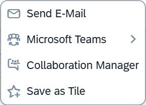

<!-- loio022bf0dcae1d4d90961ebe23d642fca3 -->

# The *Share* Functionality

The *Share* functionality allows end users to share the current application state using various options.

The following options are available as part of the *Share* functionality:



-   *Send Email*

    When an end user chooses this option, the link to the page opens in the default email client that is configured in the system. When they choose the link, the application page opens in the same state in which it was shared: filter settings, personalization options, and selections for charts and tables, as well app-specific button states such as the filter mode or view mode, are all transferred.

-   *Share in SAP Jam*

    End users can also share the current application state using *Share in SAP Jam*. A dialog appears that allows them to select an existing Jam group, comments can be added, and Jam users can be tagged. This option is only available on platforms that are integrated with SAP Jam.

-   *Save as Tile*

    When an end user chooses this option, the corresponding *Save as Tile* dialog is displayed. When they choose the tile, the application page opens in the same state in which the tile was created. Application developers can customize the title and the sub-title of the tile. In the list report, a dynamic tile with a record count is created, where the applied filter is also taken into account.

-   *Share: Microsoft Teams*

    End users can collaborate with their co-workers using the *Share: Microsoft Teams* functionality. For more information, see [The Share: Microsoft Teams Functionality](the-share-microsoft-teams-functionality-ff89e4b.md).

-   *Share: Collaboration Manager*

    When an end user chooses this option, the *SAP Collaboration Manager* dialog opens with the application URL, which includes the page title and the current `iAppState`.

    > ### Note:  
    > System administrators for SAP S/4HANA Cloud Public Edition can find the required information at [Setting Up, Integrating, and Configuring SAP Collaboration Manager](https://help.sap.com/docs/SAP%20Collaboration%20Manager/cb0f914082ac49ddac2aecc728117530/8ec4cf31f6a94a1da039f7d5922cc0f3.html).


> ### Note:  
> -   The *Share* functionality is available for the list report, object page, and subobject page.
> 
> -   For applications using the flexible column layout, the *Share* functionality is shown on the highest view level.
> 
> -   The *Share* functionality is not available for newly created objects in draft mode, so the button is not visible.
> 
> -   In SAP Fiori elements for OData V2, for draft objects with an existing active instance the *Share* functionality will directly share the URL of the active instance.
> 
>     In SAP Fiori elements for OData V4, for draft objects with an existing active instance the *Share* functionality will use the semantic bookmarking feature \(see the corresponding section in this topic below\), but if semantic keys are not defined then the URL of the active instance is shared.


<a name="loio022bf0dcae1d4d90961ebe23d642fca3__section_t52_jql_ymb"/>

## Additional Features in SAP Fiori Elements for OData V2

The *Share* functionality is hidden for the creation pages of non-draft objects.

During tile creation, you can change the tile type from dynamic to static using an extension. For more information, see [Extending the Bookmark Function to Save Static Tiles to the SAP Fiori Launchpad](extending-the-bookmark-function-to-save-static-tiles-to-the-sap-fiori-launchpad-7e34ea9.md).


<a name="loio022bf0dcae1d4d90961ebe23d642fca3__section_r4n_lql_ymb"/>

## Additional Features in SAP Fiori Elements for OData V4


### Send Email

You can also use controller extension methods to change the subject line of the email.

For more information about the `controllerextensions.Share` API, see the [API Reference](https://ui5.sap.com/#/api/sap.fe.core.controllerextensions.Share).

Make the following changes in the `manifest.json` file:

> ### Sample Code:  
> ```
> "sap.ui5": {
>         "extends": { 
>             "extensions": {
>                 "sap.ui.controllerExtensions": {
>                     "sap.fe.templates.ObjectPage.ObjectPageController": {
>                         "controllerName": "SalesOrder.ext.OPExtend"
>                     }
>                 }
>             }
>         },
> ```

Make the following changes in the `OPExtend.controller.js` file:

> ### Sample Code:  
> ```
> sap.ui.define(["sap/ui/core/mvc/ControllerExtension"], function(ControllerExtension) {
>         "use strict";
>         return ControllerExtension.extend("SalesOrder.ext.OPExtend", {
>             // this section allows to extend lifecycle hooks or override public methods of the base controller
>             override: {
>                onInit: function() {},
>                share: {
>                     adaptShareMetadata: function(oShareMetadata) {
>                         oShareMetadata.email.title = "test email subject"; // customise or change email subject
>                         return oShareMetadata;
>                     }
>                 }
>             }
>         });
>     }
> );
> ```


### Hiding Specific *Share* Menu Options

You can control the visibility of the share options displayed in the *Share* menu. You cannot hide the *Save as Tile* option, as it is always visible to end users. However, you can control the visibility of other options by configuring the corresponding settings in the `manifest.json` file.

****


<table>
<tr>
<th valign="top">

Share Options

</th>
<th valign="top">

Properties

</th>
</tr>
<tr>
<td valign="top">

*Send E-Mail*

</td>
<td valign="top">

`showSendEmail`

</td>
</tr>
<tr>
<td valign="top">

*Microsoft Teams*

</td>
<td valign="top">

`showMsTeamsOptions`

</td>
</tr>
<tr>
<td valign="top">

*Collaboration Manager*

</td>
<td valign="top">

`showCollaborationManager`

</td>
</tr>
</table>

This configuration can be done at both application level and page level. If the application-level settings for the share options' visibility is set to `true` \(or is undefined\), then its visibility is inherited from the page-level settings. If the application-level settings for the share options' visibility is set to `false`, then the specific share option is hidden, and the page-level settings aren't considered.

In the following sample code, the *Share: Microsoft Teams* option is hidden by setting `showMsTeamsOptions` to `false`, whereas the `showSendEmail` setting depends on the expression value, which can be either `true` or `false`.

> ### Sample Code:  
> Application-level settings
> 
> ```
> "sap.fe": {
>         "app": {
>             "share": {
>                 "showSendEmail": "{= !${isVerified} }",
>                 "teams": {
>                     "showMsTeamsOptions": false
>                 }
>             },
>             ...
>         }
>     }
> ```

The following sample code shows you how the share options' visibility setting is configured at page level:

The *Send E-mail* option is only hidden in the list report. The *Share: Microsoft Teams* option is displayed on the object page but is conditionally shown in the list report.

> ### Sample Code:  
> Page-level settings
> 
> ```
> "sap.ui5": {
>         "routing": {
>             "targets": {
>                 "SalesOrderManageList": {
>                     "type": "Component",
>                     "id": "SalesOrderManageList",
>                     "name": "sap.fe.templates.ListReport",
>                     "options": {
>                         "settings": {
>                             "share": {
>                              "showSendEmail": false,
>                                 "teams": {
>                                     "showMsTeamsOptions": "{= ${Delivered} }"
>                                 },
>                                 …
>                             }
>                         }
>                     },
>                     …
>                 },
>                 "SalesOrderManageObjectPage": {
>                     "type": "Component",
>                     "id": "SalesOrderManageObjectPage",
>                     "name": "sap.fe.templates.ObjectPage",
>                     "options": {
>                         "settings": {
>                             "share": {
>                                 "teams": {
>                                     "showMsTeamsOptions": true
>                                 },
>                             },
>                             …
>                         }
>                     },
>                     …
>                 },
>                 …
>             }
>         }
>     }
> 
> 
> ```

> ### Note:  
> The `showMsTeamsOptions` property is applicable only to apps that run on SAP Fiori launchpad, where the integration with *Share: Microsoft Teams* is available. The *Share: Microsoft Teams* option is a part of collaborative ERP \(enterprise resource planning\) within the SAP S/4HANA family of products and requires `ushell` and SAP Fiori launchpad configuration.


### Semantic Bookmarking

Semantic bookmarking enables the sharing of an object page even while it is being edited by an end user, that is, even when the object page has the status `draft`.

When an end user clicks on the chevron in a list report table and navigates to an object page, the URL contains technical keys or semantic keys \(depending on whether the application developer has defined semantic keys in the metadata for the entity set of the list report\).

The following sample codes shows the semantic key annotation:

> ### Sample Code:  
> XML Annotation
> 
> ```xml
> <Annotation Term="Common.SemanticKey">
>    <Collection>
>       <PropertyPath>SalesOrder</PropertyPath>
>    </Collection>
> </Annotation>
> ```

> ### Sample Code:  
> ABAP CDS Annotation
> 
> ```
> 
> @ObjectModel: {
>   semanticKey: [ 'SalesOrder' ]
> }
> 
> define view SALESORDERMANAGE {
> 
> }
> ```

> ### Sample Code:  
> CAP CDS Annotation
> 
> ```
> 
> Common.SemanticKey : [
>     SalesOrder
> ],
> ```

If the application developer does not define the annotations for the semantic keys, the URL contains only the technical keys. In this case, if end user A shares the URL using the *Share* functionality with end user B, end user B will only be able to open the list report page if end user A shares while being in display mode. If end user A is already in edit mode when the URL is shared, then end user B will not be able to open the link, since end user B cannot access the draft of end user A.

If, however, the application developer has defined semantic keys, the URL only contains semantic keys. In this case, end user B will be able to open the shared URL, irrespective of whether end user A shares the active copy \(display mode\) or the draft copy \(edit mode\). If end user A shares the draft copy, then end user B sees the corresponding active copy of the object.

> ### Note:  
> Semantic bookmarking is currently not supported in the following cases:
> 
> -   for subobject pages
> 
> -   if not all of the semantic keys defined for the entity set are part of the available context
> 
> 
> In these cases, changing to edit mode results in the technical keys being added to the URL. If user A now shares the URL while in edit mode, then user B will not be able to open the link, since user B cannot access the draft of user A for the same record.

