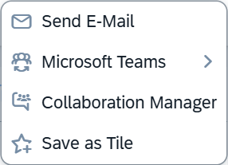

<!-- loio022bf0dcae1d4d90961ebe23d642fca3 -->

# The *Share* Functionality

Users can share the current application state with the *Share* functionality.

> ### Note:  
> This topic describes how to use the building block within SAP Fiori elements floorplans. If the functionality isn't available when you use the building block in custom pages or custom sections, you can try achieving the functionality through other means, such as the following:
> 
> -   Properties or methods exposed by the building block
> 
> -   Custom code using extensions

The following sharing options are available as part of the *Share* functionality:



-   *Send Email*

    When the user chooses this option, the link to the page opens in the default email client that is configured in the system. When they choose the link, the application page opens in the same state in which it was shared: filter settings, personalization options, and selections for charts and tables, as well app-specific button states such as the filter mode or view mode, are all transferred.

-   *Share in SAP Jam*

    Users can also share the current application state using *Share in SAP Jam*. A dialog appears that allows them to select an existing Jam group, comments can be added, and Jam users can be tagged. This option is only available on platforms that are integrated with SAP Jam.

-   *Save as Tile*

    When the user chooses this option, the corresponding *Save as Tile* dialog is displayed. When they choose the tile, the application page opens in the same state in which the tile was created. Application developers can customize the title and the sub-title of the tile. In the list report, a dynamic tile with a record count is created, where the applied filter is also taken into account.

-   *Microsoft Teams*

    Users can collaborate with their co-workers using the *Microsoft Teams* functionality. For more information, see [The Share: Microsoft Teams Functionality](the-share-microsoft-teams-functionality-ff89e4b.md).

-   *Collaboration Manager*

    When the user chooses this option, the *SAP Collaboration Manager* dialog opens with the application URL, which includes the page title and the current `iAppState`.

    > ### Note:  
    > System administrators for SAP S/4HANA Cloud Public Edition can find the required information at [Setting Up, Integrating, and Configuring SAP Collaboration Manager](https://help.sap.com/docs/SAP%20Collaboration%20Manager/cb0f914082ac49ddac2aecc728117530/8ec4cf31f6a94a1da039f7d5922cc0f3.html).


> ### Note:  
> -   The *Share* functionality is available for the list report page, object page, and subobject page.
> 
> -   For applications using the flexible column layout, the *Share* functionality is shown on the highest view level.
> 
> -   The *Share* functionality is not available for newly created objects in draft mode, so the button is not visible.
> 
> -   For draft objects with an existing active instance, the *Share* functionality uses the semantic bookmarking feature \(see the corresponding section in this topic below\), but if semantic keys are not defined, then the URL of the active instance is shared.

You can use custom handlers to configure the following additional options as part of the *Share* functionality:

-   *Print*

    When the user chooses this option, the custom handler function is executed to print the application page.

-   *Export to Spreadsheet*

    When the user chooses this option, the custom handler function is executed to export the application page to a spreadsheet.

-   *Export to CSV*

    When the user chooses this option, the custom handler function is executed to export the application page to a `CSV` file.

-   *Export to PDF*

    When the user chooses this option, the custom handler function is executed to export the application page to a `PDF` file.


<table>
<tr>
<th valign="top">

Share Options

</th>
<th valign="top">

Properties

</th>
</tr>
<tr>
<td valign="top">

*Print*

</td>
<td valign="top">

`print`

</td>
</tr>
<tr>
<td valign="top">

*Export to Spreadsheet*

</td>
<td valign="top">

`exportToSpreadsheet`

</td>
</tr>
<tr>
<td valign="top">

*Export to CSV*

</td>
<td valign="top">

`exportToCSV`

</td>
</tr>
<tr>
<td valign="top">

*Export to PDF*

</td>
<td valign="top">

`exportToPDF`

</td>
</tr>
</table>

To display these options, the `press` setting must be defined. You can do this at the page level.

The following sample code shows how the *Export to Spreadsheet* option is only displayed in the list report page by defining the `press` setting at the page level:

> ### Sample Code:  
> Page-level settings in the `manifest.json` file
> 
> ```
> "sap.ui5": {
>     "routing": {
>         "targets": {
>             "SalesOrderManageList": {
>                 "type": "Component",
>                 "id": "SalesOrderManageList",
>                 "name": "sap.fe.templates.ListReport",
>                 "options": {
>                     "settings": {
>                         "share": {
>                             "exportToSpreadsheet": {
>                                 "press": "SalesOrder.ext.CustomHandler.export"
>                             }
>                             …
>                         }
>                     }
>                 },
>                 …
>             },
>     }
> }
> 
> ```


<a name="loio022bf0dcae1d4d90961ebe23d642fca3__section_r4n_lql_ymb"/>

## Changing the Subject Line of the Email

You can also use controller extension methods to change the subject line of the email.

For more information about the `controllerextensions.Share` API, see the [API Reference](https://ui5.sap.com/#/api/sap.fe.core.controllerextensions.Share).

Make the following changes in the `manifest.json` file:

> ### Sample Code:  
> `manifest.json`
> 
> ```
> "sap.ui5": {
>     "extends": { 
>         "extensions": {
>             "sap.ui.controllerExtensions": {
>                 "sap.fe.templates.ObjectPage.ObjectPageController": {
>                     "controllerName": "SalesOrder.ext.OPExtend"
>                 }
>             }
>         }
>     },
> }
> ```

Make the following changes in the `OPExtend.controller.js` file:

> ### Sample Code:  
> `OPExtend.controller.js`
> 
> ```
> sap.ui.define(["sap/ui/core/mvc/ControllerExtension"], 
>     function(ControllerExtension) {
>         "use strict";
>         return ControllerExtension.extend("SalesOrder.ext.OPExtend", {
>             // this section allows to extend lifecycle hooks or override public methods of the base controller
>             override: {
>                 onInit: function() {},
>                 share: {
>                     adaptShareMetadata: function(oShareMetadata) {
>                         oShareMetadata.email.title = "test email subject"; // customize or change email subject
>                         return oShareMetadata;
>                     }
>                 }
>             }
>         });
>     }
> );
> ```


## Hiding Specific *Share* Menu Options

You can control the visibility of the share options displayed in the *Share* menu by configuring the corresponding settings in the `manifest.json` file.


<table>
<tr>
<th valign="top">

Share Options

</th>
<th valign="top">

Properties

</th>
</tr>
<tr>
<td valign="top">

*Send E-Mail*

</td>
<td valign="top">

`showSendEmail`

</td>
</tr>
<tr>
<td valign="top">

*Share in SAP Jam*

</td>
<td valign="top">

`showShareInWorkzone`

</td>
</tr>
<tr>
<td valign="top">

*Save as Tile*

</td>
<td valign="top">

`showSaveAsTile`

</td>
</tr>
<tr>
<td valign="top">

*Microsoft Teams*

</td>
<td valign="top">

`showMsTeamsOptions`

</td>
</tr>
<tr>
<td valign="top">

*Collaboration Manager*

</td>
<td valign="top">

`showCollaborationManager`

</td>
</tr>
</table>

This configuration can be done at both application level and page level. If the application-level settings for the share options' visibility is set to `true` \(or is undefined\), then its visibility is inherited from the page-level settings. If the application-level settings for the share options' visibility is set to `false`, then the specific share option is hidden, and the page-level settings aren't considered.

In the following sample code, the *Microsoft Teams* option is hidden by setting `showMsTeamsOptions` to `false`, whereas the `showSendEmail` setting depends on the expression value, which can be either `true` or `false`.

> ### Sample Code:  
> Application-level settings in the `manifest.json` file
> 
> ```
> "sap.fe": {
>     "app": {
>         "share": {
>             "showSendEmail": "{= !${isVerified} }",
>             "teams": {
>                 "showMsTeamsOptions": false
>             }
>         },
>         ...
>     }
> }
> ```

The following sample code shows you how the share options' visibility setting is configured at page level:

The *Send E-Mail*, *Share in SAP Jam*, and *Save as Tile* options are only hidden on the list report page. The *Microsoft Teams* option is displayed on the object page but is conditionally shown on the list report page.

> ### Sample Code:  
> Page-level settings in the `manifest.json` file
> 
> ```
> "sap.ui5": {
>     "routing": {
>         "targets": {
>             "SalesOrderManageList": {
>                 "type": "Component",
>                 "id": "SalesOrderManageList",
>                 "name": "sap.fe.templates.ListReport",
>                 "options": {
>                     "settings": {
>                         "share": {
>                             "showSendEmail": false,
>                             "showShareInWorkzone": false,
>                             "showSaveAsTile": false
>                             "teams": {
>                                 "showMsTeamsOptions": "{= ${Delivered} }"
>                             },
>                             …
>                         }
>                     }
>                 },
>                 …
>             },
>             "SalesOrderManageObjectPage": {
>                 "type": "Component",
>                 "id": "SalesOrderManageObjectPage",
>                 "name": "sap.fe.templates.ObjectPage",
>                 "options": {
>                     "settings": {
>                         "share": {
>                             "teams": {
>                                 "showMsTeamsOptions": true
>                             },
>                         },
>                         …
>                     }
>                 },
>                 …
>             },
>             …
>         }
>     }
> }
> 
> ```

> ### Note:  
> The `showMsTeamsOptions` property is applicable only to apps that run on SAP Fiori launchpad, where the integration with *Microsoft Teams* is available. The *Microsoft Teams* option is a part of collaborative ERP \(enterprise resource planning\) within the SAP S/4HANA family of products and requires `ushell` and SAP Fiori launchpad configuration.


## Semantic Bookmarking

Semantic bookmarking enables the sharing of an object page even while it is being edited by the user, that is, even when the object page has the status `draft`.

When the user clicks on the chevron in a table on a list report page and navigates to an object page, the URL contains technical keys or semantic keys \(depending on whether the application developer has defined semantic keys in the metadata for the entity set of the list report page\).

The following sample codes shows the semantic key annotation:

> ### Sample Code:  
> XML Annotation
> 
> ```xml
> <Annotation Term="Common.SemanticKey">
>    <Collection>
>       <PropertyPath>SalesOrder</PropertyPath>
>    </Collection>
> </Annotation>
> ```

> ### Sample Code:  
> ABAP CDS Annotation
> 
> ```
> 
> @ObjectModel: {
>   semanticKey: [ 'SalesOrder' ]
> }
> 
> define view SALESORDERMANAGE {
> 
> }
> ```

> ### Sample Code:  
> CAP CDS Annotation
> 
> ```
> 
> Common.SemanticKey : [
>     SalesOrder
> ],
> ```

If the application developer does not define the annotations for the semantic keys, the URL contains only the technical keys. In this case, if user A shares the URL using the *Share* functionality with user B, user B will only be able to open the list report page if user A shares while being in display mode. If user A is already in edit mode when the URL is shared, then user B will not be able to open the link, since user B cannot access the draft of user A.

If, however, the application developer has defined semantic keys, the URL only contains semantic keys. In this case, user B will be able to open the shared URL, irrespective of whether user A shares the active copy \(display mode\) or the draft copy \(edit mode\). If user A shares the draft copy, then user B sees the corresponding active copy of the object.

> ### Note:  
> Semantic bookmarking isn't supported in the following cases:
> 
> -   For subobject pages
> 
> -   If not all of the semantic keys defined for the entity set are part of the available context
> 
> 
> In these cases, changing to edit mode results in the technical keys being added to the URL. If user A now shares the URL while in edit mode, then user B will not be able to open the link, since user B cannot access the draft of user A for the same record.


> ### Note:  
> For information about SAP Fiori elements for OData V2, see [The Share Functionality](the-share-functionality-2a20b31.md).

