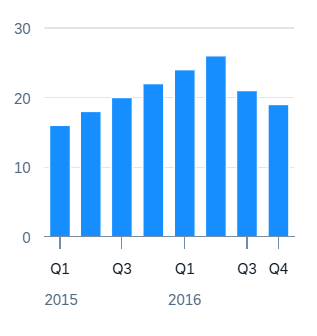

<!-- loio784d317546c54c85b5fc0b2a4dd4e5c6 -->

# Time Series Chart

You can render the chart as a time series chart in SAP Fiori elements for OData V4.

A time series chart contains a time axis instead of a categorical axis.

  
  
**Example of a Time Series Chart**



This chart type represents a time-based dimension that is more responsive to available space for the dimension axis.

The time axis is automatically enabled for a chart when its dimension is `Edm.Date`.

Additionally, the time axis is enabled when the dimension is of type `String` and is annotated with one of the following annotations:

-   `@Common.IsFiscalYear`

-   `@Common.IsFiscalYearPeriod`

-   `@Common.IsCalendarYearMonth`

-   `@Common.IsCalendarYearQuarter`

-   `@Common.IsCalendarYearWeek`

-   `@Common.IsCalendarDate`


> ### Sample Code:  
> Metadata Sample
> 
> ```
> <Property Name="Date" Type="Edm.DateTime" sap:display-format="Date" sap:label="Date" sap:aggregation-role="dimension"/>
> ```


> ### Sample Code:  
> XML Annotation
> 
> ```xml
> <Annotation Term="UI.Chart" Qualifier="Line-Time_-Currency">
>     <Record Type="UI.ChartDefinitionType">
>         <PropertyValue Property="Title" String="View1" />
>         <PropertyValue Property="ChartType" EnumMember="UI.ChartType/Line"/>
>         <PropertyValue Property="MeasureAttributes">
>             <Collection>
>                 <Record Type="UI.ChartMeasureAttributeType">
>                     <PropertyValue Property="Measure" PropertyPath="SalesShare" />
>                     <PropertyValue Property="Role"
>                                    EnumMember="UI.ChartMeasureRoleType/Axis1" />
>                     <PropertyValue Property="DataPoint" AnnotationPath="@UI.DataPoint#Eval_by_CtryCurr_-SalesShare"/>
>                 </Record>
>             </Collection>
>         </PropertyValue>
>         <PropertyValue Property="DimensionAttributes">
>             <Collection>
>                 <Record Type="UI.ChartDimensionAttributeType">
>                     <PropertyValue Property="Dimension" PropertyPath="Date" />
>                     <PropertyValue Property="Role"
>                                    EnumMember="UI.ChartDimensionRoleType/Category" />
>                 </Record>
>                 <Record Type="UI.ChartDimensionAttributeType">
>                     <PropertyValue Property="Dimension" PropertyPath="Sales_CURRENCY"/>
>                     <PropertyValue Property="Role"
>                                    EnumMember="UI.ChartDimensionRoleType/Series"/>
>                 </Record>
>             </Collection>
>         </PropertyValue>
>     </Record>
> </Annotation>
> ```

> ### Sample Code:  
> ABAP CDS Annotation
> 
> ```
> 
> @UI.Chart: [
>   {
>     title: 'View1',
>     chartType: #LINE,
>     measureAttributes: [
>       {
>         measure: 'SalesShare',
>         role: #AXIS_1,
> 		asDataPoint: true
>       }
>     ],
>     dimensionAttributes: [
>       {
>         dimension: 'Date',
>         role: #CATEGORY
>       },
>       {
>         dimension: 'Sales_CURRENCY',
>         role: #SERIES
>       }
>     ],
>     qualifier: 'Line-Time-Currency'
>   }
> ]
> annotate view VIEWNAME with { }
> 
> ```

> ### Sample Code:  
> CAP CDS Annotation
> 
> ```
> 
> UI.Chart #Line-Time-Currency : {
>     $Type : 'UI.ChartDefinitionType',
>     Title : 'View1',
>     ChartType : #Line,
>     MeasureAttributes : [
>         {
>             $Type : 'UI.ChartMeasureAttributeType',
>             Measure : SalesShare,
>             Role : #Axis1,
>             DataPoint : '@UI.DataPoint#Eval_by_CtryCurr-SalesShare'
>         }
>     ],
>     DimensionAttributes : [
>         {
>             $Type : 'UI.ChartDimensionAttributeType',
>             Dimension : Date,
>             Role : #Category
>         },
>         {
>             $Type : 'UI.ChartDimensionAttributeType',
>             Dimension : Sales_CURRENCY,
>             Role : #Series
>         }
>     ]
> }
> 
> ```


> ### Note:  
> For information about time series chart cards on the overview page, see [Time Series Chart Card](time-series-chart-card-a7de883.md).

