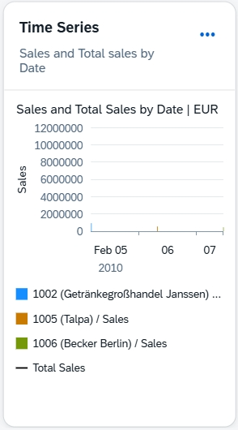

<!-- loio784d317546c54c85b5fc0b2a4dd4e5c6 -->

# Time Series Chart

You can render the chart as a time series chart in SAP Fiori elements for OData V4.

A time series chart contains a time axis instead of a categorical axis.

  
  
**Example of a Time Series Chart**



This chart type represents a time-based dimension that is more responsive to available space for the dimension axis.

The time axis is automatically enabled for a chart when its dimension is `Edm.Date`.

Additionally, the time axis is enabled when the dimension is of type `String` and is annotated with one of the following annotations:

-   `@Common.IsFiscalYear`

-   `@Common.IsFiscalYearPeriod`

-   `@Common.IsCalendarYearMonth`

-   `@Common.IsCalendarYearQuarter`

-   `@Common.IsCalendarYearWeek`

-   `@Common.IsCalendarDate`


> ### Sample Code:  
> XML Metadata
> 
> ```
> <Property Name="Date" Type="Edm.DateTime" sap:display-format="Date" sap:label="Date" sap:aggregation-role="dimension"/>
> 
> 
> ```

> ### Sample Code:  
> ABAP CDS Metadata
> 
> ```
> @EndUserText.label: 'Date'
> @Semantics.date:    true
> Date
> ```

> ### Sample Code:  
> CAP CDS Metadata
> 
> ```
> @title: 'Date'
> @Common.Label: 'Date'
> Date : Date;
> 
> ```

> ### Sample Code:  
> XML Annotation
> 
> ```xml
> <Annotation Term="UI.Chart" Qualifier="TimeSeriesChart">
>   <Record Type="UI.ChartDefinitionType">
>     <PropertyValue Property="Title"     String="Quarterly Sales"/>
>     <PropertyValue Property="ChartType" EnumMember="UI.ChartType/Line"/>
>     <PropertyValue Property="Measures">
>       <Collection>
>         <PropertyPath>NetSales</PropertyPath>
>       </Collection>
>     </PropertyValue>
>     <PropertyValue Property="Dimensions">
>       <Collection>
>         <PropertyPath>Quarter</PropertyPath>
>       </Collection>
>     </PropertyValue>
>     <PropertyValue Property="MeasureAttributes">
>       <Collection>
>         <Record Type="UI.ChartMeasureAttributeType">
>           <PropertyValue Property="Measure"   PropertyPath="NetSales"/>
>           <PropertyValue Property="Role"      EnumMember="UI.ChartMeasureRoleType/Axis1"/>
>           <PropertyValue Property="DataPoint" AnnotationPath="@UI.DataPoint#NetSalesDP"/>
>         </Record>
>       </Collection>
>     </PropertyValue>
>     <PropertyValue Property="DimensionAttributes">
>       <Collection>
>         <Record Type="UI.ChartDimensionAttributeType">
>           <PropertyValue Property="Dimension" PropertyPath="Quarter"/>
>           <PropertyValue Property="Role"      EnumMember="UI.ChartDimensionRoleType/Category"/>
>         </Record>
>       </Collection>
>     </PropertyValue>
>   </Record>
> </Annotation>
> ```

> ### Sample Code:  
> ABAP CDS Annotation
> 
> ```
> 
> @UI.chart: [
>   {
>     qualifier:  'TimeSeriesChart',
>     title:      'Quarterly Sales',
>     chartType:  #LINE,
>     measures:   ['NetSales'],
>     dimensions: ['Quarter'],
>     measureAttributes: [
>       {
>         measure:   'NetSales',
>         role:      #AXIS_1,
>         dataPoint: '@UI.dataPoint#NetSalesDP'
>       }
>     ],
>     dimensionAttributes: [
>       {
>         dimension: 'Quarter',
>         role:      #CATEGORY
>       }
>     ]
>   }
> ]
> 
> ```

> ### Sample Code:  
> CAP CDS Annotation
> 
> ```
> @UI.Chart #TimeSeriesChart: {
>   Title:      'Quarterly Sales',
>   ChartType:  #Line,
>   Measures:   [NetSales],
>   Dimensions: [Quarter],
>   MeasureAttributes: [
>     {
>       Measure:   NetSales,
>       Role:      #Axis1,
>       DataPoint: '@UI.DataPoint#NetSalesDP'
>     }
>   ],
>   DimensionAttributes: [
>     {
>       Dimension: Quarter,
>       Role:      #Category
>     }
>   ]
> }
> 
> ```


> ### Note:  
> For information about time series chart cards on the overview page, see [Time Series Chart Card](time-series-chart-card-a7de883.md).

