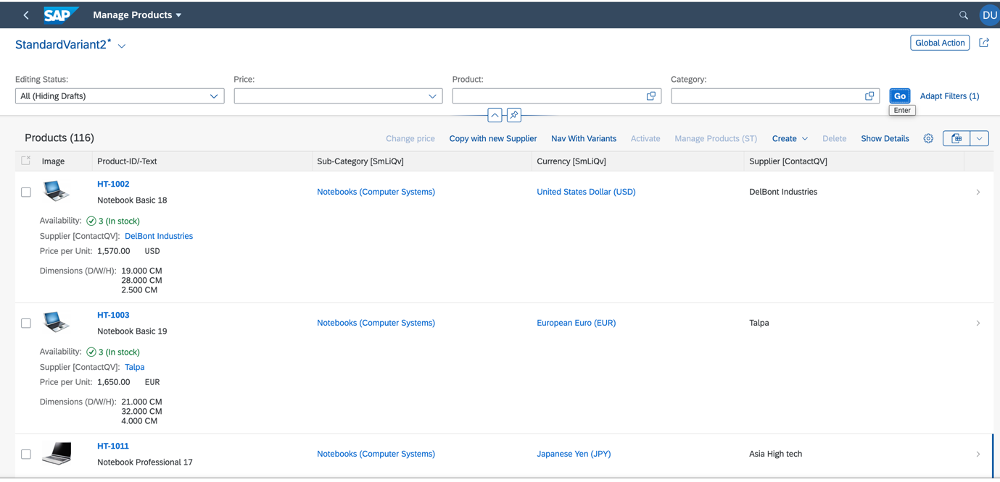
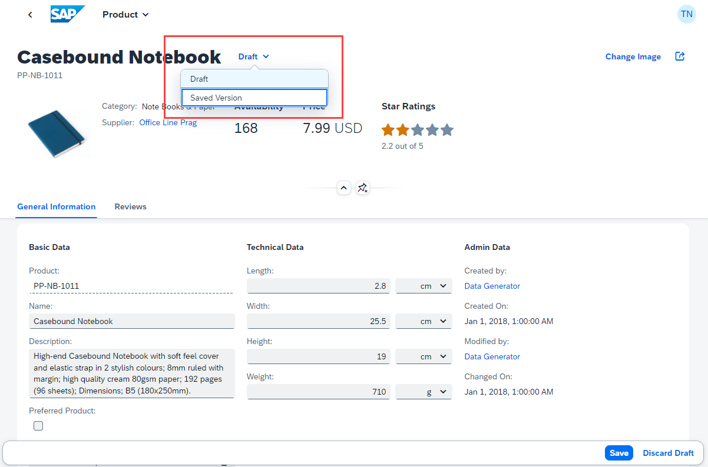
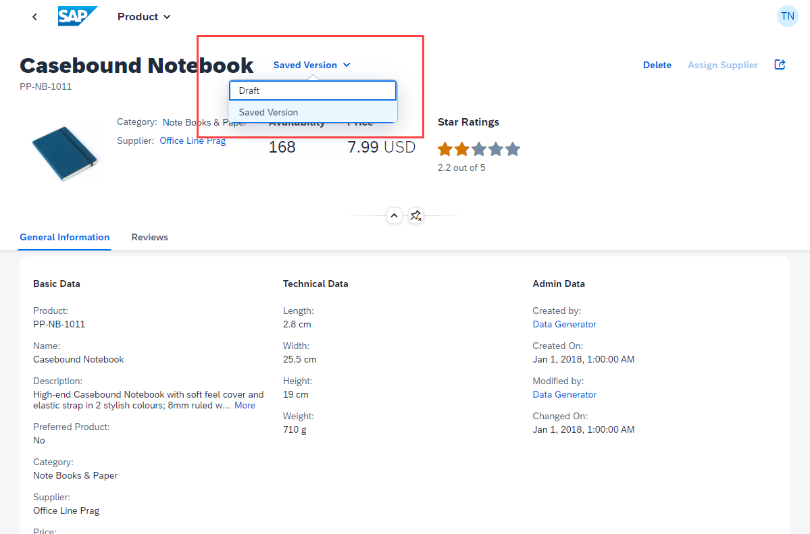

<!-- loiofd3950a0b251439ab8cd4153d64844b6 -->

# Toggling Between Draft and Saved Values

You can toggle between draft and saved values.

In SAP Fiori elements for OData V2 and SAP Fiori elements for OData V4, the draft-enabled applications have an additional entry, *All \(Hiding Drafts\)*, in the *Editing Status* filter field in the list report.

The following table shows the system behavior for the list report and object page:

****

<table>
<tr>
<th valign="top">

Editing Status Filter in List Report

</th>
<th valign="top">

In a List Report

</th>
<th valign="top">

While Navigating to an Object Page

</th>
<th valign="top">

Navigating back to a List Report

</th>
</tr>
<tr>
<td valign="top">

 *All \(Hiding Drafts\)* 

</td>
<td valign="top">

Only the saved objects with their respective data are displayed in the list report table

</td>
<td valign="top">

Saved object is displayed with a *Return to Draft* button if a draft exists for this object

</td>
<td valign="top">

Only the saved objects with their respective data are displayed in the list report table

</td>
</tr>
</table>

  

On the object page, the *Saved Version*/*Draft* button is visible if a draft exists. The *Saved Version*/*Draft* button opens a popover that allows you to toggle between the draft and saved version of an object page. The label of the button clearly indicates which version of the object page you're working with.

In the following screenshot, the object page displays the *Draft* version with the popover you can use to toggle:

  

In the following screenshot, the object page displays the *Saved Version*:

  

> ### Note:  
> In SAP Fiori elements for OData V2 apps with the classic header. the header toolbar shows the *Display Saved Version*/*Return to Draft* button instead of the menu button next to the title.

