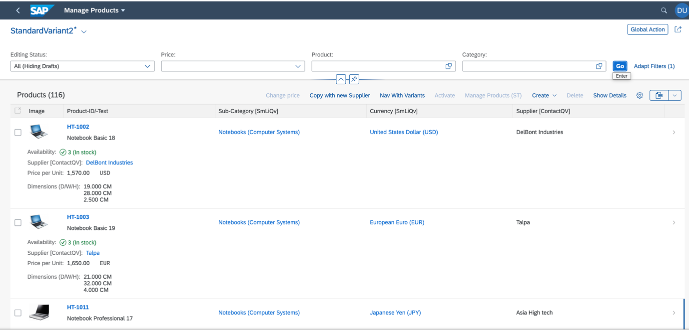
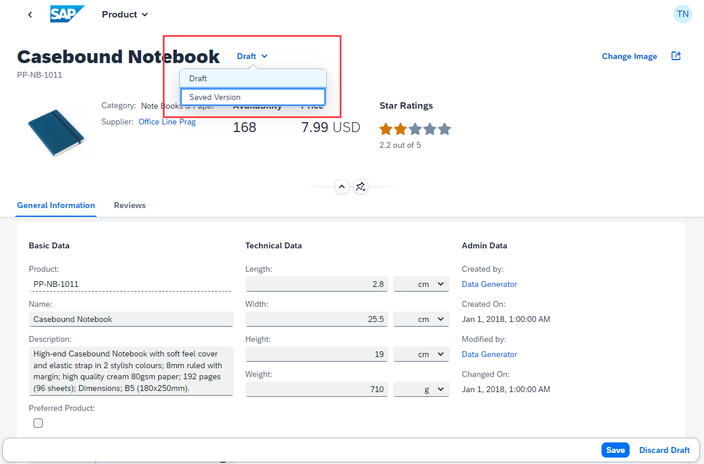
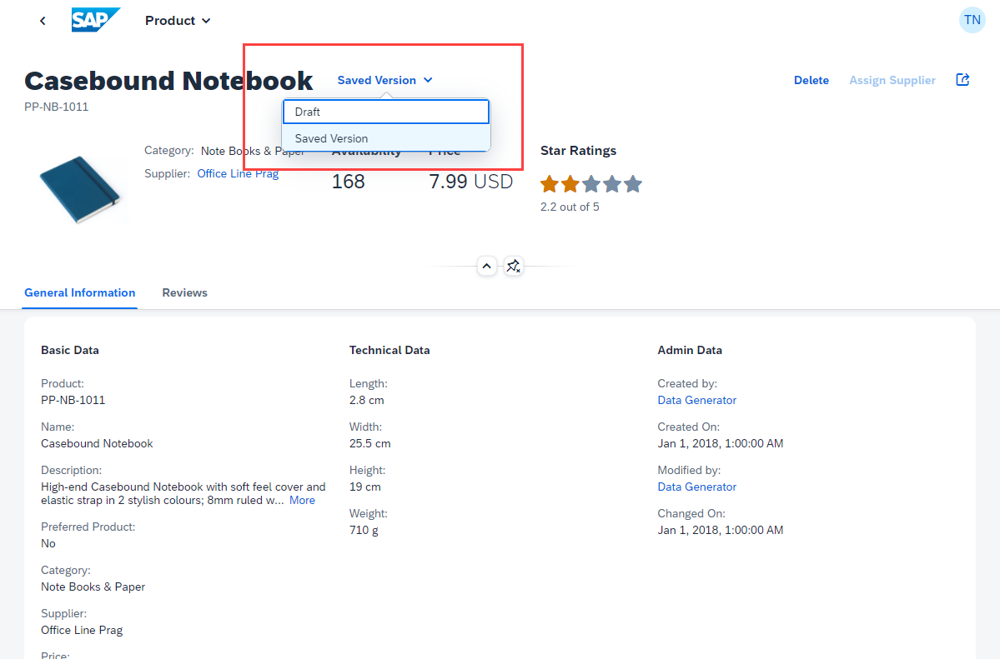

<!-- loiofd3950a0b251439ab8cd4153d64844b6 -->

# Toggling Between Draft and Saved Values

You can toggle between draft and saved values.

Draft-enabled applications have an additional entry, *All \(Hiding Drafts\)*, in the *Editing Status* filter field on the list report page.

The following table shows the system behavior for the list report page and the object page:

****

<table>
<tr>
<th valign="top">

Conditions

</th>
<th valign="top">

Behavior

</th>
</tr>
<tr>
<td valign="top">

*Editing Status* filter on a list report page

</td>
<td valign="top">

*All \(Hiding Drafts\)* 

</td>
</tr>
<tr>
<td valign="top">

On a list report page

</td>
<td valign="top">

Only the saved objects with their respective data are displayed in the list report page table.

</td>
</tr>
<tr>
<td valign="top">

Navigating to an object page

</td>
<td valign="top">

The saved object is displayed with a *Saved Version*/*Draft* button that lets users toggle between the saved version and draft if it exists.

</td>
</tr>
<tr>
<td valign="top">

Navigating back to a list report page

</td>
<td valign="top">

Only the saved objects with their respective data are displayed in the list report page table.

</td>
</tr>
</table>

On the object page, the *Saved Version*/*Draft* button is visible if a draft exists. The *Saved Version*/*Draft* button opens a popover that allows you to toggle between the draft and saved version of an object page. The label of the button clearly indicates which version of the object page you're working with.

In the following screenshot, the object page displays the *Draft* version with the popover you can use to toggle:

In the following screenshot, the object page displays the *Saved Version*:

> ### Note:  
> For information about SAP Fiori elements for OData V2, see [Toggling Between Draft and Saved Values](toggling-between-draft-and-saved-values-11f948a.md).

**Related Information**  

[Draft Handling](draft-handling-ed9aa41.md "You can configure how your SAP Fiori elements app handles drafts.")

