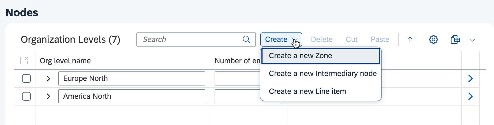
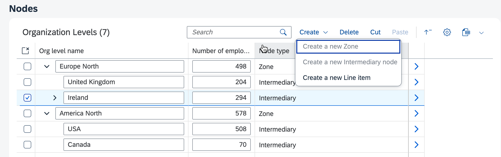
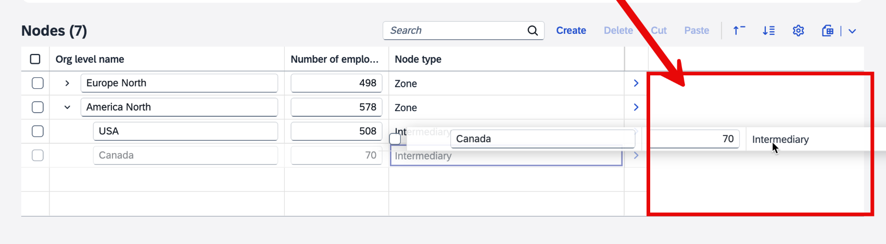
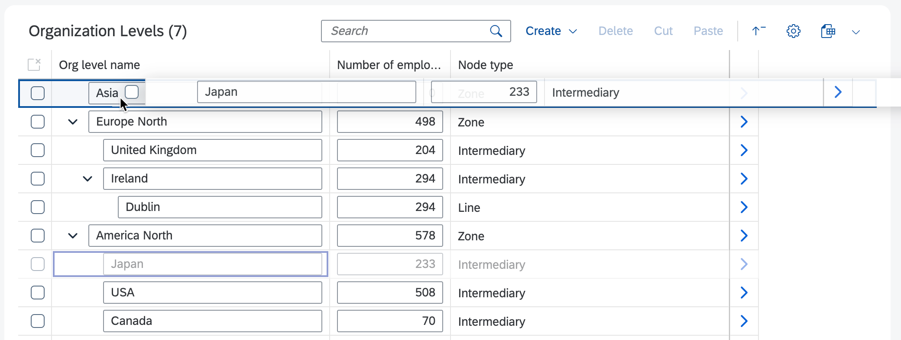
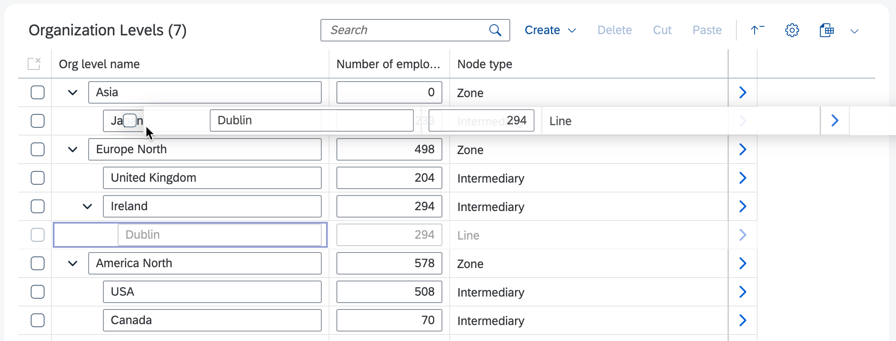
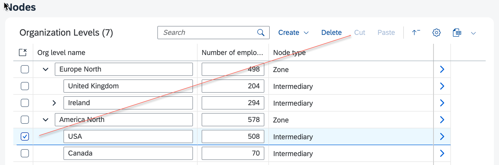

<!-- loio7cf7a31fd1ee490ab816ecd941bd2f1f -->

# Tree Tables

You can use tree tables in the list report and the object page.

> ### Note:  
> This topic is only applicable to SAP Fiori elements for OData V4.

SAP Fiori elements for OData V4 supports displaying a tree table on the list report with a draft-enabled service with the following behavior:

-   Only the active entities are displayed.

-   The *Editing Status* field is not displayed in the filter bar.

-   The draft indicator is shown if a draft exists for an active record.

-   When creating a new object, the new object needs to be saved or discarded.

-   The behavior of already saved objects remains unchanged: a draft can be saved, kept, or discarded. The navigation is also unchanged.

-   Extension points are the same as for the object page.


> ### Note:  
> When switching between edit mode and display mode, the expansion state of a tree table in an object page is not kept.

> ### Restriction:  
> A tree table cannot be displayed on the list report with a draft-enabled service in the flexible column layout.


<a name="loio7cf7a31fd1ee490ab816ecd941bd2f1f__section_kmb_mld_gbc"/>

## Enabling Tree Tables

To enable tree tables in the list report or object page, the following parameters are needed in the `tableSettings` part of the `manifest.json`:

-   Set the `type` to `TreeTable`.

-   Set the `hierarchyQualifier`. You must use the qualifier for the `Hierarchy.RecursiveHierarchy` annotation for the page entity set.


> ### Sample Code:  
> `manifest.json`
> 
> ```json
> "tableSettings": {
>      "type": "TreeTable",
>      "hierarchyQualifier": "NodesHierarchy",
>    ...
> }
> ```


<a name="loio7cf7a31fd1ee490ab816ecd941bd2f1f__section_osy_44d_gbc"/>

## Create Mode and Custom Create Mode with a Menu Button

The following creation modes are supported with a tree table:

-   `Inline`: inline creation mode

-   `NewPage`: create page

-   `CreationDialog`: create dialog


In the list report, only the create page \(default\) and the create dialog are supported.

SAP Fiori elements for OData V4 supports the default create mode as well as a custom create mode. To use the custom create mode, add the following annotations to the `nodeType` section:

-   `propertyName`: Name of the property on the page entity set used to categorize the node type to be created within the hierarchy.

-   `values`: An object containing the values of the `propertyName` and the corresponding label to be used in the menu:

    -   `value`: A value of the property defined by the `propertyName` key.

    -   `label`: The menu item label that can be localized using an `i18n` key.

    -   `creationFields`: The properties to be displayed when using the `CreationDialog` mode. The `creationFields` parameter can point to a `FieldGroup` annotation or a comma-separated list of properties.


> ### Sample Code:  
> Custom Create Mode Options in the Tree Table
> 
> ```json
> "tableSettings": {
>     "type": "TreeTable",
>     "hierarchyQualifier": "NodesHierarchy",
>     "personalization": true,
>     "creationMode": {
>          "name": "Inline",
>          "nodeType": {
>             "propertyName": "nodeType",
>             "values": {
>                 "Zone": "Create a new Zone",
>                 "Intermediary": "Create a new Intermediary node",
>                 "Line": "Create a new Line item"
>              }
>          },
>          "isCreateEnabled": ".extension.hierarchy-edit.custom.OPExtend.enableCreate"
>      }
> }
> ```

  
  
**Custom Create Mode Options in the Tree Table**




### Custom Create Mode with a Create Dialog

Set up a create dialog as shown in the following example:

> ### Sample Code:  
> ```json
> "tableSettings": {
>     "type": "TreeTable",
>     "hierarchyQualifier": "NodesHierarchy",
>     "personalization": true,
>     "creationMode": {
>         "name": "CreationDialog",
>         "creationFields": "Title",
>         "nodeType": {
>             "propertyName": "nodeType",
>             "values": {
>                 "Zone": "Create a new Zone",
>                 "Intermediary": {
>                     "label": "Create a new Intermediary node",
>                     "creationFields": "Category",},
>                 "Line": "Create a new Line item"
>             }
>         },
>         "isCreateEnabled": ".extension.hierarchy-edit.custom.OPExtend.enableCreate"
>     }
> }
> ```

In this example, the create dialog is displayed with the property `Title` for the node types `Zone` and `Line`, and the property `Category` for the node type `Intermediary`.


### Enabling or Disabling the Create Button or the Create Menu Button

For both the standard create mode and the custom create mode, you can define an `isCreateEnabled` extension point to control whether the *Create* button or *Create Menu* buttons are enabled or disabled. The extension point callback needs to be added to the page controller extension.

The following parameters are provided to the callback:

-   The `value` associated with the selected menu item.

    If the standard create mode is used, the `value` is `null`.

-   The `parent context` of the parent under which the new node is created.

    If no node is selected \(creation at the root level of the hierarchy\), the `parent context` is `undefined`.


> ### Sample Code:  
> `manifest.json`
> 
> ```json
> sap.ui.define(["sap/ui/core/mvc/ControllerExtension"], function (ControllerExtension) {
>     "use strict";
>  
>     return ControllerExtension.extend("hierarchy-edit.custom.OPExtend", {
>         // this section allows to extend lifecycle hooks or override public methods of the base controller
>  
>         //Callback to enable Create actions
>         enableCreate: function (value, parentContext) {
>             switch (parentContext?.getProperty("nodeType")) {
>                 case "Zone":
>                     return value !== "Zone"; // Anything but 'Zone' under 'Zone'
>  
>                 case "Intermediary":
>                     return value === "Line"; // Only 'Line' under 'Intermediary'
>  
>                 case "Line":
>                     return false; // Nothing under 'Line'
>  
>                 default:
>                     return value === "Zone"; // Only 'Zone' at root level
>             }
>         }
>     }
> }
> ```

The following screenshot shows an example of the outcome. Under an "Intermediary" parent, only a "Line" node type can be created.

  
  
**Disabled Create Menu Buttons**




<a name="loio7cf7a31fd1ee490ab816ecd941bd2f1f__section_ak5_szn_tbc"/>

## Create at a Position Calculated by the Back-End Server

By default, a newly created node is always displayed as the first child below its parent even if a sort or a filter is applied to the table.

You can use the `createInPlace` option to place the new node in its real position below its parent, which depends on the sort criteria applied to the table and the back-end server logic. If the new node cannot be visualized due to the filter criteria applied to the table, a message toast is displayed to the end user.

> ### Note:  
> In the flexible column layout, when using both the `NewPage` and `createInPlace` options of the `createMode` property, the new entry is shown \(for example, in a subobject page\), but no message toast is displayed if it cannot be shown on the object page due to the applied filter criteria.

> ### Sample Code:  
> `manifest.json`
> 
> ```json
> "tableSettings": {
>     "type": "TreeTable",
>     "hierarchyQualifier": "NodesHierarchy",
>     "personalization": true,
>     "creationMode": {
>         "name": "Inline",
>         "createInPlace": true,
>         "nodeType": {
>             "propertyName": "nodeType",
>             "values": {
>                 "Zone": "Create a new Zone",
>                 "Intermediary": "Create a new Intermediary node",
>                 "Line": "Create a new Line item"
>             }
>         },
>         "isCreateEnabled": ".extension.hierarchy-edit.custom.OPExtend.enableCreate"
>     }
> }
> ```


<a name="loio7cf7a31fd1ee490ab816ecd941bd2f1f__section_qkl_rms_gbc"/>

## Drag and Drop

Drag and drop actions are supported by SAP Fiori elements for OData V4 as of SAPUI5 1.124.

Drag and drop between siblings is supported if the `ChangeNextSiblingAction` term is defined in the `RecursiveHierarchyActions` annotation. When using the ABAP RESTful Application Programming Model \(RAP\), this annotation is not set for root entities. For this reason, drag and drop between siblings is not supported in the list report.

If a node is dropped onto the empty area on the right-hand side of a table, the node is promoted to a root node. In the following example, dropping the "Canada" node onto the highlighted area turns it into a root node, that is, a sibling to the "Europe North" and "America North" nodes.

  
  
**Dropping a Node onto the Empty Right-Hand Side of a Table**



You can use the following extensions to control the behavior of drag and drop:

-   `isMoveToPositionAllowed`: Define if a source node can be dropped on a specific parent node.

    -   The associated callback receives the source and target contexts as parameters.

    -   When dropping as a root node, the parent node is set to `null`.

-   `isNodeMovable`: Define if a node can be dragged.

    -   The associated callback receives the source context as a parameter.


In the following example: drag and drop is enabled.

> ### Sample Code:  
> `manifest.json`
> 
> ```json
> "tableSettings": {
>     "type": "TreeTable",
>     "hierarchyQualifier": "NodesHierarchy",
>     "personalization": true,
>     "creationMode": {...},
>     "isMoveToPositionAllowed": ".extension.hierarchy-edit.custom.OPExtend.moveToPositionAllowed",
>     "isNodeMovable": ".extension.hierarchy-edit.custom.OPExtend.nodeMovable"
> }
> ```

In the following example: `ControllerExtension` is used to control the behavior of drag and drop.

> ### Sample Code:  
> `manifest.json`
> 
> ```json
> sap.ui.define(["sap/ui/core/mvc/ControllerExtension"], function (ControllerExtension) {
>     "use strict";
>  
>     return ControllerExtension.extend("hierarchy-edit.custom.OPExtend", {
>         // this section allows to extend lifecycle hooks or override public methods of the base controller
>  
>         //Callback for Drop and Paste actions
>         moveToPositionAllowed: function (sourceContext, parentContext) {
>             switch (parentContext?.getProperty("nodeType")) {
>                 case "Zone":
>                     return sourceContext?.getProperty("nodeType") === "Intermediary"; //Only 'Intermediary' under a 'Zone'
>  
>                 case "Intermediary":
>                     return  sourceContext?.getProperty("nodeType") === "Line" && sourceContext?.getProperty("name") !== 'Dublin'; // Only 'Line' under 'Intermediary' AND 'Dublin' node cannot be moved
>  
>                 case "Line":
>                     return false; // Nothing under 'Line'
>  
>                 default:
>                     return false;
>             }
>         },
>  
>         //Callback for Drag and Cut actions
>         nodeMovable: function (sourceContext) {
>             return sourceContext?.getProperty("name") !== 'USA'; // 'USA' node cannot be moved or cut
>         }
>     });
> });
> ```

The following screenshot shows an example of the outcome. The end user can drag and drop the "Japan" node under "Asia".

  
  
**Example of Dropping a Node Under a Parent Node**



The following screenshot shows another example of the outcome. Moving the "Dublin" node is forbidden, so the target node is not highlighted.

  
  
**Example of a Forbidden Move**




<a name="loio7cf7a31fd1ee490ab816ecd941bd2f1f__section_u4g_lrt_vbc"/>

## Move Up and Move Down

End users can move a node up or down between its siblings in a tree table. To place a node before its previous sibling or after its next sibling, select the node and choose *Move Up* or *Move Down* from the tree table toolbar.

Moving a node up or down is supported if the `ChangeNextSiblingAction` term is defined in the `RecursiveHierarchyActions` annotation. When using the ABAP RESTful Application Programming Model \(RAP\), this annotation is not set for root entities. For this reason, moving up or down a node is not supported in the list report.

> ### Restriction:  
> A node that is created without the `createInPlace` option is displayed as the first child below its parent and is therefore considered "out of place". Move operations are disabled for such nodes. Similarly, moving a node up is disabled if its previous sibling is an "out of place" node.
> 
> Moving a node up and down is also disabled in the following situations:
> 
> -   A sort is applied to the table.
> 
> -   The `isNodeMovable` or `isMoveToPositionAllowed` extension points return `false` \(see the previous section, [Drag and Drop](tree-tables-7cf7a31.md#loio7cf7a31fd1ee490ab816ecd941bd2f1f__section_qkl_rms_gbc)\).


<a name="loio7cf7a31fd1ee490ab816ecd941bd2f1f__section_nl2_r1y_gbc"/>

## Cut and Paste

Cut and paste actions are supported by SAP Fiori elements for OData V4 as of SAPUI5 1.124.

Both actions can be enabled or disabled by using the same extension points as for drag and drop:

-   `isNodeMovable`: Defines if a node can be cut.

-   `isMoveToPositionAllowed`: Defines if a node can be pasted under a specific parent node.


In the following example, the USA node can't be cut or dragged:

  
  
**Example of a Node with Disabled Cut Action**



> ### Note:  
> When pasting, the position of the pasted node under its parent is defined by the back-end logic, which should reflect the needs of your use case.


<a name="loio7cf7a31fd1ee490ab816ecd941bd2f1f__section_gms_4s5_2fc"/>

## Copy and Paste

Copying a node is supported by SAP Fiori elements for OData V4 as of SAPUI5 1.136. It can be enabled or disabled by using the following extension points:

-   `isNodeCopyable`: Defines if a node can be copied. The associated callback receives the source context as a parameter.
-   `isCopyToPositionAllowed`: Defines if a source node can be pasted under a specific parent node. The associated callback receives the source and target contexts as parameters.

> ### Sample Code:  
> `manifest.json`
> 
> ```json
> "tableSettings": {
>     "type": "TreeTable",
>     "hierarchyQualifier": "NodesHierarchy",
>     "personalization": true,
>     "creationMode": {...},
>     "isNodeCopyable": ".extension.hierarchy-edit.custom.OPExtend.enableCopy",
> 	"isCopyToPositionAllowed": ".extension.hierarchy-edit.custom.OPExtend.enablePasteFromCopy"
> }
> ```


<a name="loio7cf7a31fd1ee490ab816ecd941bd2f1f__section_zvl_zyn_jdc"/>

## Context Menu

You can open the context menu in the tree table by right-clicking on any node within the table. All the other nodes are greyed out. Only bound actions are included in this menu.

> ### Note:  
> Actions that are specific to tree tables, such as cut, paste, expand entire node, or collapse entire node, are not supported with multi-selection.


<a name="loio7cf7a31fd1ee490ab816ecd941bd2f1f__section_u3q_5fy_gbc"/>

## Disabling Hierarchy Change Operations

You can disable drag and drop as well as cut and paste to restrict changes in the hierarchy. To do that, use the `UpdateRestrictions` and `NonUpdatableNavigationProperties` annotations on the navigation property to the hierarchy parent.

> ### Sample Code:  
> `manifest.json`
> 
> ```json
> @odata.draft.enabled
>   entity TreeTableSubEntityWithUpdateRestriction {
>         @Core.Immutable: true
>         @Common.Label  : 'ID'
>     key ID               : String;
>         parent           : String;
>  
>         @Common.Label  : 'Org level name'
>         name             : String;
>  
>         @UI.Hidden     : true
>         orgID            : String;
>  
>         @Core.Computed : true
>         @UI.Hidden     : true
>         DistanceFromRoot : Integer64;
>  
>         Superordinate    : Association to TreeTableSubEntityWithUpdateRestriction
>                              on Superordinate.ID = parent;
>         Organization     : Association to TreeTableEntity
>                              on Organization.ID = orgID;
>   }
>  
>   annotate TreeTableSubEntityWithUpdateRestriction with @(Capabilities: {UpdateRestrictions: {NonUpdatableNavigationProperties: [Superordinate]}});
> ```


<a name="loio7cf7a31fd1ee490ab816ecd941bd2f1f__section_lyz_f3w_rcc"/>

## Disabling the Reordering of Root Nodes

You can prevent users from changing the order of root nodes by using the [`ChangeSiblingForRootsSupported`](https://github.com/SAP/odata-vocabularies/blob/main/vocabularies/Hierarchy.xml#L201) annotation.

If `ChangeSiblingForRootsSupported` is set to `false`, users can't do the following actions:

-   Move a root node up or down

-   Drop a node as a root node between two other root nodes


If no specific restrictions have been set for an action, the following actions are supported:

-   Cutting a root node

-   Pasting a node as a root node

-   Dragging a root node

-   Dropping a node as a root node at the beginning or end of the table or onto the right-hand side of the table


If `ChangeSiblingForRootsSupported` is not defined, it is considered as set to `true`.

> ### Sample Code:  
> XML Annotation
> 
> ```xml
> <edmx:Reference Uri="/sap/opu/odata/IWFND/CATALOGSERVICE;v=2/Vocabularies(TechnicalName='%2FIWBEP%2FVOC_HIERARCHY',Version='0001',SAP__Origin='LOCAL')/$value">
>   <edmx:Include Namespace="com.sap.vocabularies.Hierarchy.v1" Alias="SAP__hierarchy"/>
> </edmx:Reference>
> 
> <Annotations Target="SAP__self.HierarchyEntityType">
>   <Annotation Term="SAP__hierarchy.RecursiveHierarchyActions" Qualifier="HierarchyNode">
>     <Record>
>       <PropertyValue Property="ChangeNextSiblingAction" String="SAP__self.changeNextSibling"/>
>       <PropertyValue Property="CopyAction" String="SAP__self.copy"/>
>       <PropertyValue Property="ChangeSiblingForRootsSupported" Bool="false"/>
>     </Record>
>   </Annotation>
> </Annotations>
> ```


<a name="loio7cf7a31fd1ee490ab816ecd941bd2f1f__section_vf1_cly_gbc"/>

## `TreeTable` Building Block

You can use a dedicated `TreeTable` building block in SAP Fiori elements for OData V4.

-   For more information about this building block, see the [API reference](https://ui5.sap.com/#/api/sap.fe.macros.TreeTable).

-   For more information and live examples, see the SAP Fiori development portal at [Building Blocks - Table - Tree Table](https://ui5.sap.com/test-resources/sap/fe/core/fpmExplorer/index.html#/buildingBlocks/table/treeTable).


