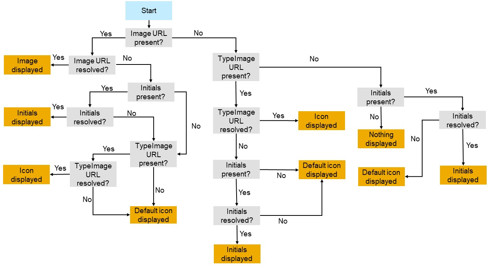

<!-- loio5760b638ea274d7aab59e4e434899528 -->

# Using Images, Initials, and Icons

SAP Fiori elements supports the use of images, initials, and icons.

> ### Note:  
> For SAP Fiori elements for OData V2based applications, you can change the display shape using the Page Editor of SAP Fiori tools. For more information, see [Configure Page Elements](https://help.sap.com/docs/SAP_FIORI_tools/17d50220bcd848aa854c9c182d65b699/047507c86afa4e96bb3d284adb9f4726.html).

The system follows this logic for choosing a display option for an object:

  

> ### Note:  
> In the object page's header, the header image is an avatar control. By default, the avatar is rendered as a square. If the avatar's source, initials, or icon isn't set or found, a fallback placeholder is displayed. The type of placeholder depends on the shape of the avatar. If the avatar is circular, a person icon is shown. If the avatar is a square, a product icon is shown.

