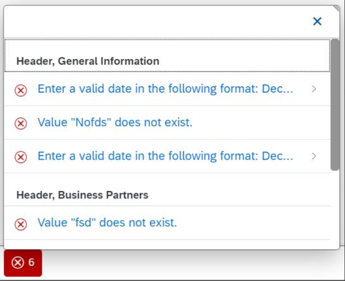
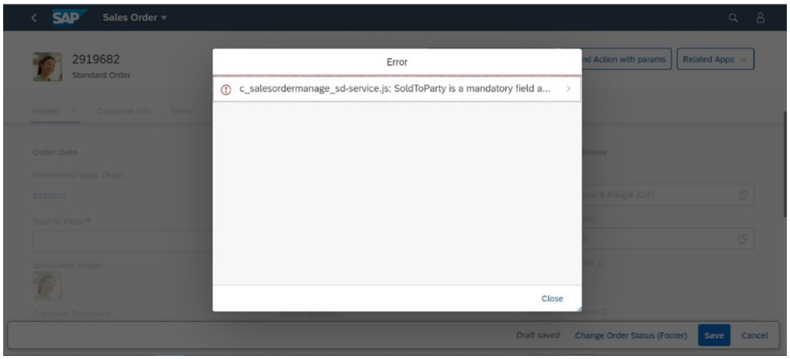

<!-- loio239b1922758645e7b451e01ded7f56bc -->

# Using Messages

The system generates messages in response to what users do in the SAP system. A message presents information, an instruction, or a warning to users in a given situation.

Back-end systems can generate either a state message or a transition message.

-   State message

    A state message refers to the state of an instance, for example when a user tries to activate an object with field values that return an error like "Amount must not be negative". These messages are displayed on the UI until the state of the related instance has been corrected, for example by changing the amount attribute to a positive value. The messages are displayed to the user and also persisted in the back-end system.

    State messages are not expected or supported in the list report and on the object page \(or subobject page\) in display mode. In edit more of the object page \(or subobject page\), state messages are shown in the message popover. The popover in the main object also displays the messages related to its items and vice versa. Client-side validation messages are also shown here.

-   Transition message

    A transition message does not affect the state of the object, but is rather 'transient' in nature and refers only to the last action that was executed , for example "Document can't be printed as printer is not available" or "Order cannot be released because the specified quantity is not available in stock".

    Transition messages are shown in the message dialog in the list report and on the object page \(or subobject page\) in display mode. The only exception is if there is exactly one transition success message, since in this case the message is shown in a message toast.

> ### Note:  
> If the back end sends a message with multiple target IDs, you must ensure that all the fields corresponding to the different targets are on the same page in the UI.

<a name="loio239b1922758645e7b451e01ded7f56bc__section_hhy_fsm_vsb"/>

## Handling of 412 Messages \("Precondition Failed" Messages\)

Messages of this type allow users to retry the action that triggered the message by ignoring the 412 warnings. For more information, see [Confirmation Popups](confirmation-popups-9a53662.md).

<a name="loio239b1922758645e7b451e01ded7f56bc__section_otc_1xw_cnb"/>

## Additional Features in SAP Fiori Elements for OData V2

Transition messages are always shown in message dialog - this is true also in edit mode of an object page. Draft operations are handled like actions, for example, activate, prepare, or validate operations.

> ### Note:  
> Avoid raising transition messages during prepare and validate operations. The user would see them in a dialog box and this UI behavior is not needed in edit mode.

<a name="loio239b1922758645e7b451e01ded7f56bc__section_zxr_fxw_cnb"/>

## Additional Features in SAP Fiori Elements for OData V4

For more detailed information, see [Server Messages in the OData V4 Model](../04_Essentials/server-messages-in-the-odata-v4-model-fbe1cb5.md).

### Bound and Unbound Messages

SAP Fiori elements provides two main types of message handling, depending on whether the incoming messages are bound, that is, specific to an instance \(for example, the sales order that was chosen for the action to be executed\) or unbound, that is, not related to a specific instance \(for example "No new sales order can be created until the end of this quarter."\).

Unbound messages are always considered as transition messages.

-   Bound transition messages are shown in a new message dialog also in edit mode if a dialog is already open \(for example, an action parameter dialog\). Only messages with targets that are the same as the fields within the original dialog are shown inline in the same dialog.

-   Bound transition messages triggered from an action without a dialog are shown in a message popover in edit mode alongside any existing state messages.

– Handling Bound Messages –

A message popover is used to display a summarized list of different types of bound messages \(messages that are specific to a particular instance, for example for a sales order selected in a list report and shown in an object page\). It provides a handy and systemized way to navigate and explore details for every message. The message popover automatically displays messages that are sent from the back end as part of the request-response cycle. The messages for subitems are also shown \(for example, if the message popover is bound to a sales order item, the messages for the underlying sales order items are shown as well\). In addition, messages are grouped by the name of the message group the current item belongs to, or else categorized under ‘General’.

Usage

-   You want to display multiple messages to the user.

-   You do not want to interrupt the user flow while still retaining the messages corresponding to the operations they perform.

Layout: Message Button

-   You want to display multiple messages to the user.

-   You do not want to interrupt the user flow while still retaining the messages corresponding to the operations they perform.

-   The message button is only available if there are bound messages.

-   The message button is colored to indicate the highest severity among all the incoming bound messages. In addition, it displays the total count of error messages.

Layout: Message Popover

The message popover consists of the following components:

-   Filter: You use the filter function to filter messages based on their severity \(for example error, success, or warning messages\).

-   Group Name: Name of the message group the current item belongs to \(otherwise categorized under 'General'\).

    Messages from the back end are grouped by tables, indicating the section and table name. This allows users to easily see which table an error message is related to if the app contains many tables.

-   Short description of the message.

-   Subtitle label for additional information.

-   Chevron navigation to the detailed description of the message \(if this is supplied by the back end\).

    If the message model provides a long text from the back end, the user is able to navigate to the details section from the message popover. There, the user typically finds more detailed information.

       
      
    **Message Popover: Chevron Navigation to Message Details**

      

Navigation is also supported from the messages. This allows end users to navigate directly to the place where the error/warning occurs on the UI by simply clicking on the respective message in the message popover.

– Handling Unbound Messages –

A message dialog is used to display a summarized list of different types of unbound messages \(messages that are not associated with any specific instance, for example a message like “No new sales order can be created since the system is under maintenance until the end of the week.”\). It provides a handy and systemized way to navigate and explore the technical details of every message. It automatically displays messages related to a user action connected to the back end, or to service failures or errors.

Usage

-   You want to display unbound messages that provide immediate feedback to end users on an operation they performed.

Layout: Message Dialog

The message dialog consists of the following components:

-   Filter: You use the filter function to filter messages based on their severity \(for example error, success, or warning messages\).

-   Type: Indicates the type of the message.

-   Title/Subtitle: Use this feature to provide a title and subtitle for the message.

-   Description: Provides the long text of the message with detailed information.

-   Chevron navigation to the detailed description of the message \(if this is supplied by the back end\).

    If the message cannot be fully displayed or includes a description, the `MessageDialog` enables the navigation to the detailed description of the message, along with the technical details of the message \(for example status code, status text, or description\), application details \(component ID, service ID, or service repository\) and error resolution details \(analysis, exception category, or timestamp\).

       
      
    **Message Dialog: Chevron Navigation to Message Details**

      

### Using Status Messages on the Object Page

Based on information received from the back end, we show a message strip on the object page with a status message for the object whenever it’s relevant to the entire object \(and not to a child entity or a specific field, for example\). The color of the message strip is derived from the criticality of the message. You can hide the message strip or display a specific message using the `ExtensionAPI`. For more information about the `ObjectPage.ExtensionAPI`, see the [API Reference](https://ui5.sap.com/#/api/sap.fe.templates.ObjectPage.ExtensionAPI/methods/showMessages).

