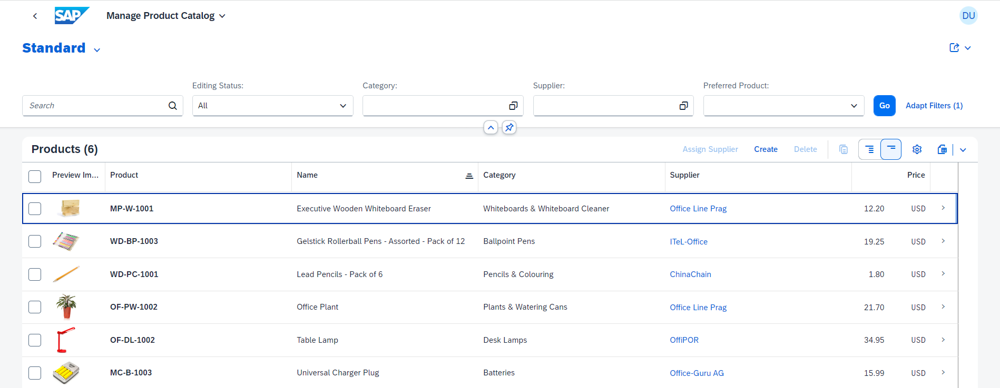
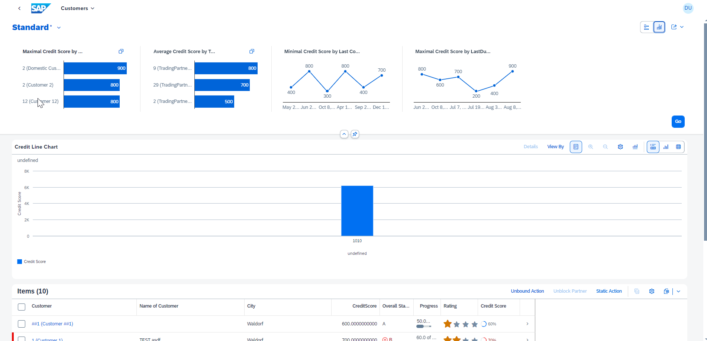
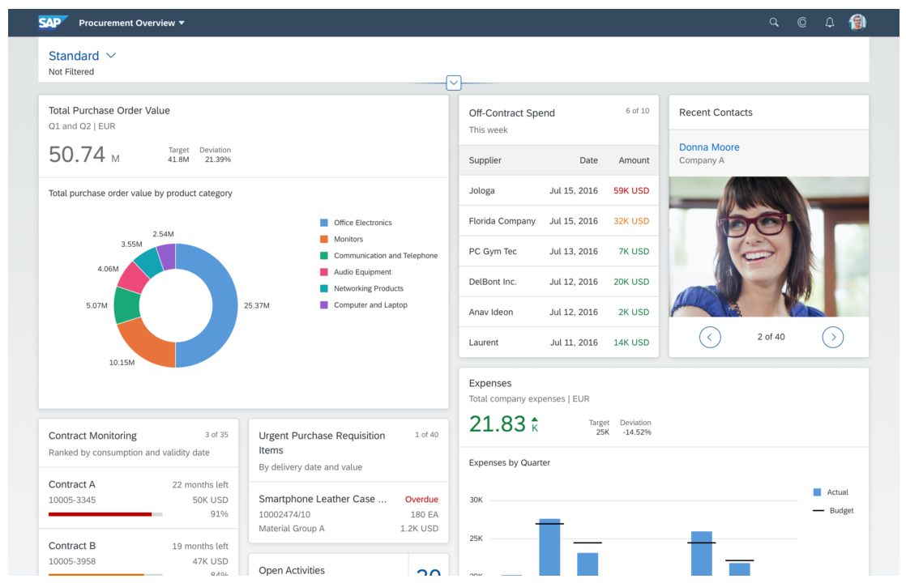
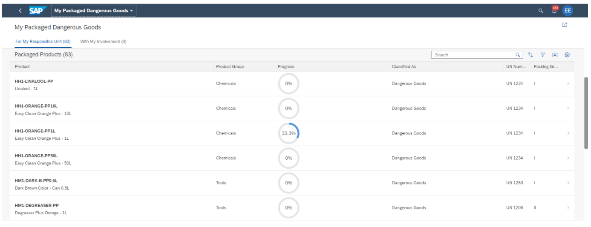

<!-- loio797c3239b2a9491fa137e4998fd76aa7 -->

# Using SAP Fiori Elements Floorplans

Our floorplans provide you with predefined templates for common application use cases.

You can create apps using the following SAP Fiori elements floorplans:

-   [List Report and Object Page](list-report-and-object-page-c0eec49.md)

    SAP Fiori elements contains predefined templates for list reports and object pages. A list report lets users filter, view, and work with items \(objects\) organized in list \(table\) format. The list report is typically used in conjunction with an object page. This object page lets users work with objects, providing functions for viewing, editing, and creating objects.

       
      
    **List Report**

      

       
      
    **Object Page**

      

-   [Analytical List Page](analytical-list-page-3d33684.md)

    The analytical list page \(ALP\) offers a unique way to analyze data step by step from different perspectives, to investigate a root cause through drilldown, and to act on transactional content. You can use SAP Fiori elements to build apps that require visualization and reporting of data using filters, interactive charts, and other data points such as KPIs \(key performance indicators\).

       
      
    **Analytical List Page**

      

-   [Overview Pages](overview-pages-c64ef8c.md)

    An overview page is a data-driven SAP Fiori app for organizing large amounts of information. Information is visualized in a card format in an attractive and efficient way. Different cards are used for different types of content. The user-friendly experience makes viewing, filtering, and acting on data quick and easy. While presenting the big picture, business users can focus on the most important tasks enabling faster decision making as well as immediate action.

      
      
    **Overview Page**

      

-   [Worklist](worklist-d1d588f.md)

    A worklist displays a collection of items to be processed by the user. There is no need for sophisticated filtering. Working through the item list usually involves reviewing details of the list items and taking action. In most cases, the user has to either complete a work item or delegate it.

       
      
    **Worklist**

      

Generic information that applies to all floorplans can be found under [How To Use SAP Fiori Elements](how-to-use-sap-fiori-elements-20de950.md).

For an overview of all available SAPUI5 versions and their maintenance status, see [SAPUI5 Versions Maintenance Status](https://ui5.sap.com/versionoverview.html).

