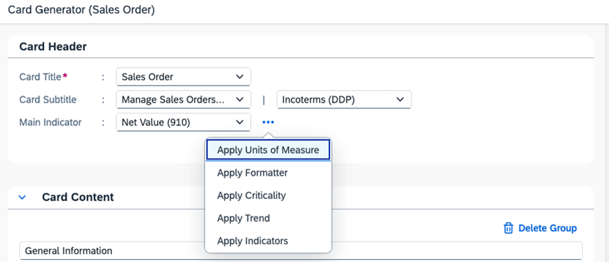

<!-- loio599428aa0b244626a029d5202c1bfaac -->

<link rel="stylesheet" type="text/css" href="../css/sap-icons.css"/>

# Using the Application Preview Generator

Applications based on SAP Fiori elements can generate integration cards and adaptive cards.

You can use cards to provide a preview of the data of the object page. Cards can be shared using SAP Collaboration Manager, Microsoft Teams, or any other platform where the integration card or the adaptive card can be hosted.

> ### Note:  
> -   Application preview cards can only be generated for object pages.
> 
> -   The integration card is displayed by default on the UI, but the adaptive card is always generated at the same time, and you can choose to display it instead.


<a name="loio599428aa0b244626a029d5202c1bfaac__section_jg1_nvr_gdc"/>

## Prerequisites

To use the application preview generator, the following requrements must be met:

-   You must have cloned your project in SAP Business Application Studio.

-   After cloning the project, you must ensure that it is compatible with UI5 Tooling v3. If it is not, you must migrate it so that it can work within SAP Business Application Studio.

    -   For more information about UI5 Tooling v3, see [Migrate to v3](https://sap.github.io/ui5-tooling/v3/updates/migrate-v3/).

    -   For more information about migrating your project, see [Migrate SAP Fiori projects from SAP Web IDE to SAP Business Application Studio](https://community.sap.com/t5/technology-blogs-by-sap/migrate-sap-fiori-projects-from-sap-web-ide-to-sap-business-application/ba-p/13544987).


<a name="loio599428aa0b244626a029d5202c1bfaac__section_pz3_4zr_gdc"/>

## Enabling the Application Preview Generator

Ensure that you are using the latest version of SAP UI5. To do that, open the `ui5.yaml` file and ensure that the `url` is set to `https://ui5.sap.com`.

```js
specVersion: "3.1"
metadata:
  name: sales-order.wd.sample
type: application
resources:
  configuration:
    paths:
      webapp: webapp
server:
  customMiddleware:
  - name: fiori-tools-proxy
    afterMiddleware: compression
    configuration:
      ignoreCertError: false
      ui5:
        path:
        - /resources
        - /test-resources
        url: https://ui5.sap.com
  - name: sap-fe-mockserver
    mountPath: /
    afterMiddleware: compression
    configuration:
      annotations:
      - localPath: './mockserver/sap/opu/odata/sap/salesorder/annotations.xml'
        urlPath: '/sap/opu/odata/sap/salesorder;v=2/Annotations*'
      services:
      - urlPath: '/sap/opu/odata/sap/salesorder'
        metadataPath: './mockserver/sap/opu/odata/sap/salesorder/metadata.xml'
        mockdataPath: './mockserver/sap/opu/odata/sap/salesorder/data/'
```

Next, open a new terminal at a desired project location and run one of the following commands:

-   `npx @sap-ux/create@latest add cards-editor`

-   `npm init @sap-ux@latest add cards-editor`


<a name="loio599428aa0b244626a029d5202c1bfaac__section_egf_vzr_gdc"/>

## Generating Cards

After enabling the application preview generator as described previously, launch the project by using the `npm run start-cards-generator` command.

If the landing page of the application is a list report, use the necessary filters or search to navigate to the object page for which the card will be created. After the object page is launched, open the user menu and choose *Generate Card*.


The following dialog appears:


Enter the data for the relevant fields in the dialog. For more information about the supported features, see the [Supported features](using-the-application-preview-generator-599428a.md#loio599428aa0b244626a029d5202c1bfaac__section_ysh_2dw_hdc) section in this topic.

A live preview of the integration card and its corresponding adaptive card is displayed on the right side, as shown in the following screenshots:

  
  
**Preview of the Integration Card**


  
  
**Preview of the Adaptive Card**


When you have created the desired application preview, choose *Save* to make the cards available within the application repository.

A new `cards` folder is created under `webapp`.


The `manifest.json` file is automatically updated with a new `sap.cards.ap` section that links the cards with the `cards` folder.

```js
"sap.cards.ap": {
  "embeds": {
    "ObjectPage": {
      "default": "C_STTA_SalesOrder_WD_20",
      "manifests": {
        "C_STTA_SalesOrder_WD_20": [
          {
            "localUri": "cards/op/C_STTA_SalesOrder_WD_20"
          }
        ]
      }
    }
  }
}
```

If you repeat the card generation process, the previously generated card is overwritten with the latest version.

After adding the cards, you must update the project repository. To do that, merge all the changed files of the project in the repository.


<a name="loio599428aa0b244626a029d5202c1bfaac__section_ysh_2dw_hdc"/>

## Supported features

You can use the following features of the card generator dialog:

**Features of the Card Generator Dialog**


<table>
<tr>
<th valign="top">

Label

</th>
<th valign="top">

Description

</th>
<th valign="top">

Screenshot

</th>
</tr>
<tr>
<td valign="top">

*Card Header*

</td>
<td valign="top">

You can add a title, a subtitle, and a main indicator as part of the card header.

</td>
<td valign="top">

  
  
**Card Header**


</td>
</tr>
<tr>
<td valign="top">

*Card Content*

</td>
<td valign="top">

You can add properties to groups, change labels, and format the properties to be displayed in the card content.

</td>
<td valign="top">

  
  
**Card Content**


</td>
</tr>
<tr>
<td valign="top">

*Card Actions*

</td>
<td valign="top">

You can add import-based actions as footer actions of the adaptive card. The recipient of the card can execute these actions from within the Microsoft Teams chat.

</td>
<td valign="top">

  
  
**Card Actions**


</td>
</tr>
<tr>
<td valign="top">

*Advanced Panel*

</td>
<td valign="top">

You can apply criticality assignments, unit of measure, and text arrangement to properties. The options configured in this panel apply to the specified properties wherever they are used in the card.

</td>
<td valign="top">

  
  
**Advanced Panel**


</td>
</tr>
<tr>
<td valign="top">

<span class="SAP-icons-V5"></span> *\(More\)*

</td>
<td valign="top">

You can apply additional options to any property that has this control displayed next to it. The following additional options are available:

-   *Apply Units of Measure*. This option can be applied to properties of string type or number type.

-   *Apply Formatter*:

    -   *Date Type*. This option lets you choose how the date and time are formatted. You can format just the date or the date and time together. You can enable or disable UTC formatting for either of those options. If you format the date and time together, you can also apply relative formatting options as described in [Date Format](https://sapui5.hana.ondemand.com/#/topic/91f2eba36f4d1014b6dd926db0e91070).

    -   *Number Type*. Numbers can be formatted as *Float*, *Currency*, *Percent*, or *Integer*.


-   *Apply Criticality*.

-   *Apply Trend*. This option can be applied to properties of string type or number type.

-   *Apply Indicators*. This option can be applied to properties of string type or number type.


</td>
<td valign="top">

  
  
**Additional Options**



  
  
**Apply Units of Measure**


  
  
**Apply Formatter: Date Type**


  
  
**Apply Formatter: Number Type**


  
  
**Apply Criticality**


  
  
**Apply Trend**


  
  
**Apply Indicators**


</td>
</tr>
</table>

