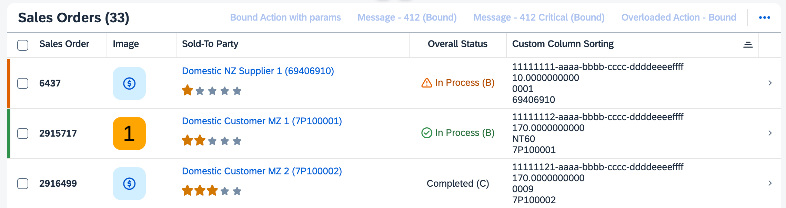

<!-- loio4bab6f2043814257974b52d4dafe1dcd -->

# Using the *Export* Button

You can export a table into a spreadsheet or to PDF.

> ### Note:  
> This topic is only applicable to SAP Fiori elements for OData V4. For more information about the export option in SAP Fiori elements for OData V2, see [Adapting the UI: List Report and Object Page](adapting-the-ui-list-report-and-object-page-0d2f1a9.md).


<a name="loio4bab6f2043814257974b52d4dafe1dcd__section_jy3_4pg_mtb"/>

## Export to Spreadsheet

By default, the `Export` button is enabled and displayed in the table toolbar of the list report and the object page. When selected, it exports the values in the table.


To disable the feature in the list report and enable it in the object page, use the `enableExport` property of the manifest of the application and set it to `false` or `true`. In the `controlConfiguration` section of the page, annotate the `LineItem` on which the export should be disabled or enabled, as shown in the following code sample:

> ### Sample Code:  
> `manifest.json`
> 
> ```
> "SalesOrderManageList": {
>    "type": "Component",
>    "id": "SalesOrderManageList",
>    "name": "sap.fe.templates.ListReport",
>    "options": {
>       "settings": {
>          "contextPath": "/SalesOrderManage",
>          "controlConfiguration": {
>             "@com.sap.vocabularies.UI.v1.LineItem": {
>                "tableSettings": {
>                   "enableExport": false
>                },
>             }
>          }
>       }
>    }
> },
> "SalesOrderManageObjectPage": {
>    "type": "Component",
>    "id": "SalesOrderManageObjectPage",
>    "name": "sap.fe.templates.ObjectPage",
>    "options": {
>       "settings": {
>          "contextPath": "/SalesOrderManage",
>          "controlConfiguration": {
>             "_Item/@com.sap.vocabularies.UI.v1.LineItem": {
>                "tableSettings": {
>                   "enableExport": true
>                },
>             }
>          }
>       }
>    }
> },
> ```

**Menu Button**

Clicking the export icon starts the export with default settings.

Clicking the drop-down arrow opens a menu with two additional options:

-   *Export*

    Exports the table with default settings.

-   *Export As...*

    Opens a dialog for specifying the export settings:

    -   Split cells with multiple values: when selecting this option, the exported spreadsheet has one column per value. If one column contains multiple values in a cell \(for example, amount and currency/unit\), this results in two separate columns in the spreadsheet. The following list provides all cases that result in multiple columns exported with this mode:

        -   Amount and unit, or price and currency: One column contains the value or price, the second one contains the unit or currency.

        -   Code and value \(properties annotated with `Text` or `TextArrangement`\): One column contains the code, the second one contains the description. Note: the `TextArrangement` annotation is not read. The code and the description are always exported when there is a `Text` annotation.

        -   `dataFieldForAnnotation` pointing to a `DataPoint` with a target value \(rating, progress visualizations\): The value of the property and the target value are exported into separate columns.

        -   `dataFieldForAnnotation` pointing to a `FieldGroup`: Every property of the `FieldGroup` is exported into a separate column.

        -   Custom columns with several properties defined: Every defined property of the custom column is exported into a separate column. See the note below for details.


    -   Include filter settings: the current filter is included on a second sheet in the exported file.


> ### Note:  
> -   You can export the custom columns you have defined using manifest settings. To allow the export of your custom column, you must maintain the `"properties"` array in the definition of the custom column. For more information about defining custom columns, see [Extension Points for Tables](extension-points-for-tables-d525522.md). The properties are exported into the spreadsheet as described for a `FieldGroup`.
> 
> -   If your domain model contains sensitive data \(data annotated as `PersonalData.IsPotentiallySensitive`\), enabling the export to a spreadsheet could lead to exposing this data, as the end user cannot choose where the data is stored. You can disable the `Export` button using the `enableExport` property in the manifest. This ensures that access control is enforced and stays within the application.
> 
>     For more security-related information, see [Security Configuration](security-configuration-ba0484b.md).

> ### Restriction:  
> -   Columns containing a `DataFieldForAnnotation` that points to `Charts` or a `DataFieldForAction` are exported without any content.
> 
> -   The following types of columns are not exported:
> 
>     -   Columns containing a multi-input field \(1:n\)
>     -   Columns containing stream media data
>     -   Columns containing binary media data
> 
> -   Columns containing a property with a dynamic `UI.Hidden` expression are still exported.
> 
> -   Numbers exceeding 15 digits are rounded in the spreadsheet file \(this is a JavaScript restriction\).

**Configuring Columns**

You can influence how both regular and custom columns are exported by using the following properties:


<table>
<tr>
<th valign="top">

Property

</th>
<th valign="top">

Description

</th>
</tr>
<tr>
<td valign="top">

`type`

</td>
<td valign="top">

The data type of the field. If this property is omitted, the property is processed as a string field. For the list of supported types, see [`sap.ui.export.EdmType`](https://ui5.sap.com/#/api/sap.ui.export.EdmType).

</td>
</tr>
<tr>
<td valign="top">

`property`

</td>
<td valign="top">

A field name or an array of field names in the data source feed.

</td>
</tr>
<tr>
<td valign="top">

`template`

</td>
<td valign="top">

A formatting template that supports indexed placeholders within curly brackets.

</td>
</tr>
<tr>
<td valign="top">

`width`

</td>
<td valign="top">

The width of the column in characters. There is no 1:1 correspondence between character widths in the exported spreadsheet and CSS units. The width of one character is approximately 0.5 em in CSS units, depending on the fonts that are used in the table and in the resulting spreadsheet. The default value is 10 characters.

</td>
</tr>
<tr>
<td valign="top">

`wrap`

</td>
<td valign="top">

A Boolean property indicating if the content is wrapped.

</td>
</tr>
<tr>
<td valign="top">

`label`

</td>
<td valign="top">

The text of the column header.

</td>
</tr>
<tr>
<td valign="top">

`textAlign`

</td>
<td valign="top">

The horizontal alignment of the column cells. The values are: `Left`, `Right`, `Center`, `Begin`, and `End`. If no value is specified, the columns are aligned based on the type.

</td>
</tr>
<tr>
<td valign="top">

`trueValue`

</td>
<td valign="top">

The textual representation associated with a Boolean type that is set to `true`.

</td>
</tr>
<tr>
<td valign="top">

`falseValue`

</td>
<td valign="top">

The textual representation associated with a Boolean type that is set to `false`.

</td>
</tr>
<tr>
<td valign="top">

`valueMap`

</td>
<td valign="top">

The mapping object which contains the values associated with a specific key. When `ValueMap` is set, the `type` must be set to `Enumeration`.

</td>
</tr>
</table>

To exclude a column from being exported, set the `disableExport` property within the `columns` key of the `manifest.json` file.

To configure the file name of the exported table. set the `exportFileName` property within the `tableSettings` key. The file name has a maximum of 31 characters. If it's longer, it is truncated.

To configure the sheet name of the exported table, set the `exportSheetName` property within the `tableSettings` key. The sheet name has a maximum of 31 characters. If it's longer, it is truncated.

To use these properties, include them in the `exportSettings` object within the `Columns` key of the `manifest.json` file as shown in the following sample code:

> ### Sample Code:  
> `manifest.json`
> 
> ```json
> "controlConfiguration": {
>     "@com.sap.vocabularies.UI.v1.LineItem": {
>         "tableSettings": {
>             "personalization": true,
>             "exportFileName": "Name of the file to be exported",
>             "exportSheetName": "Name of the sheet to be exported"
>         },
>         "columns": {
>             "DataField::Shipping": {
>                 "exportSettings":
>                 {
>                     "template": "{0}",
>                     "width": "5",
>                     "type": "Enumeration",
>                     "label": "New Column header for export",
>                     "textAlign": "Center",
>                     "valueMap": {
>                         "A":"Standard Shipping",
>                         "B":"Premium Shipping",
>                         "C":"Express Shipping"
>                     }
>                 }
>             },
>             "DataField::Delivered": {
>                 "exportSettings":
>                 {
>                     "template": "{0}",
>                     "width": "5",
>                     "type": "Boolean",
>                     "textAlign": "Right",
>                    	"trueValue": "Yes",
>                    	"falseValue": "No"
>                 }
>             },
>             "DataField::Delivered": {
>                 "disableExport": true
>             },
>             "CustomColumnSorting":{
>                 "header": " {i18n > LRCustomColumnSorting}",
>                 "template": "SalesOrder.custom.CustomColumn.CustomColumnSorting",
>                 "properties": [
>                     "ID",
>                     "TotalNetAmount",
>                     "_CustomerPaymentTerms/CustomerPaymentTerms",
>                     "_ShipToParty/BusinessPartner"
>                 ],
>                 "exportSettings":
>                 {
>                     "property": ["ID", "TotalNetAmount"],
>                     "template": " {0} {1}",
>                     "type": "String",
>                     "width": "50",
>                     "wrap": true
>                 }
>             }
>         }
>     }
> }
> ```

  
  
**Example of a Table To Be Exported to a Spreadsheet**



  
  
**Example of the Exported Spreadsheet**


<a name="loio4bab6f2043814257974b52d4dafe1dcd__section_plw_ppg_mtb"/>

## Export to PDF

To enable the export to PDF, you must configure the following annotations at service level:

-   `@Org.OData.Capabilities.V1.SupportedFormats`

    This annotation must contain `"application/pdf"`.

-   `@com.sap.vocabularies.PDF.v1.Feature`

    For more information, see [https://github.com/SAP/odata-vocabularies/blob/main/vocabularies/PDF.md](https://github.com/SAP/odata-vocabularies/blob/main/vocabularies/PDF.md).


<a name="loio4bab6f2043814257974b52d4dafe1dcd__section_okc_mcp_w1c"/>

## Set the Limit for Request Size

You can configure the limit for the count of records that can be obtained within a single request from the service. To do this, you must configure the `exportRequestSize` parameter in the table settings. The default value of the records that can be obtained within a single request is 1000 for responsive and grid tables. Analytical and tree tables don't have a default value.

> ### Sample Code:  
> ```
> {
> 	"sap.ui5": {
> 		"routing": {
> 			"targets": {
> 				"SalesOrderManageList": {
> 					"options": {
> 						"settings": {
> 							"controlConfiguration": {
> 								"@com.sap.vocabularies.UI.v1.LineItem": {
> 									"tableSettings": {
> 										"exportRequestSize":3000
> 									}
> 								}
> 							}
> 						}
> 					}
> 				}
> 			}
> 		}
> 	}
> }
> ```

The `Table` building block also supports the `exportRequestSize` parameter. For more information about the Table API, see [API Reference](https://ui5.sap.com/#/api/sap.fe.macros.Table%23controlProperties).

> ### Note:  
> When analytical or hierarchical data is exported from a table, the processing time does not increase linearly with the number of items queried. For example, exporting 200 items takes about two seconds, while exporting 1,000 items takes approximately 2.2 seconds. To optimize performance, adjust the value of the `exportRequestSize` parameter based on the structure and volume of data.

